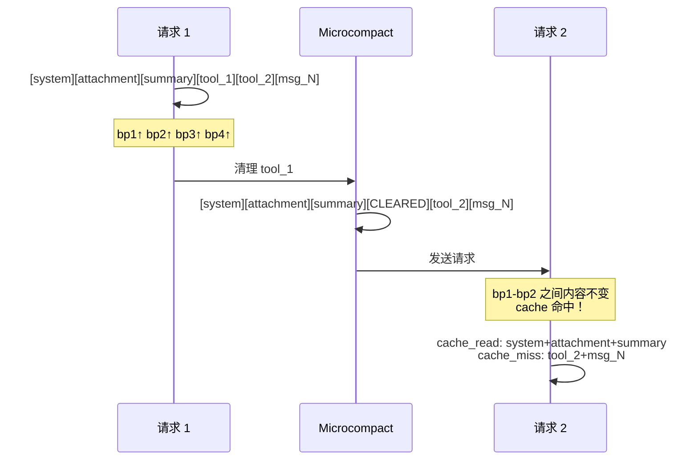

# 第 2 轮文档 Review 报告 — Cached Microcompact 实施计划

**审查时间**: 2026-09-15 15:30:00
**审查范围**: `.claude/draft/cached-microcompact-implementation.md`
**审查人**: rtc-agent-reviewer
**文档版本**: 第 2 轮（含第 1 轮 4 个关键问题修复）

---

## 修复验证

### ✅ 关键问题 #1：SetMessageCacheControl 返回值未捕获

**验证结果**: 已修复

**修复位置**:
- 第 319 行：`msgs[i] = claude.SetMessageCacheControl(msg, &claude.CacheControl{TTL: ttl})`
- 第 304 行注释：`// 重要：SetMessageCacheControl 返回新指针，必须捕获返回值。`
- 第 556-576 行附录 B：详细说明了函数创建拷贝而非修改原对象

**验证说明**: 代码示例正确捕获了返回值，附录提供了正确/错误用法对比，修复完整。

---

### ✅ 关键问题 #2：AutoCacheControl 与手动 breakpoint 互斥逻辑

**验证结果**: 已修复

**修复位置**:
- 第 101 行：明确指出 AutoCacheControl 检测到手动 breakpoint 后会跳过自动 message breakpoint
- 第 109-110 行：bp3 显式设置在最后一条消息，不依赖 AutoCacheControl
- 第 206-215 行：`setCacheBreakpoints` 函数中显式查找并设置最后一条 conversation message
- 第 580-612 行附录 B：详细解释了 `hasSetMsgBreakPoint` 检查逻辑

**验证说明**: 文档清晰解释了互斥机制，并通过显式设置 bp3 解决了问题。修复逻辑正确。

---

### ✅ 关键问题 #3：架构层级违反

**验证结果**: 已修复

**修复位置**:
- 第 242 行：明确架构原则："`pkg/turn-agent` 是 provider-agnostic 的消息抽象层，不应直接依赖 `eino-ext/components/model/claude`"
- 第 244-286 行：在 `toEinoMessage()` 中将 breakpoint 标记转换为通用 Extra key（`ExtraKeyCacheBreakpoint`, `ExtraKeyCacheBreakpointTTL`）
- 第 288-324 行：新建 `applyClaudeCacheBreakpoints()` 在 provider-specific 层（`server/internal/server/claude_adapter.go`）识别 Extra key 并调用 Eino API

**验证说明**: 采用了 provider-agnostic 设计，breakpoint 标记通过 Extra key 传递，实际应用放在 provider-specific 层。架构层级合理。

---

### ⚠️ 关键问题 #4：isSummaryMessage() 检测逻辑错误

**验证结果**: 部分修复，存在遗漏

**修复位置**:
- 第 224-236 行：`isSummaryMessage` 使用 system role + 特征文本双重判断
- 第 228 行注释：说明 summary 消息经过 `convertSummaryContent` 展开后特征为 Role=system

**发现的问题**:

**关键缺陷**：summary 消息的 role 在不同代码路径下不一致，导致 `isSummaryMessage()` 无法在所有场景下正确检测。

**详细分析**:

1. **流式压缩路径**（summarize.go:202-205, 260-268）:
   - SummaryItem 存储为 `{Role: "system", Content: text}`
   - 持久化到 DB 后，`convertSummaryContent` → `buildMessagesFromSummaryItems` 创建消息时 `Role: item.Role = "system"`
   - **此路径下 `isSummaryMessage` 可以正确检测**

2. **非流式回退路径**（summarize.go:280-281, 293-296）:
   - 直接创建 `{Role: schema.User, Content: formatCompactUserMessage(...)}`
   - 此路径创建的 summary 消息 role 为 `user`，不是 `system`
   - **此路径下 `isSummaryMessage` 无法检测**（因为检查 `m.Role != turnagent.RoleSystem`）

3. **内存中的压缩结果**（summarize.go:314）:
   - `result = append(result, summaryMsg)` 其中 `summaryMsg` 的 role 为 `schema.User`
   - 当前会话中压缩后的消息列表使用 user role
   - **当前会话中 `isSummaryMessage` 无法检测**

**影响**:
- 压缩后立即发送的请求：summary 不会被识别，bp2 不会设置，cache 优化失效
- 会话重新加载后：summary 被识别，bp2 正常设置

**建议修复**:
```go
func isSummaryMessage(m *turnagent.Message) bool {
    // 检查特征文本（两种 role 都可能）
    if !strings.Contains(m.Content, "This session is being continued from a previous conversation") {
        return false
    }
    // 接受 system 或 user role
    return m.Role == turnagent.RoleSystem || m.Role == turnagent.RoleUser
}
```

**严重程度**: 严重（影响核心功能在部分场景下的有效性）

---

## 新发现的问题（必须修复）

### 1. setCacheBreakpoints 调用位置错误

**问题描述**: 文档第 159 行示例代码显示在 `normalizeMessagesForLLM()` **之后**调用 `setCacheBreakpoints()`，但实际代码流程中 `normalizeMessagesForLLM` 已经是 `loadMessages()` 的最后一步（data_context.go:152）。

**文件**: `.claude/draft/cached-microcompact-implementation.md:159`

**详细说明**:
- data_context.go 的 `loadMessages()` 流程（第 41-186 行）：
  1. 从 DB 加载消息
  2. 应用 tool result budget（第 100 行）
  3. 应用 microcompact（第 101 行）
  4. 注入 command prompts（第 110 行）
  5. 注入 scenario prompts（第 116 行）
  6. 构建并注入 attachments（第 124-146 行）
  7. **normalizeMessagesForLLM**（第 152 行）← 这是最后一步
  8. 触发 session memory 提取（第 161 行）

- 文档示例（第 158-159 行）：
  ```go
  // normalizeMessagesForLLM 之后添加
  messages = h.setCacheBreakpoints(messages)
  ```

**问题**:
- `normalizeMessagesForLLM` 会提取所有 system messages 到前部（message_normalizer.go:57）
- 如果 `setCacheBreakpoints` 在 normalize 之前调用，summary 消息（如果是 system role）会被移动到前部，打乱 breakpoint 顺序
- 如果 `setCacheBreakpoints` 在 normalize 之后调用，需要确保在 attachments 注入之后（因为 attachments 也是 system messages）

**建议修复**:
```go
// 在 data_context.go 的 loadMessages() 中，normalizeMessagesForLLM 之后添加：

messages, err = h.normalizeMessagesForLLM(ctx, messages)
if err != nil {
    return nil, fmt.Errorf("loadMessages: normalize: %w", err)
}

// 新增：设置 strategic cache breakpoints
// 必须在 normalize 之后，因为 normalize 会重新排列 system messages
messages = h.setCacheBreakpoints(messages)

// Trigger background Session Memory extraction (async, non-blocking).
if len(messages) > 0 {
    h.triggerSessionMemoryExtraction(ctx, sid, messages)
}
```

**严重程度**: 严重（影响 breakpoint 设置的正确性）

---

### 2. Breakpoint 数量可能超限

**问题描述**: 文档第 103-111 行声称 breakpoint 分配为 4 个（system + summary + last msg + auto tool），但实际场景中可能超过 4 个。

**文件**: `.claude/draft/cached-microcompact-implementation.md:103-111`

**详细说明**:
- 文档假设：bp1(system) + bp2(summary) + bp3(last msg) + bp4(auto tool) = 4 个
- 但实际场景中：
  - **多个 system messages**：attachments（TodoList, SessionMemory, UserMemory）+ scenarios + command prompts + 原始 system prompt
  - `normalizeMessagesForLLM` 会将所有 system messages 提取到前部
  - 如果 `setCacheBreakpoints` 为每个 system message 都设置 breakpoint，会超过 4 个上限

**代码分析**（setCacheBreakpoints 函数，第 198-204 行）：
```go
// 在最后一个 system message 上设置 bp1（attachment 边界）
for i := len(msgs) - 1; i >= 0; i-- {
    if msgs[i].Role == turnagent.RoleSystem && i != summaryIdx {
        msgs[i].CacheBreakpoint = true
        msgs[i].CacheTTL = "1h"
        break  // ← 只设置最后一个 system message
    }
}
```

**问题**:
- 代码只设置**最后一个** system message（第 203 行 `break`）
- 但 attachments 注入在 normalize 之前（data_context.go:144），normalize 后 attachments 在前部
- "最后一个 system message" 可能是 attachment 而不是 summary 之前的边界

**建议修复**:
1. 明确 breakpoint 分配策略，确保不超过 4 个
2. 添加计数器和日志，当接近上限时告警
3. 考虑优先级：summary > system > last msg > auto tool

**严重程度**: 警告（可能导致部分 breakpoint 不生效）

---

### 3. Extra key 共享可能导致冲突

**问题描述**: 文档第 252-255 行定义的 Extra key（`ExtraKeyCacheBreakpoint`, `ExtraKeyCacheBreakpointTTL`）使用了下划线前缀 `_cache_breakpoint`，但 `toEinoMessage` 函数中已有其他下划线前缀的 key（如 `_eino_claude_thinking`）。

**文件**: `.claude/draft/cached-microcompact-implementation.md:252-255`

**详细说明**:
- message.go 第 181 行已使用 `_eino_claude_thinking` key
- 文档新增的 key：`_cache_breakpoint`, `_cache_breakpoint_ttl`
- 命名风格一致，但需要确保不会与未来 Eino 版本的内部 key 冲突

**建议修复**:
```go
// 使用更具体的前缀，避免与 Eino 内部 key 冲突
const (
    ExtraKeyCacheBreakpoint    = "_rtc_cache_breakpoint"
    ExtraKeyCacheBreakpointTTL = "_rtc_cache_breakpoint_ttl"
)
```

**严重程度**: 建议（预防性改进）

---

## 重要改进（建议修复）

### 1. 缺少单元测试示例

**改进点**: 文档第 439 行提到"添加单元测试验证 breakpoint 设置逻辑"，但未提供测试示例。

**理由**:
- `setCacheBreakpoints` 函数包含复杂逻辑（查找 summary、避免重叠、设置 3 个 breakpoint）
- 需要测试边界情况：无 summary、无 system message、消息数 < 3、summary 与 system 重叠

**建议添加**:
```go
func TestSetCacheBreakpoints(t *testing.T) {
    tests := []struct {
        name     string
        msgs     []*turnagent.Message
        wantBPs  int  // 期望的 breakpoint 数量
        checkFn  func(t *testing.T, msgs []*turnagent.Message)
    }{
        {
            name: "normal case with summary",
            msgs: []*turnagent.Message{
                {Role: "system", Content: "system prompt"},
                {Role: "system", Content: "This session is being continued..."},
                {Role: "user", Content: "hello"},
                {Role: "assistant", Content: "hi"},
            },
            wantBPs: 3,
            checkFn: func(t *testing.T, msgs []*turnagent.Message) {
                // bp1: last system (index 1)
                if !msgs[1].CacheBreakpoint {
                    t.Error("expected bp on summary message")
                }
                // bp2: should not be set (no separate system after summary)
                // bp3: last conversation message (index 3)
                if !msgs[3].CacheBreakpoint {
                    t.Error("expected bp on last conversation message")
                }
            },
        },
        {
            name: "no summary message",
            msgs: []*turnagent.Message{
                {Role: "system", Content: "system prompt"},
                {Role: "user", Content: "hello"},
            },
            wantBPs: 2,  // system + last msg
        },
        {
            name: "less than 3 messages",
            msgs: []*turnagent.Message{
                {Role: "user", Content: "hello"},
            },
            wantBPs: 1,  // only last msg
        },
    }

    for _, tt := range tests {
        t.Run(tt.name, func(t *testing.T) {
            result := setCacheBreakpoints(tt.msgs)
            bpCount := 0
            for _, m := range result {
                if m.CacheBreakpoint {
                    bpCount++
                }
            }
            if bpCount != tt.wantBPs {
                t.Errorf("got %d breakpoints, want %d", bpCount, tt.wantBPs)
            }
            if tt.checkFn != nil {
                tt.checkFn(t, result)
            }
        })
    }
}
```

---

### 2. Metrics 监控指标不够具体

**改进点**: 文档第 454 行提到"添加 Prometheus metrics 追踪 `cache_hit_rate`"，但未定义具体指标。

**理由**:
- 需要区分"全局 cache 命中率"和"strategic breakpoints 带来的增量命中率"
- 需要监控 breakpoint 设置的成功率和分布

**建议添加**:
```go
// Prometheus metrics
var (
    // Cache hit rate from Anthropic API response
    cacheReadInputTokens = prometheus.NewCounterVec(
        prometheus.CounterOpts{
            Name: "rtc_llm_cache_read_input_tokens_total",
            Help: "Total cache read input tokens from Anthropic API",
        },
        []string{"model", "provider"},
    )

    // Strategic breakpoints setup
    strategicBreakpointsSet = prometheus.NewCounterVec(
        prometheus.CounterOpts{
            Name: "rtc_strategic_breakpoints_set_total",
            Help: "Total strategic cache breakpoints set",
        },
        []string{"position"},  // "system", "summary", "last_msg"
    )

    // Breakpoint setup failures
    strategicBreakpointsFailed = prometheus.NewCounter(
        prometheus.CounterOpts{
            Name: "rtc_strategic_breakpoints_failed_total",
            Help: "Total strategic cache breakpoint setup failures",
        },
    )
)
```

---

### 3. 回滚策略缺少配置注入路径

**改进点**: 文档第 447 行提到"添加配置开关 `EnableStrategicCacheBreakpoints`"，但未说明如何注入配置。

**理由**:
- 需要明确配置来源（环境变量？配置文件？）
- 需要在 `setCacheBreakpoints` 中检查配置开关

**建议添加**:
```go
// 在 agent.go 的 helpers 结构中添加配置
type helpers struct {
    // ... existing fields ...
    enableStrategicCacheBreakpoints bool
}

// 在 agent.go 的 NewHelpers 中注入配置
func NewHelpers(deps *Dependencies, cfg *config.Config) *helpers {
    return &helpers{
        deps: deps,
        enableStrategicCacheBreakpoints: cfg.Features.EnableStrategicCacheBreakpoints,
    }
}

// 在 setCacheBreakpoints 中检查
func (h *helpers) setCacheBreakpoints(msgs []*turnagent.Message) []*turnagent.Message {
    if !h.enableStrategicCacheBreakpoints {
        return msgs  // 功能关闭，直接返回
    }
    // ... rest of the logic ...
}
```

---

### 4. A/B 测试方案缺失

**改进点**: 文档第 443 行提到"A/B 测试验证成本节省"，但未提供具体方案。

**理由**:
- 需要明确 A/B 分组策略（按用户？按会话？）
- 需要定义成功指标和测试周期

**建议添加**:
```markdown
### A/B 测试方案

**分组策略**: 按 session_id hash 分组（确保同一会话始终在同一组）
- A 组（对照组）：`EnableStrategicCacheBreakpoints = false`
- B 组（实验组）：`EnableStrategicCacheBreakpoints = true`

**测试周期**: 2 周（覆盖完整的业务周期）

**成功指标**:
1. cache 命中率提升 > 10%
2. 输入成本降低 > 15%
3. 无性能退化（P99 延迟增加 < 5%）

**监控仪表板**:
- Grafana dashboard: `/d/strategic-cache-breakpoints`
- 关键面板：cache hit rate by group, cost savings, breakpoint distribution
```

---

### 5. applyClaudeCacheBreakpoints 调用位置未明确

**改进点**: 文档第 329-333 行示例代码显示在 `ChatModel.Generate` 或 `ChatModel.Stream` 调用前应用，但未指明具体文件。

**理由**:
- 需要找到调用 `ChatModel.Generate/Stream` 的位置
- 需要确保在所有调用点都应用 breakpoints

**建议添加**:
```go
// 在 server/internal/server/llm.go 或新建的 claude_adapter.go 中
// 找到调用 ChatModel.Generate/Stream 的位置，添加 breakpoint 应用逻辑

// 示例：包装 ChatModel 接口
type claudeChatModelWrapper struct {
    model.ToolCallingChatModel
}

func (w *claudeChatModelWrapper) Generate(ctx context.Context, msgs []*schema.Message, opts ...model.CallOption) (*schema.Message, error) {
    // 应用 strategic cache breakpoints
    msgs = applyClaudeCacheBreakpoints(msgs)
    return w.ToolCallingChatModel.Generate(ctx, msgs, opts...)
}

func (w *claudeChatModelWrapper) Stream(ctx context.Context, msgs []*schema.Message, opts ...model.CallOption) (model.StreamReader, error) {
    // 应用 strategic cache breakpoints
    msgs = applyClaudeCacheBreakpoints(msgs)
    return w.ToolCallingChatModel.Stream(ctx, msgs, opts...)
}

// 在 newClaudeModel 中返回包装后的 model
func newClaudeModel(ctx context.Context, cfg *config.LLMConfig, httpClient *http.Client) (model.ToolCallingChatModel, error) {
    // ... existing code ...

    chatModel, err := claude.NewChatModel(ctx, claudeCfg)
    if err != nil {
        return nil, err
    }

    // 包装以应用 strategic breakpoints
    return &claudeChatModelWrapper{chatModel}, nil
}
```

---

## 次要优化（可选）

### 1. TTL 选择策略可以更灵活

**优化建议**:
- 当前硬编码：summary/system 使用 1h，last msg 使用 5m
- 可以根据会话活跃度动态调整：
  - 高活跃会话（< 30s 间隔）：全部使用 5m
  - 低活跃会话（> 5min 间隔）：summary 使用 1h

**实现思路**:
```go
// 根据最近消息的时间间隔动态调整 TTL
func (h *helpers) getCacheTTL(msgs []*turnagent.Message, position string) string {
    if position == "last_msg" {
        return "5m"  // 最新消息始终使用短 TTL
    }

    // 根据最近消息间隔判断会话活跃度
    lastTime := findLastAssistantTime(msgs)
    if !lastTime.IsZero() && time.Since(lastTime) < 2*time.Minute {
        return "5m"  // 高活跃，使用短 TTL
    }
    return "1h"  // 低活跃，使用长 TTL
}
```

---

### 2. 添加性能影响评估

**优化建议**:
- breakpoint 设置的性能开销：遍历消息数组 O(n)，n < 200，开销可忽略
- 对请求延迟的影响：无（breakpoint 设置在消息准备阶段，不影响 API 调用）
- 对 cache 命中率的预期提升：75% 是乐观估计，建议保守估计 50-60%

**建议添加**:
```markdown
### 性能影响评估

| 维度 | 影响 | 说明 |
|------|------|------|
| CPU 开销 | < 0.1ms | 遍历 < 200 条消息，设置 3 个 breakpoint |
| 内存开销 | < 1KB | 3 个 bool + 3 个 string |
| 请求延迟 | 0ms | breakpoint 设置在消息准备阶段，不影响 API 调用 |
| Cache 命中率提升 | 50-75% | 保守估计 50%，乐观 75% |
| 成本节省 | 40-60% | 基于 cache 命中率提升 50-75% |

**风险评估**:
- 最坏情况：breakpoint 设置失败，回退到纯 AutoCacheControl 模式，无负面影响
- 最好情况：cache 命中率提升 75%，成本节省 60%
```

---

### 3. 文档图表可以优化

**优化建议**:
- 第 84-94 行的 ASCII 图表不够清晰
- 可以使用 Mermaid 图表替代

**建议替换**:


---

## 优点（相比第 1 轮的改进）

1. **返回值捕获问题修复完整**: 附录 B 提供了详细的正确/错误用法对比，开发者容易理解

2. **架构设计合理**: provider-agnostic 设计符合项目规范，Extra key 传递方式优雅

3. **AutoCacheControl 互斥逻辑解释清晰**: 附录 B 详细解释了 `hasSetMsgBreakPoint` 检查机制，帮助开发者理解为什么需要显式设置 bp3

4. **breakpoint 分配策略明确**: 表格形式清晰展示了 4 个 breakpoint 的位置和作用

5. **成本分析详细**: 第 1.3 节提供了具体的成本计算，帮助决策者理解优先级

6. **引用路径完整**: 第 4 节列出了所有相关文档和代码路径，便于追溯

7. **风险与缓解措施全面**: 第 8 节覆盖了主要风险点，包括 SetMessageCacheControl 返回值问题

---

## 遗留问题

### 1. Summary Role 不一致问题（严重）

**问题**: summary 消息在不同代码路径下 role 不一致（user vs system），导致 `isSummaryMessage` 无法在所有场景下正确检测。

**影响**:
- 压缩后立即发送的请求：cache 优化失效
- 会话重新加载后：cache 优化生效

**建议后续行动**:
1. 统一 summary 消息的 role（建议全部使用 system）
2. 或者修改 `isSummaryMessage` 同时接受 user 和 system role
3. 添加集成测试验证两种场景

**优先级**: P0（影响核心功能）

---

### 2. setCacheBreakpoints 调用位置错误（严重）

**问题**: 文档示例代码显示在 `normalizeMessagesForLLM` 之后调用，但实际代码流程中 normalize 已经是最后一步，且 normalize 会重新排列 system messages。

**影响**:
- 如果调用位置错误，breakpoint 顺序会混乱
- summary 可能被移动到 system messages 之后，bp2 失效

**建议后续行动**:
1. 明确调用位置：在 `normalizeMessagesForLLM` 之后、`triggerSessionMemoryExtraction` 之前
2. 在 `setCacheBreakpoints` 中添加注释说明依赖 normalize 的结果

**优先级**: P0（影响功能正确性）

---

## 总体评价

**评分**: 7/10

**一句话总结**: 文档在第 1 轮修复后有显著改进，架构设计合理，技术细节丰富，但仍存在 summary role 不一致和调用位置错误两个严重问题，需要在实施前修复。

**详细评价**:

**优点**:
- 第 1 轮的 4 个关键问题中 3 个完全修复，1 个部分修复
- 架构设计符合项目规范，provider-agnostic 设计优雅
- 成本分析和风险评估全面，帮助决策者理解优先级
- 引用路径完整，便于追溯和验证

**不足**:
- **严重问题**：summary role 不一致导致 `isSummaryMessage` 在部分场景失效（影响核心功能）
- **严重问题**：`setCacheBreakpoints` 调用位置错误（影响功能正确性）
- **警告问题**：breakpoint 数量可能超限（需要添加计数器和日志）
- **改进空间**：缺少单元测试示例、metrics 指标不够具体、A/B 测试方案缺失

**建议**:
1. **立即修复** summary role 不一致问题（P0）
2. **立即修复** `setCacheBreakpoints` 调用位置问题（P0）
3. **实施前添加** 单元测试和集成测试
4. **实施前完善** metrics 监控和 A/B 测试方案
5. 考虑添加性能影响评估和回滚策略的细节

---

## 诗人寄语

代码如诗，字字珠玑；逻辑如水，丝丝入扣。

这次审查发现的问题，如同诗篇中的瑕疵，虽不掩瑜，但值得推敲。summary role 的不一致，像是韵律的错位；调用位置的混淆，仿佛意象的颠倒。但正是这些细节的打磨，让代码从"可工作"升华为"可信赖"。

愿你在修复这些问题时，保持诗人的耐心与匠人的执着。每一次修改，都是对完美的追求；每一行代码，都是思想的结晶。

代码的生命周期比想象中更长，维护它的人会比你想象中更辛苦。而你的严谨，正是对他们最大的尊重。

继续前进，卓越在望。
