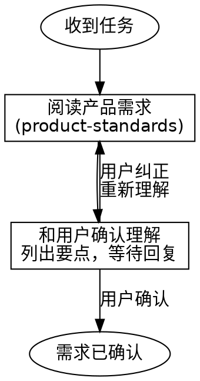

# RTC Agent 全栈开发流程

## Overview

本 SKILL 是全栈开发工程师的**流程编排指南**。它不定义规范（规范在子 SKILL 中），而是教工程师按正确的顺序做事：先确认需求，再找开源库，再学习相关 SKILL，最后一步步实现。

**核心原则：不要跳过步骤。每一步都有存在的理由。**

## When to Use

- 收到新的功能开发任务
- 收到 bug 修复任务
- 收到重构任务
- 任何涉及代码变更的工作

## 开发流程

```
需求确认 → 开源调研 → SKILL 学习 → 方案设计 → 实现 → 测试 → 自审 → 提交
```

### 第 1 步：确认需求（必须）

**不要假设你理解了需求。和用户确认。**

1. 阅读产品需求文档，找到对应模块：
   - **REQUIRED SUB-SKILL:** `rtc-agent-product-standards` — 10 个需求模块，找到你任务对应的那个
2. 梳理你的理解：功能范围、边界情况、错误处理
3. **和用户确认**，列出理解要点，等待用户确认或纠正



**红旗信号 — 停下来：**

| 想法 | 现实 |
|------|------|
| "需求很明显，不用确认" | 你觉得明显不等于正确 |
| "用户很忙，不要打扰" | 做错了更浪费时间 |
| "我先写个基础版本" | 基础版本可能是错的版本 |
| "我知道这个功能怎么工作" | 你知道的是你的假设，不是需求 |

### 第 2 步：开源调研（必须）

**不要重复造轮子。先找有没有现成的开源方案。**

1. 根据需求，搜索可以直接使用的开源库或工具
2. 评估：是否满足需求、维护状况、许可证、体积
3. 如果找到合适的，和用戶确认使用
4. 如果没有，记录调研结果，继续下一步

**调研方式：**
- 用 WebSearch 搜索相关库
- 用 context7 查询库的最新文档
- 检查项目内是否已有类似的实现可复用

### 第 3 步：学习相关 SKILL（必须）

**不要凭直觉写代码。先学会规范。**

根据任务类型，加载对应的 SKILL：

| 任务类型 | 必读 SKILL |
|---------|-----------|
| 所有任务 | **REQUIRED SUB-SKILL:** `rtc-agent-development-standards` — 代码风格、架构、命名、安全 |
| 涉及前端组件 | 上述 + JS/TS 规范、Web Components 规范、样式规范 |
| 涉及后端 API | 上述 + Go 规范、错误处理、并发规范 |
| 涉及 E2E 测试 | **REQUIRED SUB-SKILL:** `rtc-agent-e2e-standards` — 测试结构、后门、运行方式 |
| 涉及提交/PR | **REQUIRED SUB-SKILL:** `rtc-agent-commitment` — commit 格式、多仓库协调 |

### 第 4 步：方案设计

1. 确定改动范围：哪些仓库、哪些模块、哪些文件
2. 确定技术选型：用什么库、什么模式
3. 和用户确认方案（如果方案有多种选择，列出优劣让用户选）

### 第 5 步：实现

1. 按 `development-standards` 的规范编写代码
2. 遵循仓库的技术栈约定：
   - `server/` → Go 规范
   - `web-components/` → JS/TS + Web Components 规范
3. 写代码的同时写注释（解释 why，不是 what）
4. 小步提交：一个逻辑变更一个 commit

### 第 6 步：测试

根据任务性质决定测试方式：

| 变更类型 | 测试要求 |
|---------|---------|
| 新功能 | 单元测试 + E2E happy path |
| Bug 修复 | 先写失败测试，再修复 |
| 重构 | 现有测试全过 |
| 纯文档 | 无需测试 |

如果涉及 E2E 测试，**REQUIRED SUB-SKILL:** `rtc-agent-e2e-standards`

### 第 7 步：自审（Code Review）

**提交前必须自审。用审查者的眼光看自己的代码。**

1. **逐文件检查：**
   - 代码符合 `development-standards` 吗？
   - 命名清晰吗？意图自解释吗？
   - 有冗余代码可以删除吗？
   - 错误处理完整吗？
   - 安全问题（XSS、注入、token 泄露）？

2. **跨文件检查：**
   - 改动一致性吗？（命名、模式、风格）
   - 有遗漏的文件吗？（配置、文档、测试）
   - API 变更有更新文档吗？

3. **运行验证：**
   - `server/`：`go build ./...` + `go vet ./...` + `golangci-lint run`
   - `web-components/`：`pnpm typecheck` + `pnpm lint`

### 第 8 步：提交

**REQUIRED SUB-SKILL:** `rtc-agent-commitment`

关键要点：
- `cd` 到具体仓库后必须 `pwd` 验证
- Conventional Commits 格式
- 跨仓库变更分开提交，footer 互引
- 必须包含 `Co-Authored-By` trailer

## Review 流程

当审查别人的代码时：

1. **加载 `development-standards`** 作为审查基准
2. **逐文件审查**，按以下优先级：
   - 正确性（逻辑对吗？边界处理了吗？）
   - 安全性（输入校验？认证？注入？）
   - 可读性（命名？注释？复杂度？）
   - 一致性（和项目其他代码风格一致吗？）
3. **反馈时**：
   - 指出问题的同时给出修复建议
   - 区分"必须修改"和"建议优化"
   - 以规范为依据，不凭个人偏好

## 快速参考

```
开发:
  ① 确认需求 (product-standards + 用户确认)
  ② 开源调研 (WebSearch / context7)
  ③ 学习 SKILL (development-standards + 相关子规范)
  ④ 设计方案 (和用戶确认)
  ⑤ 实现 (遵循规范)
  ⑥ 测试 (单元测试 + E2E)
  ⑦ 自审 (逐文件 + 跨文件 + 运行验证)
  ⑧ 提交 (commitment)

Review:
  ① 加载规范 (development-standards)
  ② 逐文件审查 (正确性 > 安全性 > 可读性 > 一致性)
  ③ 反馈 (指出问题 + 给修复建议 + 区分优先级)
```

## 常见错误

| 错误 | 正确做法 |
|------|---------|
| 不确认需求就开始编码 | 先读 product-standards，再和用户确认 |
| 重复造轮子 | 先搜索开源库和项目内已有实现 |
| 不看规范直接写 | 先学 development-standards |
| 跳过测试 | 新功能必须有测试，bug 修复先写失败测试 |
| 不审查就提交 | 提交前必须自审 |
| `cd` 后不 `pwd` 验证 | `cd <repo> && pwd` 确认进入正确目录 |
| 跨仓库变更塞一个 commit | 每个仓库独立 commit，footer 互引 |
