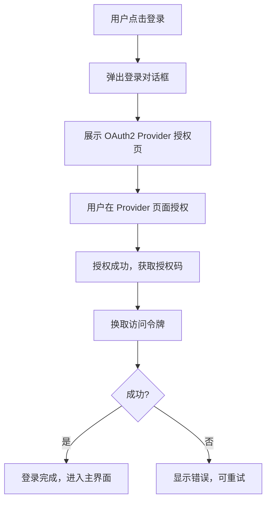
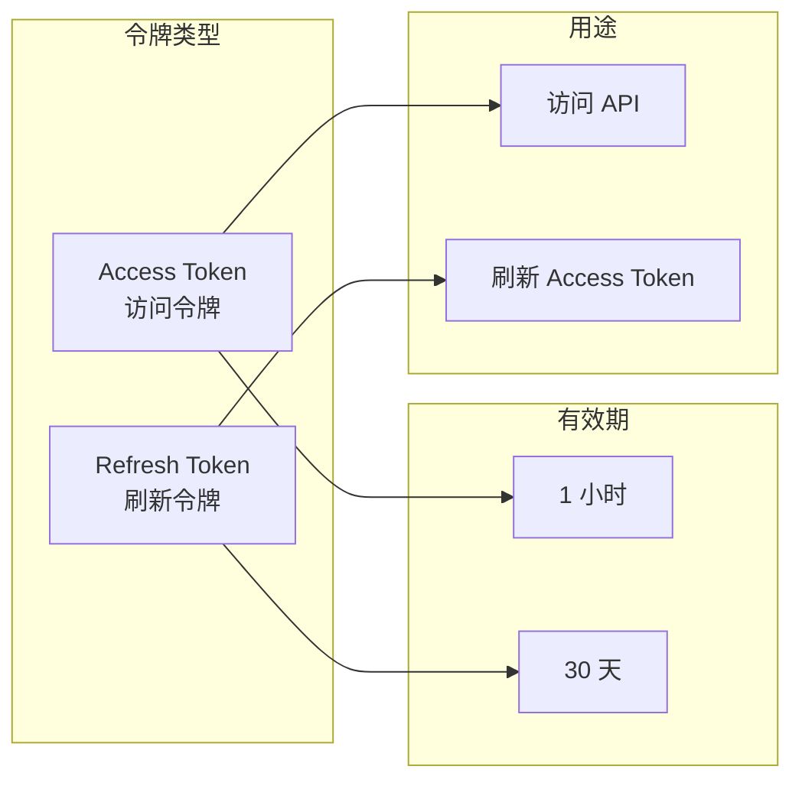
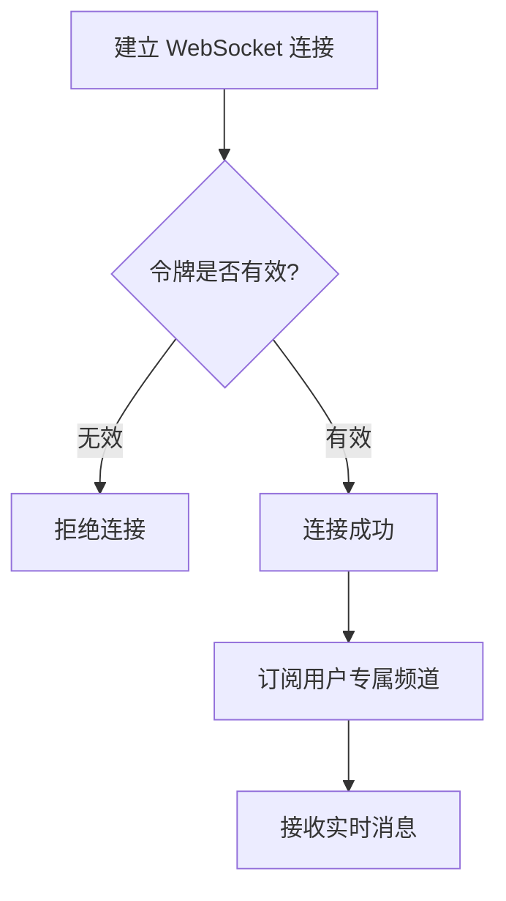

# 认证与授权

## 概述

用户通过 OAuth2 登录系统，获取访问令牌后使用所有功能。系统支持多设备登录，令牌自动刷新。

## 登录流程

### 登录方式

| 方式 | 说明 |
|------|------|
| OAuth2 授权码模式 | 通过 iframe 展示 Provider 授权页，授权后回调获取令牌 |

### 登录状态

- **未登录**：显示登录页面，无法使用功能
- **已登录**：可正常使用所有功能
- **令牌过期**：自动刷新，失败则需重新登录

## 令牌机制

| 令牌 | 有效期 | 用途 |
|------|--------|------|
| Access Token | 1 小时 | 访问 API 和 WebSocket |
| Refresh Token | 30 天 | 刷新 Access Token |

### 自动刷新

系统在以下情况自动刷新令牌：
- 令牌即将过期（提前 5 分钟）
- 页面从后台切回前台
- 建立 WebSocket 连接时

刷新失败则退出登录，要求用户重新认证。

## 设备管理

| 概念 | 说明 |
|------|------|
| 设备 ID | 浏览器唯一标识，首次访问时生成 |
| 设备名 | 根据浏览器类型自动推断（如 Mac、Windows PC） |
| 多设备 | 同一用户可在多个设备登录，各自独立 |

## 会话认证

WebSocket 连接时使用 Access Token 认证，连接断开后需重新认证。

## 安全约束

| 约束 | 说明 |
|------|------|
| CSRF 防护 | OAuth2 授权时使用 state 参数防止跨站请求伪造 |
| 频道隔离 | 用户只能接收自己的消息，无法访问他人数据 |
| 令牌存储 | 令牌存储在浏览器本地，不传输到第三方 |
| 刷新令牌 | 只存哈希值，明文一次性返回后立即丢弃 |

## 错误处理

| 场景 | 用户看到的行为 |
|------|---------------|
| 授权失败 | 登录对话框显示错误信息，可重试 |
| 令牌过期且刷新失败 | 退出登录，显示登录页面 |
| WebSocket 认证失败 | 连接断开，提示重新登录 |
