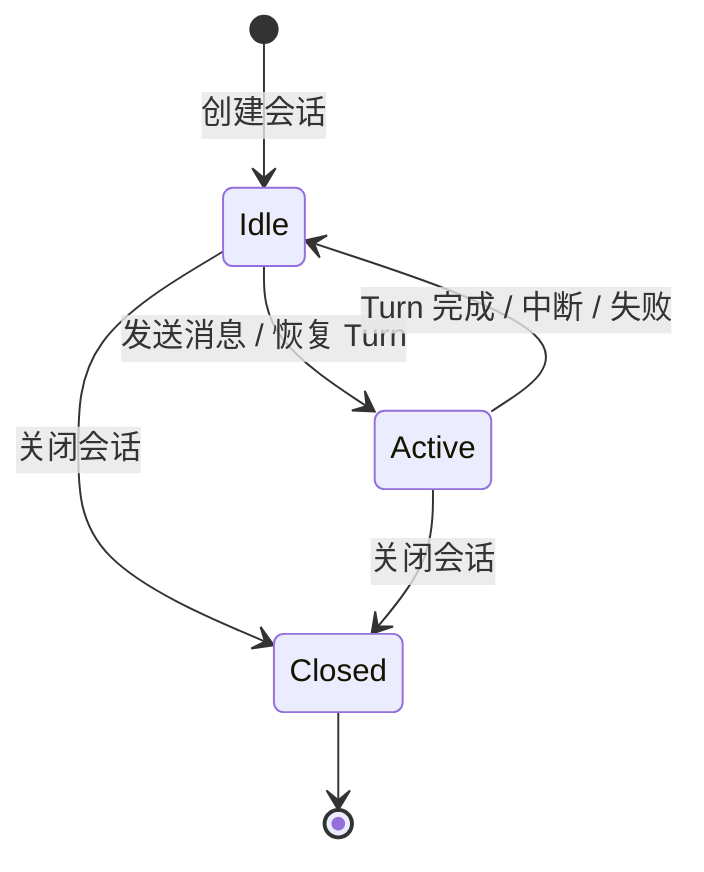
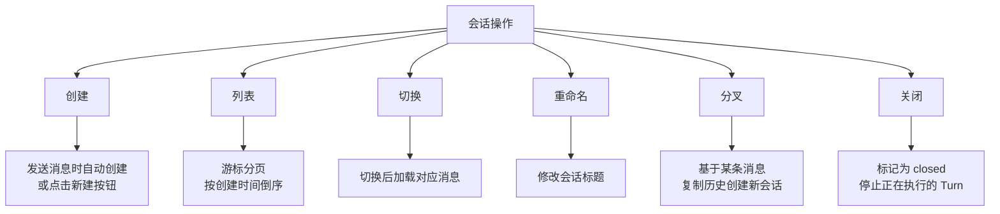
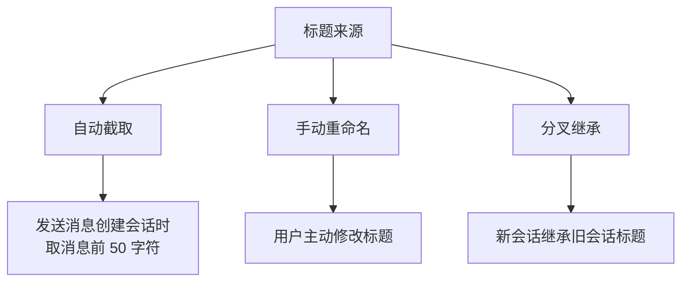
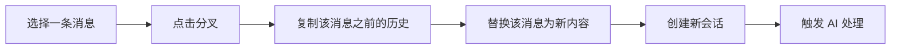
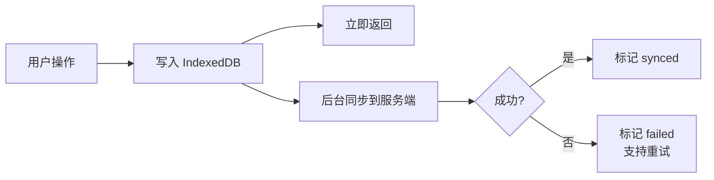

# 会话管理

## 概述

会话是用户与 AI 对话的容器。用户可创建、切换、重命名、删除会话，也可基于某条消息分叉创建新会话。

## 会话状态

| 状态 | 含义 |
|------|------|
| Idle | 空闲，可发送新消息 |
| Active | 正在执行 Turn（AI 处理中） |
| Closed | 已关闭，不可再写入 |

## 会话操作

| 操作 | 说明 |
|------|------|
| 创建 | 发送消息时自动创建；也可点击新建按钮创建空会话 |
| 列表 | 按创建时间倒序，游标分页加载 |
| 切换 | 选择历史会话，加载对应消息 |
| 重命名 | 修改会话标题 |
| 分叉 | 基于某条消息复制历史，替换该消息内容，触发新的 AI 流程 |
| 关闭 | 标记为 closed，停止正在执行的 Turn |

## 会话标题

## 会话分叉

分叉用于：对之前的回答不满意，修改问题重新生成。

## 并发约束

| 约束 | 说明 |
|------|------|
| 单 Turn 执行 | 同一会话同时只能有一个 Turn 在执行 |
| 归属隔离 | 用户只能操作自己的会话 |
| 关闭即冻结 | 已关闭的会话不可再发送消息 |

## 本地优先

会话数据先存本地，后台异步同步，保证离线可用。

## 实时更新

服务端通过 WebSocket 推送会话变更（创建、更新、关闭），前端自动同步到本地存储并更新 UI。
