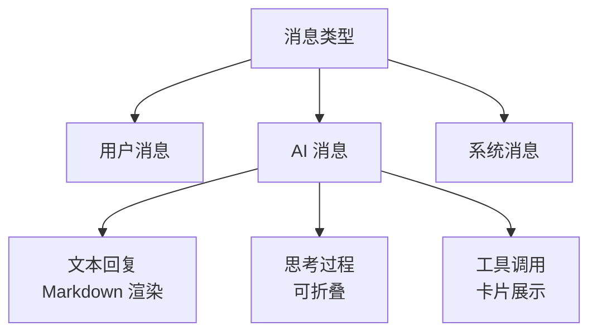
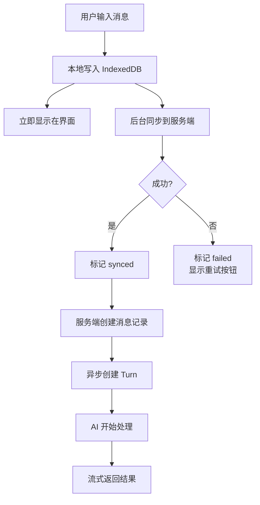
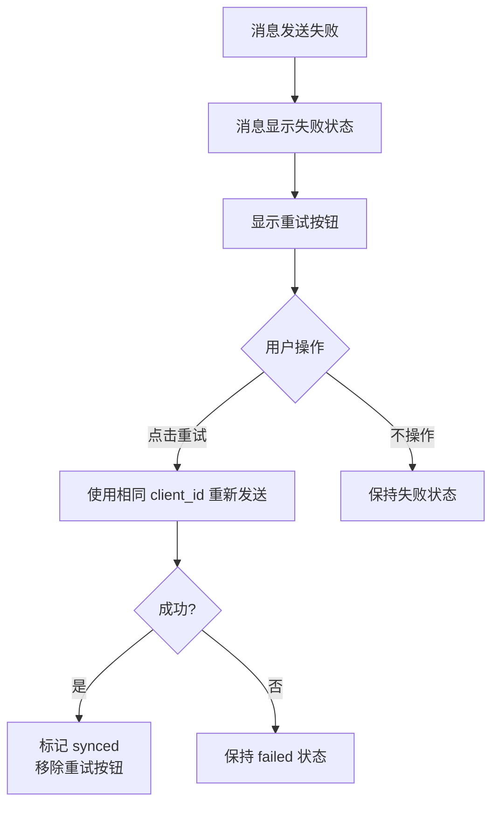
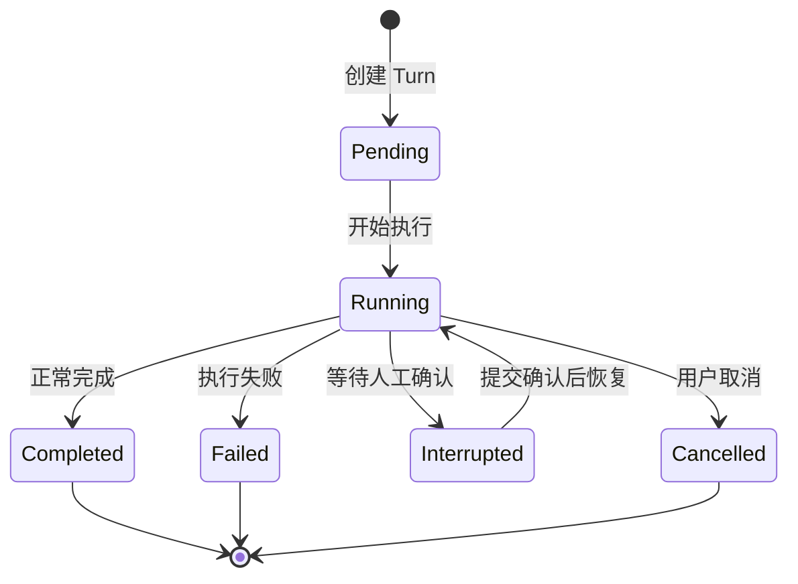
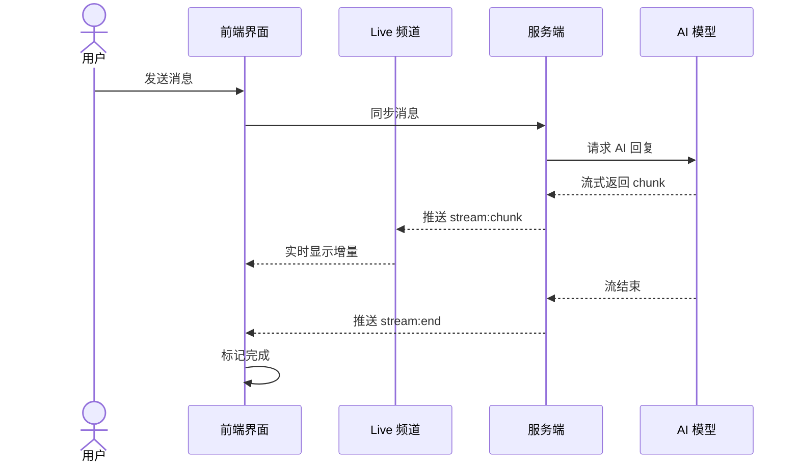
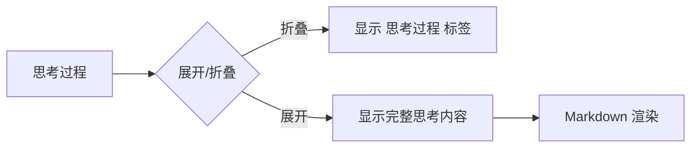
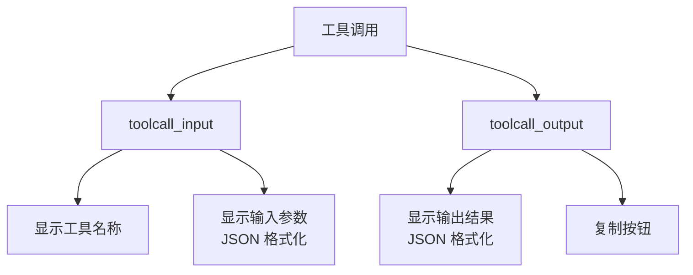

# 消息与对话

## 概述

消息是用户与 AI 交互的载体。用户发送消息，AI 流式返回回复，支持 Markdown 渲染、代码高亮、思考过程展示、工具调用卡片。

## 消息类型

| 类型 | 说明 |
|------|------|
| 用户消息 | 用户输入的内容 |
| AI 回复 | AI 生成的文本，支持 Markdown |
| 思考过程 | AI 的推理过程，默认折叠，可展开查看 |
| 工具调用 | AI 请求执行工具，显示输入参数和输出结果 |
| 系统消息 | 系统生成的通知消息 |

## 消息发送流程

消息先存本地立即显示，后台异步同步，保证响应速度。

## 发送失败交互

| 状态 | 用户看到的行为 |
|------|---------------|
| pending | 消息显示发送中状态 |
| synced | 消息正常显示 |
| failed | 消息显示失败标记 + 重试按钮 |

重试使用相同的 client_id，服务端幂等去重，不会产生重复消息。

## Turn 状态

| 状态 | 含义 |
|------|------|
| Pending | 等待执行 |
| Running | 正在执行 |
| Completed | 正常完成 |
| Failed | 执行失败 |
| Interrupted | 被中断（等待工具执行结果） |
| Cancelled | 用户取消 |

## 流式消息

流式消息实时显示 AI 生成过程，无需等待完整回复。

## 停止 Turn

用户可随时停止正在执行的 Turn：
- 点击停止按钮
- 服务端取消队列中的任务
- 正在执行的 Turn 标记为 Cancelled

## AI Thinking 展示

- 默认折叠，节省空间
- 点击展开查看 AI 推理过程
- 流式生成时有脉冲动画

## 工具调用卡片

- 输入参数和输出结果分区展示
- JSON 自动格式化
- 状态指示：运行中（橙色脉冲）/ 完成（绿色）
- 支持复制输入/输出内容

## 消息列表

| 特性 | 说明 |
|------|------|
| 排序 | 按发送时间升序 |
| 分页 | 游标分页，从服务端加载历史消息 |
| 自动滚动 | 新消息到达时自动滚动到底部 |
| 离开底部提示 | 用户滚动离开底部时显示"新消息"按钮 |

## 消息重试

| 场景 | 处理方式 |
|------|---------|
| 发送失败 | 标记 failed，显示重试按钮 |
| 幂等保证 | 使用 client_id 去重，重试不会产生重复消息 |
| RTC 失败 | 指数退避重试（1s, 2s, 4s...30s 封顶） |
