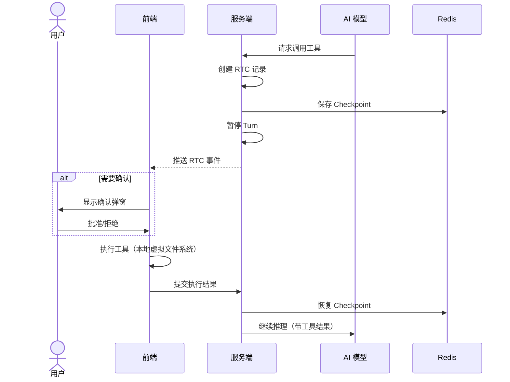
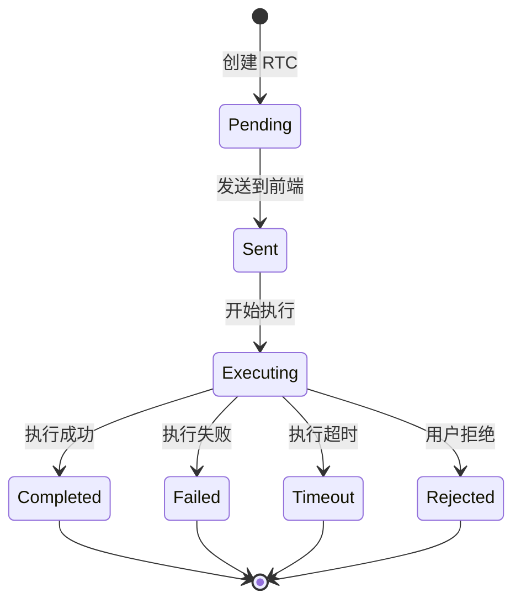
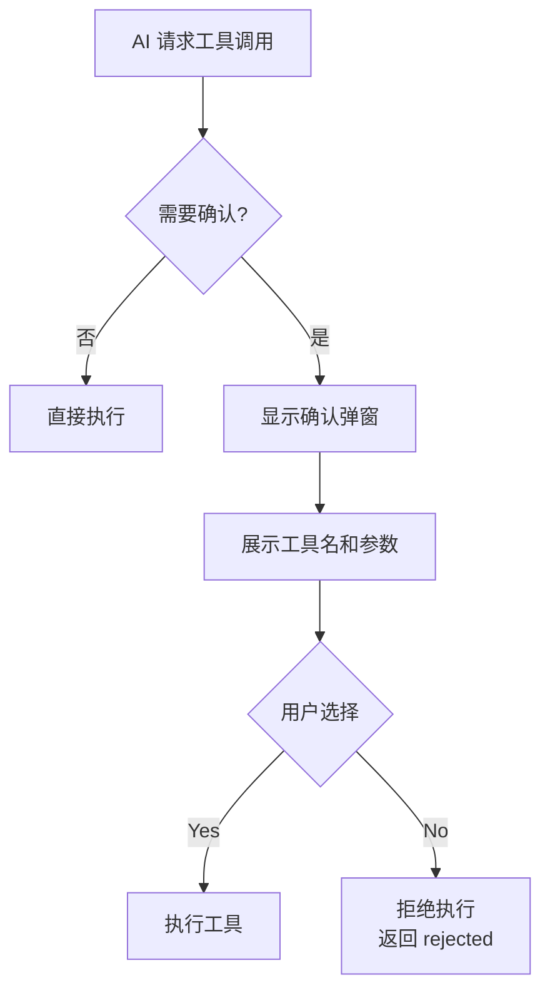
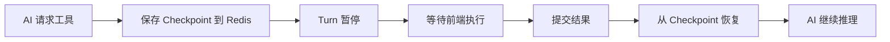
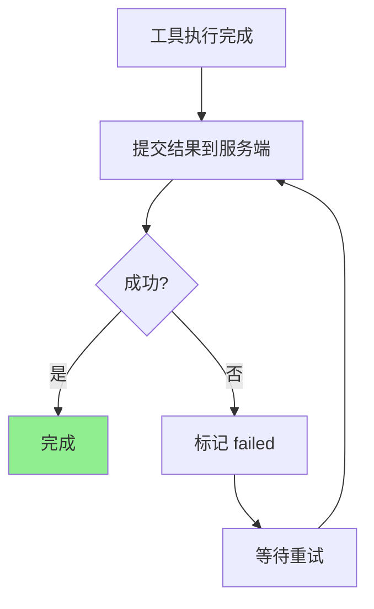
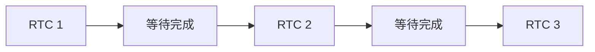

# Remote Tool Call 系统

## 概述

RTC（Remote Tool Call）是产品核心特性：AI 需要执行操作时，由浏览器端完成（文件读写、脚本执行等），数据不离开用户设备，实现隐私优先。

## RTC 完整生命周期

## 6 个内置工具

| 工具 | 功能 | 参数 |
|------|------|------|
| ls | 列出目录内容 | path（可选） |
| read | 读取文件 | path（必填），offset/limit（可选） |
| write | 写入文件 | path、content（必填），mode（overwrite/append） |
| grep | 搜索文件内容 | pattern（必填），path（可选） |
| find | 按名称查找文件 | pattern（必填），path（可选） |
| script | 执行 JavaScript | action（save/run/eval），name/code |

## RTC 状态

| 状态 | 含义 | AI 看到的提示 |
|------|------|--------------|
| Pending | 等待前端接收 | [Tool Pending] |
| Sent | 已送达前端 | [Tool Pending] |
| Executing | 正在执行 | [Tool Pending] |
| Completed | 执行成功 | 返回工具输出 |
| Failed | 执行失败 | [Tool Error] |
| Timeout | 执行超时 | [Tool Timeout] |
| Rejected | 用户拒绝 | [Tool Rejected] |

## 工具确认弹窗

确认弹窗显示：
- 工具名称
- 参数详情（JSON 格式化）
- Yes / No 按钮

## 权限系统（按工作模式）

| 工具 | manual | edit | plan/auto | bypass |
|------|--------|------|-----------|--------|
| ls / read / find / grep | 自动允许 | 自动允许 | 自动允许 | 自动允许 |
| write | 需确认 | 自动允许 | 自动允许 | 自动允许 |
| script | 需确认 | 需确认 | 需确认 | 自动允许 |

- 只读工具始终自动允许
- write 仅在 manual 模式需确认
- script 除 bypass 外都需确认

## Checkpoint 机制

- Checkpoint 存储在 Redis，TTL 24 小时
- 服务端重启后仍可恢复
- 用户无感知，体验为"AI 等待工具结果后继续"

## 结果上报可靠性

**必须 100% 上报成功**，否则 AI 无法继续，会无限等待：
- 提交失败时标记 `sync_status='failed'`
- 自动重试，直到成功
- 无放弃机制，必须保证送达

## 顺序执行机制

**同一会话的 RTC 严格顺序执行**：
- 当前 RTC 完成后，才处理下一个
- 避免并发导致的文件冲突
- RtcProcessor 维护处理队列，串行消费

## 失败处理

| 场景 | 处理方式 |
|------|---------|
| 提交结果失败 | 无限重试，直到成功 |
| 幂等保证 | 终态重复提交同 client_id 返回成功 |
| Checkpoint 过期 | 创建新 Submit 任务，AI 从历史中获取结果 |
