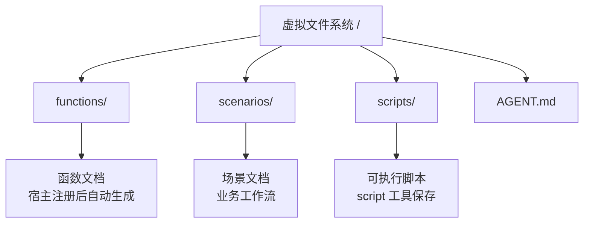
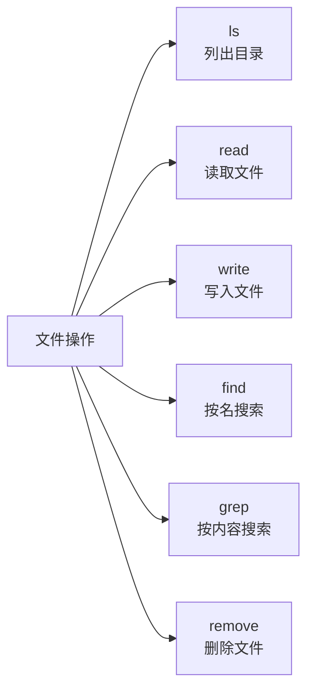
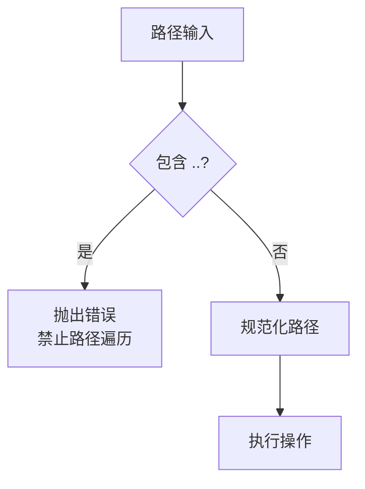
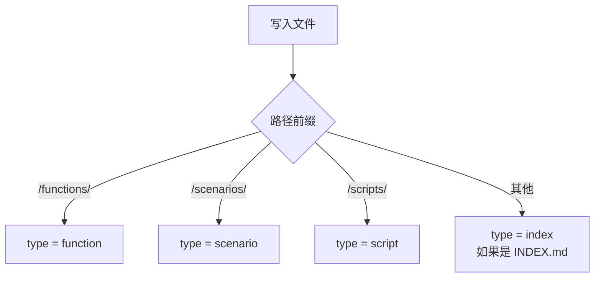

# 虚拟文件系统

## 概述

基于 IndexedDB 的虚拟文件系统，所有数据存储在浏览器本地。AI 通过 RTC 工具操作文件系统，实现本地化的文件管理。

## 文件系统结构

| 目录/文件 | 用途 | 类型 |
|-----------|------|------|
| `/functions/` | 函数文档（宿主应用注册后自动生成） | function |
| `/scenarios/` | 场景文档（业务工作流） | scenario |
| `/scripts/` | 保存的可执行脚本 | script |
| `/AGENT.md` | 系统入口文件 | index |

## 路径规范

| 规则 | 说明 |
|------|------|
| 根目录 | `/` |
| 分隔符 | `/`（正斜杠） |
| 绝对路径 | 所有路径自动转为绝对路径 |
| 目录 | 逻辑概念，不单独存储，通过路径推导 |

## 文件操作

| 操作 | 功能 | 参数 |
|------|------|------|
| ls | 列出目录内容 | path（默认 `/`） |
| read | 读取文件内容 | path（必填），offset/limit（分页） |
| write | 写入/创建文件 | path、content（必填），mode（overwrite/append） |
| find | 按名称搜索 | pattern（glob），path |
| grep | 按内容搜索 | pattern（正则），path，caseSensitive |
| remove | 删除文件 | path |

## 安全约束

| 约束 | 说明 |
|------|------|
| 路径遍历防护 | `..` 直接拒绝，不做解析 |
| 权限控制 | 按工作模式决定（见 RTC 权限表） |
| 大小限制 | 无显式限制，受浏览器 IndexedDB 配额约束 |

## 存储机制

| 特性 | 说明 |
|------|------|
| 存储方式 | IndexedDB（Dexie.js 封装） |
| 主键 | 文件路径 |
| 大文件 | 无特殊处理，整存整取，支持分页读取 |
| 缓存 | 无缓存层，每次直接查询 IndexedDB |

## 文件类型推断

文件类型根据路径自动推断，无需显式指定。

## 初始化

系统启动时检查 `/AGENT.md` 是否存在，不存在则自动生成模板，描述目录结构和可用工具。
