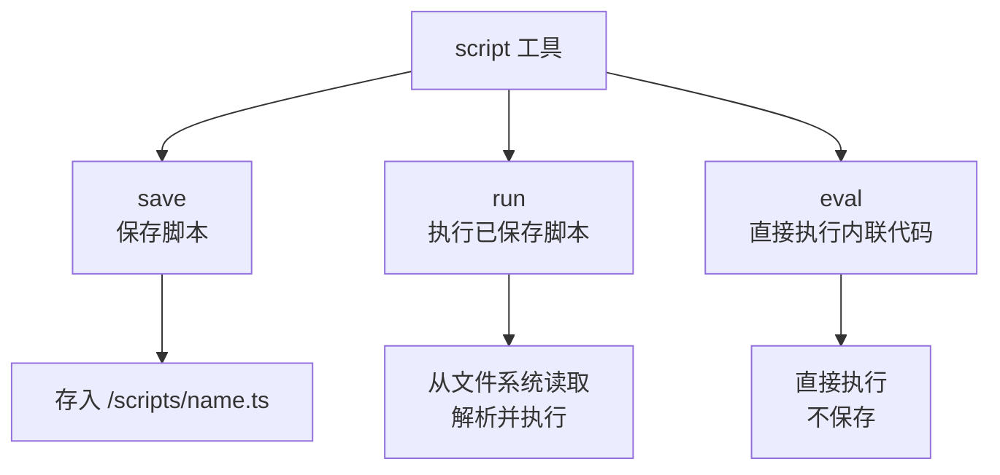
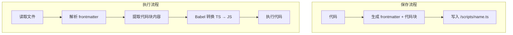
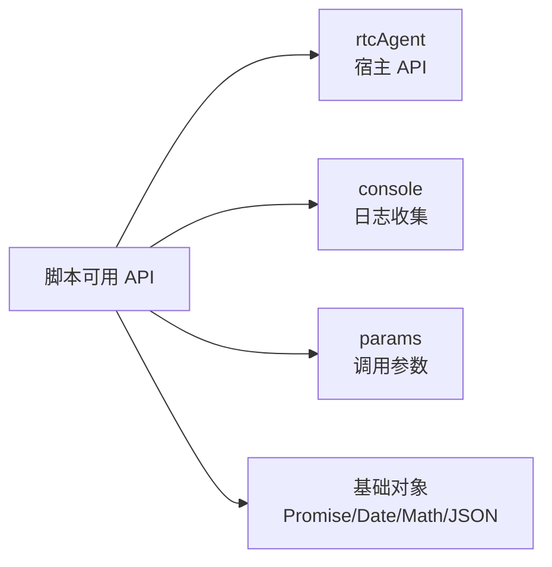
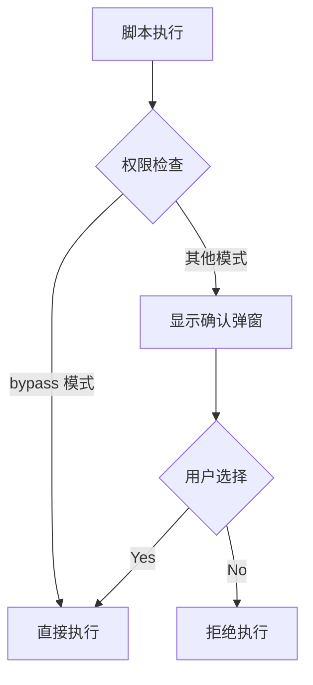
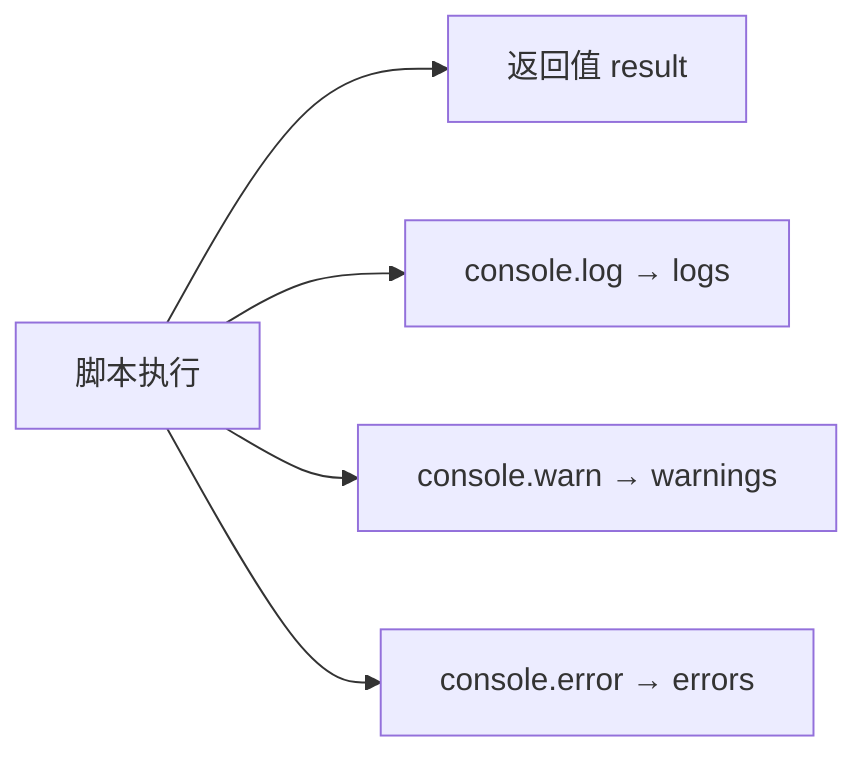

# 脚本执行引擎

## 概述

脚本执行引擎允许 AI 在浏览器中执行 JavaScript/TypeScript 代码，扩展 AI 的能力。脚本可以操作虚拟文件系统、调用宿主函数。

## 脚本类型

| 特性 | 说明 |
|------|------|
| 支持语言 | JavaScript / TypeScript（自动转换） |
| 转换方式 | Babel 擦除 TypeScript 类型语法 |
| 执行环境 | 浏览器主线程（无沙箱隔离） |

## 三种执行方式



| Action | 功能 | 必需参数 |
|--------|------|---------|
| save | 保存脚本到文件系统 | name, code |
| run | 执行已保存的脚本 | name |
| eval | 直接执行内联代码 | code |

## 脚本存储与执行流程



**保存格式**（YAML frontmatter + Markdown 代码块）：
```markdown
---
name: "myScript"
description: "示例脚本"
createdAt: "2026-09-05T..."
---

```typescript
console.log("Hello");
```
```

**执行时**：
1. 读取文件内容
2. 解析 frontmatter（获取元数据）
3. 提取代码块中的代码（支持多个代码块，自动拼接）
4. 如果没有代码块，直接使用文件内容作为代码
5. Babel 转换后执行

Markdown 格式用于**可读性和元数据存储**，实际执行的是提取出来的纯代码。

## 沙箱 API



**rtcAgent API**：

| 方法 | 功能 |
|------|------|
| callFunction | 调用已注册的函数 |
| readFile | 读取文件 |
| writeFile | 写入文件 |
| listDir | 列出目录 |

**console 劫持**：log/warn/error 输出同时收集，返回给 AI。

## 安全约束



| 约束 | 说明 |
|------|------|
| 权限 | 除 bypass 外都需要用户确认 |
| 超时 | 默认 30 秒，可自定义 |
| 超时行为 | 放弃等待，不终止脚本（脚本仍在后台运行） |
| 隔离 | 无真正隔离，通过 new Function 构造限制 this |

## 输出收集



返回结构：
- `result` — 脚本返回值
- `logs` — console.log 输出
- `warnings` — console.warn 输出
- `errors` — console.error 输出

## 异步支持

- 脚本支持 async/await
- 执行包装为 async IIFE
- 沙箱提供 Promise 构造器
