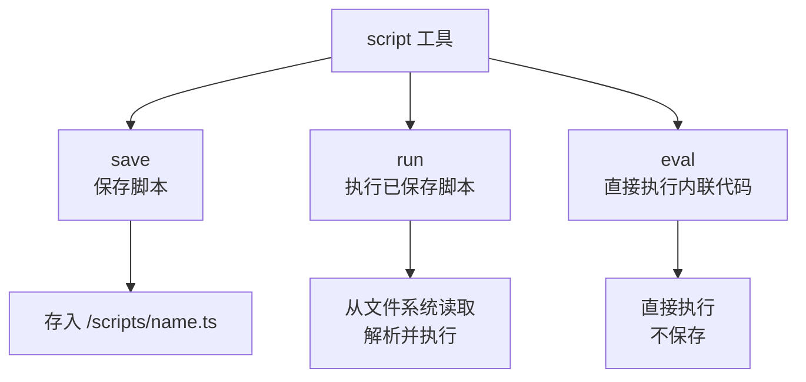
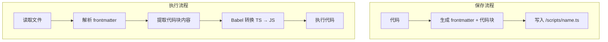
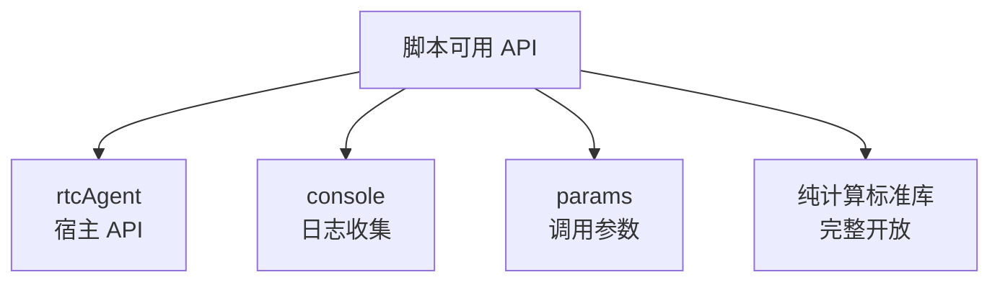
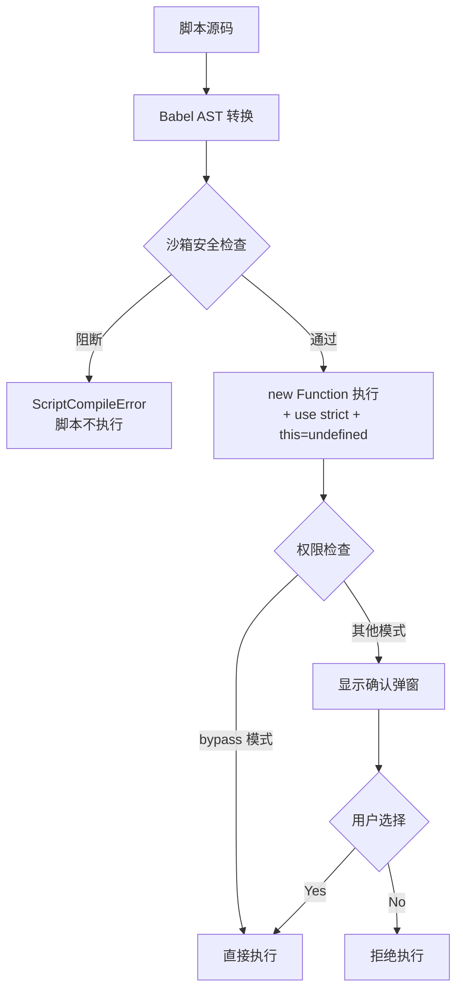
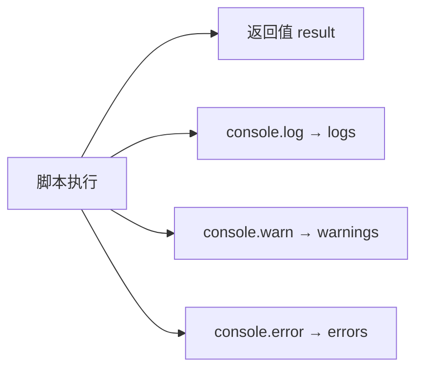

# 脚本执行引擎

## 概述

脚本执行引擎允许 AI 在浏览器中执行 JavaScript/TypeScript 代码，扩展 AI 的能力。脚本通过 `rtcAgent.*` 操作 UI、读写虚拟文件系统、调用宿主函数。

**核心原则**：沙箱限制"副作用"（存储/网络/DOM），不限制"表达力"（语言/数据结构/逻辑）。LLM 的创造力在逻辑层——数据处理、控制流、rtcAgent 调用组合——这一层完全敞开。

## 脚本类型

| 特性 | 说明 |
|------|------|
| 支持语言 | JavaScript / TypeScript（自动转换） |
| 转换方式 | Babel 类型擦除 + 沙箱安全插件（AST 阶段阻断危险 API） |
| 执行环境 | 浏览器主线程，AST 级沙箱（非隔离沙箱） |

## 三种执行方式



| Action | 功能 | 必需参数 |
|--------|------|---------|
| save | 保存脚本到文件系统 | name, code |
| run | 执行已保存的脚本 | name |
| eval | 直接执行内联代码 | code |

## 脚本存储与执行流程



**保存格式**（YAML frontmatter + Markdown 代码块）：
```markdown
---
name: "myScript"
description: "示例脚本"
createdAt: "2026-09-05T..."
---

```typescript
console.log("Hello");
```
```

**执行时**：
1. 读取文件内容
2. 解析 frontmatter（获取元数据）
3. 提取代码块中的代码（支持多个代码块，自动拼接）
4. 如果没有代码块，直接使用文件内容作为代码
5. Babel 转换后执行

Markdown 格式用于**可读性和元数据存储**，实际执行的是提取出来的纯代码。

## 沙箱 API



### rtcAgent API（宿主注入）

| 方法              | 功能           |
| ----------------- | -------------- |
| callFunction      | 调用已注册的函数 |
| readFile          | 读取文件       |
| writeFile         | 写入文件       |
| listDir           | 列出目录       |

> 通过 `rtcAgent.*` 可访问所有已注册的 Function Group（如 `rtcAgent.task.create()`），实现完整的 UI 操作能力。

### 纯计算标准库（完整开放）

沙箱**显式注入**以下标准库，使 API 表面可审计：

| 类别             | 可用的全局对象/函数                                                                                                     |
| ---------------- | ---------------------------------------------------------------------------------------------------------------------- |
| 语言构造器       | Promise, Date, Math, JSON, Array, Object, String, Number, Boolean, Error                                                |
| 数据结构         | Map, Set, WeakMap, WeakSet, RegExp, Symbol, BigInt                                                                      |
| Error 子类       | TypeError, RangeError, ReferenceError, SyntaxError, URIError, AggregateError                                            |
| 解析与编码       | parseInt, parseFloat, isNaN, isFinite, encodeURIComponent, decodeURIComponent, encodeURI, decodeURI, atob, btoa          |
| 工具函数         | structuredClone                                                                                                         |
| 特殊值           | NaN, Infinity, undefined                                                                                                |
| URL 解析         | URL, URLSearchParams                                                                                                    |
| console          | log, warn, error（劫持版，输出同时收集给 AI）                                                                            |

> 未列入的浏览器标准全局（如 `queueMicrotask`）可通过作用域链访问。沙箱通过 AST 阻断副作用 API（见下文），而非逐个白名单。

**console 劫持**：log/warn/error 输出同时收集，返回给 AI。

### 内置 system 工具组（默认注册）

沙箱阻断了 `setTimeout`、`crypto.randomUUID` 等"灰色 API"。为了让脚本仍有能力使用这些常用功能，系统**默认注册** `rtcAgent.system.*` 工具组，通过标准 `FunctionDef` 规范注册（自动生成虚拟文档，LLM 通过 `/functions/INDEX.md` 发现）。

| 函数                          | 功能                          | 包装的平台 API            |
| ----------------------------- | ----------------------------- | ------------------------- |
| rtcAgent.system.delay(ms)     | 暂停执行指定毫秒数            | setTimeout                |
| rtcAgent.system.uuid(count?)  | 生成 UUID v4（支持批量）       | crypto.randomUUID         |
| rtcAgent.system.now()         | 获取当前时间戳（毫秒）          | Date.now                  |
| rtcAgent.system.random(opts?) | 生成随机数（支持范围/整数）     | Math.random               |
| rtcAgent.system.time(format?) | 获取格式化时间（iso/locale/ts） | Date                      |

**注册方式**：遵守标准 FunctionDef 规范（OpenAPI 参数 schema + handler），由 `defineRegistry()` 自动调用 `registerBuiltinSystemGroup()` 完成。与用户自定义 group 无异——可被 `rtcAgent.system.*` 链式调用，虚拟文档自动生成在 `/functions/system/*.md`。

**实现位置**：`web-components/packages/component/src/core/builtin-system-group.ts`

## 安全约束



### AST 阶段阻断（编译期，脚本不执行）

沙箱插件在 Babel 转换阶段**静态阻断**以下类别：

| 类别             | 阻断目标                                                                                                    | 替代方案                         |
| ---------------- | ----------------------------------------------------------------------------------------------------------- | -------------------------------- |
| 存储 API         | localStorage, sessionStorage, indexedDB, caches, cookieStore                                                | rtcAgent.readFile / writeFile    |
| 网络 API         | fetch, XMLHttpRequest, WebSocket, EventSource, BroadcastChannel                                             | rtcAgent.callFunction            |
| DOM / 浏览器环境 | window, self, document, navigator, location, history, screen, alert, confirm, prompt 等                      | rtcAgent（UI 操作走 Function 注册）|
| 元编程 / 逃逸    | eval, Function, globalThis, global                                                                          | 无需替代                         |
| Worker           | Worker, SharedWorker, ServiceWorker, importScripts                                                          | 无需替代                         |
| 定时器           | setTimeout, setInterval（逃逸超时控制）                                                                      | 后续提供 rtcAgent.delay 包装     |
| 共享内存         | SharedArrayBuffer, Atomics                                                                                  | 无需替代                         |
| CJS 全局         | require, module, exports, __dirname, __filename                                                             | 无需替代                         |
| 原型链逃逸       | `.constructor`, `.__proto__`（包括 `['constructor']` 字符串索引形式）                                         | 无需替代                         |
| 动态 import      | `import(...)`                                                                                               | 无需替代                         |
| 无限循环         | `while`, `do...while`, `for(;;)`                                                                             | for...of / 有界 for / 数组迭代方法 |

**智能识别**：如果标识符有本地绑定（如用户声明了同名变量），不会误阻断。TypeScript 类型注解（如 `const fn: Function`）也不会触发阻断。

### 执行阶段约束（运行时）

| 约束       | 说明                                                                          |
| ---------- | ----------------------------------------------------------------------------- |
| 权限       | 除 bypass 外都需要用户确认                                                     |
| 超时       | 默认 30 秒，可自定义                                                           |
| 超时行为   | 放弃等待，不终止脚本（脚本仍在后台运行）                                         |
| this 绑定  | `"use strict"` + `fn.call(undefined)` 防止 this 逃逸到 globalThis               |
| 隔离       | AST 级沙箱（非隔离沙箱）。通过 new Function 构造限制形参作用域 + AST 阻断副作用 API |

### 设计哲学

> **沙箱限制的是"副作用"（存储/网络/DOM），不是"表达力"（语言/数据结构/逻辑）。LLM 的创造力在逻辑层，这一层要敞开。**

脚本来源为 LLM 生成，威胁模型是防止 LLM 幻觉/过度发挥（误用平台 API），而非防御恶意攻击。AST 阻断 + 权限确认 构成两层防线。

## 输出收集



返回结构：
- `result` — 脚本返回值
- `logs` — console.log 输出
- `warnings` — console.warn 输出
- `errors` — console.error 输出

## 异步支持

- 脚本支持 async/await
- 执行包装为 async IIFE
- 沙箱提供 Promise 构造器
