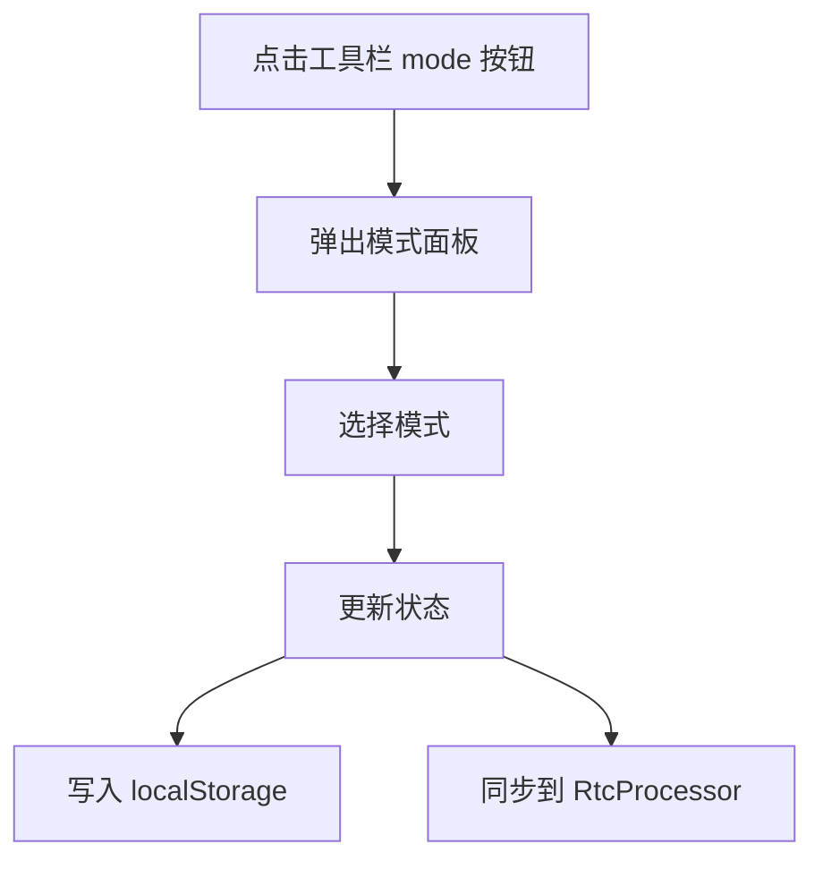
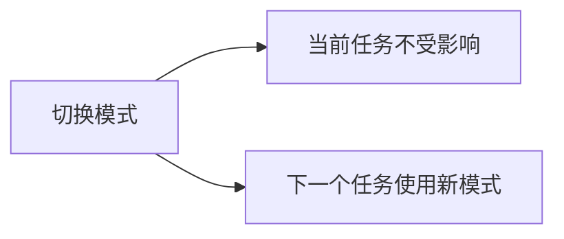

# 工作模式系统

## 概述

工作模式决定 AI 执行工具时是否需要用户确认。不同模式提供不同级别的自动化程度，让用户在安全和效率之间选择。

## 5 种工作模式

| 模式 | 标签 | 说明 | 启用状态 |
|------|------|------|---------|
| manual | Manual | 每次编辑前询问用户 | ✅ 启用 |
| edit | Edit automatically | 自动编辑文件 | ✅ 启用 |
| plan | Plan | 先探索代码再编辑 | ❌ 未启用 |
| auto | Auto | 安全检查后自动执行 | ❌ 未启用 |
| bypass | Bypass permissions | 不询问直接执行 | ✅ 启用 |

**默认模式**：`edit`

## 模式切换

- 位置：输入区域底部工具栏
- 面板：浮动在按钮上方
- 关闭：点击外部或按 Escape

## 工具权限矩阵

| 工具 | manual | edit | bypass |
|------|--------|------|--------|
| ls / read / find / grep | 自动允许 | 自动允许 | 自动允许 |
| write | 需确认 | 自动允许 | 自动允许 |
| script | 需确认 | 需确认 | 自动允许 |

- **只读工具**：所有模式自动允许
- **write**：仅 manual 需确认
- **script**：仅 bypass 自动允许（风险最高）

## 模式切换的影响

- 正在执行的任务不会被中断
- 新模式立即影响下一个待处理的工具调用

## 状态持久化

- 存储在 `localStorage['rtc_mode']`
- 页面刷新后恢复上次的模式
- 存储失败时静默降级为默认值 `edit`
