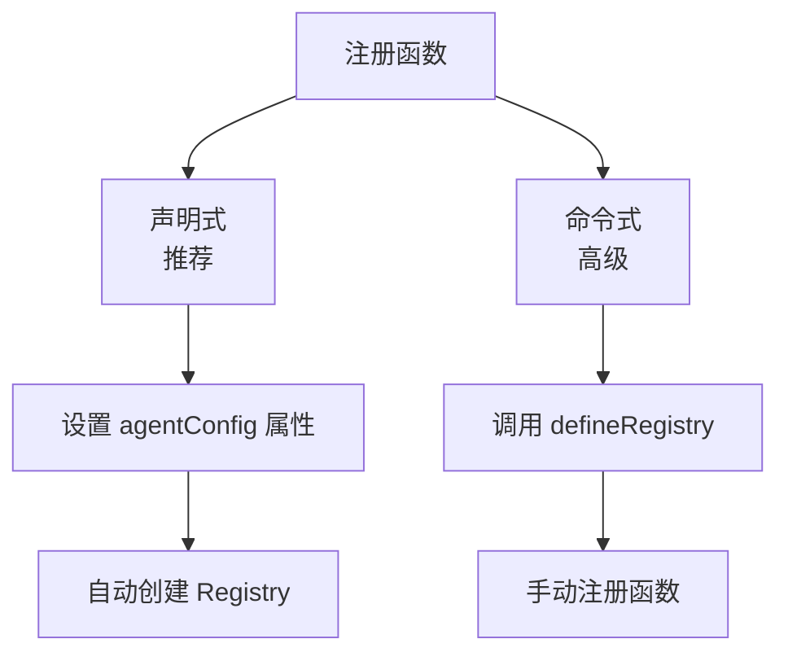
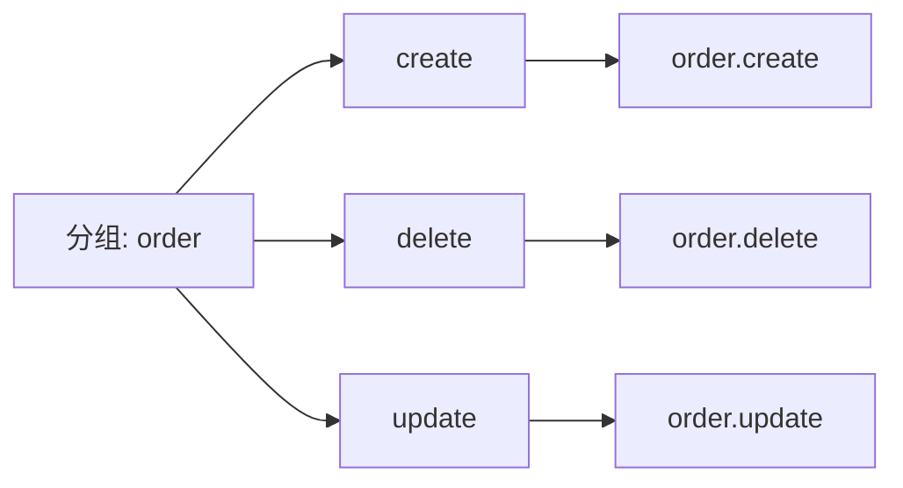
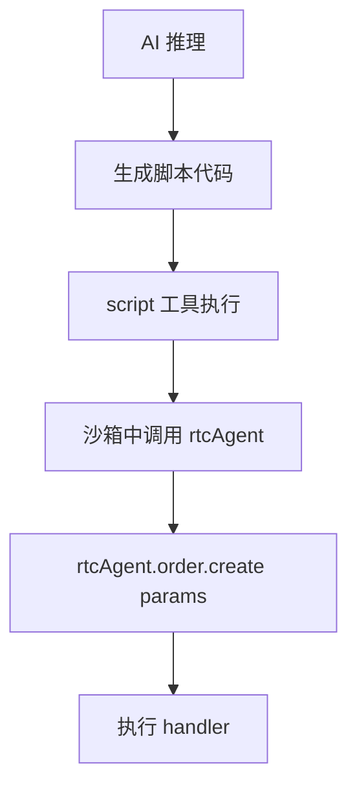
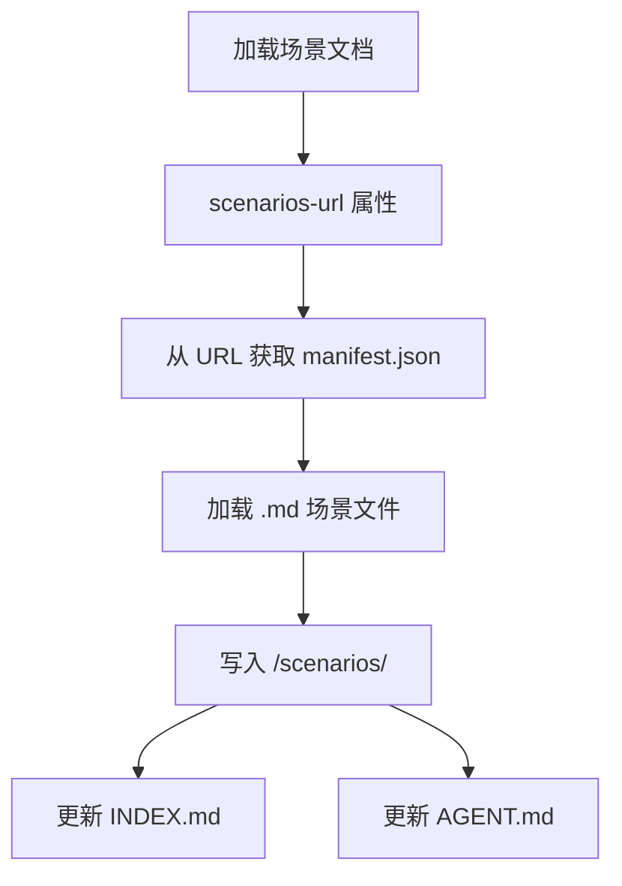

# Skill 系统

## 概述

Skill 系统允许宿主应用注册自定义函数，AI 可以通过脚本调用这些函数，扩展产品能力。函数文档自动生成，AI 可直接阅读使用。

## 两种注册方式



**声明式（推荐）**：
```ts
agent.agentConfig = {
  name: 'MyApp',
  persona: '你是一个...助手',
  groups: [{
    name: 'editor',
    description: '编辑器操作',
    functions: [
      { name: 'getCode', description: '获取代码', handler: () => editor.getCode() }
    ]
  }]
};
```

## 函数定义

| 字段 | 说明 |
|------|------|
| name | 函数名称 |
| description | 函数描述（写入文档） |
| parameters | 参数列表（OpenAPI Schema 格式） |
| returns | 返回值定义 |
| handler | 执行函数（支持异步） |
| hooks | UI 钩子（onStart/onSuccess/onError/onProgress） |

## 函数分组



- 分组名 + 函数名 = 完整路径（如 `order.create`）
- 文档自动生成到 `/functions/{group}/{funcName}.md`

## AI 调用方式



AI 通过 `script` 工具执行代码，在沙箱中使用 `rtcAgent.groupName.funcName(params)` 调用函数。

## Proxy 链式调用

```ts
// 链式调用
await rtcAgent.order.create({ productId: '123', quantity: 2 });

// 等价于
await rtcAgent.execute('order.create', { productId: '123', quantity: 2 });
```

通过 Proxy 实现自然的 API 调用语法。

## Hook 系统

| Hook | 触发时机 | 说明 |
|------|---------|------|
| onStart | 执行前 | 可抛出 CancelledError 取消执行 |
| onSuccess | 成功后 | 异步执行，不阻塞 |
| onError | 失败后 | 异步执行，不阻塞 |
| onProgress | 进度更新 | handler 调用 onProgress(n) 时触发 |

## 文档自动生成

```mermaid
flowchart TD
    A[注册函数] --> B[生成函数文档]
    B --> C[/functions/group/func.md]
    B --> D[更新 INDEX.md]
    B --> E[更新 AGENT.md]
```

- 每次注册函数自动生成 Markdown 文档
- 包含：函数描述、参数表格、返回值、调用示例
- AI 可直接阅读文档了解如何使用

## Scenarios 场景机制



| 特性 | 说明 |
|------|------|
| 场景文档 | 业务工作流说明，Markdown 格式 |
| 加载方式 | 通过 `<rtc-agent scenarios-url="...">` 属性指定 URL |
| 存储位置 | `/scenarios/{slug}.md` |
| 索引文件 | `/scenarios/INDEX.md` 自动更新 |
| AI 使用 | AI 可阅读场景文档了解业务流程 |

场景用于告诉 AI 特定的业务流程和操作指南，例如"如何创建订单"、"如何处理退款"等。
