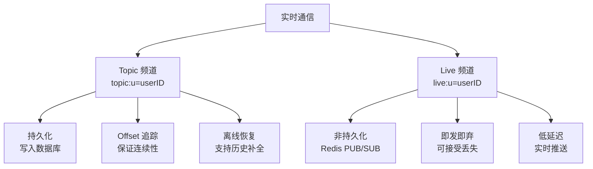
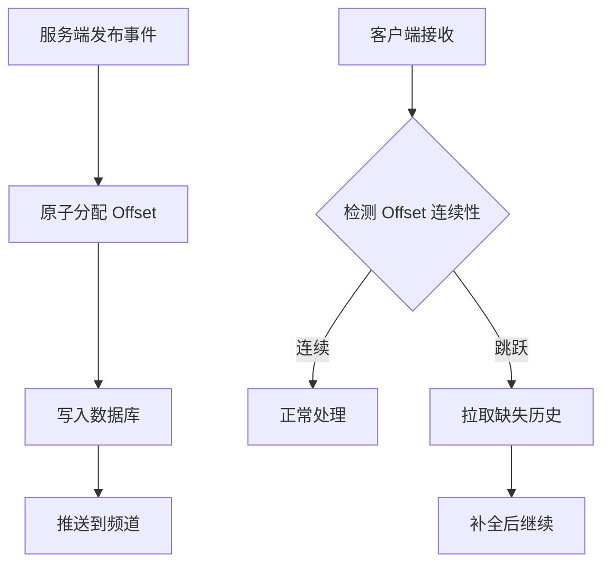
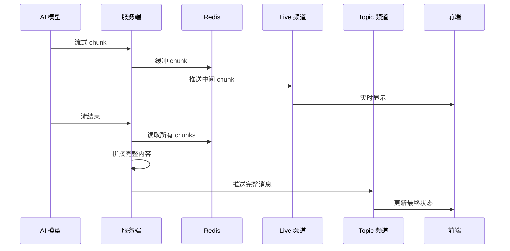
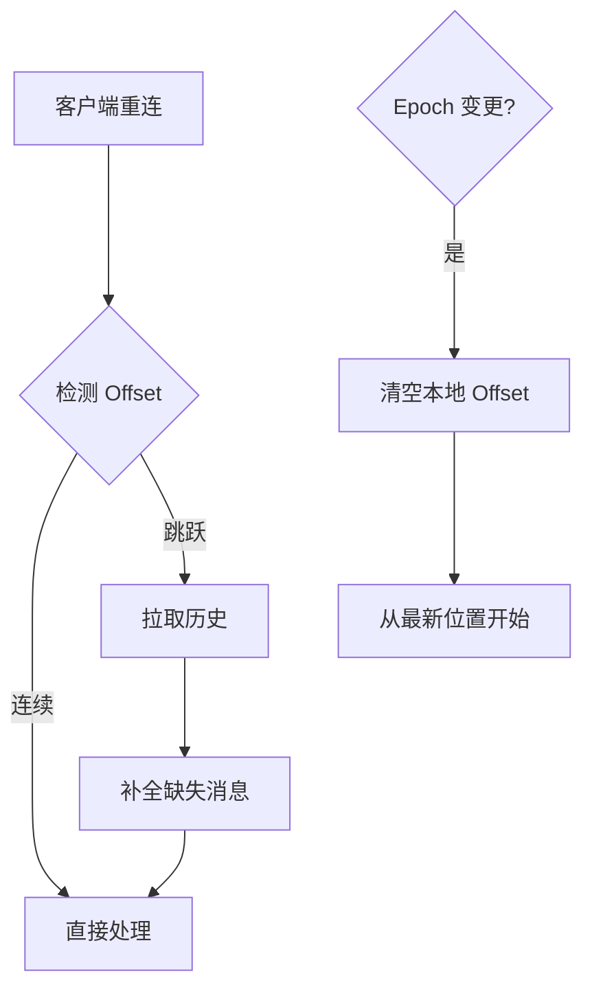

# 实时通信

## 概述

基于 Centrifuge WebSocket 的实时通信系统，采用双频道架构：Topic 频道保证可靠性，Live 频道提供低延迟。

## 双频道架构

| 频道 | 用途 | 特性 |
|------|------|------|
| Topic | 状态变更事件 | 持久化、Offset 追踪、离线恢复 |
| Live | 流式消息中间 chunks | 非持久化、低延迟、可丢失 |

## 事件分布

| 事件类型 | Topic 频道 | Live 频道 |
|---------|-----------|-----------|
| session.created/updated | ✅ | ❌ |
| turn.created/updated | ✅ | ❌ |
| message.created | ✅ | ❌ |
| message.updated（流完成） | ✅ | ❌ |
| message.updated（流中间 chunk） | ❌ | ✅ |
| rtc.created/updated | ✅ | ❌ |

## Offset 机制

- 每个 Topic 事件分配严格递增的 Offset
- 客户端检测 Offset 跳跃，自动补全历史
- 保证消息不丢失、不重复

## 流式消息流程

1. 第一个 chunk：创建消息记录，推送到 Topic
2. 中间 chunks：追加到 Redis，推送到 Live（实时显示）
3. 最后一个 chunk：拼接完整内容，更新数据库，推送到 Topic

## 离线恢复

| 场景 | 行为 |
|------|------|
| 短暂断网 | 自动推送离线消息 |
| 长时间断网 | 检测 Offset 跳跃，拉取历史 |
| 历史被清理 | Epoch 变更，从最新位置开始 |

## 重连行为

- Centrifuge SDK 自动重连
- Token 失效时尝试刷新，失败则需重新登录
- Offset 持久化到 IndexedDB，页面刷新后恢复
