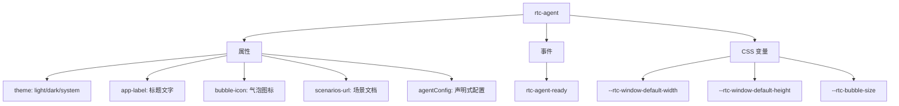
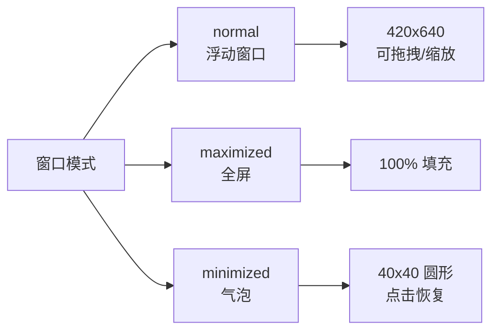
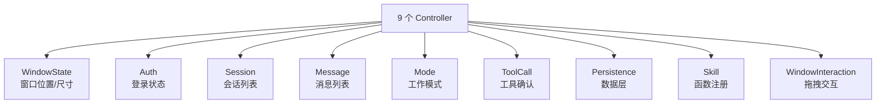

# 前端组件架构

## 概述

基于 Lit 的 Web Components 组件库，对外只暴露一个 `<rtc-agent>` 组件，内部包含 16 个子组件，使用 9 个 Controller 管理状态。

## 公开组件 `<rtc-agent>`

| 属性 | 说明 |
|------|------|
| theme | 主题切换（light/dark/system） |
| app-label | 标题栏文字 + 气泡 tooltip |
| bubble-icon | 最小化气泡内的 SVG/HTML |
| scenarios-url | 场景文档 URL |
| agentConfig | 声明式函数注册（推荐） |

## 窗口系统

- 拖拽：title-bar 作为手柄
- 缩放：8 方向 resize
- 键盘：方向键移动，Shift 加速
- 视口约束：始终保持在可视区域内

## 状态管理

- Controller 之间不直接引用
- 根组件 `<rtc-agent>` 作为中枢编排跨 Controller 通信
- 使用 `@lit/context` 向子组件分发状态

## 样式系统

| 层级 | 内容 |
|------|------|
| Design Tokens | 间距、字体、圆角、阴影、过渡、z-index |
| 颜色主题 | light / dark（VS Code 风格） |
| CSS 变量 | 组件级自定义（窗口尺寸、气泡大小） |

## 关键交互

**输入区域**：
- textarea + 底部工具栏
- Enter 提交，Shift+Enter 换行
- 工具栏：附件、工具、模式、发送/停止

**消息列表**：
- 自动滚动到底部
- 用户滚动离开时显示"新消息"按钮
- 支持 Markdown 渲染、代码高亮

**工具确认弹窗**：
- 显示工具名和参数
- Yes / No 按钮
- 点击背景等同拒绝
