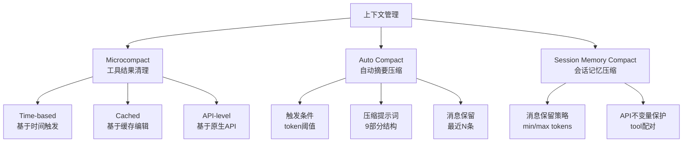
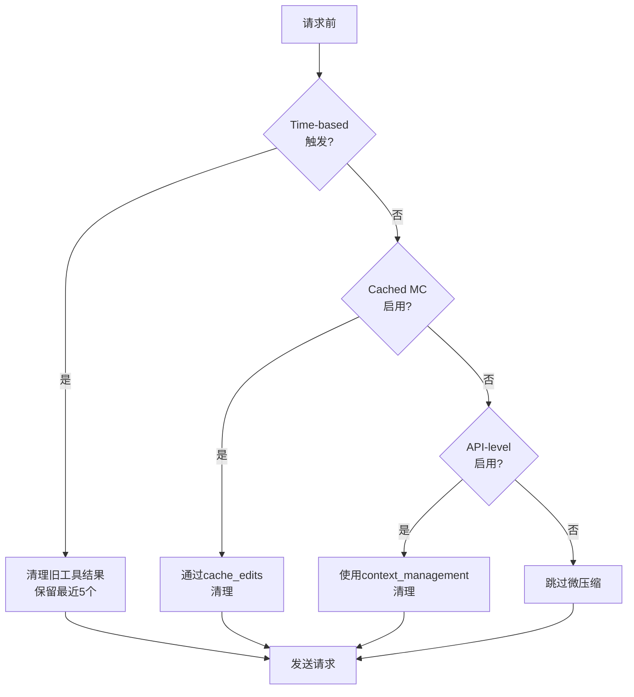
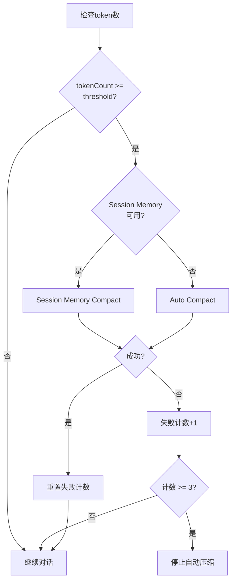
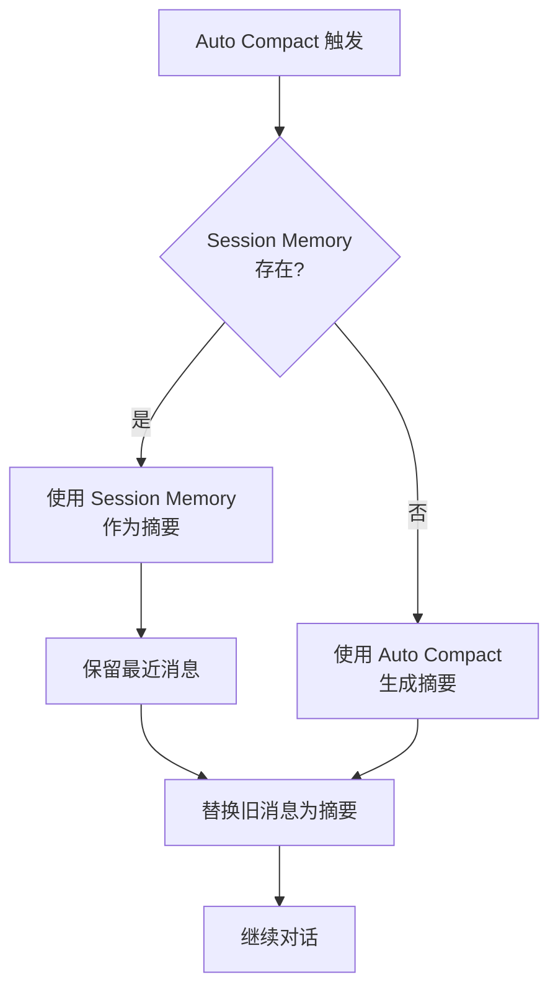
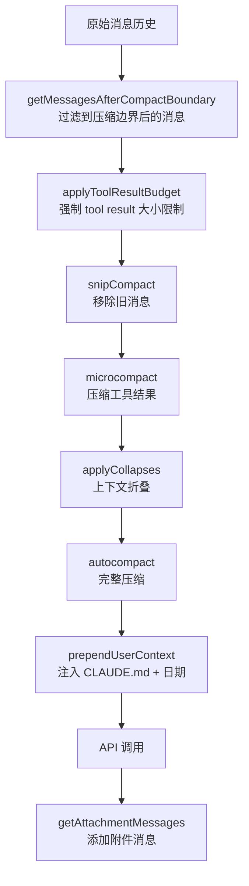

# Agent 上下文管理

## 概述

Agent 上下文管理系统负责在对话过程中智能地管理上下文窗口，通过多层次的压缩策略确保对话可以持续进行而不丢失关键信息。系统采用三层压缩机制：Microcompact（工具结果清理）、Auto Compact（自动摘要压缩）、Session Memory Compact（基于会话记忆的压缩）。

## 核心概念



## 1. Microcompact - 工具结果清理

### 目的
在不触发完整压缩的情况下，清理旧的工具调用结果，释放上下文空间。

### 可压缩的工具
仅清理以下工具的结果（这些工具通常产生大量输出）：
- `Read` - 文件读取
- `Bash` / `PowerShell` - Shell 命令
- `Grep` - 文本搜索
- `Glob` - 文件匹配
- `WebSearch` - 网络搜索
- `WebFetch` - 网页抓取
- `Edit` - 文件编辑
- `Write` - 文件写入

### 清理策略

#### 策略 A: Time-based Microcompact（基于时间）
当距上次 assistant 消息的时间间隔超过阈值时触发：

| 配置项 | 默认值 | 说明 |
|--------|--------|------|
| gapThresholdMinutes | 60 | 时间间隔阈值（分钟） |
| keepRecent | 5 | 保留最近的 N 个工具结果 |

清理后的内容替换为：`[Old tool result content cleared]`

**注意**：至少保留 1 个最近的工具结果（`Math.max(1, keepRecent)`），避免模型失去所有工作上下文。

#### 策略 B: Cached Microcompact（基于缓存编辑）
使用 API 的 `cache_edits` 功能，在不破坏 prompt cache 的情况下清理工具结果：
- 不修改本地消息内容
- 通过 `cache_edits` 块告知 API 删除特定 tool_result
- 适用于缓存仍然有效的场景

#### 策略 C: API-level Context Management（基于原生 API）
使用 Anthropic API 原生的 `context_management` 功能：

| 配置项 | 默认值 | 说明 |
|--------|--------|------|
| maxInputTokens | 180,000 | 触发阈值 |
| targetInputTokens | 40,000 | 保留最近的 N tokens |

策略类型：
- `clear_tool_uses_20250919` - 清理工具结果
- `clear_thinking_20251015` - 清理 thinking 块

### 执行流程



## 2. Auto Compact - 自动摘要压缩

### 触发条件

```
effectiveContextWindow = contextWindow - MAX_OUTPUT_TOKENS_FOR_SUMMARY
autoCompactThreshold = effectiveContextWindow - AUTOCOMPACT_BUFFER_TOKENS
```

| 配置项 | 默认值 | 说明 |
|--------|--------|------|
| MAX_OUTPUT_TOKENS_FOR_SUMMARY | 20,000 | 预留输出 token 数 |
| AUTOCOMPACT_BUFFER_TOKENS | 13,000 | 缓冲区 token 数 |

对于 200K 上下文窗口模型：
- effectiveContextWindow = 200,000 - 20,000 = 180,000
- autoCompactThreshold = 180,000 - 13,000 = **167,000 tokens**

当 `tokenCount >= autoCompactThreshold` 时触发自动压缩。

### 熔断机制

连续自动压缩失败 3 次后停止尝试，避免在不可恢复的场景下浪费 API 调用。

```
MAX_CONSECUTIVE_AUTOCOMPACT_FAILURES = 3
```

### 压缩流程



### 压缩提示词结构

压缩时使用 9 部分结构的提示词，要求模型生成详细摘要：

1. **Primary Request and Intent** - 用户请求和意图
2. **Key Technical Concepts** - 关键技术概念
3. **Files and Code Sections** - 文件和代码段（含完整代码片段）
4. **Errors and fixes** - 错误和修复
5. **Problem Solving** - 问题解决
6. **All user messages** - 所有用户消息（非工具结果）
7. **Pending Tasks** - 待处理任务
8. **Current Work** - 当前工作
9. **Optional Next Step** - 可选的下一步

提示词文件：
- `prompts/no-tools-preamble.md` - 禁止调用工具的开头声明
- `prompts/base-compact-prompt.md` - 完整压缩提示词
- `prompts/partial-compact-prompt.md` - 部分压缩提示词（保留前面的消息）
- `prompts/partial-compact-up-to-prompt.md` - 部分压缩提示词（保留后面的消息）
- `prompts/no-tools-trailer.md` - 禁止调用工具的结尾提醒
- `prompts/compact-user-summary-message.md` - 压缩后的用户消息模板

### 消息保留策略

压缩时保留最近的消息，不全部压缩：

| 配置项 | 默认值 | 说明 |
|--------|--------|------|
| minTokens | 10,000 | 至少保留的 token 数 |
| minTextBlockMessages | 5 | 至少保留的有文本块的消息数 |
| maxTokens | 40,000 | 最多保留的 token 数 |

**保留逻辑**：从后往前计算，直到满足以下条件之一：
1. `totalTokens >= minTokens` **且** `textBlockMessageCount >= minTextBlockMessages`
2. `totalTokens >= maxTokens`（达到上限就停）

### API 不变量保护

压缩时必须保证 API 调用的正确性：

1. **tool_use/tool_result 配对**：如果保留的消息中有 `tool_result`，必须包含对应的 `tool_use` 所在的 assistant 消息
2. **thinking 块共享**：如果保留的 assistant 消息和前面的消息共享同一个 `message.id`（streaming 拆分），需要包含前面那些消息

## 3. Session Memory Compact - 会话记忆压缩

### 目的
利用外部化的 Session Memory（在对话过程中持续提取的关键信息）作为压缩摘要，避免额外的 LLM 调用。

### 执行流程



### 优势
- 无需额外的 LLM 调用
- 摘要质量更高（持续更新，而非一次性生成）
- 压缩速度更快

## 4. Token 计算

### 粗略估算
用于快速判断是否需要压缩：

```
roughTokenCountEstimation(content) = content.length / 4
```

特殊场景：
- JSON 文件：`bytesPerToken = 2`（更密集）
- image/document：固定 2000 tokens

### 精确计算
优先使用 API 返回的 `usage` 数据：

```
getTokenCountFromUsage(usage) = 
  input_tokens + 
  cache_creation_input_tokens + 
  cache_read_input_tokens + 
  output_tokens
```

### 消息 token 估算
遍历所有消息，累加各类型 block 的 token 数，最后乘以 4/3 作为保守估计。

## 5. 压缩后的上下文恢复

### Post-Compact 文件恢复
压缩后自动恢复最近读取的文件，帮助模型快速恢复工作上下文：

| 配置项 | 默认值 | 说明 |
|--------|--------|------|
| POST_COMPACT_MAX_FILES_TO_RESTORE | 5 | 最多恢复的文件数 |
| POST_COMPACT_TOKEN_BUDGET | 50,000 | 总 token 预算 |
| POST_COMPACT_MAX_TOKENS_PER_FILE | 5,000 | 每个文件的 token 上限 |
| POST_COMPACT_MAX_TOKENS_PER_SKILL | 5,000 | 每个 skill 的 token 上限 |
| POST_COMPACT_SKILLS_TOKEN_BUDGET | 25,000 | skills 总预算 |

## 6. 配置参考

详细的配置参数请参考：[prompts/config-reference.md](prompts/config-reference.md)

## 7. 实现要点

### 7.1 Microcompact 实现
- 在每次请求前执行
- 优先检查 Time-based 触发（缓存已过期）
- 清理时至少保留 1 个最近的工具结果
- 清理后重置 Cached MC 状态（避免状态不一致）

### 7.2 Auto Compact 实现
- 在 Microcompact 之后检查
- 优先尝试 Session Memory Compact
- 失败时回退到标准压缩
- 实现熔断机制，连续失败 3 次后停止

### 7.3 压缩提示词实现
- 使用 `<analysis>` 块作为思考草稿（提升摘要质量）
- 使用 `<summary>` 块包含最终摘要
- 格式化时剥离 `<analysis>` 块（无信息价值）
- 将 `<summary>` 标签替换为 `Summary:\n` 头部

### 7.4 消息保留实现
- 从后往前计算保留的消息
- 检查 tool_use/tool_result 配对
- 检查 thinking 块的 message.id 共享
- 必要时向前扩展保留范围

## 8. 上下文组装

### 8.1 系统提示词组装

系统提示词分为**静态部分**（可缓存）和**动态部分**（每次变化）：

#### 静态部分（可全局缓存）
- 基础系统提示词（身份介绍、安全指令、工具使用指南等）
- 工具 schema 定义（每个会话缓存一次）
- Agent 定义（当不使用自定义提示词时）

#### 动态部分（每次请求可能变化）
- Git 状态（对话开始时快照）
- 当前日期
- 自定义系统提示词（通过 `--system-prompt` 参数）
- `appendSystemPrompt`（用户提供的追加内容）
- Coordinator 模式提示词
- Agent 特定提示词

#### 提示词优先级（从高到低）
1. `overrideSystemPrompt` - 替换所有其他提示词
2. Coordinator system prompt - Coordinator 模式
3. Agent system prompt - Agent 定义存在时替换默认提示词
4. Custom system prompt - `--system-prompt` 参数
5. Default system prompt - 标准系统提示词
6. `appendSystemPrompt` - 始终追加到末尾

### 8.2 消息组装流程



### 8.3 动态注入内容（Attachment 系统）

Claude Code 使用 Attachment 系统在对话过程中动态注入内容：

#### Todo List 注入
| 配置项 | 默认值 | 说明 |
|--------|--------|------|
| TURNS_SINCE_WRITE | 10 | 距离上次写入 10 轮后注入提醒 |
| TURNS_BETWEEN_REMINDERS | 10 | 两次提醒之间间隔 10 轮 |

- 仅在 TodoWrite 工具可用且 todo list 有内容时注入
- 注入为 `todo_reminder` 或 `task_reminder` 附件

#### Memory (CLAUDE.md) 注入

**三种注入路径**：

1. **初始注入**（通过 `getUserContext`）
   - 每个对话调用一次，结果被 memoize 缓存
   - 读取 CLAUDE.md 文件
   - 作为 `<system-reminder>` 注入到第一条用户消息

2. **嵌套内存注入**（`nested_memory`）
   - 当在子目录中读取/编辑文件时触发
   - 搜索目录层级中的 CLAUDE.md 文件
   - 配置：`MAX_MEMORY_LINES = 200`, `MAX_MEMORY_BYTES = 4096`

3. **相关记忆注入**（`relevant_memories`）
   - 异步预取，搜索 auto-memory 目录中的相关记忆
   - 配置：`RELEVANT_MEMORIES_CONFIG = { MAX_SESSION_BYTES: 60 * 1024 }`

#### Skills 注入

| 类型 | 说明 |
|------|------|
| `skill_listing` | 初始技能列表（turn 0） |
| `dynamic_skill` | 文件操作中发现的技能 |
| `skill_discovery` | 通过搜索发现的技能 |
| `invoked_skills` | 调用时的技能内容 |

去重：`sentSkillNames` Map 跟踪每个 agent 已宣布的技能

#### 其他动态内容

| 内容 | 注入时机 | 说明 |
|------|----------|------|
| 当前日期 | 初始 + 日期变化时 | 通过 `getUserContext` 和 `date_change` 附件 |
| Git Status | 对话开始时快照 | 包含：当前分支、主分支、用户名、状态（截断到 2000 字符）、最近提交 |
| IDE 上下文 | 实时 | 选中行（`selected_lines_in_ide`）、打开的文件（`opened_file_in_ide`） |
| Changed Files | 工具执行后 | 检测自上次读取后修改的文件 |
| MCP Instructions | MCP 连接/变化时 | MCP 服务器指令 |
| Token/Budget Usage | 实时 | 当前 token 使用情况和预算剩余 |
| Deferred Tools | 工具可用时 | 新可用的工具列表 |
| Agent Listing | agent 变化时 | 可用的 agent 列表 |

### 8.4 上下文裁剪/过滤

#### 消息过滤
- **`getMessagesAfterCompactBoundary`** - 只返回压缩边界后的消息
- **`normalizeMessagesForAPI`** - 过滤不适合 API 的消息
- **`stripSignatureBlocks`** - 移除 thinking/redacted_thinking 块的模型签名

#### Tool Result 预算
- **`applyToolResultBudget`** - 强制每个 tool result 的大小限制
- 超大结果被替换为占位符
- 替换结果被持久化，支持恢复

#### 图片处理
- **`maybeResizeAndDownsampleImageBlock`** - 调整大图片大小
- 超过限制的图片被压缩或移除
- 通过 `ImageSizeError` 和 `ImageResizeError` 跟踪

#### Thinking 块
- Thinking 块必须保留（API 要求）
- Thinking 块不能作为最后一条消息
- Thinking 块需要 `max_thinking_length > 0`
- 模型回退前需要移除签名块

### 8.5 用户上下文注入格式

初始用户上下文注入格式：

```xml
<system-reminder>
As you answer the user's questions, you can use the following context:
# claudeMd
[CLAUDE.md 内容]
# currentDate
Today's date is 2026-09-05.

IMPORTANT: this context may or may not be relevant to your tasks. You should not respond to this context unless it is highly relevant to your task.
</system-reminder>
```

### 8.6 系统上下文注入格式

系统上下文（Git 状态等）追加到系统提示词末尾：

```
gitStatus: On branch main
Your branch is up to date with 'origin/main'.
nothing to commit, working tree clean

recentCommits: abc123 Fix bug
def456 Add feature
```

## 9. 系统提示词中的压缩说明

在系统提示词中需要包含以下说明：

1. **自动压缩说明**：
   > The system will automatically compress prior messages in your conversation as it approaches context limits. This means your conversation with the user is not limited by the context window.

2. **工具结果清理说明**（当启用 Cached Microcompact 时）：
   > Old tool results will be automatically cleared from context to free up space. The [N] most recent results are always kept.

3. **工具结果记录建议**：
   > When working with tool results, write down any important information you might need later in your response, as the original tool result may be cleared later.
