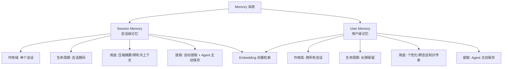
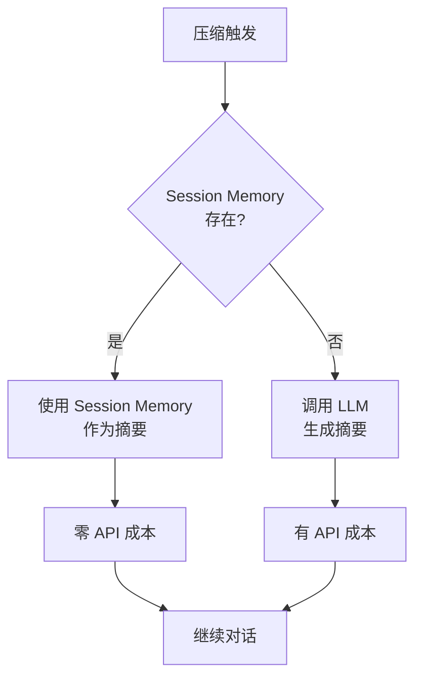
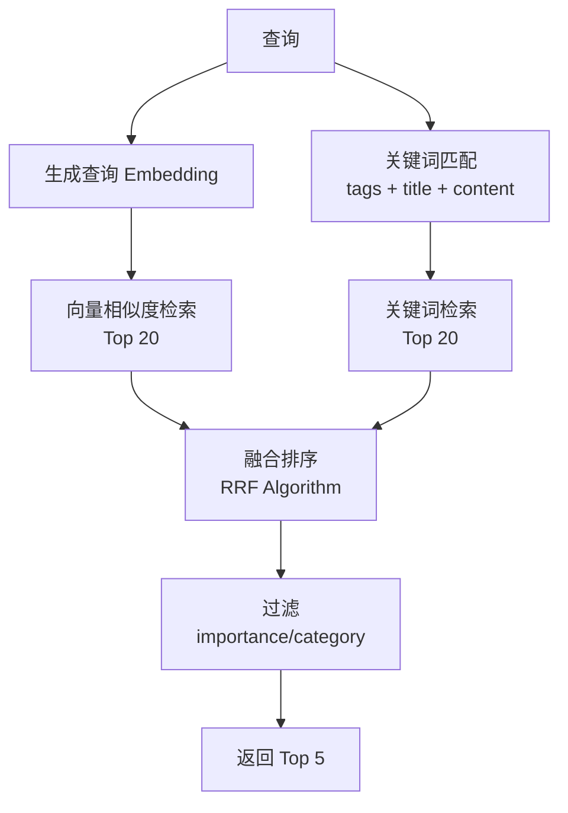

# 记忆系统

## 概述

记忆系统为 Agent 提供长期记忆能力，使其能够跨会话保持上下文、学习用户偏好、追踪项目进展。系统分为两层：**Session Memory**（会话级记忆）和 **User Memory**（用户级记忆），均采用数据库存储 + Embedding 向量检索的架构。

## 核心概念



## 1. Session Memory（会话级记忆）

### 1.1 设计目的

Session Memory 用于在会话过程中持续提取关键信息，为自动压缩提供摘要内容，避免额外的 LLM 调用成本。

### 1.2 表结构

```sql
CREATE TABLE session_memories (
    id UUID PRIMARY KEY DEFAULT gen_random_uuid(),
    session_id UUID NOT NULL REFERENCES sessions(id) ON DELETE CASCADE,
    
    -- 分类
    category VARCHAR(50) NOT NULL,        -- decision/context/progress/issue/learnings
    
    -- 内容
    title VARCHAR(200) NOT NULL,          -- 简短标题（5-10 词）
    content TEXT NOT NULL,                 -- 详细内容
    
    -- 元数据
    metadata JSONB DEFAULT '{}',           -- 额外元数据（如相关文件、代码片段等）
    token_count INTEGER,                   -- 预估 token 数（用于限制总大小）
    
    -- 时间戳
    created_at TIMESTAMP WITH TIME ZONE DEFAULT NOW(),
    updated_at TIMESTAMP WITH TIME ZONE DEFAULT NOW()
);

-- 索引
CREATE INDEX idx_session_memories_session_id ON session_memories(session_id);
CREATE INDEX idx_session_memories_category ON session_memories(category);
CREATE INDEX idx_session_memories_created_at ON session_memories(created_at DESC);
```

### 1.3 数据结构示例

```json
{
  "id": "abc123",
  "session_id": "def456",
  "category": "decision",
  "title": "选择 PostgreSQL 作为数据库",
  "content": "用户决定使用 PostgreSQL 14 作为主数据库，主要原因是需要 JSONB 支持和全文检索能力。",
  "metadata": {
    "related_files": ["server/config/database.go"],
    "code_snippets": ["dsn := \"postgres://...\""]
  },
  "token_count": 150,
  "created_at": "2026-09-05T10:00:00Z",
  "updated_at": "2026-09-05T10:30:00Z"
}
```

### 1.4 分类体系

> **注意**：Claude Code 的 Session Memory 使用固定章节的 Markdown 文件（Session Title / Current State / Task specification 等 10 个 section），参见 `prompts/session-memory-template.md` 和 `prompts/session-memory-update-prompt.md`。
>
> 我们的设计采用数据库表 + 分类体系，需要**自行编写提取提示词**，Claude Code 的提示词仅作为参考。

| 分类 | 说明 | 示例 |
|------|------|------|
| `decision` | 技术决策和设计选择 | "选择 React 作为前端框架" |
| `context` | 当前任务上下文 | "正在实现用户登录功能" |
| `progress` | 任务进展和完成状态 | "已完成数据库 schema 设计" |
| `issue` | 遇到的问题和解决方案 | "遇到 CORS 错误，通过配置中间件解决" |
| `learnings` | 学到的经验和教训 | "发现使用连接池可以显著提升性能" |

### 1.5 提取机制

采用**双轨提取**策略：

#### A. 自动提取（后台 Agent）

类似 Claude Code 的实现，通过后台 forked agent 自动提取：

**触发条件**：
- 初始化阈值：上下文 token 数 >= 10,000
- 更新阈值（两者都要满足 OR token + 无 tool call）：
  - token 增长 >= 5,000
  - tool call 数量 >= 3
  - 或者：token 阈值满足 + 最后一轮 assistant 没有 tool call（自然对话断点）

**执行方式**：
- 使用独立的后台 agent（fork 自主对话，共享 prompt cache）
- 权限限制：只允许读写 session_memories 表
- 硬限制：最多 5 轮对话

**提取 Prompt**：

> Claude Code 的 Session Memory 使用固定章节 Markdown 文件，其更新提示词（`prompts/session-memory-update-prompt.md`）**不能直接使用**，需要基于其思路自行编写适合数据库表结构的提取提示词。
>
> **参考要点**（来自 Claude Code）：
> - 写详细、信息密集的内容，包含文件路径、函数名、错误信息等具体细节
> - 每个 section/分类限制 ~2000 tokens
> - 总 token 数限制 ~12,000 tokens
> - 重点更新 "Current State" 以反映最新工作（对应我们的 `context` 和 `progress` 分类）
> - 不保存已经在 CLAUDE.md 中的信息

#### B. Agent 主动保存（通过 Tool）

Agent 可以通过 Tool 主动保存重要信息：

```go
save_session_memory(category, title, content, metadata)
```

### 1.6 容量限制

- 单个 session 最多保留 **20 条**记忆
- 每条记忆 token 数限制 **~2,000 tokens**
- 总 token 数限制 **~12,000 tokens**
- 超出限制时，删除最旧的记忆

### 1.7 用于压缩（Session Memory Compact）

当触发自动压缩时：



**优势**：
- 无需额外的 LLM 调用
- 摘要质量更高（持续更新，而非一次性生成）
- 压缩速度更快

---

## 2. User Memory（用户级记忆）

### 2.1 设计目的

User Memory 用于跨会话保持用户偏好、项目信息、技术栈等长期知识，实现个性化和知识传承。

### 2.2 表结构

```sql
CREATE TABLE user_memories (
    id UUID PRIMARY KEY DEFAULT gen_random_uuid(),
    user_id UUID NOT NULL REFERENCES users(id) ON DELETE CASCADE,
    
    -- 分类（对齐 Claude Code 的记忆类型）
    category VARCHAR(50) NOT NULL,        -- user/feedback/project/reference
    importance VARCHAR(20) DEFAULT 'medium', -- low/medium/high/critical
    
    -- 内容
    title VARCHAR(200) NOT NULL,          -- 简短标题
    content TEXT NOT NULL,                 -- 详细内容
    description VARCHAR(500),              -- 一行描述（用于检索）
    
    -- 标签和搜索
    tags TEXT[],                           -- 标签（用于关键词匹配）
    embedding vector(1536),                -- Embedding 向量（用于语义检索）
    
    -- 元数据
    metadata JSONB DEFAULT '{}',           -- 额外元数据
    source_session_id UUID,                -- 来源会话（可选）
    
    -- 时间戳
    created_at TIMESTAMP WITH TIME ZONE DEFAULT NOW(),
    updated_at TIMESTAMP WITH TIME ZONE DEFAULT NOW(),
    deleted_at TIMESTAMP WITH TIME ZONE,   -- 软删除
    
    -- 检索统计
    access_count INTEGER DEFAULT 0,        -- 访问次数
    last_accessed_at TIMESTAMP WITH TIME ZONE
);

-- 索引
CREATE INDEX idx_user_memories_user_id ON user_memories(user_id);
CREATE INDEX idx_user_memories_category ON user_memories(category);
CREATE INDEX idx_user_memories_importance ON user_memories(importance);
CREATE INDEX idx_user_memories_tags ON user_memories USING GIN(tags);
CREATE INDEX idx_user_memories_embedding ON user_memories USING ivfflat (embedding vector_cosine_ops) WITH (lists = 100);
CREATE INDEX idx_user_memories_deleted_at ON user_memories(deleted_at) WHERE deleted_at IS NULL;
```

### 2.3 数据结构示例

```json
{
  "id": "abc123",
  "user_id": "def456",
  "category": "preference",
  "importance": "high",
  "title": "偏好使用 TypeScript",
  "content": "用户偏好使用 TypeScript 而非 JavaScript，要求严格类型检查，不喜欢 any 类型。",
  "description": "用户偏好 TypeScript 严格类型检查",
  "tags": ["typescript", "programming-language", "type-safety"],
  "embedding": [0.123, -0.456, ...],  // 1536 维向量
  "metadata": {
    "examples": ["const x: number = 1;"],
    "related_memories": ["ghi789"]
  },
  "source_session_id": "jkl012",
  "created_at": "2026-09-01T10:00:00Z",
  "updated_at": "2026-09-05T14:30:00Z",
  "access_count": 15,
  "last_accessed_at": "2026-09-05T14:30:00Z"
}
```

### 2.4 分类体系（对齐 Claude Code）

分类与 Claude Code 的 Auto-Memory 类型保持一致，可直接复用 `prompts/memory-system-prompt.md` 中的类型定义和提示词：

| 分类 | 说明 | 示例 |
|------|------|------|
| `user` | 用户角色、目标、偏好、知识水平 | "用户是数据科学家，专注可观测性"、"10 年 Go 经验，React 新手" |
| `feedback` | 用户对工作方式的指导和纠正 | "不要在测试中 mock 数据库"、"不要每次回复都总结" |
| `project` | 项目进展、目标、决策背景 | "合并冻结从 2026-03-05 开始"、"auth 中间件重写源于合规要求" |
| `reference` | 外部系统的指针 | "pipeline bug 在 Linear INGEST 项目追踪"、"oncall 延迟看板在 grafana.internal/d/api-latency" |

#### feedback 和 project 类型的特殊结构

参考 Claude Code 的提示词，feedback 和 project 类型的记忆应包含 **Why** 和 **How to apply** 结构：

```
规则/事实
**Why:** 用户给出的原因（通常是过去的事件或强烈偏好）
**How to apply:** 这条指导何时/何地适用
```

示例：
- feedback: "集成测试必须使用真实数据库，不用 mock。**Why:** 上季度 mock 测试通过但生产迁移失败。**How to apply:** 所有涉及数据库的测试都适用。"
- project: "2026-03-05 起合并冻结，移动端发布分支。**Why:** 移动端团队 cutting release branch。**How to apply:** 标记此日期后所有非关键 PR。"

### 2.5 重要性级别

| 级别 | 说明 | 检索优先级 |
|------|------|-----------|
| `critical` | 关键信息，必须记住 | 最高 |
| `high` | 重要信息，优先检索 | 高 |
| `medium` | 一般信息 | 中 |
| `low` | 次要信息 | 低 |

### 2.6 提取机制

采用 **Agent 主动保存**策略（推荐）：

Agent 通过 Tool 主动保存重要信息：

```go
save_user_memory(category, title, content, description, importance, tags)
```

**提取时机**：
- 了解用户身份、角色、偏好时
- 用户纠正或确认某种做法时
- 了解到重要的项目信息时
- 发现用户的工作习惯时

**提取 Prompt**（在系统提示词中）：

使用 `prompts/memory-system-prompt.md`（来自 Claude Code，分类已对齐），包含：
- 记忆类型定义（user/feedback/project/reference）及详细示例
- 何时保存、如何使用
- 不该保存什么（代码模式、git 历史、调试方案等）
- 保存格式说明（需适配为我们的 Tool 调用，而非写文件）
- 何时访问记忆
- 信任记忆的注意事项（记忆可能过时，需验证）

> **适配说明**：Claude Code 的提示词中 "How to save memories" 段落描述了写文件的流程（Step 1 写 .md 文件，Step 2 更新 MEMORY.md 索引），我们需要替换为 Tool 调用方式：`save_user_memory(category, title, content, description, importance, tags)`。其余段落（类型定义、示例、不该保存什么、何时访问）可直接复用。

### 2.7 Embedding 生成

**模型选择**：
- 本地模型（推荐）：`all-MiniLM-L6-v2` 或 `bge-small-zh`（中文优化）
- API 模型：OpenAI `text-embedding-3-small`

**生成时机**：
- 创建记忆时生成 embedding
- 更新记忆时重新生成 embedding

**维度**：
- `all-MiniLM-L6-v2`: 384 维
- `bge-small-zh`: 512 维
- `text-embedding-3-small`: 1536 维（默认）

### 2.8 容量限制

- 单个用户最多保留 **1,000 条**记忆
- 每条记忆 token 数限制 **~1,000 tokens**
- 超出限制时：
  - 优先删除 `low` importance 的记忆
  - 其次删除最久未访问的记忆
  - 最后删除最旧的记忆

---

## 3. Embedding 检索

### 3.1 检索策略

采用**混合检索**策略：



### 3.2 向量相似度检索

使用余弦相似度（Cosine Similarity）：

```sql
SELECT *, 
    1 - (embedding <=> query_embedding) AS similarity
FROM user_memories
WHERE user_id = $1 
  AND deleted_at IS NULL
ORDER BY embedding <=> query_embedding
LIMIT 20;
```

### 3.3 关键词检索

使用 PostgreSQL 全文检索 + 标签匹配：

```sql
SELECT *, 
    ts_rank(to_tsvector(title || ' ' || content || ' ' || array_to_string(tags, ' ')), query) AS rank
FROM user_memories
WHERE user_id = $1 
  AND deleted_at IS NULL
  AND (
    to_tsvector(title || ' ' || content || ' ' || array_to_string(tags, ' ')) @@ query
    OR tags && $2  -- 标签数组交集
  )
ORDER BY rank DESC
LIMIT 20;
```

### 3.4 融合排序（RRF Algorithm）

Reciprocal Rank Fusion (RRF) 算法：

```
score(d) = Σ 1 / (k + rank_i(d))

其中：
- k = 60（常数）
- rank_i(d) = 文档在第 i 个检索结果中的排名
```

### 3.5 过滤和排序

融合排序后，应用以下过滤：
1. 按 `importance` 加权（critical: 1.5, high: 1.3, medium: 1.0, low: 0.7）
2. 按 `access_count` 加权（频繁访问的记忆优先级更高）
3. 按 `last_accessed_at` 加权（最近访问的记忆优先级更高）
4. 返回 Top 5

### 3.6 时效性标注

对于超过 1 天的记忆，标注时效性：

```
注意：这条记忆是 N 天前创建的，可能已过时。
```

---

## 4. Memory Tool 设计

### 4.1 Session Memory Tools

```go
// 保存 session memory
save_session_memory(
    category: string,        // decision/context/progress/issue/learnings
    title: string,           // 简短标题（5-10 词）
    content: string,         // 详细内容
    metadata?: object        // 额外元数据（可选）
)

// 搜索 session memory
search_session_memory(
    query?: string,          // 搜索关键词（可选）
    category?: string,       // 分类过滤（可选）
    limit?: number           // 返回数量（默认 10）
)

// 列出所有 session memory
list_session_memories(
    category?: string,       // 分类过滤（可选）
    limit?: number           // 返回数量（默认 20）
)
```

### 4.2 User Memory Tools

```go
// 保存 user memory
save_user_memory(
    category: string,        // user/feedback/project/reference
    title: string,           // 简短标题
    content: string,         // 详细内容（feedback/project 类型应包含 **Why:** 和 **How to apply:** 结构）
    description: string,     // 一行描述（用于检索，对应 Claude Code frontmatter 的 description 字段）
    importance?: string,     // low/medium/high/critical（默认 medium）
    tags?: string[]          // 标签数组（可选）
)

// 搜索 user memory（支持语义检索）
search_user_memory(
    query: string,           // 搜索关键词或自然语言查询
    category?: string,       // 分类过滤（可选）
    importance?: string,     // 重要性过滤（可选）
    limit?: number           // 返回数量（默认 5）
)

// 更新 user memory
update_user_memory(
    id: string,              // 记忆 ID
    content?: string,        // 新内容（可选）
    importance?: string,     // 新重要性（可选）
    tags?: string[]          // 新标签（可选）
)

// 删除 user memory
delete_user_memory(
    id: string               // 记忆 ID
)

// 列出所有 user memory
list_user_memories(
    category?: string,       // 分类过滤（可选）
    importance?: string,     // 重要性过滤（可选）
    limit?: number           // 返回数量（默认 20）
)
```

### 4.3 Tool 实现要点

**Embedding 生成**：
- 保存/更新记忆时，自动生成 embedding
- 使用本地 embedding 模型或 API

**权限控制**：
- Session Memory：只能访问当前会话的记忆
- User Memory：只能访问当前用户的记忆

**错误处理**：
- Embedding 生成失败时，降级为纯关键词检索
- 数据库错误时，返回友好的错误信息

---

## 5. 注入策略

### 5.1 Session Memory 注入

**注入时机**：
- 每轮对话前，自动注入最近的 5 条 session memory
- 压缩时，注入所有 session memory 作为摘要

**注入格式**：
```xml
<system-reminder>
## Session Memory（当前会话的关键信息）

### Decision
- **选择 PostgreSQL 作为数据库**：用户决定使用 PostgreSQL 14，主要原因是需要 JSONB 支持和全文检索能力。

### Progress
- **已完成数据库 schema 设计**：设计了 users、sessions、messages 三个表。

### Issue
- **遇到 CORS 错误**：通过配置中间件解决，允许 localhost:3000 跨域访问。
</system-reminder>
```

### 5.2 User Memory 注入

**注入时机**：
- 会话开始时，注入相关的 user memory（基于 embedding 检索）
- Agent 通过 Tool 主动查询时，返回匹配的记忆

**注入格式**：
```xml
<system-reminder>
## User Memory（用户偏好和项目信息）

### Preference（High Importance）
- **偏好使用 TypeScript**：用户偏好使用 TypeScript 而非 JavaScript，要求严格类型检查。
  - 标签：typescript, programming-language
  - 创建时间：2026-09-01

### Project（High Importance）
- **正在开发 RTC-Agent 项目**：RTC-Agent 是一个实时通信 Agent 平台，使用 Go + PostgreSQL。
  - 标签：rtc-agent, go, postgresql
  - 创建时间：2026-09-01

### Feedback（Medium Importance）
- **不要使用 var 声明变量**：用户不喜欢使用 var，要求使用 const 或 let。
  - 标签：javascript, coding-style
  - 创建时间：2026-09-03
  - 注意：这条记忆是 2 天前创建的，可能已过时。
</system-reminder>
```

### 5.3 注入策略配置

| 配置项 | 默认值 | 说明 |
|--------|--------|------|
| SESSION_MEMORY_INJECT_COUNT | 5 | 每轮注入的 session memory 数量 |
| USER_MEMORY_INJECT_COUNT | 5 | 会话开始时注入的 user memory 数量 |
| USER_MEMORY_SEARCH_LIMIT | 5 | Tool 搜索返回的记忆数量 |
| MEMORY_AGE_THRESHOLD_DAYS | 1 | 超过此天数标注时效性 |

---

## 6. 与压缩系统的集成

### 6.1 Session Memory Compact

当触发自动压缩时，优先使用 Session Memory：

```go
func compressContext(ctx context.Context, messages []*schema.Message) ([]*schema.Message, error) {
    // 1. 查询 session memory
    memories, err := h.deps.SessionMemoryRepo.ListBySession(ctx, sessionID, 20)
    
    if len(memories) > 0 {
        // 2. 使用 session memory 作为摘要（零 API 成本）
        summary := buildSummaryFromMemories(memories)
        return []*schema.Message{{
            Role:    "system",
            Content: summary,
        }}, nil
    }
    
    // 3. 没有 session memory，调用 LLM 生成摘要
    return summarizeMessages(ctx, messages)
}
```

### 6.2 压缩提示词

使用 Claude Code 的 9 部分结构提示词（见 `prompts/base-compact-prompt.md`）。

---

## 7. 实现要点

### 7.1 Embedding 服务

需要实现一个 Embedding 服务：

```go
type EmbeddingService interface {
    // 生成文本的 embedding
    GenerateEmbedding(ctx context.Context, text string) ([]float32, error)
    
    // 批量生成 embedding
    GenerateEmbeddings(ctx context.Context, texts []string) ([][]float32, error)
}
```

**实现选项**：
- 本地模型：使用 `github.com/philippgille/chromem-go` 或 `github.com/huggingface/transformers`
- API 模型：调用 OpenAI、Cohere 等 API

### 7.2 向量数据库

PostgreSQL + pgvector 扩展：

```sql
-- 安装 pgvector 扩展
CREATE EXTENSION IF NOT EXISTS vector;

-- 创建向量索引
CREATE INDEX idx_user_memories_embedding ON user_memories 
USING ivfflat (embedding vector_cosine_ops) 
WITH (lists = 100);
```

### 7.3 后台提取 Agent

需要实现一个后台 agent 用于自动提取 session memory：

```go
type SessionMemoryExtractor struct {
    chatModel    ChatModel
    memoryRepo   SessionMemoryRepo
    tokenCounter TokenCounter
}

func (e *SessionMemoryExtractor) ExtractIfNeeded(ctx context.Context, messages []*schema.Message) error {
    // 1. 检查是否满足提取条件
    if !e.shouldExtract(ctx, messages) {
        return nil
    }
    
    // 2. 调用 LLM 提取记忆
    memories, err := e.extractMemories(ctx, messages)
    if err != nil {
        return err
    }
    
    // 3. 保存到数据库
    for _, memory := range memories {
        e.memoryRepo.Create(ctx, memory)
    }
    
    return nil
}
```

### 7.4 系统提示词集成

在系统提示词中添加记忆相关的说明：

```
## Memory System

You have access to a memory system that helps you remember important information across conversations.

### Session Memory
- Automatically extracted from the current conversation
- Used for compression and maintaining context
- You can also save important information using `save_session_memory` tool

### User Memory
- Long-term memories about the user, their preferences, and projects
- Retrieved based on relevance to the current conversation
- You should proactively save important information using `save_user_memory` tool

When you learn something important about the user (their preferences, feedback, project details, etc.), 
save it to user memory so you can remember it in future conversations.
```

---

## 8. 配置参考

| 配置项 | 默认值 | 说明 |
|--------|--------|------|
| SESSION_MEMORY_MAX_COUNT | 20 | 单个 session 最大记忆数 |
| SESSION_MEMORY_MAX_TOKENS | 12000 | 单个 session 记忆总 token 上限 |
| USER_MEMORY_MAX_COUNT | 1000 | 单个用户最大记忆数 |
| USER_MEMORY_MAX_TOKENS | 1000 | 单条记忆 token 上限 |
| EMBEDDING_MODEL | text-embedding-3-small | Embedding 模型 |
| EMBEDDING_DIMENSION | 1536 | Embedding 维度 |
| MEMORY_SEARCH_TOP_K | 5 | 检索返回的 Top K |
| MEMORY_AGE_THRESHOLD_DAYS | 1 | 时效性标注阈值（天） |

---

## 9. 未来扩展

### 9.1 记忆整合（Dream Task）

类似 Claude Code 的 Dream Task，定期整合记忆：
- 合并重复的记忆
- 删除过时的记忆
- 提取共性知识

### 9.2 团队记忆

支持团队共享的记忆：
- 团队偏好和规范
- 项目文档和最佳实践
- 团队成员的 expertise

### 9.3 记忆可视化

提供 UI 界面：
- 查看和编辑记忆
- 搜索和过滤记忆
- 记忆的使用统计
