# 命令系统

## 概述

命令系统允许用户通过 `/command` 语法快速触发特定功能。前端解析 `/` 开头的输入，识别命令名和参数，分发到对应的处理逻辑。命令可以是纯前端处理、调用后端 RPC、或注入 prompt 交给 AI 处理。

## 命令类型

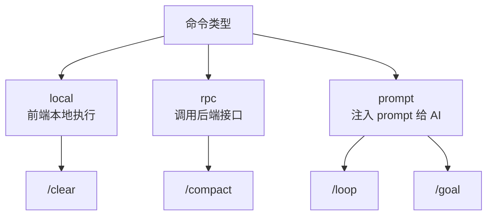

| 类型 | 执行方式 | 说明 |
|------|----------|------|
| local | 前端直接处理 | 不经过后端，如 `/clear` 清空本地状态 |
| rpc | 调用后端 RPC | 需要后端配合，如 `/compact` 触发压缩 |
| prompt | 生成 prompt 注入对话 | 交给 AI 处理，如 `/loop` 设置定时任务 |

## 命令解析流程

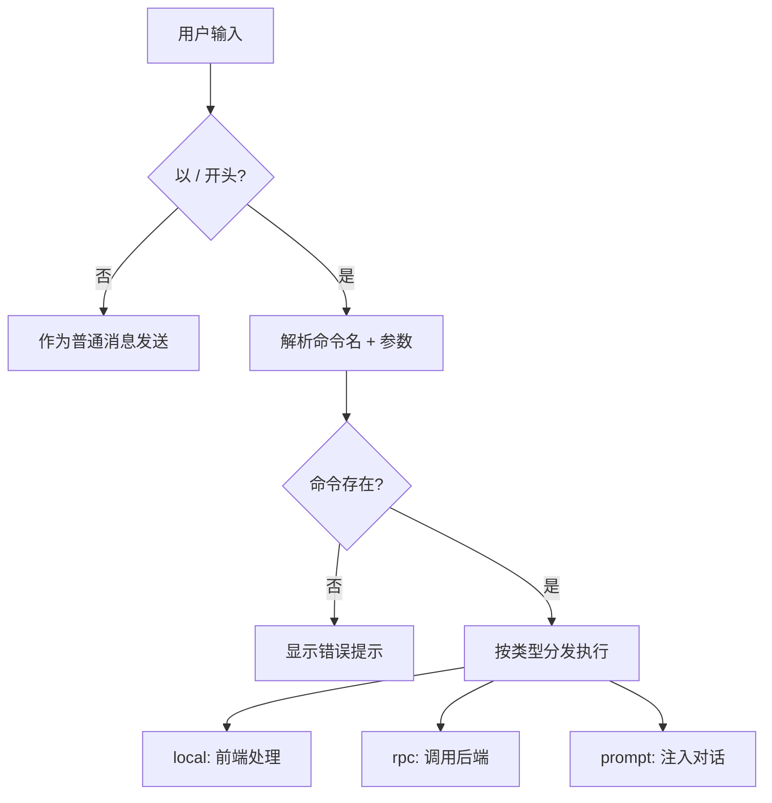

解析规则：
- `/` 后第一个单词为命令名
- 剩余部分为参数（原始字符串传递）
- 命令名匹配优先级：精确匹配 > 别名匹配

## 命令注册

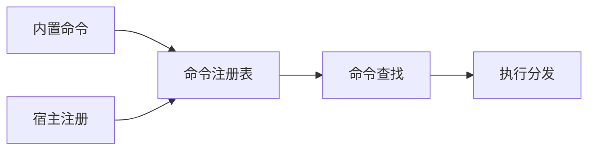

| 来源 | 说明 |
|------|------|
| 内置命令 | 系统预定义的命令（`/compact`, `/loop`, `/goal`） |
| 宿主注册 | 宿主应用通过 API 注册的自定义命令 |

## 首批命令

| 命令 | 类型 | 功能 |
|------|------|------|
| `/compact` | rpc | 手动触发上下文压缩 |
| `/loop` | prompt | 定时循环执行 prompt |
| `/goal` | prompt | 设定目标，AI 持续工作直到达成 |

---

## /compact — 手动压缩

### 功能

暴露已有的自动压缩功能，允许用户主动触发。压缩逻辑完全复用后端的 Auto Compact 实现，只是从被动触发变为主动调用。

### 流程

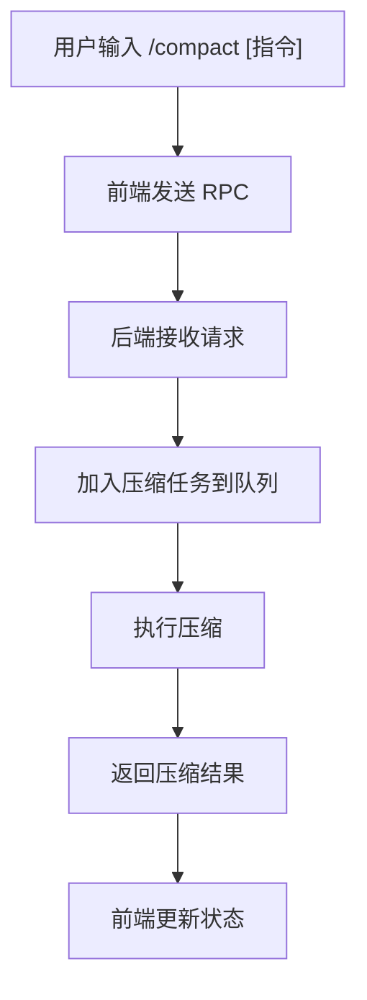

### 参数

| 参数 | 必填 | 说明 |
|------|------|------|
| 自定义指令 | 否 | 自定义摘要指令，覆盖默认压缩 prompt |

### 关键规则

- 压缩走队列，不阻塞当前对话
- 压缩完成后通过 Live 频道推送通知
- 压缩中禁止重复触发（返回"压缩进行中"提示）
- 压缩结果包含：压缩前 token 数、压缩后 token 数、压缩比

### RPC 接口

| 方法 | 说明 |
|------|------|
| `v1.session.compact` | 触发会话压缩 |

请求参数：
| 字段 | 类型 | 说明 |
|------|------|------|
| session_id | string | 会话 ID |
| custom_instruction | string? | 自定义摘要指令 |

---

## /loop — 循环执行

### 功能

用户用自然语言描述需要循环执行的任务，Agent 理解意图后选择合适的循环模式执行。

### 两种循环模式

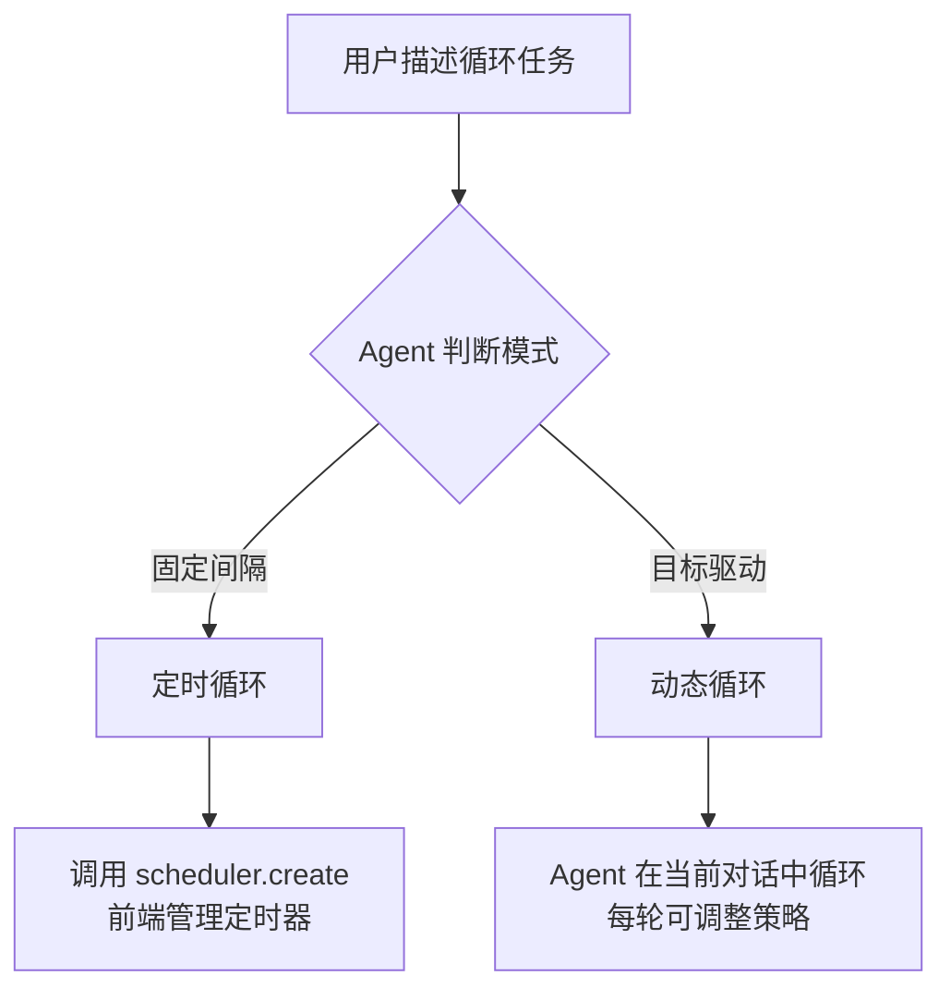

| 模式 | 特点 | 适用场景 | 实现方式 |
|------|------|----------|----------|
| **定时循环** | 固定间隔，独立执行 | 监控部署、轮询状态 | RTC tool `scheduler.create` |
| **动态循环** | 目标驱动，轮次相关 | 测试迭代、代码优化、批量处理 | Agent 在当前对话中循环 |

### 模式 1：定时循环（Scheduled Loop）

用于固定间隔的独立任务。

**流程**：
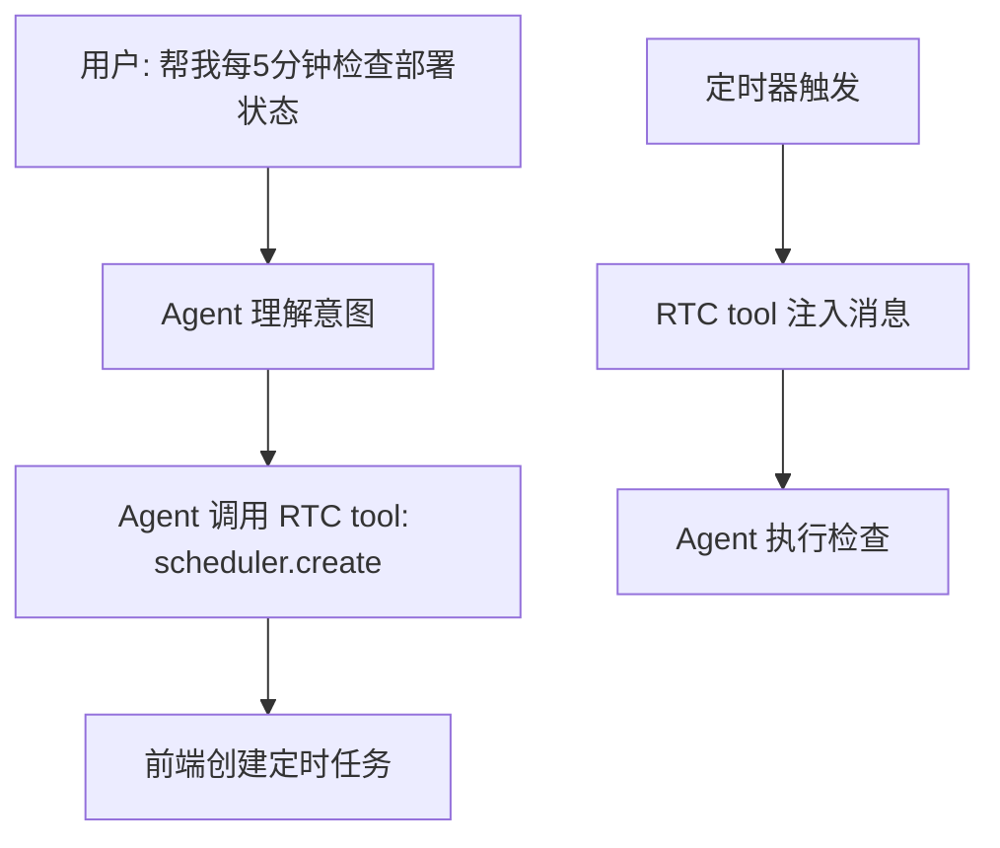

**RTC 工具**：`scheduler.create`, `scheduler.list`, `scheduler.cancel`, `scheduler.pause`, `scheduler.resume`

详见下文 [定时循环 RTC 工具](#定时循环-rtc-工具) 章节。

### 模式 2：动态循环（Dynamic Loop）

用于目标驱动、轮次相关的关键任务。系统显式管理任务状态，保证执行完成，不依赖 LLM 上下文记忆。

**为什么不能用 ReAct**：
- ReAct 依赖 LLM 上下文记忆任务进度
- 上下文过长时 LLM 可能"遗忘"任务
- 不可靠，用户不敢放心使用

**设计原则**：
- **显式状态管理**：当前轮次、总轮次、每轮参数、每轮结果都存在任务状态中
- **系统控制循环**：不是 LLM 决定何时停止，而是系统检查任务状态
- **持久化**：即使上下文被压缩，任务状态不丢失
- **不达目的不罢休**：保证执行完成，除非用户取消或达到最大轮次

**流程**：
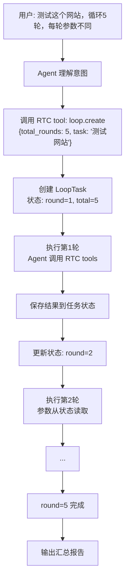

**RTC 工具**：

#### loop.create

创建动态循环任务。

| 参数 | 类型 | 必填 | 说明 |
|------|------|------|------|
| task | string | 是 | 任务描述 |
| total_rounds | number | 否 | 总轮次（无上限时不填） |
| termination_condition | string | 否 | 终止条件描述 |
| round_params | object[] | 否 | 每轮参数（可动态生成） |

返回：
```json
{
  "task_id": "loop_abc123",
  "status": "running",
  "current_round": 1,
  "total_rounds": 5
}
```

#### loop.get_status

获取任务状态。

返回：
```json
{
  "task_id": "loop_abc123",
  "status": "running",
  "current_round": 3,
  "total_rounds": 5,
  "rounds": [
    {"round": 1, "result": "登录页面响应慢", "params": {...}},
    {"round": 2, "result": "100并发时超时", "params": {...}},
    {"round": 3, "status": "running"}
  ]
}
```

#### loop.submit_round_result

提交当前轮次结果，触发下一轮。

| 参数 | 类型 | 必填 | 说明 |
|------|------|------|------|
| task_id | string | 是 | 任务 ID |
| result | string | 是 | 本轮结果 |
| next_params | object | 否 | 下一轮参数 |

#### loop.cancel

取消任务。

| 参数 | 类型 | 必填 | 说明 |
|------|------|------|------|
| task_id | string | 是 | 任务 ID |

**任务状态存储**：

| 字段 | 说明 |
|------|------|
| task_id | 任务唯一标识 |
| session_id | 所属会话 |
| task_description | 任务描述 |
| total_rounds | 总轮次（可为空，表示无上限） |
| termination_condition | 终止条件 |
| current_round | 当前轮次 |
| status | running / paused / completed / cancelled |
| rounds | 每轮结果和参数 |
| created_at | 创建时间 |

存储位置：后端数据库（任务状态需要持久化，不依赖前端）。

**关键规则**：

- 任务状态由系统管理，不依赖 LLM 上下文
- 每轮执行前，系统注入任务状态到 Agent 上下文（当前轮次、历史结果、本轮参数）
- 每轮执行后，Agent 必须调用 `loop.submit_round_result` 提交结果
- 系统检查终止条件（轮次完成 / 条件满足）决定是否继续
- 即使上下文被压缩，任务状态不丢失（存在数据库中）
- 支持暂停/恢复（页面关闭时暂停，重新打开后恢复）

**示例对话**：

```
用户: 帮我测试这个网站，一共循环5轮，每一轮的参数是不同的

Agent: 好的，我来创建测试任务。
[Agent 调用 loop.create]
Agent: 已创建测试任务（ID: loop_abc123），共 5 轮。

[系统注入任务状态：round=1, total=5]
Agent: 【第1轮】基础功能测试
[Agent 执行测试，调用 RTC tools]
[Agent 调用 loop.submit_round_result]
Agent: 第1轮完成：发现登录页面响应慢

[系统注入任务状态：round=2, 第1轮结果]
Agent: 【第2轮】性能压力测试 - 针对登录接口
[Agent 调整参数，增加并发]
[Agent 调用 loop.submit_round_result]
Agent: 第2轮完成：登录接口在100并发时超时

...

[系统注入任务状态：round=5]
Agent: 【第5轮】回归测试
[Agent 执行最后一轮]
[Agent 调用 loop.submit_round_result]
Agent: 5轮测试完成，汇总报告：...
```

### 模式判断

Agent 根据用户描述判断使用哪种模式：

| 用户描述 | 判断依据 | 模式 |
|----------|----------|------|
| "每5分钟检查一次" | 固定时间间隔 | 定时循环 |
| "每小时轮询" | 固定时间间隔 | 定时循环 |
| "循环5轮" | 固定轮次，轮次相关 | 动态循环 |
| "直到测试通过" | 目标驱动 | 动态循环 |
| "处理这100个文件" | 批量处理，每批相关 | 动态循环 |
| "反复优化直到满意" | 迭代优化 | 动态循环 |

---

### 定时循环 RTC 工具

#### scheduler.create

创建定时任务。

| 参数 | 类型 | 必填 | 说明 |
|------|------|------|------|
| interval | string | 是 | 执行间隔（如 `5m`, `2h`, `1d`） |
| prompt | string | 是 | 要执行的 prompt |
| max_age | string | 否 | 最大存活时间（默认 `7d`） |

返回：
```json
{
  "task_id": "abc123",
  "interval": 300000,
  "next_fire_at": 1725599100000,
  "status": "active"
}
```

#### scheduler.list

列出所有定时任务。

返回：
```json
{
  "tasks": [
    {
      "task_id": "abc123",
      "interval": 300000,
      "prompt": "检查部署状态",
      "status": "active",
      "created_at": 1725598800000,
      "next_fire_at": 1725599100000
    }
  ]
}
```

#### scheduler.cancel

取消定时任务。

| 参数 | 类型 | 必填 | 说明 |
|------|------|------|------|
| task_id | string | 是 | 任务 ID |

#### scheduler.pause / scheduler.resume

暂停 / 恢复定时任务。

| 参数 | 类型 | 必填 | 说明 |
|------|------|------|------|
| task_id | string | 是 | 任务 ID |

### 间隔格式

| 输入 | 含义 |
|------|------|
| `30s` | 30 秒（最小粒度 1 分钟，向上取整） |
| `5m` | 5 分钟 |
| `2h` | 2 小时 |
| `1d` | 1 天 |

### 任务存储

| 字段 | 说明 |
|------|------|
| id | 任务唯一标识 |
| session_id | 所属会话 |
| interval | 执行间隔（毫秒） |
| prompt | 要执行的 prompt |
| created_at | 创建时间 |
| last_fired_at | 上次执行时间 |
| next_fire_at | 下次执行时间 |
| status | active / paused / expired |

存储位置：IndexedDB，前端管理。

### 任务生命周期

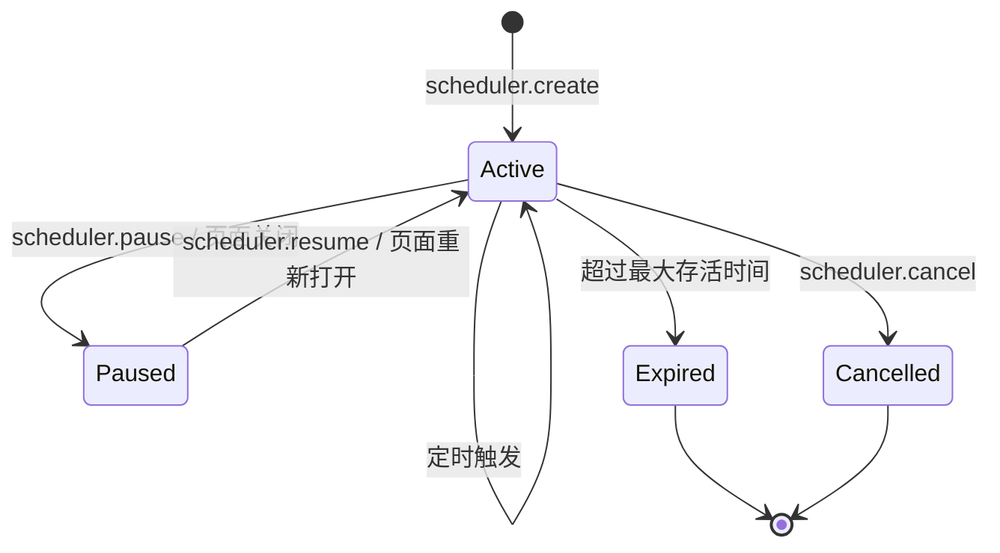

| 阶段 | 行为 |
|------|------|
| 创建 | Agent 调用 `scheduler.create`，立即执行一次 + 注册定时器 |
| 触发 | RTC tool 注入消息到对话，Agent 执行 |
| 暂停 | 页面关闭时暂停，不执行 |
| 恢复 | 页面重新打开后，从当前时间重算下次触发 |
| 过期 | 默认 7 天后自动过期 |
| 取消 | Agent 调用 `scheduler.cancel` |

### 关键规则

- 任务仅在当前会话有效，页面关闭后暂停
- 触发时如果 AI 正在处理其他请求，排队等待
- 支持多个 loop 任务并行
- 状态栏显示活跃的 loop 任务数量和下次触发时间
- 过期时间可配置（默认 7 天）
- 触发时注入的消息标记为 `isMeta: true`，不显示在用户界面但 Agent 可见

### 用户交互示例

**场景 1：创建定时任务**
```
用户: 帮我每5分钟检查一次部署状态
Agent: 好的，我来创建一个定时任务。
[Agent 调用 scheduler.create]
Agent: 已创建定时任务（ID: abc123），每 5 分钟检查一次部署状态。
       下次执行时间: 10:05，任务将在 7 天后自动过期。
```

**场景 2：查看任务列表**
```
用户: 现在有哪些定时任务？
Agent: [调用 scheduler.list]
Agent: 当前有 2 个活跃的定时任务：
       1. 检查部署状态（每 5 分钟，下次: 10:05）
       2. 轮询 PR 状态（每 30 分钟，下次: 10:30）
```

**场景 3：取消任务**
```
用户: 取消第一个任务
Agent: [调用 scheduler.cancel task_id=abc123]
Agent: 已取消"检查部署状态"任务。
```

---

## /goal — 目标驱动

### 功能

用户设定一个完成条件，AI 持续工作直到条件满足。每次 AI 准备停止时，系统用独立评判模型检查条件是否达成，未达成则强制 AI 继续。

### 流程

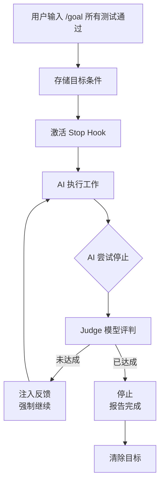

### 核心机制

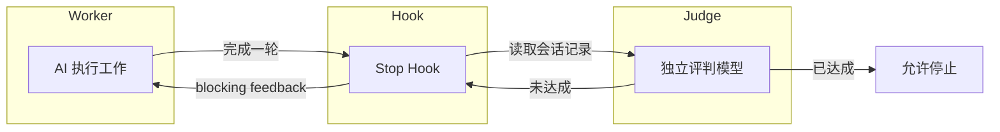

| 组件 | 职责 |
|------|------|
| Worker | 执行工作的主模型 |
| Judge | 独立评判模型，读取会话记录判断目标是否达成 |
| Stop Hook | 在 AI 停止时触发，调用 Judge 检查条件 |

### 参数

| 参数 | 必填 | 说明 |
|------|------|------|
| 条件 | 是 | 完成条件的自然语言描述 |

### 目标存储

| 字段 | 说明 |
|------|------|
| id | 目标唯一标识 |
| session_id | 所属会话 |
| condition | 完成条件描述 |
| created_at | 创建时间 |
| status | active / completed / cancelled |
| turn_count | 已执行轮次 |
| token_usage | 累计 token 消耗 |

### Judge 评判

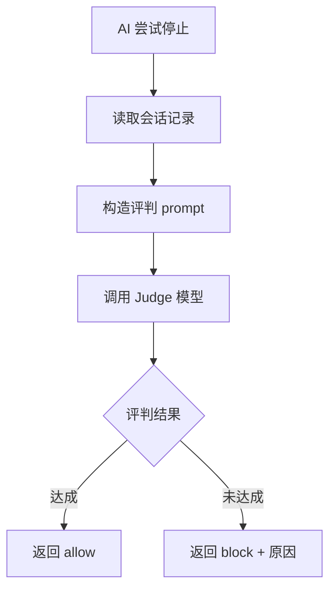

Judge prompt 核心结构：
- 输入：目标条件 + 最近 N 轮会话记录
- 输出：`{ "achieved": boolean, "reason": string }`
- Judge 使用轻量模型（如 Haiku），降低成本

### 状态显示

| 元素 | 说明 |
|------|------|
| 状态栏 | 显示当前目标条件摘要 |
| Overlay 面板 | 显示已执行轮次、累计 token、运行时长 |
| 完成通知 | 目标达成时弹出通知 |

### 关键规则

- 目标仅在当前会话有效
- `/goal` 无参数时显示当前目标
- `/goal clear` 手动取消目标
- 单次会话只能有一个活跃目标
- Judge 评判失败时（API 错误等），默认允许停止（避免死循环）
- 设置最大轮次上限（如 50 轮），防止失控
- 超过上限后自动停止并报告

### 相关命令

| 命令 | 说明 |
|------|------|
| `/goal` | 显示当前目标 |
| `/goal <condition>` | 设定目标 |
| `/goal clear` | 清除目标 |

---

## 前端交互

### 输入区

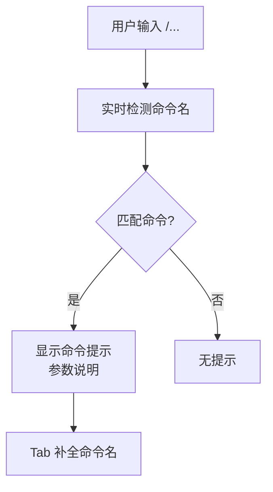

- 输入 `/` 后显示命令列表（typeahead）
- 匹配命令后显示参数提示（灰色文字）
- Tab 键补全命令名
- 未知命令发送时显示确认提示

### 命令反馈

| 场景 | 反馈方式 |
|------|----------|
| 命令执行成功 | Toast 通知 |
| 命令执行失败 | Toast 错误提示 |
| 命令返回结果 | 系统消息显示在对话中 |
| 命令需要交互 | 弹出对话框 |

### 状态栏

活跃的命令在状态栏显示：
- Loop 任务：显示任务数量和下次触发时间
- Goal 目标：显示目标条件摘要和运行时长
