# /goal 命令设计文档 (v3.1)

**版本**: 3.1
**日期**: 2026-09-07
**状态**: 代码伪代码化（所有代码替换为 mermaid 逻辑图 + 解释）

> v3.1 相对 v3 的变更：
>
> - **明确命令解析位置**：在 `data_context.go` 的 `loadMessages` 中解析命令并注入提示词
> - **新增命令处理架构**：引入 `CommandProcessor` 模式，统一处理 `/goal`、`/loop` 等命令
> - **更新架构图**：将 "Message Ingestion" 移到 Worker 内部，重命名为 "Context Assembly"
> - **更新流程图和序列图**：反映实际的代码流程（RPC → DB → rtc-queue → Worker → loadMessages）
> - **补充扩展性设计**：未来新增命令只需实现 `CommandProcessor` 接口并注册
>
> v3 相对 v2 的变更：
>
> - **所有 Go / TypeScript 代码替换为 mermaid 图 + 文字解释**，避免伪代码对实施造成困扰
> - 数据结构用 `classDiagram` 表达（字段、关系）
> - 业务流程用 `flowchart` 表达（决策分支）
> - 交互流程用 `sequenceDiagram` 表达（组件间调用）
> - 状态流转用 `stateDiagram-v2` 表达
> - JSON 协议示例保留（协议规格不是代码）
> - v2 的所有决策与内容均延续，无变更

---

## 1. 概述

### 1.1 功能定位

`/goal` 机制让 AI 持续工作直到某个完成条件满足。核心交互：

- **创建 goal**：前端 `/goal <自然语言目标>` 作为 UX 入口 → send message RPC → 后端在 `loadMessages` 中解析 `/goal` 前缀，注入 **goal 提示词** 到 turn 上下文 → Agent 按提示词**先调研**，再**润色**成 SMART 条件，向用户提议 → 用户确认后 → Agent 调用 `create_goal` tool
- **取消 goal**：用户自然语言（"停下"、"算了"等）→ Agent 识别意图 → 调用 `cancel_goal` tool
- **完成 goal**：后端 Judge 模型判定达成，自动标记 `completed`
- **耗尽 goal**：后端达到 `max_turns` 仍未达成，自动标记 `exhausted`

前端**只有一个 `/goal <目标>` 命令**（无子命令如 `/goal clear`、`/goal history`）。取消通过自然语言对话；历史查询后端提供 RPC 接口，前端暂不做 UI。

### 1.2 核心机制

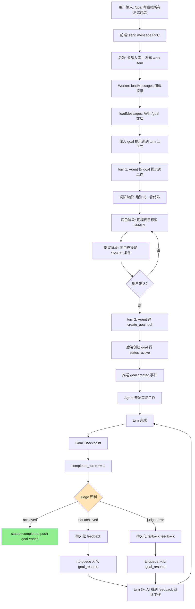
```mermaid
flowchart TD
    A["用户输入: /goal 帮我把所有测试通过"] --> B["前端: send message RPC"]
    B --> C["后端: 消息入库 + 发布 work item"]
    C --> D["Worker: loadMessages 加载消息"]
    D --> E["loadMessages: 解析 /goal 前缀"]
    E --> F["注入 goal 提示词到 turn 上下文"]
    F --> G["turn 1: Agent 按 goal 提示词工作"]
    G --> G1["调研阶段: 跑测试、看代码"]
    G1 --> G2["润色阶段: 把模糊目标变 SMART"]
    G2 --> G3["提议阶段: 向用户提议 SMART 条件"]
    G3 --> H{"用户确认?"}
    H -- 否 --> G2
    H -- 是 --> I["turn 2: Agent 调 create_goal tool"]
    I --> I1["后端创建 goal 行 status=active"]
    I1 --> I2["推送 goal.created 事件"]
    I2 --> I3["Agent 开始实际工作"]
    I3 --> J["turn 完成"]
    J --> K["Goal Checkpoint"]
    K --> K1["completed_turns += 1"]
    K1 --> K2{"Judge 评判"}
    K2 -- achieved --> L1["status=completed, push goal.ended"]
    K2 -- "not achieved" --> M1["持久化 feedback"]
    M1 --> M2["rtc-queue 入队 goal_resume"]
    K2 -- "judge error" --> N1["持久化 fallback feedback"]
    N1 --> N2["rtc-queue 入队 goal_resume"]
    M2 --> O["turn 3+: AI 看到 feedback 继续工作"]
    N2 --> O
    O --> J

    style L1 fill:#90EE90
    style K2 fill:#FFE4B5
```

**解释**：用户发 `/goal` 消息 → 后端消息入库并发布 work item → Worker 在 `loadMessages` 中识别并注入 goal 提示词 → Agent 走"调研 → 润色 → 提议 → 创建"流程 → 创建后 turn 完成触发 Checkpoint → Checkpoint 必做三件事：①`completed_turns += 1`（不论 Judge 状态），②调 Judge，③根据结果决定 re-queue 还是进终态。Judge 失败也 re-queue，max_turns 兜底。

### 1.3 设计原则

1. **Agent 当 goal 教练**：用户说模糊意图，Agent 负责润色成 SMART 条件
2. **自然语言驱动**：用户不说"创建 goal"，而是说"帮我把 X 做了"、"停下来"
3. **后端统一解析**：前端 `/goal` 是 UX 语法糖，后端在 `loadMessages` 中统一解析前缀并注入专用提示词，未来新增命令走同一套逻辑
4. **turn 边界检查**：Goal 评判发生在 turn 之间，不侵入 turn 内部
5. **复用调度基础设施**：通过 rtc-queue 驱动多轮，cancel / 限流 / 监控 / Centrifuge 推送全部免费继承
6. **显式状态管理**：goal 状态持久化到独立 goals 表，feedback 持久化到 DB
7. **轻量评判**：使用独立的轻量模型（Haiku）降低成本
8. **防护机制**：max_turns 上限（默认 50 turn），Judge 失败也计入轮次，避免无限挂起

---

## 2. 架构设计

### 2.1 整体架构

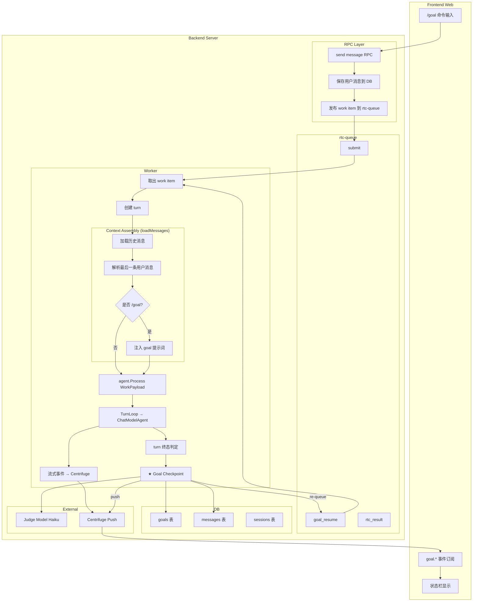
```mermaid
flowchart TB
    subgraph FE["Frontend Web"]
        F1["/goal 命令输入"]
        F2["状态栏显示"]
        F3["goal.* 事件订阅"]
    end

    subgraph BE["Backend Server"]
        subgraph RPC["RPC Layer"]
            R1["send message RPC"]
            R2["保存用户消息到 DB"]
            R3["发布 work item 到 rtc-queue"]
        end

        subgraph Worker["Worker"]
            W0["取出 work item"]
            W00["创建 turn"]
            subgraph ContextAssembly["Context Assembly (loadMessages)"]
                CA1["加载历史消息"]
                CA2["解析最后一条用户消息"]
                CA3{"是否 /goal?"}
                CA4["注入 goal 提示词"]
            end
            W1["agent.Process WorkPayload"]
            W2["TurnLoop → ChatModelAgent"]
            W3["流式事件 → Centrifuge"]
            W4["turn 终态判定"]
            W5["★ Goal Checkpoint"]
        end

        subgraph Queue["rtc-queue"]
            Q1["submit"]
            Q2["goal_resume"]
            Q3["rtc_result"]
        end

        subgraph Storage["DB"]
            S1["goals 表"]
            S2["messages 表"]
            S3["sessions 表"]
        end

        subgraph External["External"]
            E1["Judge Model Haiku"]
            E2["Centrifuge Push"]
        end
    end

    F1 --> R1
    R1 --> R2
    R2 --> R3
    R3 --> Q1
    Q1 --> W0
    W0 --> W00
    W00 --> CA1
    CA1 --> CA2
    CA2 --> CA3
    CA3 -- 是 --> CA4
    CA3 -- 否 --> W1
    CA4 --> W1
    Q2 --> W0
    W1 --> W2
    W2 --> W3
    W3 --> E2
    W2 --> W4
    W4 --> W5
    W5 --> S2
    W5 --> E1
    W5 --> S1
    W5 -- "re-queue" --> Q2
    W5 -- push --> E2
    E2 --> F3
    F3 --> F2
```

**解释**：

- **前端**：`/goal` 入口 + 状态栏 + 事件订阅（暂不做历史面板）
- **RPC Layer**：接收用户消息，保存到 DB（此时 turnID=NULL），发布 work item 到 rtc-queue
- **rtc-queue**：复用现有队列，新增 `goal_resume` work kind
- **Worker**：`agent.Process()` 流程与现有一致；turn 完成后触发 Goal Checkpoint
- **Context Assembly (loadMessages)**：**关键阶段** —— 在消息进入 turn 前解析最后一条用户消息，若 `/goal` 则注入提示词。这是所有命令处理的统一入口
- **Goal Checkpoint**：本设计核心组件，调用 Judge、持久化 feedback、re-queue
- **Storage**：独立 `goals` 表 + 现有 `messages` 表（feedback 以 system 消息写入）
- **External**：Judge 用独立 Haiku 模型；Centrifuge 推送 goal 事件到前端

**为什么不在 RPC 层解析**：RPC 层只负责消息持久化和队列发布，此时 turn 尚未创建。命令解析需要完整的上下文（历史消息），必须在 Worker 的 `loadMessages` 中进行。

**为什么不在 ChatModelAgent middleware 内做**：middleware 作用于单次 turn 内的 ReAct 循环，turn 结束后 TurnLoop 与 agent 实例全部销毁；goal 驱动的"继续"需要跨 turn 编排，必须回到 rtc-queue 这条 turn 调度的单一入口。

### 2.2 核心组件

| 组件 | 职责 | 位置 |
|------|------|------|
| **Goal Checkpoint** | turn 边界检查 goal 状态，调用 Judge，决定是否 re-queue | `server/internal/agent/goal_checkpoint.go` |
| **Judge** | 独立评判模型，判断 goal 是否达成 | `server/internal/agent/judge.go` |
| **Goal Storage** | 持久化 goal 状态（独立表） | `server/internal/model/goal.go` |
| **Goal Command Processor** | 在 `loadMessages` 中解析 `/goal` 前缀，注入 goal 提示词 | `server/internal/agent/command/goal_command.go` |
| **Command Processor Manager** | 管理所有命令处理器，在 `loadMessages` 中统一调用 | `server/internal/agent/command/manager.go` |
| **WorkPayload 扩展** | 新增 `WorkKindGoalResume`，标识 goal 驱动的 turn | `server/pkg/turn-agent/types.go` |

### 2.3 命令处理架构

为了支持未来可能的命令扩展（如 `/loop`、`/research`、`/compact` 等），命令解析采用统一的 **CommandProcessor** 模式：

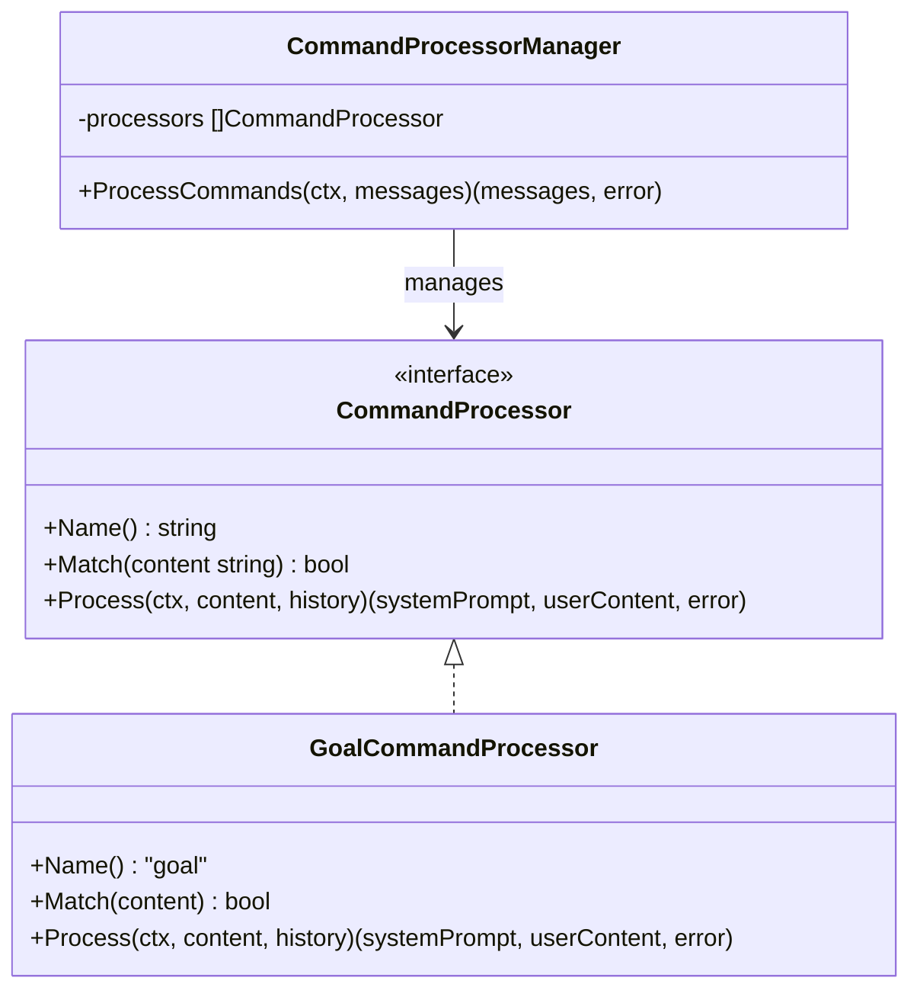
```mermaid
classDiagram
    class CommandProcessor {
        <<interface>>
        +Name() string
        +Match(content string) bool
        +Process(ctx, content, history) (systemPrompt, userContent, error)
    }

    class GoalCommandProcessor {
        +Name() "goal"
        +Match(content) bool
        +Process(ctx, content, history) (systemPrompt, userContent, error)
    }

    class CommandProcessorManager {
        -processors []CommandProcessor
        +ProcessCommands(ctx, messages) (messages, error)
    }

    CommandProcessor <|.. GoalCommandProcessor
    CommandProcessorManager --> CommandProcessor : manages
```

**职责**：

- `CommandProcessor`：定义命令处理的标准接口
- `GoalCommandProcessor`：实现 `/goal` 命令的解析和提示词注入
- `CommandProcessorManager`：管理所有命令处理器，在 `loadMessages` 中调用

**调用时机**：

在 `data_context.go` 的 `loadMessages` 函数中，消息加载完成后的统一拦截点：

```text
loadMessages 流程：
1. 加载 DB 消息 → 转换格式
2. 应用 in-memory 处理（tool result budget、microcompact）
3. 注入附件（TodoList、SessionMemory、UserMemory）
4. ★ 命令解析：检查最后一条用户消息，注入对应的 system prompt
5. 返回 messages 给 TurnLoop
```

**关键规则**：

- 只检查**最后一条**用户消息（历史消息不重复解析）
- 匹配到命令时，注入对应的 system prompt 到 messages 中
- 命令处理器按注册顺序匹配，第一个匹配成功即停止

**扩展性**：

新增命令只需三步：

1. 实现 `CommandProcessor` 接口
2. 注册到 `CommandProcessorManager`
3. 完成（不需要修改 `loadMessages` 或核心流程）

---

## 3. 数据模型

### 3.1 设计要点

**Goal 独立于 Session**。Session 是"对话容器"，Goal 是"工作目标"——两个正交的维度。把 Goal 作为独立表：

- 一个 Session 可以顺序跑多个 Goal（保留历史）
- 同一个 Goal 模板可以被多个 Session 复用（未来扩展）
- Goal 的状态变更不会污染 Session 行
- Goal 历史可独立查询、统计、归档

### 3.2 Goal 模型

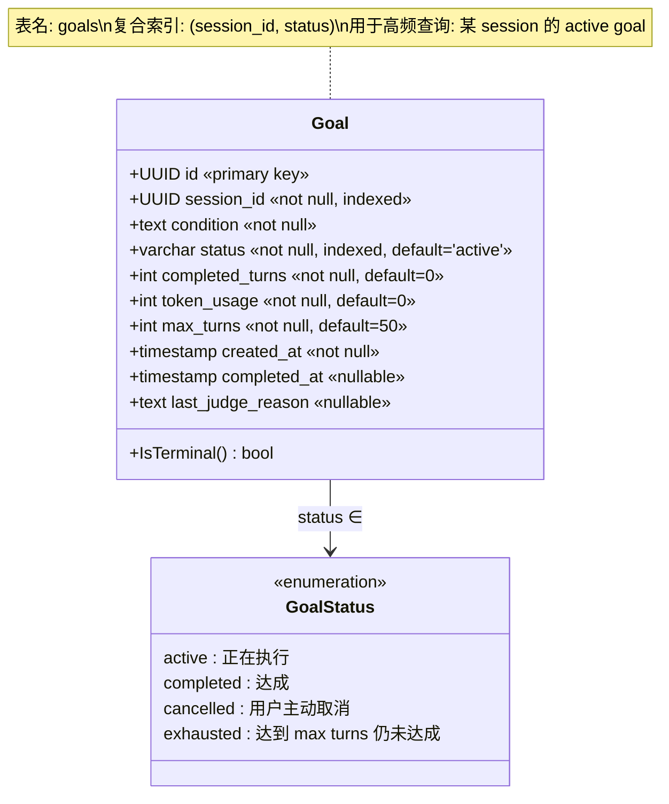
```mermaid
classDiagram
    class Goal {
        +UUID id «primary key»
        +UUID session_id «not null, indexed»
        +text condition «not null»
        +varchar status «not null, indexed, default='active'»
        +int completed_turns «not null, default=0»
        +int token_usage «not null, default=0»
        +int max_turns «not null, default=50»
        +timestamp created_at «not null»
        +timestamp completed_at «nullable»
        +text last_judge_reason «nullable»
        +IsTerminal() bool
    }

    class GoalStatus {
        <<enumeration>>
        active : 正在执行
        completed : 达成
        cancelled : 用户主动取消
        exhausted : 达到 max turns 仍未达成
    }

    Goal --> GoalStatus : status ∈

    note for Goal "表名: goals\n复合索引: (session_id, status)\n用于高频查询: 某 session 的 active goal"
```

**字段解释**：

| 字段 | 类型 | 说明 |
|------|------|------|
| `id` | uuid | 主键 |
| `session_id` | uuid | 所属 session；与 status 复合索引，用于高频查询 active goal |
| `condition` | text | 完成条件的自然语言描述（SMART 形式） |
| `status` | varchar(20) | 四态之一：`active` / `completed` / `cancelled` / `exhausted` |
| `completed_turns` | int | 已完成的主 Agent turn 数（每次 turn 正常完成 +1，不论 Judge 状态） |
| `token_usage` | int | goal 生命周期内 session 累计 token（主 Agent + Judge） |
| `max_turns` | int | 创建时固化的 max_turns 配置，避免历史 goal 受未来配置影响 |
| `created_at` | timestamp | goal 创建时间 |
| `completed_at` | timestamp | goal 进入**任意终态**的时间（completed / cancelled / exhausted 都填） |
| `last_judge_reason` | text | 最近一次 Judge 给出的 reason，供前端展示进度 |

**关键设计**：

- `max_turns` 在创建时固化，避免历史 goal 受未来配置变更影响
- `completed_at` 覆盖所有终态，语义为"goal 完结时间"
- `token_usage` 追踪整个 goal 生命周期的 session 累计 token（主 Agent + Judge），用于前端展示和未来预算上限

### 3.3 Session 模型（不修改）

**Session 模型不变**。不添加 `Goal` 字段，也不添加 `CurrentGoalID` 指针。

> 为什么不加 `CurrentGoalID`？避免双向状态同步的复杂度（goal 状态变了还要同步 session 行）。查询 active goal 直接走 goals 表的索引，开销可忽略。

### 3.4 GoalRepo

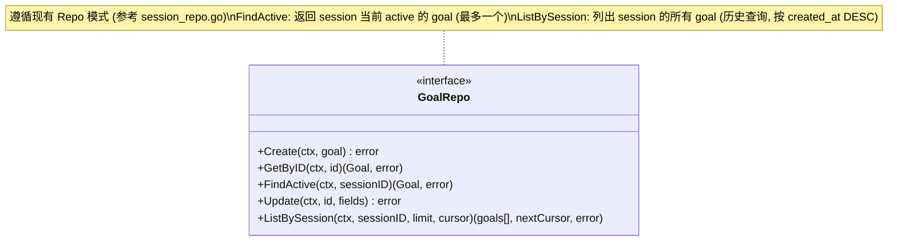
```mermaid
classDiagram
    class GoalRepo {
        <<interface>>
        +Create(ctx, goal) error
        +GetByID(ctx, id) (Goal, error)
        +FindActive(ctx, sessionID) (Goal, error)
        +Update(ctx, id, fields) error
        +ListBySession(ctx, sessionID, limit, cursor) (goals[], nextCursor, error)
    }

    note for GoalRepo "遵循现有 Repo 模式 (参考 session_repo.go)\nFindActive: 返回 session 当前 active 的 goal (最多一个)\nListBySession: 列出 session 的所有 goal (历史查询, 按 created_at DESC)"
```

**方法职责**：

- `Create`：插入新 goal 行
- `GetByID`：按 id 查单条
- `FindActive`：按 `(session_id, status='active')` 查，最多一条
- `Update`：通用字段更新（传 map）
- `ListBySession`：分页列出历史 goal，支持 cursor 翻页

### 3.5 数据库迁移

把 `Goal` 模型加入现有 `AutoMigrate` 列表即可，无 schema 变更脚本需求。

### 3.6 Goal 状态更新时机

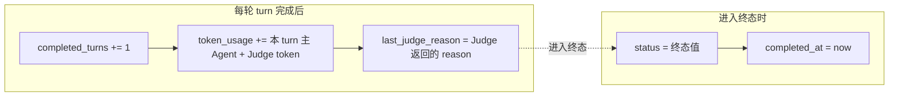
```mermaid
flowchart LR
    subgraph 每轮 turn 完成后
        A1["completed_turns += 1"]
        A2["token_usage += 本 turn 主 Agent + Judge token"]
        A3["last_judge_reason = Judge 返回的 reason"]
    end

    subgraph 进入终态时
        B1["status = 终态值"]
        B2["completed_at = now"]
    end

    A1 --> A2 --> A3
    A3 -.进入终态.-> B1 --> B2
```

**解释**：状态更新分两类——每轮 turn 完成后更新"过程字段"（turns / tokens / reason）；进入终态时再更新"终态字段"（status + completed_at）。两次更新可合并为一次 DB 写入（在 Checkpoint 内统一处理）。

---

## 4. Goal Checkpoint 设计

### 4.1 设计思路

Goal Checkpoint 不是 middleware，而是 **turn 完成后的编排逻辑**。它挂在 `agent.Process()` 的末尾。

**触发条件**：turn 以 `completeTurn` 状态结束（不是 cancel / interrupt / fail）。

**四种结果**：

1. **goal 非 active** → 直接返回，无事发生
2. **达到 max_turns** → 标记 `exhausted`，推送 `goal.ended`，不 re-queue
3. **goal 达成** → 标记 `completed`，推送 `goal.ended`，不 re-queue
4. **goal 未达成（含 Judge 失败）** → `completed_turns += 1` → 持久化 feedback → re-queue

### 4.2 Goal Checkpoint 组件结构

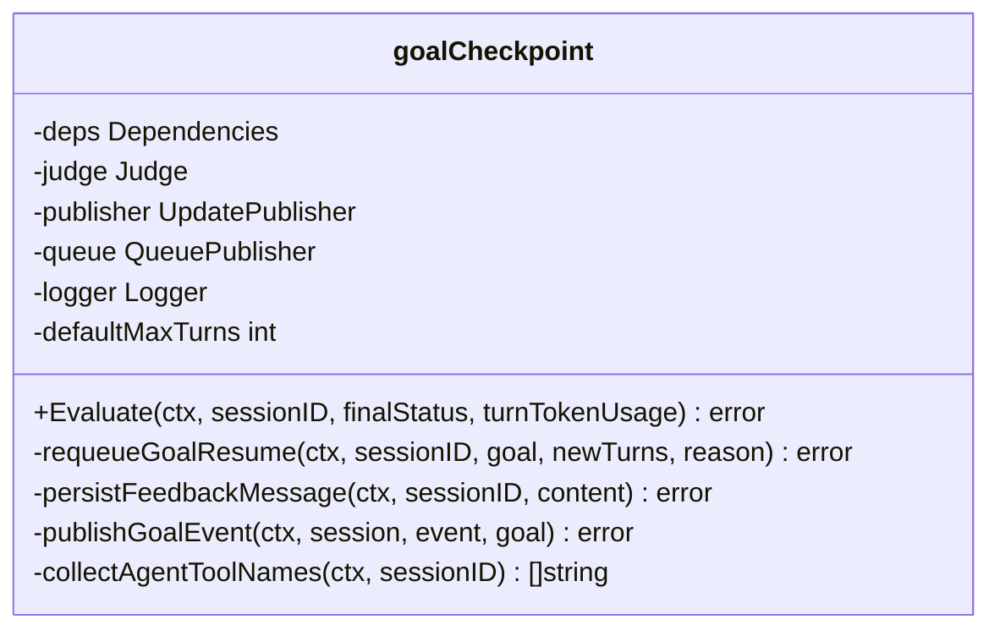
```mermaid
classDiagram
    class goalCheckpoint {
        -deps Dependencies
        -judge Judge
        -publisher UpdatePublisher
        -queue QueuePublisher
        -logger Logger
        -defaultMaxTurns int
        +Evaluate(ctx, sessionID, finalStatus, turnTokenUsage) error
        -requeueGoalResume(ctx, sessionID, goal, newTurns, reason) error
        -persistFeedbackMessage(ctx, sessionID, content) error
        -publishGoalEvent(ctx, session, event, goal) error
        -collectAgentToolNames(ctx, sessionID) []string
    }
```

**职责**：

- `Evaluate`：主入口，turn 完成后调用，决定 re-queue 还是终态
- `requeueGoalResume`：向 rtc-queue 发布 `goal_resume` work item
- `persistFeedbackMessage`：把 feedback 作为 system 消息写入 DB（`ContentTypeGoalFeedback`）
- `publishGoalEvent`：推送 goal 生命周期事件到用户 topic channel
- `collectAgentToolNames`：收集 Agent 可用的 tool 名字（供 Judge 参考）

### 4.3 Evaluate 核心流程

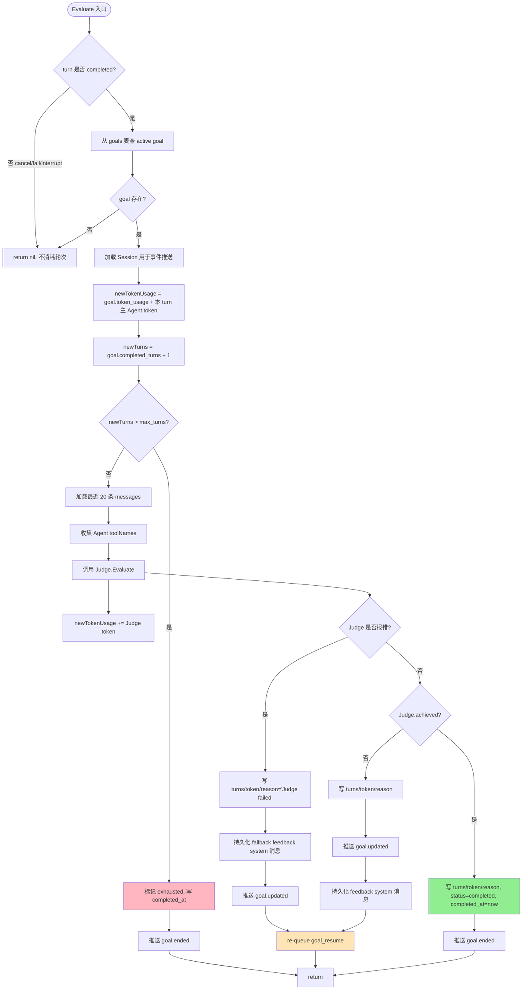
```mermaid
flowchart TD
    Start(["Evaluate 入口"]) --> C1{"turn 是否 completed?"}
    C1 -- "否 cancel/fail/interrupt" --> R1["return nil, 不消耗轮次"]

    C1 -- 是 --> L1["从 goals 表查 active goal"]
    L1 --> L2{"goal 存在?"}
    L2 -- 否 --> R1

    L2 -- 是 --> LS["加载 Session 用于事件推送"]
    LS --> T1["newTokenUsage = goal.token_usage + 本 turn 主 Agent token"]
    T1 --> T2["newTurns = goal.completed_turns + 1"]

    T2 --> C2{"newTurns > max_turns?"}
    C2 -- 是 --> EX["标记 exhausted, 写 completed_at"]
    EX --> EX1["推送 goal.ended"]
    EX1 --> R2["return"]

    C2 -- 否 --> LM["加载最近 20 条 messages"]
    LM --> LT["收集 Agent toolNames"]
    LT --> J["调用 Judge.Evaluate"]
    J --> T3["newTokenUsage += Judge token"]

    J --> JE{"Judge 是否报错?"}
    JE -- 是 --> JEF["写 turns/token/reason='Judge failed'"]
    JEF --> JEF2["持久化 fallback feedback system 消息"]
    JEF2 --> JEF3["推送 goal.updated"]
    JEF3 --> RQ["re-queue goal_resume"]
    RQ --> R2

    JE -- 否 --> JU{"Judge.achieved?"}
    JU -- 是 --> CO["写 turns/token/reason, status=completed, completed_at=now"]
    CO --> CO1["推送 goal.ended"]
    CO1 --> R2

    JU -- 否 --> UN["写 turns/token/reason"]
    UN --> UN1["推送 goal.updated"]
    UN1 --> UN2["持久化 feedback system 消息"]
    UN2 --> RQ

    style EX fill:#FFB6C1
    style CO fill:#90EE90
    style RQ fill:#FFE4B5
```

**解释**：

1. **入口守卫**：只有 turn 正常完成（`completed`）才评判；cancel / fail / interrupt 不消耗配额
2. **active goal 查找**：无活跃 goal 直接退出
3. **Session 加载**：用于事件推送时拿 `ownerRefID` 路由到用户 topic channel
4. **轮次必计**：`completed_turns += 1` 在进入 Judge 前就完成，不论 Judge 状态
5. **max_turns 兜底**：超过则标 exhausted 不 re-queue
6. **Judge 失败路径**：也写入 turns/token + 持久化 fallback feedback + re-queue，让下一轮再判
7. **达成路径**：写终态 + 推送 `goal.ended`
8. **未达成路径**：推送 `goal.updated`（前端刷新进度）+ 持久化 feedback + re-queue

### 4.4 集成点

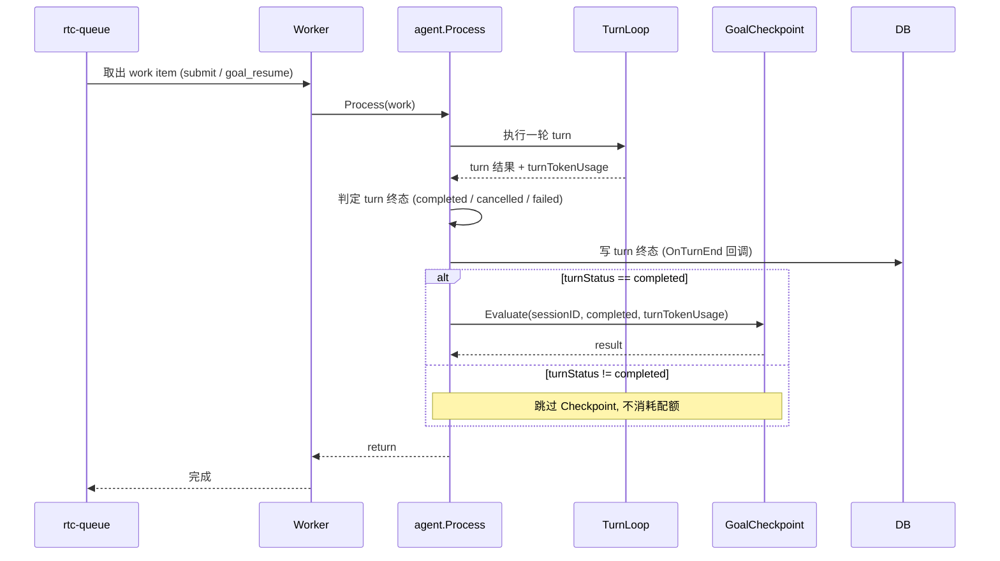
```mermaid
sequenceDiagram
    participant Q as rtc-queue
    participant W as Worker
    participant P as agent.Process
    participant TL as TurnLoop
    participant GC as GoalCheckpoint
    participant DB as DB

    Q->>W: 取出 work item (submit / goal_resume)
    W->>P: Process(work)
    P->>TL: 执行一轮 turn
    TL-->>P: turn 结果 + turnTokenUsage
    P->>P: 判定 turn 终态 (completed / cancelled / failed)
    P->>DB: 写 turn 终态 (OnTurnEnd 回调)

    alt turnStatus == completed
        P->>GC: Evaluate(sessionID, completed, turnTokenUsage)
        GC-->>P: result
    else turnStatus != completed
        Note over P,GC: 跳过 Checkpoint, 不消耗配额
    end

    P-->>W: return
    W-->>Q: 完成
```

**解释**：Goal Checkpoint 集成在 `Process()` 末尾，仅在 turn 正常完成时触发。turn 的 token 消耗（主 Agent）通过参数传给 Checkpoint，Judge 的 token 由 Checkpoint 内部累加。

### 4.5 rtc-queue 扩展

在现有 WorkKind 枚举中新增一项：

| WorkKind | 含义 |
|----------|------|
| `submit` | 现有：用户发消息 |
| `resume` | 现有：RTC 结果提交后恢复 |
| `goal_resume` | **新增**：goal 未达成触发 |

Worker 在处理 `goal_resume` 时与 `submit` 走同一条 `Process()` 路径 —— GenInput 加载消息时会看到上一轮持久化的 feedback 消息（system role + `ContentTypeGoalFeedback`），AI 自然知道要继续工作。

### 4.6 与 summarizeMW 的配合

feedback 消息使用 system role + `ContentTypeGoalFeedback` 类型，summarizeMW 在压缩时可以：

- 识别这类消息，保留最新一条，丢弃旧的（避免 N 轮 feedback 累积污染上下文）
- 或者把多条 feedback 合并成一条"progress summary"

> 这是 Phase 6（上下文管理）的优化项，Phase 3 先按默认 summarizeMW 行为跑通。

### 4.7 Turn 取消与 Goal 的交互

| 场景 | turn 状态 | goal 状态 | 行为 |
|------|----------|----------|------|
| AI 正常工作完成 | completed | active | Goal Checkpoint 评判 |
| 用户点 Stop（cancel turn） | cancelled | active | Goal 不消耗轮次，等待下一次用户消息 |
| AI 报错 | failed | active | 同上，不消耗轮次 |
| Agent 调用 `cancel_goal` tool | 当前 turn 继续运行 | cancelled | tool 内推送 `goal.ended`；当前 turn 完成后 Checkpoint 看到 cancelled 状态即跳过 |
| Agent 调用 `create_goal` tool（已有 active goal） | 当前 turn 继续 | 新 goal 创建失败 | tool 返回错误提示，Agent 应告知用户"已有一个 goal 在跑，要先取消吗？" |

**注意**：Agent 调用 `cancel_goal` 后，当前 turn 仍会继续运行到自然结束（不会立即中断）。Agent 的系统提示应引导它在调完 `cancel_goal` 后**立即结束当前 turn**（不再做新工作），避免用户感知延迟。

### 4.8 Agent Tools for Goal

Agent 通过 tool 调用驱动 goal 的创建与取消。**前端没有直接的 goal RPC** —— 所有 goal 生命周期转换由 Agent tool 触发。

#### 4.8.1 `create_goal` tool

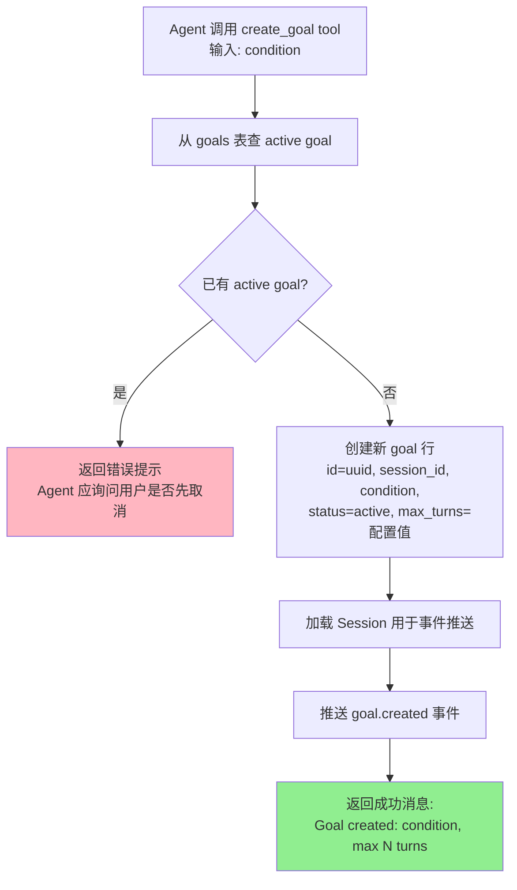
```mermaid
flowchart TD
    A["Agent 调用 create_goal tool<br/>输入: condition"] --> B["从 goals 表查 active goal"]
    B --> C{"已有 active goal?"}
    C -- 是 --> D["返回错误提示<br/>Agent 应询问用户是否先取消"]
    C -- 否 --> E["创建新 goal 行<br/>id=uuid, session_id, condition,<br/>status=active, max_turns=配置值"]
    E --> F["加载 Session 用于事件推送"]
    F --> G["推送 goal.created 事件"]
    G --> H["返回成功消息:<br/>Goal created: condition, max N turns"]

    style D fill:#FFB6C1
    style H fill:#90EE90
```

**tool 描述（给 Agent 看的说明）**：

> Create a goal for sustained, multi-turn work.
>
> You MUST follow this workflow:
> 1. Investigate: Run relevant tools (test runner, linter, code search) to understand current state
> 2. Refine: Transform the user's vague intent into a concrete, measurable completion condition (SMART)
> 3. Propose: Present the refined condition to the user and wait for confirmation
> 4. Create: ONLY after user confirms, call this tool with the final condition
>
> Do NOT call this tool for one-shot tasks. Do NOT call this tool if there is already an active goal.

**输入参数**：

| 字段 | 类型 | 必填 | 说明 |
|------|------|------|------|
| `condition` | string | 是 | 润色后的、具体的、可判定的完成条件 |

#### 4.8.2 `cancel_goal` tool

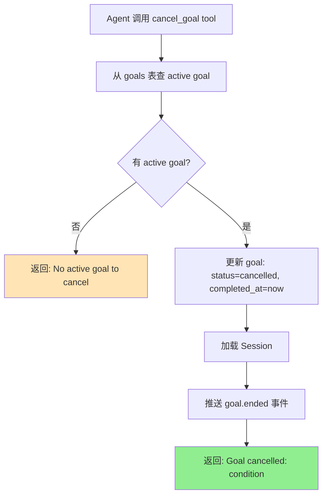
```mermaid
flowchart TD
    A["Agent 调用 cancel_goal tool"] --> B["从 goals 表查 active goal"]
    B --> C{"有 active goal?"}
    C -- 否 --> D["返回: No active goal to cancel"]
    C -- 是 --> E["更新 goal: status=cancelled, completed_at=now"]
    E --> F["加载 Session"]
    F --> G["推送 goal.ended 事件"]
    G --> H["返回: Goal cancelled: condition"]

    style D fill:#FFE4B5
    style H fill:#90EE90
```

**tool 描述**：

> Cancel the current active goal.
>
> Call this when the user indicates they want to stop working on the current goal. Examples: "停下来", "别做了", "算了", "I'm done with this goal".
>
> Do NOT call this just because a subtask failed — only when the user explicitly wants to abandon the goal entirely.
>
> **IMPORTANT**: After calling this tool, end your turn immediately. Do not do more work in this turn.

#### 4.8.3 Tool 注册

把 `create_goal` 和 `cancel_goal` 加入到 Agent 的工具列表（与现有的 `ls`、`read_file`、`write_file` 等并列）。

#### 4.8.4 Agent 系统提示词

在 Agent 的系统提示词中加入 goal 引导段落：

> When the user's message starts with `/goal` (injected by the system as a goal-creation intent), follow the goal creation workflow: (1) investigate the request using available tools, (2) refine the vague intent into a SMART condition, (3) propose to the user and wait for confirmation, (4) call `create_goal` after confirmation.
>
> When the user signals they want to stop (e.g., "stop", "cancel", "停下", "算了"), call `cancel_goal` and end your turn immediately. Don't use goals for one-shot questions or single-step tasks.

#### 4.8.5 完整交互示例

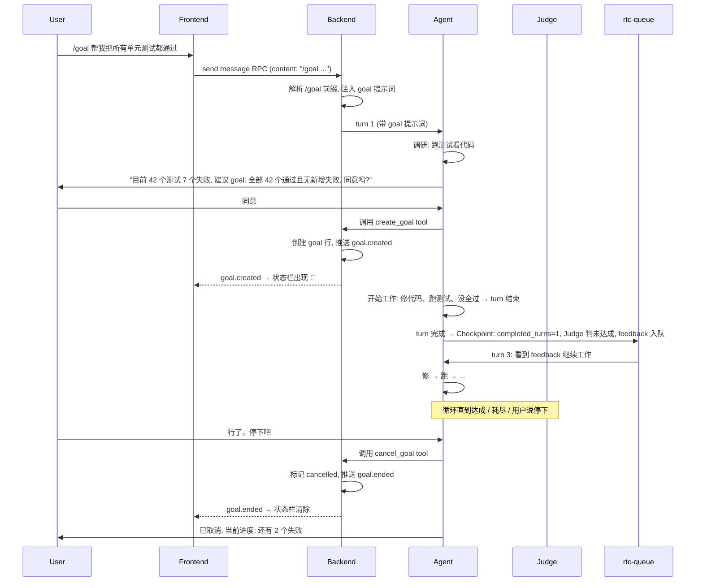
```mermaid
sequenceDiagram
    participant U as User
    participant FE as Frontend
    participant BE as Backend
    participant AG as Agent
    participant J as Judge
    participant Q as rtc-queue

    U->>FE: /goal 帮我把所有单元测试都通过
    FE->>BE: send message RPC (content: "/goal ...")
    BE->>BE: 解析 /goal 前缀, 注入 goal 提示词
    BE->>AG: turn 1 (带 goal 提示词)
    AG->>AG: 调研: 跑测试看代码
    AG->>U: "目前 42 个测试 7 个失败, 建议 goal: 全部 42 个通过且无新增失败, 同意吗?"
    U->>AG: 同意
    AG->>BE: 调用 create_goal tool
    BE->>BE: 创建 goal 行, 推送 goal.created
    BE-->>FE: goal.created → 状态栏出现 🎯
    AG->>AG: 开始工作: 修代码、跑测试、没全过 → turn 结束
    AG->>Q: turn 完成 → Checkpoint: completed_turns=1, Judge 判未达成, feedback 入队
    Q->>AG: turn 3: 看到 feedback 继续工作
    AG->>AG: 修 → 跑 → ...
    Note over AG,J: 循环直到达成 / 耗尽 / 用户说停下
    U->>AG: 行了，停下吧
    AG->>BE: 调用 cancel_goal tool
    BE->>BE: 标记 cancelled, 推送 goal.ended
    BE-->>FE: goal.ended → 状态栏清除
    AG->>U: 已取消, 当前进度: 还有 2 个失败
```

---

## 5. Goal 提示词注入

### 5.1 设计思路

前端 `/goal <目标>` 通过 send message RPC 发送，内容以 `/goal ` 开头。后端在消息进入 turn 处理前**解析前缀**，识别 goal 创建意图，向 turn 上下文注入一段 **goal 提示词**，引导 Agent 走"调研 → 润色 → 提议 → 创建"流程。

**解析位置**：在 `data_context.go` 的 `loadMessages` 函数中。这是 turn 入口的统一拦截点，所有消息在组装上下文时都会经过这里。这样设计的好处：

- **统一入口**：未来新增命令（如 `/loop`、`/research`）都可以在这里处理，走同一套逻辑
- **时机合适**：在消息进入 turn 前最后一步，可以基于完整的历史上下文做决策
- **与附件注入对齐**：与 TodoList、SessionMemory 等附件的注入逻辑平行，职责清晰

> 为什么不直接在前端润色？因为 Agent 能调用工具（跑测试、看代码）获得客观信息，润色出的 SMART 条件才真实可判定。

### 5.2 注入逻辑

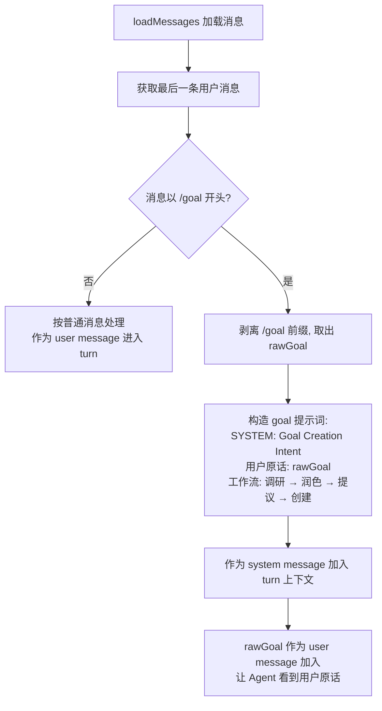
```mermaid
flowchart TD
    A["loadMessages 加载消息"] --> A1["获取最后一条用户消息"]
    A1 --> B{"消息以 /goal 开头?"}
    B -- 否 --> C["按普通消息处理<br/>作为 user message 进入 turn"]

    B -- 是 --> D["剥离 /goal 前缀, 取出 rawGoal"]
    D --> E["构造 goal 提示词:<br/>SYSTEM: Goal Creation Intent<br/>用户原话: rawGoal<br/>工作流: 调研 → 润色 → 提议 → 创建"]
    E --> F["作为 system message 加入 turn 上下文"]
    F --> G["rawGoal 作为 user message 加入<br/>让 Agent 看到用户原话"]
```

**goal 提示词内容**：

> [SYSTEM: Goal Creation Intent]
> The user wants to set a goal. Their original input: `<rawGoal>`
>
> You MUST follow this workflow:
> 1. **Investigate**: Use available tools to understand the current state. For code goals: run tests, check linters, inspect relevant files.
> 2. **Refine**: Transform the user's vague intent into a concrete, measurable completion condition (SMART).
> 3. **Propose**: Present the refined condition to the user in plain language and explicitly ask for confirmation.
> 4. **Create**: ONLY after the user confirms, call the create_goal tool with the final condition.
>
> Do NOT skip the investigation step. Do NOT call create_goal before getting user confirmation.

### 5.3 集成点

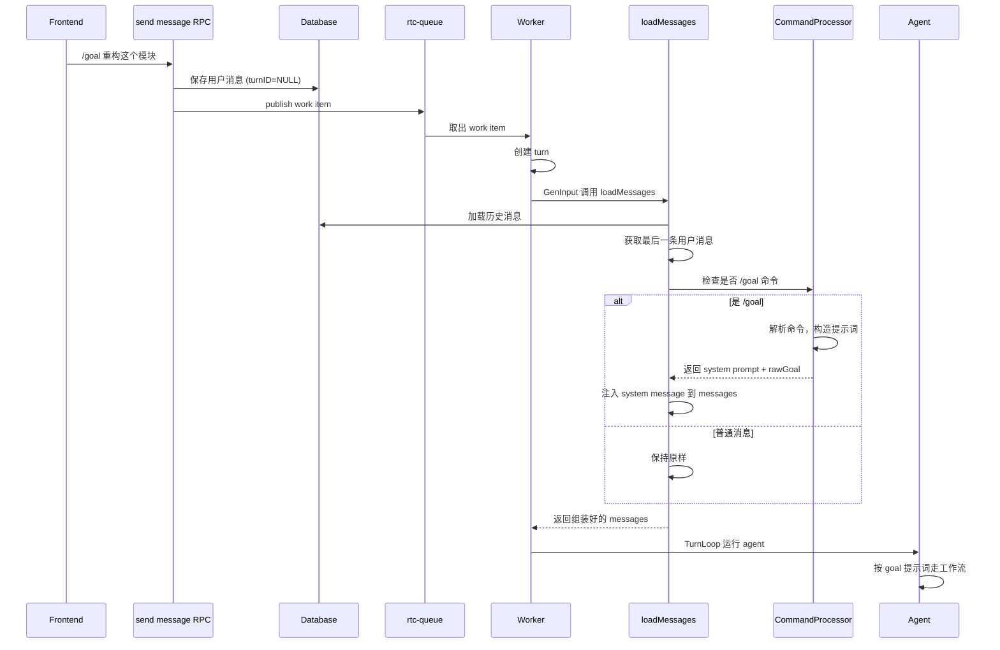
```mermaid
sequenceDiagram
    participant FE as Frontend
    participant RPC as send message RPC
    participant DB as Database
    participant Q as rtc-queue
    participant W as Worker
    participant LM as loadMessages
    participant CP as CommandProcessor
    participant AG as Agent

    FE->>RPC: /goal 重构这个模块
    RPC->>DB: 保存用户消息 (turnID=NULL)
    RPC->>Q: publish work item
    Q->>W: 取出 work item
    W->>W: 创建 turn
    W->>LM: GenInput 调用 loadMessages
    LM->>DB: 加载历史消息
    LM->>LM: 获取最后一条用户消息
    LM->>CP: 检查是否 /goal 命令
    alt 是 /goal
        CP->>CP: 解析命令，构造提示词
        CP-->>LM: 返回 system prompt + rawGoal
        LM->>LM: 注入 system message 到 messages
    else 普通消息
        LM->>LM: 保持原样
    end
    LM-->>W: 返回组装好的 messages
    W->>AG: TurnLoop 运行 agent
    AG->>AG: 按 goal 提示词走工作流
```

> 注：前端发送时是否保留 `/goal ` 前缀由前端决定。后端在 `loadMessages` 中兜底解析前缀；前端也可以选择剥离前缀，通过 metadata（如 `intent: 'goal_create'`）传递意图。两种机制可以共存。

---

## 6. Judge 设计

### 6.1 组件结构

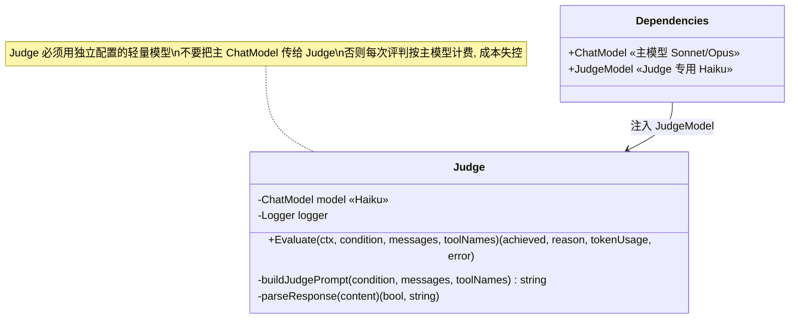
```mermaid
classDiagram
    class Judge {
        -ChatModel model «Haiku»
        -Logger logger
        +Evaluate(ctx, condition, messages, toolNames) (achieved, reason, tokenUsage, error)
        -buildJudgePrompt(condition, messages, toolNames) string
        -parseResponse(content) (bool, string)
    }

    class Dependencies {
        +ChatModel «主模型 Sonnet/Opus»
        +JudgeModel «Judge 专用 Haiku»
    }

    note for Judge "Judge 必须用独立配置的轻量模型\n不要把主 ChatModel 传给 Judge\n否则每次评判按主模型计费, 成本失控"
    Dependencies --> Judge : 注入 JudgeModel
```

### 6.2 Evaluate 流程

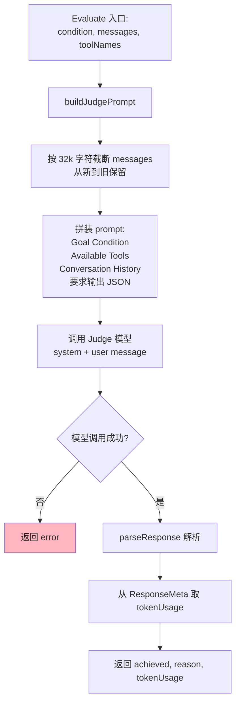
```mermaid
flowchart TD
    A["Evaluate 入口:<br/>condition, messages, toolNames"] --> B["buildJudgePrompt"]
    B --> B1["按 32k 字符截断 messages<br/>从新到旧保留"]
    B1 --> B2["拼装 prompt:<br/>Goal Condition<br/>Available Tools<br/>Conversation History<br/>要求输出 JSON"]
    B2 --> C["调用 Judge 模型<br/>system + user message"]
    C --> D{"模型调用成功?"}
    D -- 否 --> E["返回 error"]
    D -- 是 --> F["parseResponse 解析"]
    F --> G["从 ResponseMeta 取 tokenUsage"]
    G --> H["返回 achieved, reason, tokenUsage"]

    style E fill:#FFB6C1
```

### 6.3 parseResponse 鲁棒解析

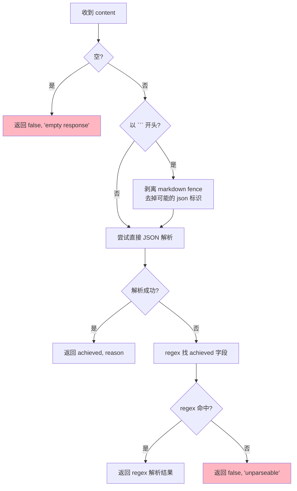
```mermaid
flowchart TD
    A["收到 content"] --> B{"空?"}
    B -- 是 --> C["返回 false, 'empty response'"]
    B -- 否 --> D{"以 ``` 开头?"}
    D -- 是 --> E["剥离 markdown fence<br/>去掉可能的 json 标识"]
    D -- 否 --> F["尝试直接 JSON 解析"]
    E --> F
    F --> G{"解析成功?"}
    G -- 是 --> H["返回 achieved, reason"]
    G -- 否 --> I["regex 找 achieved 字段"]
    I --> J{"regex 命中?"}
    J -- 是 --> K["返回 regex 解析结果"]
    J -- 否 --> L["返回 false, 'unparseable'"]

    style C fill:#FFB6C1
    style L fill:#FFB6C1
```

**解释**：Judge 模型可能返回 markdown fence 包裹、可能带多余 prose，因此解析链路为：去 fence → JSON 解析 → regex fallback → 默认 false（不轻言放弃）。

### 6.4 Judge 模型选择与配置

| 模型 | 用途 | 原因 |
| --- | --- | --- |
| Claude Haiku | 默认 Judge 模型 | 成本低，速度快，足够准确 |
| Claude Sonnet | 可选升级 | 复杂 goal 时使用 |

**独立配置**：系统需要在 Dependencies 中增加独立的 `JudgeModel` 字段，在 wire 注入时构造第二个 ChatModel 实例（复用 provider 配置，但强制使用 Haiku）。

> 重要：不要把主 ChatModel 传给 Judge。否则每次评判都按主模型计费，成本失控。

---

## 7. RPC 接口设计

### 7.1 RPC 边界说明

**创建和取消 goal 不通过独立 RPC**，而是通过 Agent tool 在服务端内部完成。前端与 goal 的交互：

- **创建 goal**：前端 `/goal <目标>` → 复用 send message RPC（后端在 `loadMessages` 中解析前缀，注入 goal 提示词）→ Agent 接管 → 调 `create_goal` tool
- **取消 goal**：用户自然语言 → Agent 识别意图 → 调 `cancel_goal` tool
- **查询 goal**：前端调 `get_goal` / `list_goals` RPC（见下文）

**已删除的 RPC**（v1 版本定义，v2/v3 移除）：

- ~~`v1.session.set_goal`~~ — 创建只走 Agent tool
- ~~`v1.session.clear_goal`~~ — 取消只走 Agent tool

**保留的 RPC**：

- `v1.session.get_goal` — 查询当前 active goal
- `v1.session.list_goals` — 查询 goal 历史

仍然定义成独立 RPC（查询类）是为了：

- 未来前端做历史面板时直接调用
- 复用鉴权、归属校验等逻辑
- 保持 HTTP/WebSocket 边界清晰，便于调试

### 7.2 查询 Goal

**方法**: `v1.session.get_goal`

**请求**：

```json
{
    "session_id": "uuid"
}
```

**响应**（无 active goal 时 `goal` 为 null）：

```json
{
    "goal": {
        "id": "goal-uuid",
        "session_id": "session-uuid",
        "condition": "所有测试通过",
        "status": "active",
        "completed_turns": 5,
        "token_usage": 12345,
        "max_turns": 50,
        "last_judge_reason": "还差 2 个单元测试未通过: TestX, TestY",
        "created_at": "2026-09-07T10:00:00Z"
    }
}
```

### 7.3 列出 Goal 历史

**方法**: `v1.session.list_goals`

**请求**：

```json
{
    "session_id": "uuid",
    "limit": 20,
    "cursor": "optional-pagination-cursor"
}
```

**响应**：

```json
{
    "goals": [
        {
            "id": "goal-uuid-1",
            "session_id": "session-uuid",
            "condition": "所有测试通过",
            "status": "completed",
            "completed_turns": 3,
            "token_usage": 8000,
            "max_turns": 50,
            "created_at": "2026-09-07T10:00:00Z",
            "completed_at": "2026-09-07T10:05:00Z",
            "last_judge_reason": "全部 42 个测试通过"
        },
        {
            "id": "goal-uuid-2",
            "condition": "性能优化到 100ms 内",
            "status": "exhausted",
            "completed_turns": 50,
            "token_usage": 120000,
            "max_turns": 50,
            "created_at": "2026-09-07T11:00:00Z",
            "completed_at": "2026-09-07T11:45:00Z",
            "last_judge_reason": "P95 仍为 180ms，未能达到 100ms 目标"
        }
    ],
    "next_cursor": "optional-next-page-cursor"
}
```

**Handler 要点**：

- 复用 `loadOwnedSession` 做归属校验
- 调用 `GoalRepo.ListBySession(ctx, sessionID, limit, cursor)`，按 `created_at DESC` 排序
- 返回分页结果，支持 cursor 翻页

---

## 8. 前端交互

前端**只有 `/goal <自然语言目标>` 一个命令**（无子命令）。取消、查询、历史等功能通过 Agent 对话或 UI 控件完成。

### 8.1 `/goal` slash 命令

`/goal <目标>` 是一个**前端 UX 入口**，实际走 send message RPC。

**前端职责**：

- 识别输入框中以 `/goal ` 开头的消息
- 通过 send message RPC 发送（内容可保留 `/goal ` 前缀，后端负责解析；或前端剥离前缀并通过 metadata 标记 `intent: 'goal_create'`）
- 订阅 `goal.*` 事件，更新状态栏和发通知
- 提供 goal 状态栏（显示 active goal 进度）

### 8.2 Goal 事件订阅

```mermaid
stateDiagram-v2
    [*] --> NoActiveGoal

    state NoActiveGoal {
    }

    state ActiveGoal {
        note right of ActiveGoal
            goalStore.setActive goal
            状态栏显示 condition / turns / tokens / reason
        end note
    }

    NoActiveGoal --> ActiveGoal : goal.created
    ActiveGoal --> ActiveGoal : goal.updated 刷新进度
    ActiveGoal --> NoActiveGoal : goal.ended + status=completed toast
    ActiveGoal --> NoActiveGoal : goal.ended + status=exhausted toast
    ActiveGoal --> NoActiveGoal : goal.ended + status=cancelled 静默
```

**Toast 规则**：

- `goal.created` — 不发 toast（Agent 在对话中已告知）
- `goal.updated` — 不发 toast，仅刷新状态栏
- `goal.ended + completed` — 发 🎉 toast
- `goal.ended + exhausted` — 发 ⚠️ toast，引导用户优化条件
- `goal.ended + cancelled` — 静默（Agent 在对话中已告知）

### 8.3 状态栏 UI 结构

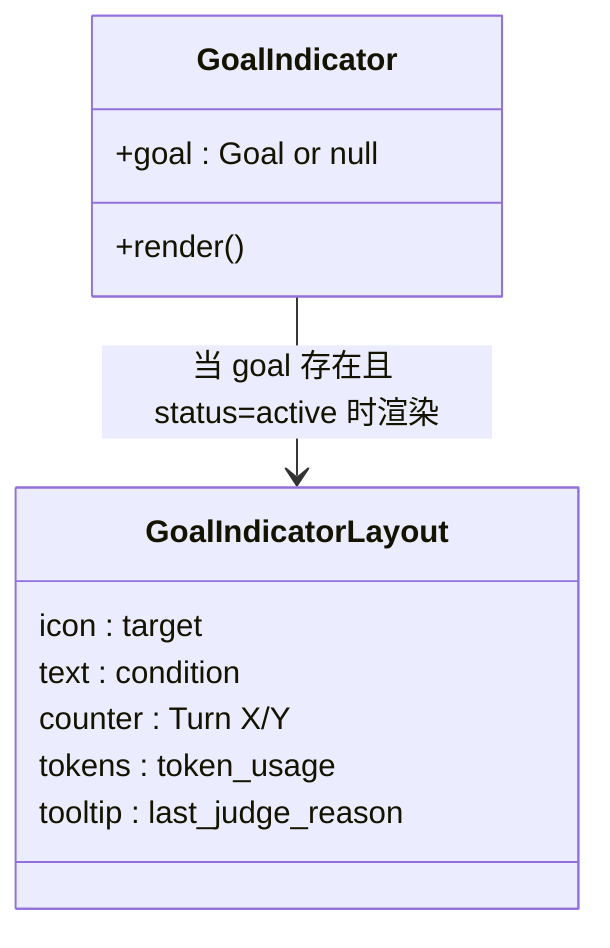
```mermaid
classDiagram
    class GoalIndicator {
        +goal : Goal or null
        +render()
    }

    class GoalIndicatorLayout {
        icon : target
        text : condition
        counter : Turn X/Y
        tokens : token_usage
        tooltip : last_judge_reason
    }

    GoalIndicator --> GoalIndicatorLayout : 当 goal 存在且 status=active 时渲染
```

**布局说明**：

- 🎯 图标 + condition 文本（截断过长内容）
- Turn 计数器（当前轮 / 最大轮）
- 🔥 token 消耗（千位分隔）
- 💬 悬停显示 Judge 最近 reason

### 8.4 Goal 历史面板

> **v3 决策**：后端提供 `list_goals` RPC，前端**暂不做 UI**。未来实现时：
>
> - 入口：状态栏 "History" 按钮或 session 设置页
> - 调用 `v1.session.list_goals` RPC 分页加载
> - 每行显示：condition + status badge（✅ completed / ❌ exhausted / ⏹ cancelled / 🔄 active）+ turns + tokens + duration + last reason

---

## 9. 关键规则

### 9.1 生命周期

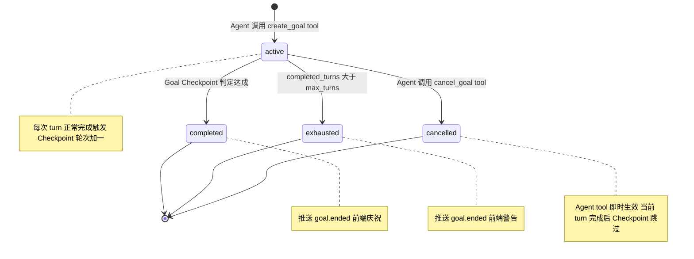
```mermaid
stateDiagram-v2
    [*] --> active : Agent 调用 create_goal tool

    active --> completed : Goal Checkpoint 判定达成
    active --> exhausted : completed_turns 大于 max_turns
    active --> cancelled : Agent 调用 cancel_goal tool

    completed --> [*]
    exhausted --> [*]
    cancelled --> [*]

    note right of active : 每次 turn 正常完成触发 Checkpoint 轮次加一
    note right of completed : 推送 goal.ended 前端庆祝
    note right of exhausted : 推送 goal.ended 前端警告
    note right of cancelled : Agent tool 即时生效 当前 turn 完成后 Checkpoint 跳过
```

**关键语义**：

- `active`：每次 turn 正常完成时触发 Goal Checkpoint 评判
- `completed`：推送 `goal.ended`，前端显示 🎉
- `cancelled`：Agent tool 即时生效；当前 turn 完成后 Checkpoint 看到 cancelled 状态即跳过
- `exhausted`：推送 `goal.ended`，前端显示 ⚠️ 引导用户优化条件
- **终态不可逆**：goal 一旦进入 completed/cancelled/exhausted，不能改回 active。需要新一轮就让 Agent 调用 `create_goal` 创建新 goal

### 9.2 事件模型

Goal 独立于 Session 后，有自己的事件生命周期，**不再通过 `session.updated` 承载**：

| 事件 | 触发时机 | payload |
|------|---------|---------|
| `goal.created` | 新 goal 创建 | 完整 goal 对象 |
| `goal.updated` | 每轮 turn 完成后（turns / tokens / reason 变化） | 完整 goal 对象 |
| `goal.ended` | goal 进入终态（completed / cancelled / exhausted） | 完整 goal 对象 |

事件发到用户的 topic channel（与 session 事件同 channel），前端按 event name 路由到 goal store。

### 9.3 约束条件

1. **单会话单 active goal**：一个会话同时只能有一个 `active` goal
2. **max_turns 创建时固化**：goal 行的 `max_turns` 字段保存创建时的配置值
3. **仅 completed turn 计入轮次**：cancel / interrupt / fail 不消耗 goal 配额
4. **主 Agent turn 完成即计数**：`completed_turns += 1` 在 turn 完成时立即执行，**不论 Judge 是否成功评判**
5. **Judge 失败容错**：Judge 模型错误时，**也 re-queue**，等下一轮再判，max_turns 兜底
6. **Token 追踪**：`token_usage` 记录 goal 生命周期内 session 的累计 token（主 Agent + Judge 合计）
7. **Feedback 持久化**：feedback 消息写入 DB（system role + `ContentTypeGoalFeedback`）
8. **历史不可变**：终态 goal 行保留，不删除不修改
9. **`completed_at` 字段**：goal 进入任意终态的时间戳

### 9.4 边界情况

```mermaid
flowchart LR
    subgraph 边界场景
        E1["已有 active goal 时再调 create_goal"]
        E2["Judge 模型 API 错误"]
        E3["达到最大轮次"]
        E4["Session 关闭时 goal 仍活跃"]
        E5["用户 cancel 正在跑的 turn"]
        E6["Agent 调 cancel_goal 时 turn 还在跑"]
        E7["Judge 反复判未达成 但 AI 已无事可做"]
    end

    subgraph 处理方式
        H1["tool 返回错误提示 Agent 询问是否先取消"]
        H2["计入轮次 + re-queue 下一轮再判"]
        H3["goal 进入 exhausted 推送 goal.ended"]
        H4["状态保留在 DB 不会自动继续"]
        H5["Checkpoint 跳过评判 goal 保持 active"]
        H6["goal 立即 cancelled turn 完成后 Checkpoint 跳过"]
        H7["max_turns 兜底进 exhausted"]
    end

    E1 --> H1
    E2 --> H2
    E3 --> H3
    E4 --> H4
    E5 --> H5
    E6 --> H6
    E7 --> H7
```

---

## 10. 实现计划

### 10.1 Phase 1: 数据模型

- [ ] 创建 `server/internal/model/goal.go`，定义 `Goal` 独立表
- [ ] 创建 `server/internal/repo/goal_repo.go`，实现 `GoalRepo` 接口（含 `FindActive`、`ListBySession`、`Create`、`Update`）
- [ ] 更新 `protocol` 定义（OpenAPI spec）：新增 `get_goal` / `list_goals` 方法
- [ ] 重新生成 protocol 代码

### 10.2 Phase 2: Judge 实现

- [ ] 创建 `judge.go`
- [ ] 实现 `Evaluate` 方法（含 toolNames 参数）
- [ ] 实现 `parseResponse` 鲁棒解析
- [ ] 配置 Judge 模型（Haiku）
- [ ] Dependencies 增加 JudgeModel 字段，wire 注入

### 10.3 Phase 3: Goal 提示词注入 + Checkpoint + rtc-queue 集成

- [ ] 创建命令处理架构：
  - 创建 `server/internal/agent/command/processor.go`，定义 `CommandProcessor` 接口
  - 创建 `server/internal/agent/command/manager.go`，实现 `CommandProcessorManager`
- [ ] 创建 `server/internal/agent/command/goal_command.go`，实现 `GoalCommandProcessor`（`/goal` 前缀解析与提示词注入）
- [ ] 在 `data_context.go` 的 `loadMessages` 中集成命令解析：
  - 在附件注入后，调用 `CommandProcessorManager.ProcessCommands()`
  - 检查最后一条用户消息，匹配到 `/goal` 时注入提示词
- [ ] 在 `server/pkg/turn-agent/types.go` 新增 `WorkKindGoalResume`
- [ ] 创建 `server/internal/agent/goal_checkpoint.go`，实现 `Evaluate` 方法（按 §4.3 流程图）
- [ ] 在 `agent_process.go` 的 `Process()` 末尾调用 Goal Checkpoint
- [ ] feedback 消息使用 system role + `ContentTypeGoalFeedback` 持久化到 DB
- [ ] re-queue 逻辑：调用 `queue.Publish` 发布 `goal_resume` work item
- [ ] 验证：rtc-queue 是否已保证同 session 串行；否则需加 session 路由

### 10.4 Phase 4: Agent Tool + RPC 接口

- [ ] 创建 `tools_goal.go`，实现 `create_goal` / `cancel_goal` tool（按 §4.8 流程图）
- [ ] 在 `data.go` 注册两个 tool
- [ ] 更新 Agent 系统提示词，加入 goal 引导
- [ ] 创建 `action.goal.go`，实现 `GetGoal` / `ListGoals`
- [ ] 注册 RPC 路由
- [ ] 推送 `goal.created` / `goal.updated` / `goal.ended` 事件到 user topic channel
- [ ] 新增 `updates.EntityGoal` entity 类型

### 10.5 Phase 5: 前端集成

- [ ] `/goal <目标>` 命令解析 —— 识别前缀，通过 send message RPC 发送
- [ ] 订阅 `goal.created` / `goal.updated` / `goal.ended` 事件
- [ ] 状态栏显示（condition + completed_turns/max_turns + token_usage + last_judge_reason）
- [ ] 完成通知（🎉 completed / ⚠️ exhausted / 静默 cancelled）
- [ ] Goal 历史面板（**Phase 5 暂不实现**，后端 `list_goals` RPC 已就位，UI 留到后续版本）

---

## 11. 测试计划

### 11.1 单元测试

- **Judge.Evaluate — 目标达成**：返回 `achieved=true` + reason
- **Judge.Evaluate — 目标未达成**：返回 `achieved=false` + reason
- **Judge.Evaluate — toolNames 传入**：Judge prompt 中包含工具列表
- **Judge.parseResponse — JSON 响应**：正确解析
- **Judge.parseResponse — markdown fence 包裹**：剥离后正确解析
- **Judge.parseResponse — 完全无法解析**：返回 `achieved=false` + unparseable 提示
- **GoalCommandProcessor.Match — 普通消息**：返回 `false`
- **GoalCommandProcessor.Match — /goal 前缀**：返回 `true`
- **GoalCommandProcessor.Process — 注入提示词**：返回 system prompt + rawGoal
- **CommandProcessorManager.ProcessCommands — 多命令匹配**：只匹配第一个，不重复处理
- **loadMessages 集成 — 命令解析**：最后一条用户消息是 `/goal` 时，messages 中包含注入的 system prompt
- **GoalCheckpoint.Evaluate — goal 非 active**：直接返回，不调用 Judge
- **GoalCheckpoint.Evaluate — turn 非 completed（cancel/fail）**：跳过评判，不消耗轮次
- **GoalCheckpoint.Evaluate — 达到最大轮次**：goal 进入 `exhausted` 终态，推送 `goal.ended`，不 re-queue
- **GoalCheckpoint.Evaluate — Judge 报错**：计入轮次 + re-queue，max_turns 兜底
- **GoalCheckpoint.Evaluate — 未达成**：feedback 消息写入 DB（system role）+ goal_resume work item 发布到 rtc-queue + 推送 `goal.updated`
- **GoalCheckpoint.Evaluate — 达成**：goal 进入 `completed` 终态，推送 `goal.ended`
- **GoalCheckpoint.Evaluate — token 累加**：主 Agent token + Judge token 都计入 goal.token_usage
- **create_goal tool — 已存在 active goal**：返回错误提示，不创建新行
- **cancel_goal tool — 正常取消**：goal 状态变 cancelled，推送 goal.ended
- **cancel_goal tool — 无 active goal**：返回 "No active goal to cancel."

### 11.2 集成测试

- `/goal 所有测试通过` + Agent 调研润色 + 用户确认 + AI 完成工作 → Goal 达成，状态变 `completed`，推送 `goal.ended`
- `/goal 所有测试通过` + AI 未完成 → Goal 未达成，rtc-queue 收到 goal_resume，新 turn 看到 feedback 继续工作
- 达到 max_turns 上限 → goal 进入 `exhausted`，推送 `goal.ended`，前端显示 ⚠️
- 用户在 AI 工作时 cancel turn（Stop 按钮）→ goal 保持 active，等待下次
- 用户自然语言 "停下" → Agent 调 cancel_goal → goal 状态变 `cancelled`，推送 `goal.ended`
- `v1.session.list_goals` → 返回该 session 所有 goal（含 completed/cancelled/exhausted 历史），按 created_at DESC 排序
- `v1.session.get_goal` → 返回当前 active goal；无 active goal 时返回 null

---

## 12. 风险与缓解

- **Judge 误判（达成判未达成）**：AI 继续工作但无法达成 → 由 max_turns 兜底进入 `exhausted`；产品上引导 Agent 润色 SMART 条件
- **Judge 误判（未达成判达成）**：AI 提前停止，用户失望 → 允许用户取消后重设 goal；未来可考虑"Judge 两次确认"机制
- **无限循环（AI 反复做同样的事）**：每轮 feedback 相同 → summarizeMW 压缩 + 用户自然语言取消 + max_turns 兜底
- **Token 消耗过高**：跨 turn 累积 → `Goal.TokenUsage` 追踪（主 Agent + Judge 合计）；前端状态栏显示；未来可加 token 预算上限
- **rtc-queue 同 session 并发**：goal_resume 与用户新消息被不同 worker 同时认领 → 验证 queue 是否 session-scoped，否则需加分布式锁
- **Feedback 累积污染上下文**：N 轮 feedback 堆在消息历史 → system role + `ContentTypeGoalFeedback` 类型标识，summarizeMW 特殊处理（Phase 6 优化项）
- **Session 关闭后的"自动继续"误解**：文档需明确"保留状态，下次发消息时继续"，不是后台自动运行
- **Goal 表膨胀**：长期运行的 session 累积大量历史 goal → 建议加 TTL（如 90 天后归档），或在 list_goals 默认只查近期
- **Goal 提示词被 Agent 忽略**：Agent 可能没按"调研 → 润色 → 提议 → 创建"流程走 → 系统提示词强化 + 后续可考虑在 goal_prompt 内强制 tool 调用顺序

---

## 13. 未来扩展

1. **多 active goal 支持**：允许同时设定多个 active goal（目前限制为单 active）
2. **目标优先级**：多个 active goal 时按优先级评判
3. **Goal 暂停/恢复**：`/goal pause` / `/goal resume`，新增 `paused` 状态（独立命令）
4. **自定义 Judge**：允许用户指定评判模型
5. **Goal 模板**：预定义常用 goal 模板
6. **跨 Session Goal**：Goal 解耦 Session 后，可支持一个 Goal 跨多个 Session 执行
7. **Goal 归档**：长期历史 goal 自动归档（如 90 天后），减轻 goals 表压力
8. **前端 Goal 历史面板**：基于已实现的 `list_goals` RPC 做 UI
9. **下一轮 token 预估**：在状态栏显示"下一轮预估 X tokens，剩余 Y tokens 触发自动压缩"，提前告警

---

## 附录 A: 与 /loop 命令的对比

- **循环控制**：`/goal` 目标驱动；`/loop` 轮次驱动 / 时间驱动
- **停止条件**：`/goal` Judge 判定；`/loop` 轮次完成 / 时间到达
- **状态管理**：`/goal` 独立 goals 表；`/loop` 数据库任务表
- **底层机制**：两者都通过 rtc-queue 驱动 turn 循环，差异仅在"是否 re-queue"的判定逻辑
- **适用场景**：`/goal` 模糊目标（如"所有测试通过"）；`/loop` 明确任务（如"循环 5 轮"）

---

## 附录 B: v1 → v2 → v3 变更清单

| 主题 | v1 | v2 | v3 |
|------|----|----|----|
| 创建路径 | Agent tool + RPC `set_goal` | 仅 Agent tool | 同 v2 |
| 取消路径 | Agent tool + RPC `clear_goal` | 仅 Agent tool | 同 v2 |
| 前端 `/goal` | §1.1 说不存在 / §7 说存在 | 存在，作为 UX 入口 | 同 v2 |
| `/goal` 子命令 | 模糊 | 明确无子命令 | 同 v2 |
| 时间字段名 | `ended_at` | `completed_at` | 同 v2 |
| status 字段说明 | §3.5 漏 `exhausted` | 4 种状态全列 | 同 v2 |
| Judge 失败 | 不 re-queue，挂起等用户发消息 | 也 re-queue，max_turns 兜底 | 同 v2 |
| 轮次计数 | Judge 判未达成才 +1 | 主 Agent turn 完成即 +1 | 同 v2 |
| token_usage | Judge + 主 Agent（代码只追踪 Judge） | 整个 goal 生命周期 session 累计 token | 同 v2 |
| Feedback role | user | system | 同 v2 |
| Judge 参数 | `toolNames` 漏传 | 必须传 | 同 v2 |
| Session 获取 | Evaluate 参数不足 | Evaluate 内加载 Session | 同 v2 |
| 架构图 Session.goal 字段 | 画了（与 §3 冲突） | 删除 | 同 v2 |
| 前端历史面板 | 做 | 暂不做（后端接口保留） | 同 v2 |
| **文档表达形式** | Go / TS 伪代码 | 同 v1 | **全部替换为 mermaid 图 + 文字解释** |

---

## 附录 C: 相关文档

- [13-commands.md](../13-commands.md) - 命令系统总览
- [11-context-management.md](../11-context-management.md) - 上下文管理
- [Eino Middleware Reference](../../eino-agent/reference/middleware.md)

---

**文档结束**
