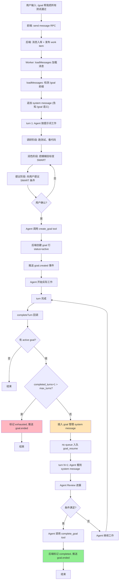
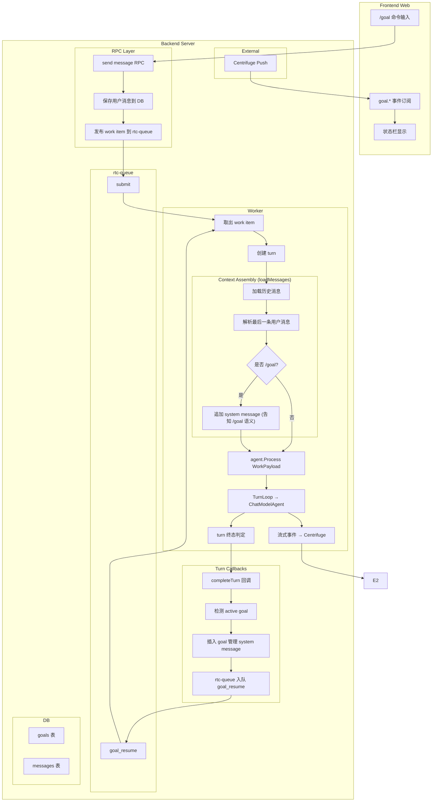
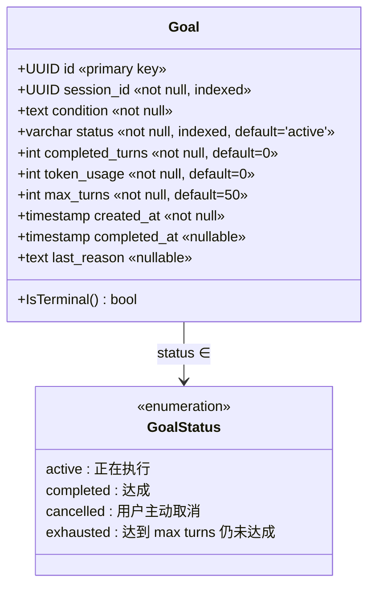
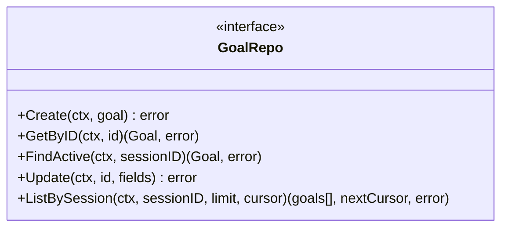
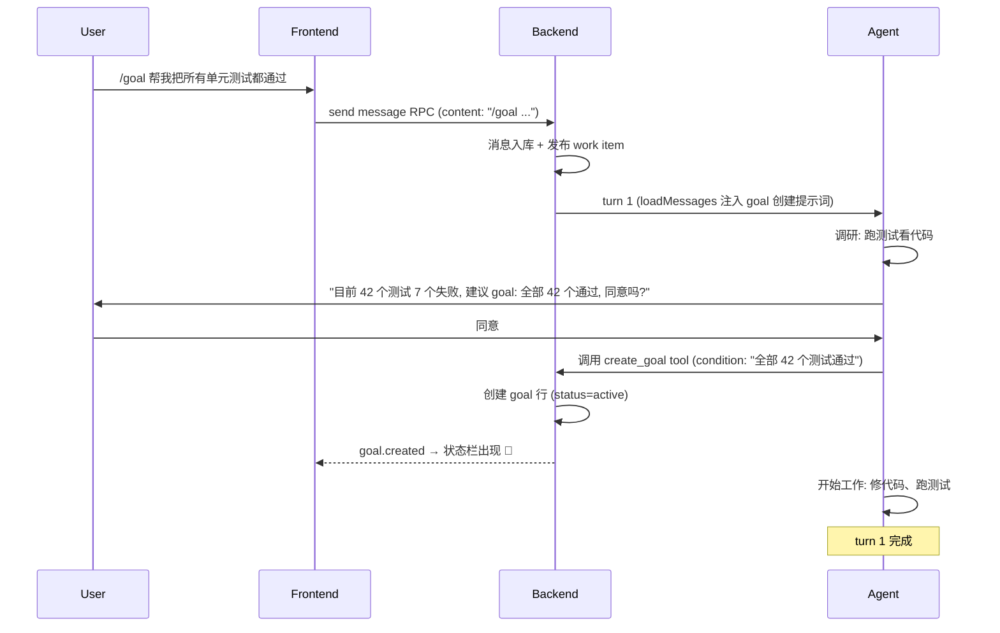
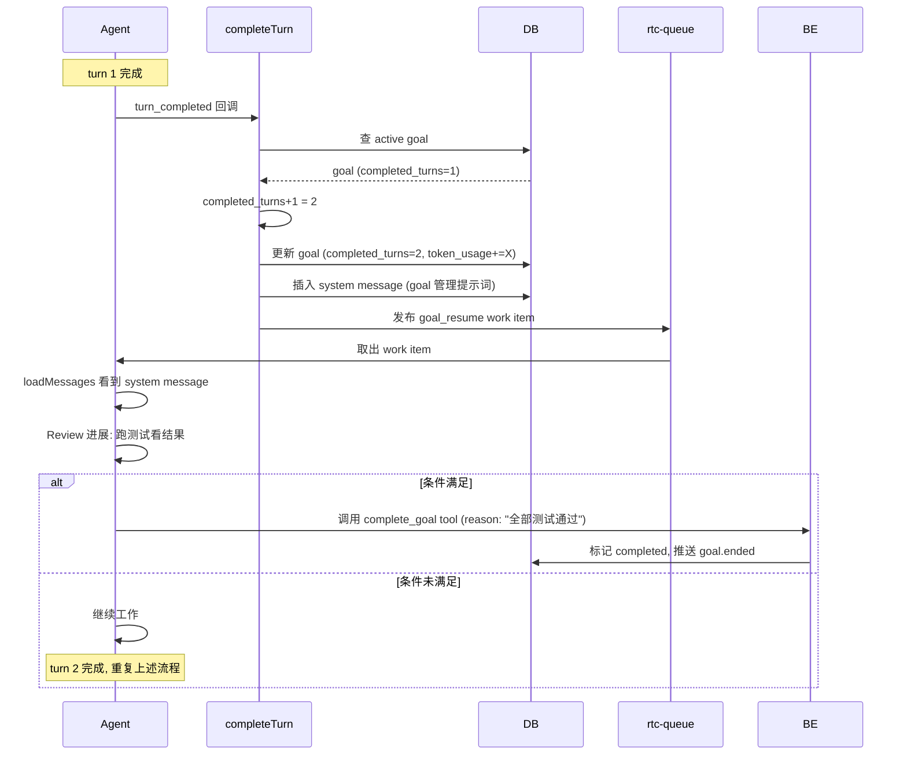
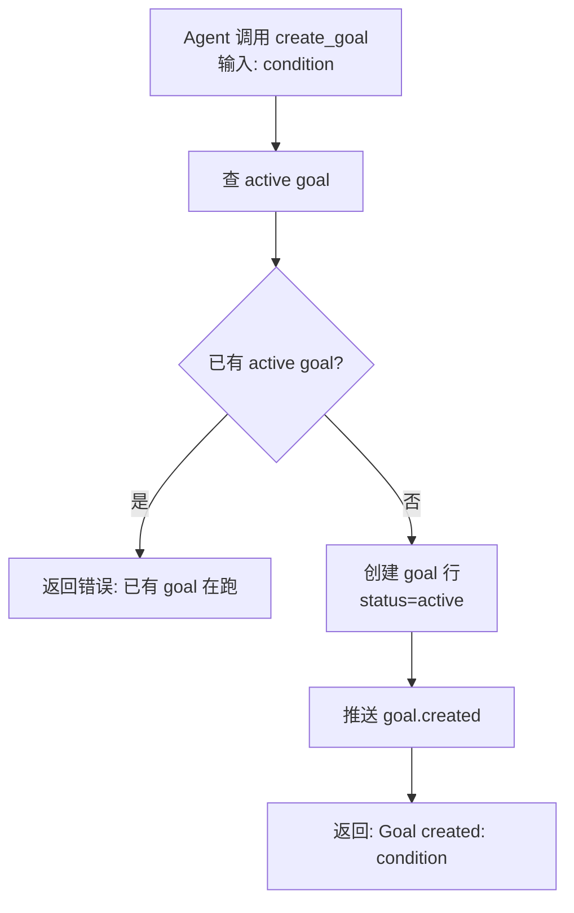
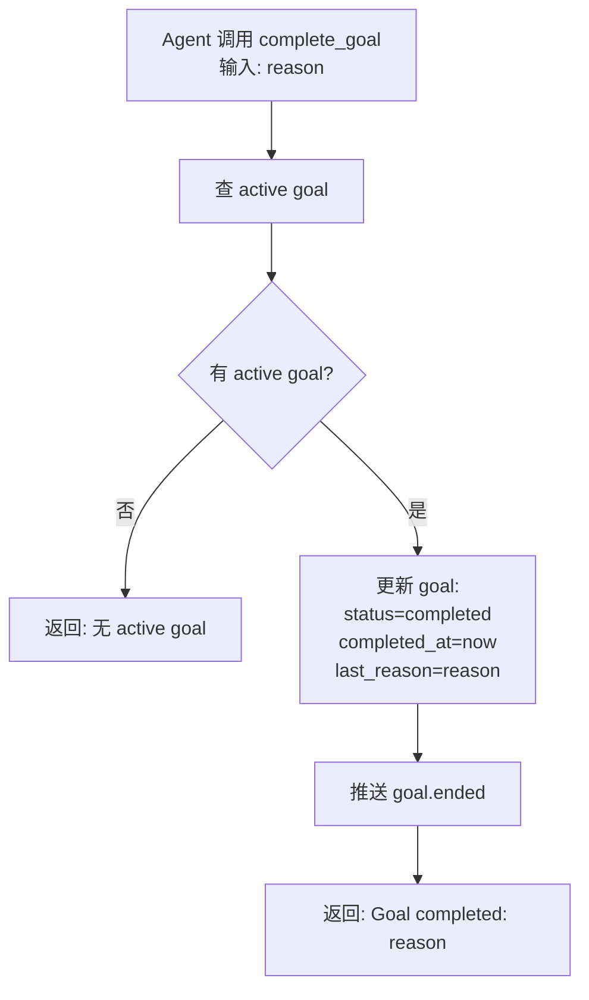
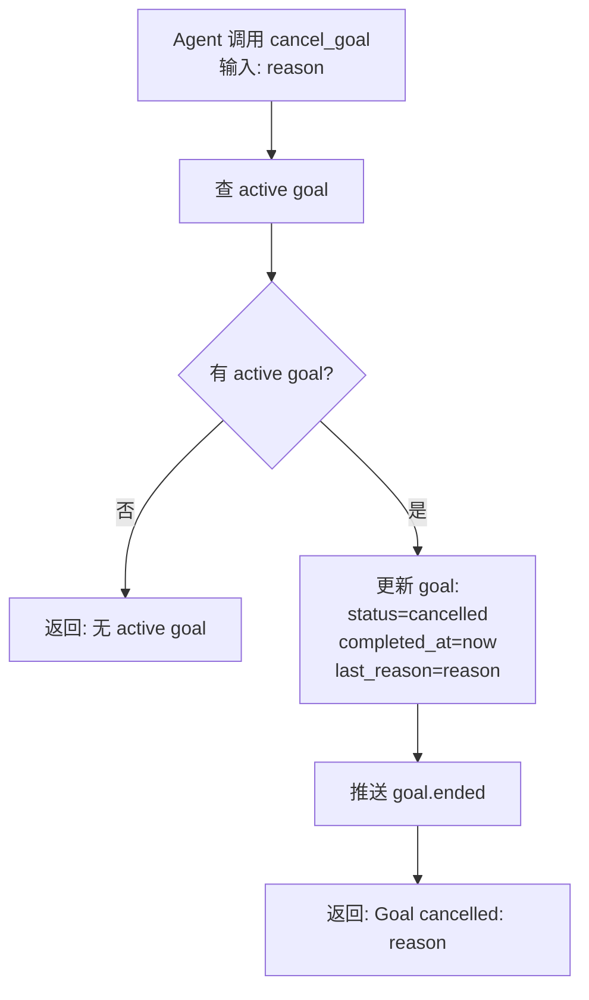
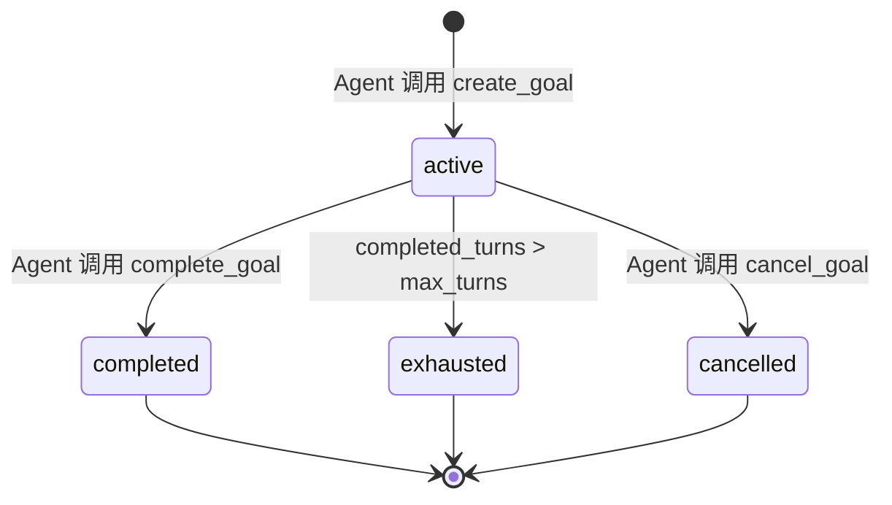

# /goal 命令设计文档 (v4.0)

**版本**: 4.0  
**日期**: 2026-09-07  
**状态**: 简化设计（去掉独立 Judge，Agent 自评判）

> v4.0 相对 v3.1 的变更：
>
> - **去掉独立 Judge 组件**：不再使用独立的 Haiku 模型评判，改为主 Agent 自己 Review
> - **去掉独立 Goal Checkpoint 组件**：逻辑直接放在 `completeTurn` 回调中
> - **简化流程**：每轮 turn 完成后，直接插入 system message（含 goal 管理提示词）→ re-queue
> - **Agent 主动评判**：Agent 在下一轮看到 system message 后，自己 Review 并调 `complete_goal` tool
> - **新增 `complete_goal` tool**：Agent 主动调用，标记 goal 完成
> - **强化提示词**：每轮插入的 system message 包含完整的 goal 管理指令，确保 Agent 不会忘记调用 tool

---

## 1. 概述

### 1.1 功能定位

`/goal` 机制让 AI 持续工作直到某个完成条件满足。核心交互：

- **创建 goal**：前端 `/goal <自然语言目标>` → 后端注入 goal 提示词 → Agent 调研 → 润色 SMART 条件 → 用户确认 → Agent 调用 `create_goal` tool
- **执行 goal**：每轮 turn 完成后，后端自动插入 goal 管理提示词 → re-queue → Agent 下一轮 Review → 调 `complete_goal` 或继续工作
- **完成 goal**：Agent 判断条件满足 → 调用 `complete_goal` tool → 后端标记 `completed`
- **取消 goal**：用户说"停下" → Agent 调用 `cancel_goal` tool → 后端标记 `cancelled`
- **耗尽 goal**：达到 `max_turns` → 后端自动标记 `exhausted`

### 1.2 核心机制（简化版）



**解释**：

- **创建阶段**：Agent 调研 → 润色 → 提议 → 用户确认 → 调 `create_goal`
- **执行阶段**：每轮 turn 完成后，`completeTurn` 检测 active goal → 插入 system message → re-queue
- **Review 阶段**：Agent 下一轮看到 system message → 自己 Review → 调 `complete_goal` 或继续工作
- **完成阶段**：Agent 调 `complete_goal` → 后端标记 `completed`

---

## 2. 架构设计

### 2.1 简化后的架构



**关键变化**：

- **没有 Judge 组件**：不再调用独立的 Haiku 模型
- **没有 Goal Checkpoint 组件**：逻辑直接在 `completeTurn` 回调中
- **Agent 自己 Review**：每轮插入的 system message 引导 Agent 自己评判

### 2.2 核心组件

| 组件                  | 职责                                                    | 位置                                            |
| --------------------- | ------------------------------------------------------- | ----------------------------------------------- |
| **Goal Storage**      | 持久化 goal 状态                                        | `server/internal/model/goal.go`                 |
| **/goal 前缀检测**    | `loadMessages` 内联：检测前缀，追加 system message      | `server/internal/agent/load_messages.go`        |
| **completeTurn 回调** | 检测 active goal，插入 system message，re-queue         | `server/internal/agent/callbacks.go`            |
| **Agent Tools**       | `create_goal` / `complete_goal` / `cancel_goal`         | `server/internal/agent/tools_goal.go`           |

> 注：`/goal` 前缀检测逻辑直接内联在 `loadMessages` 中，不创建独立组件。
> 检测到 `/goal` 前缀后，追加一条 `role=system` 的 message，告知 Agent `/goal` 的语义，
> Agent 自行从上下文提炼目标。

---

## 3. 数据模型

### 3.1 Goal 模型



**字段解释**：

| 字段 | 类型 | 说明 |
|------|------|------|
| `id` | uuid | 主键 |
| `session_id` | uuid | 所属 session |
| `condition` | text | 完成条件（SMART 形式） |
| `status` | varchar(20) | `active` / `completed` / `cancelled` / `exhausted` |
| `completed_turns` | int | 已完成的 turn 数 |
| `token_usage` | int | goal 生命周期内 session 累计 token |
| `max_turns` | int | 创建时固化的 max_turns 配置 |
| `created_at` | timestamp | goal 创建时间 |
| `completed_at` | timestamp | 进入终态的时间 |
| `last_reason` | text | Agent 最近一次给出的 reason（调 `complete_goal` 或 `cancel_goal` 时传入） |

### 3.2 GoalRepo



---

## 4. 核心流程

### 4.1 Goal 创建流程



### 4.2 Goal 执行与 Review 流程



### 4.3 completeTurn 回调逻辑（伪代码）

```go
func completeTurn(ctx, sessionID, turnTokenUsage) {
    // 1. 更新 turn 状态
    db.UpdateTurn(sessionID, completed, turnTokenUsage)
    
    // 2. 检测 active goal
    goal := goalRepo.FindActive(ctx, sessionID)
    if goal == nil {
        return // 无 active goal，无事发生
    }
    
    // 3. 轮次计数 + token 累加
    newTurns := goal.CompletedTurns + 1
    newTokens := goal.TokenUsage + turnTokenUsage
    
    // 4. 检查 max_turns
    if newTurns > goal.MaxTurns {
        goalRepo.Update(ctx, goal.ID, {
            status: "exhausted",
            completed_turns: newTurns,
            token_usage: newTokens,
            completed_at: now(),
        })
        publishGoalEvent(sessionID, "goal.ended", goal)
        return // 不 re-queue
    }
    
    // 5. 更新 goal
    goalRepo.Update(ctx, goal.ID, {
        completed_turns: newTurns,
        token_usage: newTokens,
    })
    
    // 6. 插入 goal 管理 system message
    prompt := buildGoalManagementPrompt(goal)
    db.InsertMessage(ctx, sessionID, {
        role: "system",
        content: prompt,
        content_type: "goal_management",
    })
    
    // 7. re-queue
    queue.Publish(ctx, WorkKindGoalResume, sessionID)
    
    // 8. 推送 goal.updated 事件
    publishGoalEvent(sessionID, "goal.updated", goal)
}

func buildGoalManagementPrompt(goal) string {
    return fmt.Sprintf(`# Goal Management

You are working on a persistent goal:
- Condition: %s
- Progress: Turn %d/%d

## Your responsibilities

- Review current progress by checking message history and running verification tools (tests, linters, etc.)
- If the condition is fully satisfied, call ` + "`complete_goal`" + ` tool with a clear reason
- If the condition cannot be achieved, call ` + "`cancel_goal`" + ` tool with a clear reason
- Otherwise, continue working toward the goal

## Reporting

- Briefly report current status to the user
- If continuing, state your next action

## Constraints

- You MUST explicitly evaluate goal status each turn
- You MUST call ` + "`complete_goal`" + ` or ` + "`cancel_goal`" + ` when appropriate — this is mandatory
- Do not skip verification steps before calling ` + "`complete_goal`" + `,
        goal.Condition,
        goal.CompletedTurns, goal.MaxTurns,
    )
}
```

---

## 5. 提示词设计

### 5.1 Goal 创建提示词（Phase 2：注入到 turn 1）

```markdown
# Goal Creation

The user wants to set a goal. Their original input: `<rawGoal>`

## Your Role

Help the user transform a vague intent into a concrete, measurable completion condition following SMART principles.

## Workflow

### 1. Investigate
- Use available tools to understand the current state (run tests, check linters, inspect files)
- Understand what the user is trying to achieve

### 2. Refine
- Transform the vague intent into a concrete, measurable completion condition
- The condition must be SMART:
  - **S**pecific: Clear about what needs to be done
  - **M**easurable: How to determine completion
  - **A**chievable: Within current capabilities
  - **R**elevant: Aligned with user's actual need
  - **T**ime-bound: Bounded by `max_turns`

### 3. Propose
- Present the refined condition to the user and ask for confirmation
- Example: "I understand you want to fix all tests. Currently 7 of 42 tests are failing. Suggested goal: All 42 tests pass. Agree?"

### 4. Create
- After user confirms, **call `create_goal` tool** with the final condition as the `condition` parameter

## Constraints

- You **MUST** follow the workflow in order — do not skip investigation
- You **MUST** call `create_goal` after user confirmation — this is mandatory
- You **MUST NOT** call `create_goal` if there is already an active goal
- You **MUST NOT** decide the condition for the user — confirmation is required

## Example

User input: `/goal get all tests passing`

Your response:
1. Run tests, find 7 of 42 failing
2. Propose: "Suggested goal: All 42 tests pass. Agree?"
3. After user agrees, call `create_goal(condition: "All 42 tests pass")`
```

### 5.2 Goal 管理提示词（Phase 3：每轮 turn 完成后插入）

```markdown
# Goal Management

You are working on a persistent goal:

| Field | Value |
|-------|-------|
| Condition | `{condition}` |
| Progress | Turn `{completed_turns}/{max_turns}` |

## Your Responsibilities

### 1. Review Progress
- Check message history to understand what has been done
- Run verification tools (tests, linters, etc.) to check current state
- Evaluate how much of the completion condition is satisfied

### 2. Evaluate Status

Based on your review, choose one of the following actions:

| Status | Action | Tool Call |
|--------|--------|-----------|
| Condition fully satisfied | Mark complete | `complete_goal(reason: "...")` |
| Condition cannot be achieved | Mark cancelled | `cancel_goal(reason: "...")` |
| Condition not yet met but workable | Continue working | No tool call, keep working |

### 3. Report Status
- Briefly report current status to the user
- If continuing, state your next action
- If completing or cancelling, explain why

## Constraints

- You **MUST** explicitly evaluate goal status each turn
- You **MUST** call `complete_goal` when the condition is satisfied — this is mandatory
- You **MUST** call `cancel_goal` when the condition cannot be achieved
- You **MUST NOT** skip verification steps before calling `complete_goal`
- You **MUST NOT** call `complete_goal` when the condition is not fully met

## Example

Goal condition: "All 42 tests pass"
Current turn: 2/50

Your actions:
1. Run tests, find 40 passing, 2 failing
2. Report: "40/42 tests passing. Continuing to fix `test_auth.py:58` and `test_api.py:127`."
3. Continue working, fix the failing tests
4. Next turn: run tests, all passing
5. Call `complete_goal(reason: "All 42 tests pass")`
```

---

## 6. Agent Tools

### 6.1 `create_goal` tool



**输入参数**：

| 字段 | 类型 | 必填 | 说明 |
|------|------|------|------|
| `condition` | string | 是 | 润色后的 SMART 条件 |

### 6.2 `complete_goal` tool



**输入参数**：

| 字段 | 类型 | 必填 | 说明 |
|------|------|------|------|
| `reason` | string | 是 | 完成原因（如"全部 42 个测试通过"） |

**Tool 描述**：

> Mark the current active goal as completed.
>
> Call this when you have verified that the goal condition is fully satisfied. You MUST run verification tools (e.g., run tests, check outputs) before calling this tool.
>
> **IMPORTANT**: This is a mandatory step. If the goal condition is met, you MUST call this tool. Do not skip it.

### 6.3 `cancel_goal` tool



**输入参数**：

| 字段 | 类型 | 必填 | 说明 |
|------|------|------|------|
| `reason` | string | 是 | 取消原因（如"用户要求停止"） |

**Tool 描述**：

> Cancel the current active goal.
>
> Call this when:
> - The user explicitly asks to stop (e.g., "停下", "算了", "cancel")
> - You determine the goal is impossible to achieve
>
> **IMPORTANT**: After calling this tool, end your turn immediately.

---

## 7. 前端交互

### 7.1 `/goal` 命令

前端识别输入框中以 `/goal ` 开头的消息，通过 send message RPC 发送。

### 7.2 Goal 事件订阅

```mermaid
stateDiagram-v2
    [*] --> NoActiveGoal

    state NoActiveGoal {
    }

    state ActiveGoal {
        note right of ActiveGoal
            状态栏显示 condition / turns / tokens
        end note
    }

    NoActiveGoal --> ActiveGoal : goal.created
    ActiveGoal --> ActiveGoal : goal.updated
    ActiveGoal --> NoActiveGoal : goal.ended + status=completed (🎉)
    ActiveGoal --> NoActiveGoal : goal.ended + status=exhausted (⚠️)
    ActiveGoal --> NoActiveGoal : goal.ended + status=cancelled (静默)
```

### 7.3 状态栏 UI

- 🎯 图标 + condition 文本
- Turn 计数器（当前轮 / 最大轮）
- 🔥 token 消耗
- 💬 悬停显示 `last_reason`

---

## 8. 关键规则

### 8.1 生命周期



### 8.2 事件模型

| 事件 | 触发时机 | payload |
|------|---------|---------|
| `goal.created` | Agent 调用 `create_goal` | 完整 goal 对象 |
| `goal.updated` | 每轮 turn 完成后 | 完整 goal 对象 |
| `goal.ended` | goal 进入终态 | 完整 goal 对象 |

### 8.3 约束条件

1. **单会话单 active goal**
2. **max_turns 创建时固化**
3. **仅 completed turn 计入轮次**
4. **每轮必插入 system message**：确保 Agent 看到 goal 管理提示词
5. **Agent 必须调 tool**：`complete_goal` 或 `cancel_goal`，由提示词强制
6. **Token 追踪**：`token_usage` 记录 goal 生命周期的累计 token
7. **历史不可变**：终态 goal 行保留

---

## 9. 实现计划

### 9.1 Phase 1: 数据模型

- [ ] 创建 `server/internal/model/goal.go`
- [ ] 创建 `server/internal/repo/goal_repo.go`

### 9.2 Phase 2: /goal 前缀检测与 System Message 注入

**目标**：检测 `/goal` 前缀，注入 system message 告知 Agent 语义，由 Agent 自行根据上下文判断目标

#### 触发位置

**代码路径**：`server/internal/chat/loadMessages`（消息加载时）

**时机**：Worker 从数据库加载历史消息后、发送给 Agent 前

#### 实现步骤

1. **前缀检测**
   - 扫描最后一条 `role=user` 消息
   - 判断是否以 `/goal` 开头（允许单独出现或带后续内容）

2. **构建 System Message**
   - 新增一条 `role=system` 消息
   - 内容：告知 `/goal` 语义的提示词
   - **位置**：追加到消息列表末尾（在用户消息之后）

3. **插入逻辑**
   ```go
   messages := loadFromDB(sessionID)
   if len(messages) > 0 && strings.HasPrefix(messages[len(messages)-1].Content, "/goal") {
       messages = append(messages, &schema.Message{
           Role:    schema.System,
           Content: goalSystemPrompt,
       })
   }
   ```

4. **前缀匹配规则**
   - `/goal` 单独出现：走注入逻辑
   - `/goal 帮我把测试通过`：走注入逻辑
   - `/goalify` 或其他前缀：不匹配

5. **多次触发处理**
   - 每次检测到 `/goal` 前缀都注入 system message
   - 不检查是否已有 active goal
   - 中途取消后再输入 `/goal`：相同处理，不影响

#### 关键决策

- ✅ **注入位置**：追加到消息末尾（简单直接）
- ✅ **消息持久化**：不入库，仅运行时注入（避免污染历史）
- ✅ **前缀匹配**：`strings.HasPrefix(content, "/goal")`（灵活匹配）
- ✅ **多次触发**：每次独立处理，不维护状态

#### 待补充

- [ ] system message 的具体提示词内容

> 设计原则：后端不做"命令解析"，只做前缀检测。检测到 `/goal` 前缀后，
> 在发给 LLM 的消息列表末尾追加一条 `role=system` 的 schema.Message，
> 告知 Agent `/goal` 的语义；Agent 自行从上下文（`/goal` 后面的自然语言）
> 中提炼目标。

- [ ] 在 `loadMessages` 中判断最后一条用户消息是否以 `/goal` 开头（匹配 `/goal` 后跟空格，或精确等于 `/goal`）
- [ ] 若是，追加一条 system message：说明 `/goal` 的含义，引导 Agent 调研上下文、提炼 SMART 完成条件、向用户提议、确认后调 `create_goal`
- [ ] 不创建独立的命令处理器组件（无 `goal_command.go`），逻辑内联在 `loadMessages`

### 9.3 Phase 3: completeTurn 回调扩展

- [ ] 在 `callbacks.go` 的 `completeTurn` 中添加 goal 检测逻辑
- [ ] 实现 `buildGoalManagementPrompt` 函数
- [ ] 实现 goal_resume work item 发布

### 9.4 Phase 4: Agent Tools

- [ ] 创建 `server/internal/agent/tools_goal.go`
- [ ] 实现 `create_goal` / `complete_goal` / `cancel_goal` tool
- [ ] 注册 tool 到 Agent

### 9.5 Phase 5: 前端集成

- [ ] `/goal` 命令解析
- [ ] 订阅 `goal.*` 事件
- [ ] 状态栏显示

---

## 10. 测试计划

### 10.1 单元测试

- **loadMessages — /goal 前缀检测**：追加 system message；无前缀则不追加
- **completeTurn — 无 active goal**：不插入 system message
- **completeTurn — 达到 max_turns**：标记 exhausted，不 re-queue
- **completeTurn — 正常流程**：插入 system message，发布 goal_resume
- **create_goal tool — 已有 active goal**：返回错误
- **complete_goal tool — 正常完成**：标记 completed
- **cancel_goal tool — 正常取消**：标记 cancelled

### 10.2 集成测试

- `/goal 所有测试通过` → Agent 调研 → 用户确认 → `create_goal` → 多轮工作 → `complete_goal` → `completed`
- 达到 `max_turns` → `exhausted`
- 用户说"停下" → `cancel_goal` → `cancelled`

---

## 11. 风险与缓解

- **Agent 不调 `create_goal`**：强化提示词，要求必须调用
- **Agent 不调 `complete_goal`**：每轮 system message 强制要求；`max_turns` 兜底
- **Agent 误判（自欺欺人）**：依赖 SMART 条件 + 提示词要求执行验证工具
- **无限循环**：`max_turns` 兜底
- **Token 消耗过高**：`token_usage` 追踪，前端展示

---

**文档结束**
