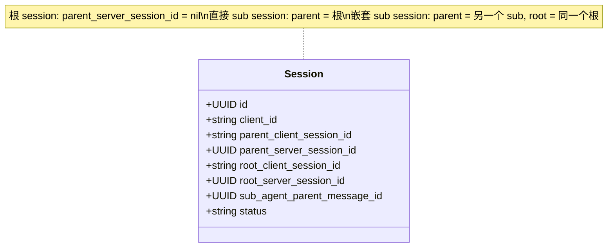
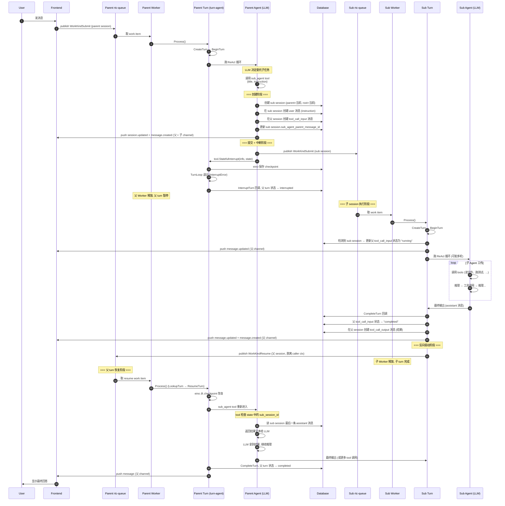
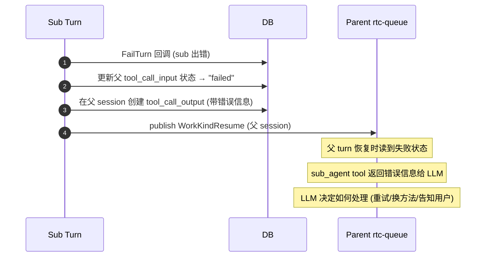
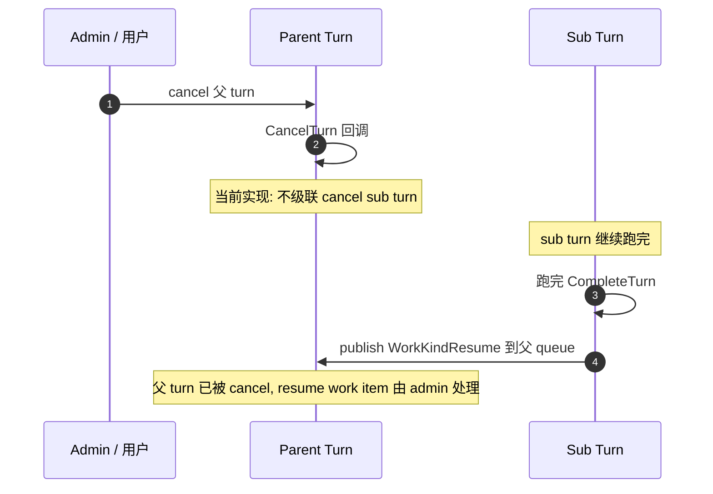
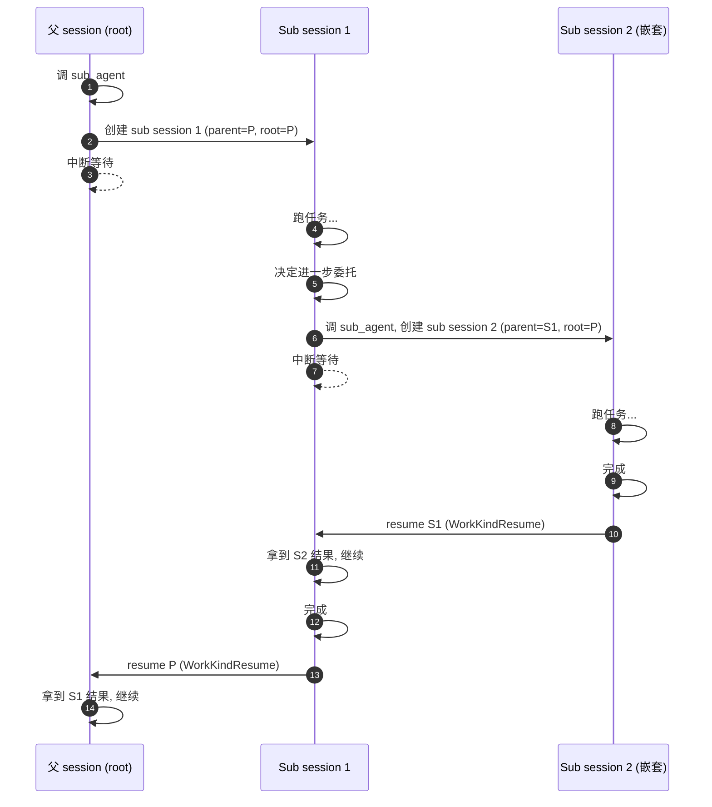
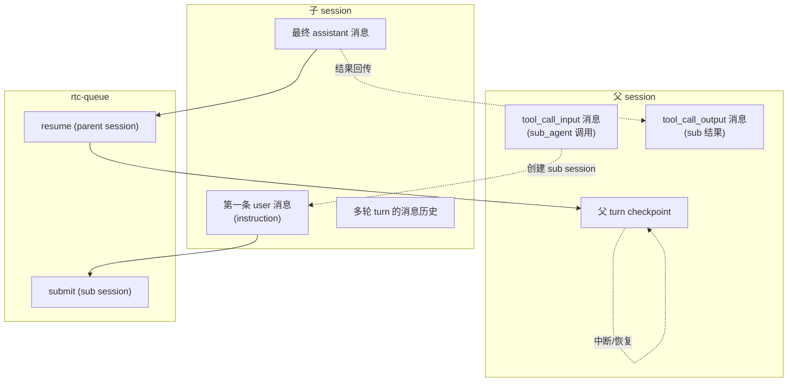

# Sub Agent 设计文档

**状态**：已实现，文档化整理中
**日期**：2026-09-07

---

## 1. 概述

Sub Agent 让主 Agent（父 session）能够**把复杂任务委托给独立的子 session**执行。子 session 在独立的上下文里跑完任务后，把最终结果作为 tool 调用结果返回给父 session，父 session 继续推理。

**核心价值**：
- **任务分解**：主 Agent 可把长任务拆成多个子任务并行 / 串行处理
- **上下文隔离**：子 session 从空白上下文开始，不污染父 session 的对话历史
- **完全复用 turn-agent**：子 session 走 rtc-queue + turn-agent 全套机制，天然支持多轮、RTC Tool、interrupt/resume

---

## 2. 核心概念

### 2.1 Session 层级



**层级规则**：
- **根 session**：`parent_server_session_id = nil`
- **直接 sub session**：`parent` 指向根 session
- **嵌套 sub session**：`parent` 指向另一个 sub session，`root` 始终指向最顶层
- `sub_agent_parent_message_id`：父 session 中 `tool_call_input` 消息的 ID，用于 sub session 完成后反向驱动父 session

### 2.2 消息类型

Sub Agent 涉及两类特殊消息：

| 消息类型 | Role | 位置 | 用途 |
|---------|------|------|------|
| `tool_call_input` | tool | 父 session | 记录 sub_agent tool 调用（含 title + instruction） |
| `tool_call_output` | tool | 父 session | 记录 sub agent 的返回结果 |
| 第一条 user 消息 | user | 子 session | sub agent 的 instruction（伪装成用户消息） |

### 2.3 Work Kind

复用现有 `submit` / `resume`：

| WorkKind | 场景 |
|----------|------|
| `submit` | 创建 sub session 后发布，触发子 session 的首轮 turn |
| `resume` | sub session 完成后发布到父 session，恢复被中断的父 turn |

---

## 3. 主流程时序图



---

## 4. 关键机制详解

### 4.1 StatefulInterrupt 的双参数设计

sub_agent tool 调用 `tool.StatefulInterrupt(ctx, info, state)`：

- **info**（`subAgentInterruptInfo`）：元数据，进 eino 的 interrupt 事件，供前端展示
  - `Type: "sub_agent"`
  - `SubSessionID`、`ParentMessageID`、`Instruction`
- **state**（`subAgentInterruptState`）：序列化到 checkpoint，tool resume 时读回
  - `SubSessionID`：用于找结果
  - `ToolCallID`：用于关联 tool_call_input / output
  - `ParentMessageID`：用于更新父消息状态

**为什么 info 和 state 分两个参数**：
- info 是"这次中断是什么事件"——用于事件流、前端展示
- state 是"恢复时需要什么数据"——必须能 gob 序列化，持久化到 checkpoint

### 4.2 结果获取：从 DB 读而非 ResumeParams

Sub session 完成后，**结果不通过 WorkPayload.SubAgentResult 透传**（虽然字段存在），而是父 turn 恢复后，sub_agent tool 自己去 DB 读 sub session 的最后一条 assistant 消息。

```text
父 turn 恢复 →
  sub_agent tool 重新进入 →
    tool.GetInterruptState → 拿到 state.SubSessionID →
      MessageRepo.ListRecentBySession(subSessionID, 50) →
        找最后一条 role=assistant 消息 →
          返回文本内容作为 tool 结果
```

**原因**：RTC 模式下 ResumeParams 不带数据，tool 自给自足；Sub Agent 沿用同一模式，保持一致性。

### 4.3 反向驱动的 context 脱离

`resumeParentAfterSubAgent` 必须**脱离 caller 的 context**：

```go
// Detach from the callback's context.
// The sub session's turn is already completed;
// the resume is fire-and-forget and must not be aborted by
// the callback context timeout/cancellation.
```

因为 sub session 的 CompleteTurn 回调结束后，其 context 可能被取消。但"发布 resume work item 到父 queue" 是独立动作，必须继续执行。

### 4.4 嵌套 sub session 的 root 推导

```text
创建 sub session 时：
  if 当前 session 已有 root:
      新 sub session 的 root = 当前 session 的 root
  else:
      新 sub session 的 root = 当前 session (自己就是根)
```

这保证了无论嵌套多深，整棵 session 树共享同一个 root。

### 4.5 Invocation 状态机

父 session 的 `tool_call_input` 消息随 sub session 生命周期变化：

```mermaid
stateDiagram-v2
    [*] --> created: sub_agent tool 创建消息
    created --> running: sub turn BeginTurn 回调
    running --> completed: sub turn CompleteTurn 回调
    running --> failed: sub turn FailTurn 回调

    state created {
        note right of created
            前端渲染: "准备启动子任务..."
        end note
    }

    state running {
        note right of running
            前端渲染: 子任务进度
        end note
    }

    state completed {
        note right of completed
            前端渲染: 子任务结果
        end note
    }

    state failed {
        note right of failed
            前端渲染: 子任务失败
        end note
    }
```

---

## 5. 边界情况

### 5.1 Sub session 失败



### 5.2 父 turn 被 cancel（sub 正在跑）



> 当前实现：父 cancel 不级联 sub。未来可选：通过 `stop_sub_agent` tool 让 LLM 主动取消，或在 CancelTurn 回调里扫描活跃 sub session 级联 cancel。

### 5.3 Sub session 自己又调用 sub_agent（嵌套）



嵌套深度理论上无限制，但建议通过 prompt 引导 LLM 谨慎使用。

---

## 6. 配套 tools

| Tool | 用途 |
|------|------|
| `sub_agent` | 创建并启动 sub session |
| `stop_sub_agent` | 取消正在运行的 sub session |
| `list_sub_agent` | 列出当前 session 的所有 sub sessions |
| `get_sub_agent_message` | 读取 sub session 的消息历史（进度观察） |

---

## 7. 与 Goal / Judge 的关系

Sub Agent 机制已实现，可直接用于 Goal 的 Judge 场景：

```text
Goal Checkpoint (主 turn 完成后)
  └─ 不调 Judge 模型
  └─ 主 Agent 在下一轮 turn 中调 sub_agent tool
       instruction: "检查 goal <condition> 是否达成, 跑相关测试/lint..."
  └─ sub agent (Judge 角色) 跑只读 tools 验证
  └─ 返回 {achieved, reason} 文本
  └─ 主 Agent 解析结果, 调 create_goal 或继续工作
```

**优势**：
- Judge 完全复用 Sub Agent 机制，零新基础设施
- Judge 可以是任意模型（通过 sub session 的 AgentPrompt 控制）
- Judge 也能用 RTC tools（跑客户端测试等）

---

## 8. 数据流总结



---

**文档结束**
