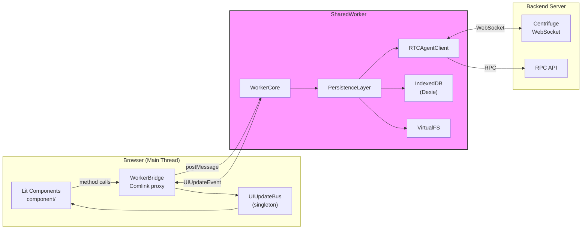

# rtc-agent/web-components Architecture

Web Components monorepo for RTC Agent — 5 packages providing a real-time AI chat interface backed by Centrifuge WebSocket + IndexedDB persistence.

## Quick Stats

- **75 files**, **66 topics** across **8 dimensions**
- **257 Mermaid diagrams**, **380 cross-references**
- **22 component directories**, **22 controllers** (20 in `controllers/` + LocaleController + FloatingPanelController), **16 context files** (17 `createContext` calls: 16 in `contexts/` + `localeContext` in `core/i18n.ts`)
- **47 custom elements**, **5 packages**: protocol, client, persistence, worker, component

## Package Map

| Package | Role | Key Classes |
| --------- | ------ | ------------- |
| `protocol` | Shared TypeScript types (OpenAPI-generated) | `Session`, `Message`, `Update`, `RpcMethod` |
| `client` | WebSocket client + logging | `RTCAgentClient`, `OAuth2Client`, `createLogger` |
| `persistence` | IndexedDB + sync layer | `PersistenceLayer`, `EntityRepository`, `UIUpdateBus`, `VirtualFS`, `OffsetManager` |
| `worker` | SharedWorker core | `WorkerCore`, `shared-worker.ts` entry |
| `component` | Lit Web Components UI | `RtcAgent`, `FunctionRegistry`, `WorkerBridge`, `AuthController`, 19 controllers instantiated |

## Architecture Dimensions

| # | Dimension | Entry | Topics |
| --- | ------- | ----- | ------ |
| 1 | Lifecycle | [lifecycle/INDEX.md](lifecycle/INDEX.md) | 17 topics: Connection, Database, SharedWorker, WorkerBridge, Ready, I18n/Theme, PersistenceLayer, RtcProcessor, ScriptEngine, ComponentHierarchy, SkillSystem, FloatingPanelController, RootComponentHelpers, DesignSystem, ChatLayout, LogoSystem, OverlaySystem |
| 2 | State | [state/INDEX.md](state/INDEX.md) | 21 topics: ConnectionState, Offset, SyncStatus, UIUpdate, MasterLock, ControllerPattern, ContextSystem, EntityRepository, MessageRepository, DialogState, PersistenceController, NotificationController, MessageVirtualScroll, SessionManagement, EditorSystem, VisibilityState, ScrollSaver, WindowSystem, SettingsSystem, ConcurrencyPatterns, SyncPattern |
| 3 | Events | [events/INDEX.md](events/INDEX.md) | 7 topics: Publication, UIUpdateBus, EventBus, ComponentEvents, BusHandler (with Tab reconciliation), CommandPipeline, StreamingEvents |
| 4 | Registry | [registry/INDEX.md](registry/INDEX.md) | 6 topics: FunctionRegistry, ToolRegistry, Factory, SchemaValidation, BuiltinSystemGroup, MarkdownGenerator |
| 5 | Config | [config/INDEX.md](config/INDEX.md) | 6 topics: RtcAgentConfig, PersistenceConfig, AgentConfig, WindowConfig, ActivityBarConfig, ProtocolTypes |
| 6 | Security | [security/INDEX.md](security/INDEX.md) | 4 topics: OAuth2, AuthController, Permission, DeviceIdentity |
| 7 | Storage | [storage/INDEX.md](storage/INDEX.md) | 3 topics: IndexedDB, VirtualFS, LocalStorage |
| 8 | Observability | [observability/INDEX.md](observability/INDEX.md) | 2 topics: Logger, DebugAPI |

## Data Flow Overview

