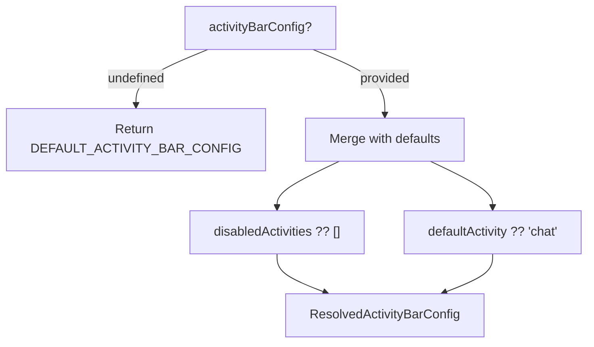

# ActivityBarConfig

Activity Bar 配置：控制侧边栏活动按钮的显隐与默认活动。

**所属 package**: `component`

## 关键代码文件

- [types/activity-bar-config.ts](~/Workspaces/rtc-agent/web-components/packages/component/src/types/activity-bar-config.ts) — `ActivityBarConfig` 接口 + `resolveActivityBarConfig()`

## 配置接口

```typescript
interface ActivityBarConfig {
    /** 禁用的活动列表（chat 不可禁用） */
    disabledActivities?: Array<'files' | 'settings'>;
    /** 默认活动 */
    defaultActivity?: Activity;
}

type Activity = 'files' | 'chat' | 'settings';
```

## 默认配置

```typescript
DEFAULT_ACTIVITY_BAR_CONFIG = {
    disabledActivities: [],
    defaultActivity: 'chat',
};
```

## 解析逻辑



## 约束

| 规则 | 说明 |
|------|------|
| chat 始终显示 | `disabledActivities` 只能包含 `'files'` 或 `'settings'` |
| 默认活动 | 未指定时默认为 `'chat'` |

## 使用示例

```typescript
const agent = document.querySelector('rtc-agent');
agent.activityBarConfig = {
    disabledActivities: ['settings'],
    defaultActivity: 'files'
};
```

## 跨维度关联

- [[RtcAgentConfig]] — `activityBarConfig` 是 RtcAgentConfig 的子配置之一
- [[WindowConfig]] — 同为 UI 配置，WindowConfig 控制窗口布局，ActivityBarConfig 控制活动栏
