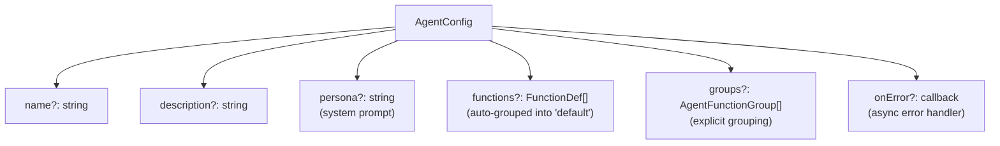

# AgentConfig

Agent 声明式配置：name / description / persona / functions / groups。宿主应用通过 `<rtc-agent>.agentConfig = {...}` 完成所有配置。

**所属 package**: `component`

## 关键代码文件

- [types/agent-config.ts](~/Workspaces/rtc-agent/web-components/packages/component/src/types/agent-config.ts) — `AgentConfig` / `AgentFunctionGroup` 接口
- [core/function-registry.ts](~/Workspaces/rtc-agent/web-components/packages/component/src/core/function-registry.ts) — `defineRegistry(config)` 消费 AgentConfig

## 配置接口

```typescript
interface AgentConfig {
  name?: string;              // Agent 名称（缺省使用 appLabel）
  description?: string;       // Agent 描述
  persona?: string;           // AI 人设（system prompt）
  functions?: FunctionDef[];  // 平铺函数列表（自动放入 'default' group）
  groups?: AgentFunctionGroup[]; // 分组的函数列表
  onError?: (error: Error, context: string) => void; // 异步操作错误回调
}

interface AgentFunctionGroup {
  name: string;               // 分组名称（如 'editor'、'file'）
  description?: string;       // 分组描述
  functions: FunctionDef[];   // 该分组下的函数列表
}
```

## 配置结构



## AgentConfig -> FunctionRegistry

```mermaid
flowchart TD
    AC["AgentConfig"] --> FR["defineRegistry(config)"]
    FR --> BSG["registerBuiltinSystemGroup()"]
    FR --> Proxy["createProxy()"]

    G["groups[]"] --> CG["createGroup(groupDef)"]
    CG --> Reg["group.register(funcDef)"]

    F["functions[]"] --> DirectReg["registry.register(funcDef)"]
    Note over DirectReg["Auto-placed into 'default' group"]
```

`groups` 在 `functions` 之前注册。两者可同时使用。

## 文档生成

AgentConfig 的 `name`、`description`、`persona` 被注入到 `/AGENT.md` 的头部：

```markdown
# AgentName

AgentDescription

## Persona
persona content...

## Functions
...

## Scenarios
...
```

## 使用示例

```typescript
const agent = document.querySelector<RtcAgent>('#agent')!;
agent.agentConfig = {
  name: 'MermaidEditor',
  persona: 'You are a helpful Mermaid diagram assistant...',
  groups: [{
    name: 'editor',
    description: 'Editor operations',
    functions: [
      { name: 'getCode', description: 'Get current code', handler: () => editorAPI.getCode() },
    ],
  }],
};
```

## 关键注释摘录

> **声明式 API 设计** — [types/agent-config.ts:1-23](~/Workspaces/rtc-agent/web-components/packages/component/src/types/agent-config.ts#L1-L23)
>
> ```text
> 用于 <rtc-agent> 组件的声明式配置 API。
> 宿主应用通过设置 element.agentConfig = {...} 完成所有配置，
> 无需了解内部的 FunctionRegistry / FunctionGroup / toolRegistry 等概念。
> ```

## 跨维度关联

- [[FunctionRegistry]] — AgentConfig 的 functions/groups 在此注册
- [[RtcAgentConfig]] — AgentConfig 是 RtcAgentConfig 的子配置
- [[VirtualFS]] — 生成的 AGENT.md 写入 VirtualFS
- [[ToolRegistry]] — FunctionRegistry 桥接到 ToolRegistry
- [[BuiltinSystemGroup]] — 内置系统函数组（如 system.delay）在 AgentConfig 之前注册
