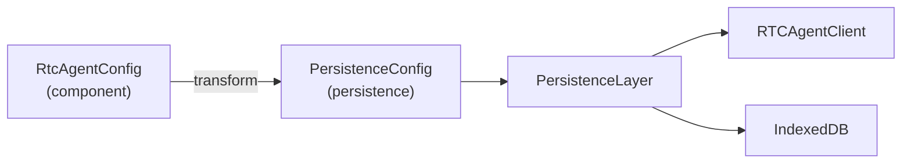

# PersistenceConfig

持久化层配置：PersistenceConfig。

**所属 package**: `persistence`

## 关键代码文件

- [index.ts:29-36](~/Workspaces/rtc-agent/web-components/packages/persistence/src/index.ts#L29-L36) — `PersistenceConfig` 接口

## 配置结构

```typescript
interface PersistenceConfig {
  client: RTCAgentClientOptions;  // RTCAgentClient 配置
  databaseName?: string;          // 数据库名（默认 'rtc-agent'）
  deviceId: string;               // 设备 ID（RTC 执行时过滤）
}
```

## 数据流



`WorkerBridge` 或 `PersistenceController` 负责将 `RtcAgentConfig` 转换为 `PersistenceConfig`。

## deviceId 的作用

`deviceId` 用于 RTC 执行时的设备过滤：

> 多个 Tab 可能共享同一个 Worker，但每个 Tab 有不同的 deviceId。
> RTC 执行时只处理 `session_device_id === deviceId` 的记录，避免多设备重复执行。

## 跨维度关联

- [[RtcAgentConfig]] — 上游配置
- [[Database]] — databaseName 控制数据库实例
- [[Connection]] — client 配置包含 WebSocket endpoint
