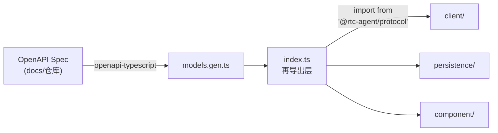
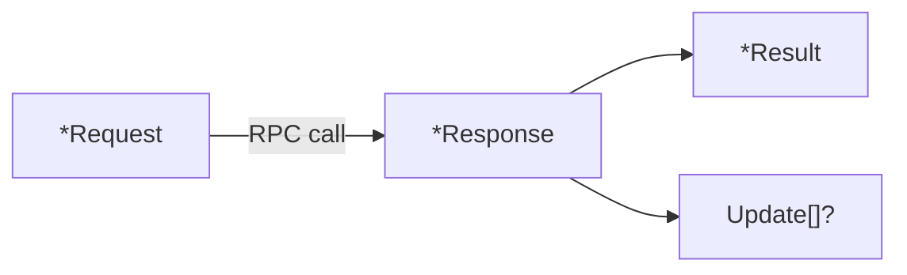

# ProtocolTypes

OpenAPI 生成的共享类型定义：域模型、RPC 方法、枚举、请求/响应结构。

**所属 package**: `protocol`

## 关键代码文件

- [protocol/index.ts](~/Workspaces/rtc-agent/web-components/packages/protocol/index.ts) — 类型再导出 + RPC 方法常量 + 错误码
- [protocol/models.gen.ts](~/Workspaces/rtc-agent/web-components/packages/protocol/models.gen.ts) — openapi-typescript 自动生成的 OpenAPI 规范类型

## 生成机制



`models.gen.ts` 由 `openapi-typescript` 从 OpenAPI 3.1 规范自动生成，禁止手动修改。`index.ts` 将 `components.schemas` 下的嵌套类型再导出为扁平名称，保持导入兼容性。

## 域模型

| 类型 | 描述 | 关键字段 |
|------|------|----------|
| `Session` | 会话 | `client_id`, `server_id`, `title`, `status`, `agent_prompt` |
| `Message` | 消息 | `client_id`, `session_client_id`, `role`, `content`, `streaming_status` |
| `Turn` | 对话轮次 | `client_id`, `session_client_id`, `status` |
| `Rtc` | 工具调用 | `client_id`, `session_client_id`, `tool_name`, `status`, `result` |
| `ContentData` | 消息内容 | `type` (text/image/file/tool_call/tool_result), `data` |
| `ToolCall` | 工具调用详情 | `tool_name`, `arguments`, `result`, `status` |
| `TodoItem` | 待办项 | — |
| `Update` | 变更集 | `items: UpdateItem[]`, `epoch` |
| `UpdateItem` | 单条变更 | `entity`, `action`, `data`, `offset` |

## 枚举类型

| 枚举 | 值 | 说明 |
|------|-----|------|
| `SessionStatus` | — | 会话状态 |
| `TurnStatus` | — | 轮次状态 |
| `MessageRole` | `user` / `assistant` / `system` | 消息角色 |
| `MessageStreamingStatus` | — | 流式状态 |
| `ContentType` | `text` / `image` / `file` / `tool_call` / `tool_result` | 内容类型 |
| `ErrorCategory` | — | 错误分类 |
| `RtcStatus` | — | 工具调用状态 |
| `UpdateEntity` | — | 变更实体类型 |
| `UpdateAction` | — | 变更动作 |

## RPC 方法常量

```typescript
// index.ts 中定义的 RpcMethod 命名空间对象
export const RpcMethod = {
    // Session
    SessionList: 'v1.session.list',
    SessionGet: 'v1.session.get',
    SessionClose: 'v1.session.close',
    SessionOpen: 'v1.session.open',
    SessionUpdate: 'v1.session.update',
    SessionFork: 'v1.session.fork',
    SessionCompact: 'v1.session.compact',
    // Message
    MessageSend: 'v1.message.send',
    MessageList: 'v1.message.list',
    MessageGet: 'v1.message.get',
    // Turn
    TurnList: 'v1.turn.list',
    TurnGet: 'v1.turn.get',
    TurnStop: 'v1.turn.stop',
    // RTC
    RtcList: 'v1.rtc.list',
    RtcGet: 'v1.rtc.get',
    RtcUpdateStatus: 'v1.rtc.update_status',
    RtcSubmitResult: 'v1.rtc.submit_result',
} as const;
```

## RPC 错误码

| Code | Name | 说明 |
|------|------|------|
| 100 | `InvalidRequest` | 请求参数无效 |
| 101 | `InternalError` | 服务器内部错误 |
| 200 | `ClientIdConflict` | client_id 已存在，幂等性冲突 |

## RPC 请求/响应结构

所有 RPC 操作遵循统一模式：



- **操作类**: `SendMessageRequest` -> `SendMessageResponse` = `{ result: SendMessageResult, updates?: Update[] }`
- **查询类**: `ListSessionsRequest` -> `ListSessionsResponse`（直接返回数据，无 updates）

### 操作类 RPC

| 方法 | Request | Result |
|------|---------|--------|
| `v1.message.send` | `SendMessageRequest` | `SendMessageResult` |
| `v1.session.close` | `CloseSessionRequest` | `CloseSessionResult` |
| `v1.session.open` | `OpenSessionRequest` | `OpenSessionResult` |
| `v1.session.update` | `UpdateSessionRequest` | `UpdateSessionResult` |
| `v1.session.fork` | `ForkSessionRequest` | `ForkSessionResult` |
| `v1.session.compact` | `CompactSessionRequest` | `CompactSessionResult` |
| `v1.turn.stop` | `StopTurnRequest` | `StopTurnResult` |
| `v1.rtc.update_status` | `UpdateRtcStatusRequest` | `UpdateRtcStatusResult` |
| `v1.rtc.submit_result` | `SubmitRtcResultRequest` | `SubmitRtcResultResult` |

### 查询类 RPC

| 方法 | Request | Response |
|------|---------|----------|
| `v1.session.list` | `ListSessionsRequest` | `ListSessionsResponse` |
| `v1.session.get` | `GetSessionRequest` | `GetSessionResponse` |
| `v1.message.list` | `MessageListRequest` | `MessageListResponse` |
| `v1.message.get` | `MessageGetRequest` | `MessageGetResponse` |
| `v1.turn.list` | `TurnListRequest` | `TurnListResponse` |
| `v1.turn.get` | `TurnGetRequest` | `TurnGetResponse` |
| `v1.rtc.list` | `RtcListRequest` | `RtcListResponse` |
| `v1.rtc.get` | `RtcGetRequest` | `RtcGetResponse` |

## OAuth2 类型

| 类型 | 说明 |
|------|------|
| `OAuth2AuthorizeResponse` | 授权重定向 URL + CSRF state |
| `OAuth2TokenExchangeRequest` | Authorization Code -> Token |
| `OAuth2TokenExchangeResponse` | access_token + refresh_token |
| `OAuth2TokenRefreshRequest` | refresh_token -> new access_token |
| `OAuth2TokenRefreshResponse` | 刷新后的 token |
| `OAuth2Error` | OAuth2 错误响应 |

## 关键注释摘录

> **扁平再导出** — [index.ts:9-10](~/Workspaces/rtc-agent/web-components/packages/protocol/index.ts#L9-L10)
>
> ```text
> 将 components.schemas 下的所有类型重新导出为扁平名称。
> 保持与旧版手写 TS 的导入兼容：import { Session } from '@rtc-agent/protocol'
> ```

> **幂等性冲突** — [index.ts:156](~/Workspaces/rtc-agent/web-components/packages/protocol/index.ts#L156)
>
> ```text
> client_id 已存在，请求被拒绝
> ```
> 使用客户端生成的 `client_id` 实现幂等性，服务器拒绝重复的 `client_id`。

## 跨维度关联

- [[Connection]] — `RTCAgentClient` 使用 RPC 方法与服务器通信
- [[OAuth2]] — OAuth2 类型定义认证流程
- [[Publication]] — `Update` / `UpdateItem` 是 Publication 事件的载荷
- [[ComponentEvents]] — 域模型类型被组件层消费
- [[EntityRepository]] — 域模型持久化到 IndexedDB
