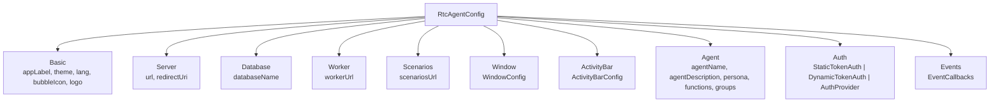

# RtcAgentConfig

createRtcAgent 工厂的配置类型：RtcAgentConfig 全字段解析。

**所属 package**: `component`

## 关键代码文件

- [types/factory.ts:365-611](~/Workspaces/rtc-agent/web-components/packages/component/src/types/factory.ts#L365-L611) — `RtcAgentConfig` 接口
- [types/window-config.ts](~/Workspaces/rtc-agent/web-components/packages/component/src/types/window-config.ts) — `WindowConfig` 接口
- [types/activity-bar-config.ts](~/Workspaces/rtc-agent/web-components/packages/component/src/types/activity-bar-config.ts) — `ActivityBarConfig` 接口
- [types/agent-config.ts](~/Workspaces/rtc-agent/web-components/packages/component/src/types/agent-config.ts) — `AgentConfig` 接口

## 配置分组

## 必填与可选

| Field | Required | Default | Description |
|-------|----------|---------|-------------|
| `server.url` | Yes | — | 后端服务器 URL |
| `server.redirectUri` | No | — | OAuth 回调地址 |
| `appLabel` | No | `'RTC Agent'` | 标题栏标签 |
| `theme` | No | `'system'` | `'light' \| 'dark' \| 'system'` |
| `lang` | No | `'zh-CN'` | BCP 47 语言标签 |
| `databaseName` | No | `'rtc-agent'` | IndexedDB 名称前缀 |
| `workerUrl` | No | auto-detect | SharedWorker 脚本 URL |
| `auth` | No | — | 认证配置（不提供则使用内部 OAuth） |

## 跨维度关联

- [[Factory]] — 配置的消费者
- [[AgentConfig]] — Agent 行为配置详解
- [[WindowConfig]] — 窗口配置详解
- [[ActivityBarConfig]] — 活动栏配置详解
- [[OAuth2]] — 认证流程
