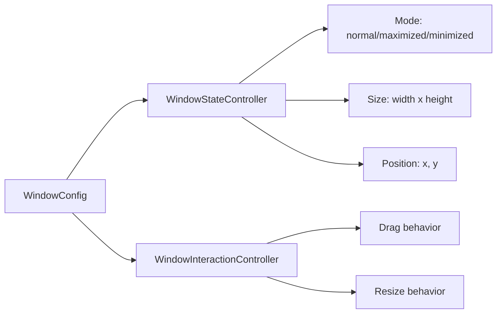

# WindowConfig

窗口布局配置：mode / size / position / embedded / bubble。

**所属 package**: `component`

## 关键代码文件

- [types/window-config.ts](~/Workspaces/rtc-agent/web-components/packages/component/src/types/window-config.ts) — `WindowConfig` 接口

## 配置项

| Field | Type | Default | Description |
|-------|------|---------|-------------|
| `defaultMode` | `'normal' \| 'maximized' \| 'minimized'` | `'normal'` | 初始窗口模式 |
| `embedded` | `boolean` | `false` | 嵌入模式（无窗口边框） |
| `width` | `number` | — | 初始宽度 |
| `height` | `number` | — | 初始高度 |
| `x` | `number` | — | 初始 X 位置 |
| `y` | `number` | — | 初始 Y 位置 |
| `draggable` | `boolean` | `true` | 是否可拖拽 |
| `resizable` | `boolean` | `true` | 是否可调整大小 |
| `bubblePlacement` | `'bottom-right' \| 'bottom-left' \| 'top-right' \| 'top-left'` | `'bottom-right'` | 气泡位置 |

## 消费者

`WindowStateController` 和 `WindowInteractionController` 读取此配置：

## 跨维度关联

- [[RtcAgentConfig]] — WindowConfig 是 RtcAgentConfig 的子配置
- [[Factory]] — 通过 `config.window` 传入
