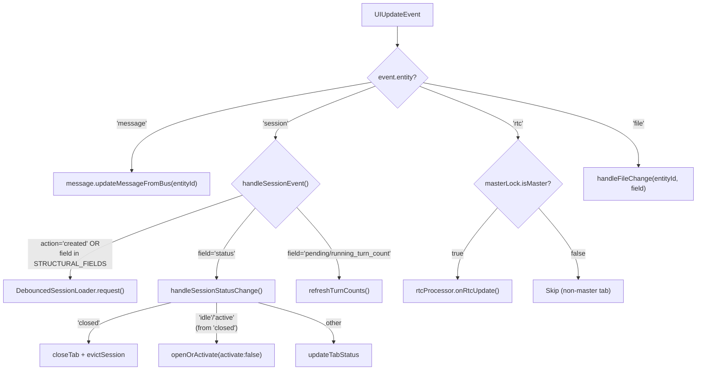
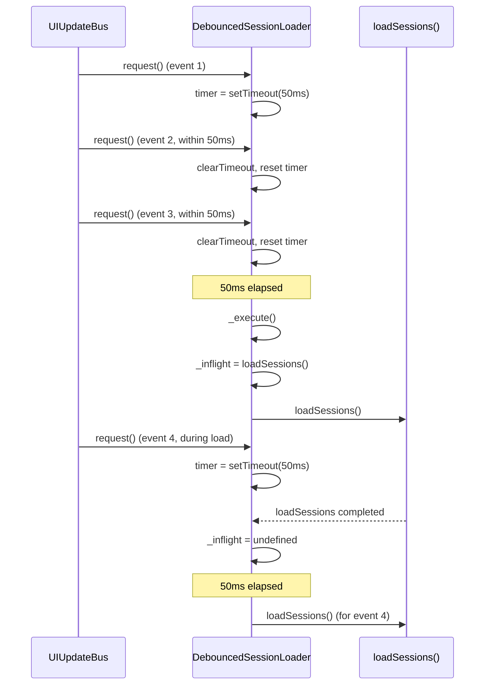
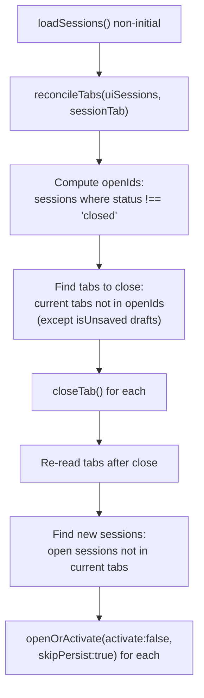
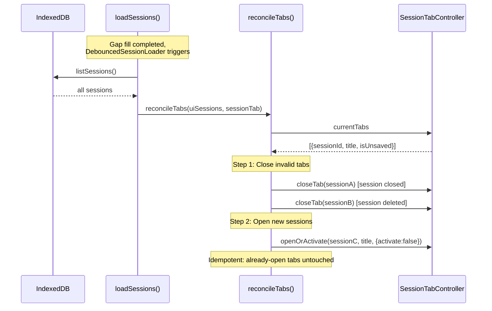

# BusHandler

UIUpdateBus 事件在 component 包中的路由分发逻辑。将持久化层的实体变更事件映射到对应的 Controller 操作。

**所属 package**: `component`

## 关键代码文件

- [components/rtc-agent/helpers/bus-handler.ts](~/Workspaces/rtc-agent/web-components/packages/component/src/components/rtc-agent/helpers/bus-handler.ts) — `handleBusEvent()` 主路由函数 + `DebouncedSessionLoader`
- [components/rtc-agent/helpers/session-loader.ts](~/Workspaces/rtc-agent/web-components/packages/component/src/components/rtc-agent/helpers/session-loader.ts) — `loadSessions()` 会话加载与 Tab 对账
- [components/rtc-agent/helpers/vfs-operations.ts](~/Workspaces/rtc-agent/web-components/packages/component/src/components/rtc-agent/helpers/vfs-operations.ts) — `handleFileChange()` 跨 Tab 文件变更处理

## 事件路由



## Session 字段分类

`SESSION_STRUCTURAL_FIELDS` 定义了需要全量重载 Session 列表的字段：

| Structural Fields (触发全量重载) | Lightweight Fields (专用处理) |
| -------------------------------- | ------------------------------ |
| `title` | `pending_turn_count` |
| `status` | `running_turn_count` |
| `deleted_at` | |
| `root_client_session_id` | |
| `created_at` | |
| `updated_at` | |

Structural change = `action === 'created'` OR `!event.field` OR `field in SESSION_STRUCTURAL_FIELDS`。

## DebouncedSessionLoader

防止批量事件触发多次 `loadSessions` 调用：



关键设计：
- **Debounce**: 50ms 内的多次 request 合并为一次 load
- **Serialize**: 如果 load 正在进行中，新的 request 等待当前 load 完成后再执行
- **Dispose**: 组件销毁时清理 pending timer

## Session 状态变更处理

`handleSessionStatusChange()` 处理三种场景：

| 旧状态 | 新状态 | 操作 |
| -------- | -------- | ------ |
| any | `closed` | `closeTab(sessionId)` + `message.evictSession(sessionId)` (Fix 45: 释放消息缓存防内存泄漏) |
| `closed` | `idle` / `active` | `openOrActivate(sessionId, title, {activate: false})` (创建 Tab 但不激活) |
| other | other | `updateTabStatus(sessionId, newStatus)` (仅更新状态点) |

`evictSession()` 调用 `MessageController` 清除该 session 的消息缓存（`_messages` Map 中的条目），避免已关闭 session 的消息数据常驻内存。

## 跨 Tab 文件变更处理

`handleFileChange()` 响应来自其他 Tab 的 VFS 变更：

| field | 操作 |
| ------- | ------ |
| `batch` | 全量重载文件树 |
| `write` / `create` | 刷新父目录；如果文件已打开且未修改，静默重载内容 |
| `delete` | 刷新父目录；如果文件已打开，关闭 Tab |

`write` 时如果文件 `isDirty`（用户有未保存修改），不覆盖内容，而是显示 Toast 提示。

## Master Tab 门控

RTC 更新仅由 Master Tab 处理：

```typescript
if (event.entity === 'rtc') {
    if (persistence.masterLock?.isMaster === false) {
        return;  // Skip non-master tabs
    }
    getRtcProcessor()?.onRtcUpdate();
}
```

这确保多个 Tab 同时打开时，只有一个 Tab 执行 RTC 工具调用（避免重复执行）。

## Tab 对账（reconcileTabs）

Gap fill / BulkUpdate 后，DB 中的 session 列表可能已变化（其他 Tab/Client 创建、关闭或删除了 session）。`loadSessions()` 在非首次加载时调用 `reconcileTabs()` 增量修补 Tab 栏。

[session-loader.ts:279-320](~/Workspaces/rtc-agent/web-components/packages/component/src/components/rtc-agent/helpers/session-loader.ts#L279-L320)



### 与首次加载恢复的区别

| 方面 | restoreTabsFromDB（首次加载） | reconcileTabs（后续对账） |
| ---- | ----------------------------- | ------------------------- |
| 触发时机 | `initialLoadDone === false` | `initialLoadDone === true` |
| 策略 | 全量恢复，按 `updatedAt` 排序 | 增量修补，保留用户已有 Tab 顺序 |
| 激活行为 | 恢复 `storedActiveId` 对应的 Tab | 新 Tab 不激活（不打扰用户） |
| 持久化 | `skipPersist: true`（批量避免 N 次写） | `skipPersist: true`（增量无需持久化） |
| 幂等性 | 多次调用安全 | 多次调用无副作用 |

### 对账规则

1. **关闭无效 Tab** — session 已 `closed` 或已从 DB 删除 → `closeTab(sessionId)`。但 `isUnsaved === true` 的草稿 Tab 保留（用户可能有未保存内容）
2. **新增 Tab** — 新出现的 open session → `openOrActivate(sessionId, title, {activate: false})`。不激活，不打扰用户当前操作
3. **保留顺序** — 已有 Tab 的顺序和激活状态不变



## 关键注释摘录

> **Module-level constants** — [bus-handler.ts:8](~/Workspaces/rtc-agent/web-components/packages/component/src/components/rtc-agent/helpers/bus-handler.ts#L8)
> _Module-level constants (like SESSION_STRUCTURAL_FIELDS) are defined here to avoid recreation on every callback invocation (performance optimization)._

> **Message queue ordering** — [bus-handler.ts:180](~/Workspaces/rtc-agent/web-components/packages/component/src/components/rtc-agent/helpers/bus-handler.ts#L180)
> _Return the Promise so UIUpdateBus can queue events for the same messageId, preventing race conditions where stale DB reads overwrite newer state (e.g., streaming content or sync_status)._

> **Debounced session loader** — [bus-handler.ts:57](~/Workspaces/rtc-agent/web-components/packages/component/src/components/rtc-agent/helpers/bus-handler.ts#L57)
> _Fix 40: Prevents IndexedDB query storms and UI jitter from rapid session events._

> **Tab 对账幂等性** — [session-loader.ts:277-278](~/Workspaces/rtc-agent/web-components/packages/component/src/components/rtc-agent/helpers/session-loader.ts#L277-L278)
> _幂等安全：多次调用无副作用，已存在的 tab 不会被重复打开或重排。_

## 跨维度关联

- [[UIUpdateBus]] — 事件源：持久化层发出的 UIUpdateEvent
- [[UIUpdate]] — UIUpdateBus 的队列化与 suspend/resume 机制
- [[MasterLock]] — Master Tab 门控 RTC 处理
- [[ConnectionState]] — 连接状态变更也通过 UIUpdateBus 传播
- [[ControllerPattern]] — SessionController / MessageController 等 Controller 详解
- [[RtcProcessor]] — RTC 事件的处理方
- [[SessionManagement]] — reconcileTabs 与 Session Tab 管理
- [[Publication]] — Gap fill 后触发 loadSessions → reconcileTabs
