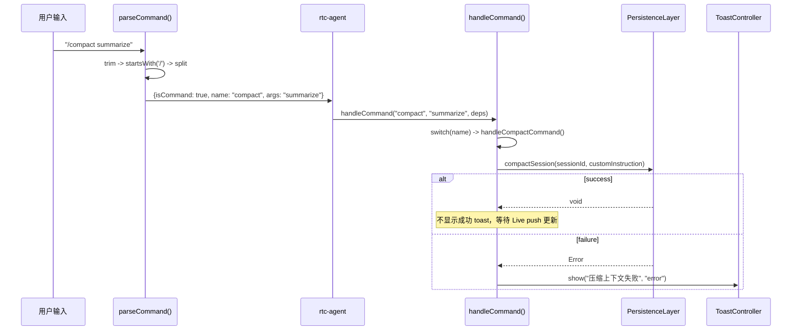

# CommandPipeline

Slash 命令管线：用户输入解析 -> 命令分发 -> 执行。

**所属 package**: `component`

## 关键代码文件

- [command-parser.ts](~/Workspaces/rtc-agent/web-components/packages/component/src/utils/command-parser.ts) — 用户输入解析器：`/name [args]` -> `ParsedCommand`
- [command-handler.ts](~/Workspaces/rtc-agent/web-components/packages/component/src/components/rtc-agent/helpers/command-handler.ts) — 命令分发器：依赖注入 + switch dispatch
- [rtc-agent.ts](~/Workspaces/rtc-agent/web-components/packages/component/src/components/rtc-agent/rtc-agent.ts) — 根组件：调用 `parseCommand()` 判断后分发到 `handleCommand()`

## 数据流



## 解析规则

| 输入 | isCommand | name | args |
| ---- | --------- | ---- | ---- |
| `"/compact"` | `true` | `"compact"` | `undefined` |
| `"/compact summarize"` | `true` | `"compact"` | `"summarize"` |
| `"/compact 请总结对话"` | `true` | `"compact"` | `"请总结对话"` |
| `"hello world"` | `false` | - | - |
| `"/"` | `false` | - | - |
| `"/ "` | `false` | - | - |

命令名规则：`/` 后至少一个非空白字符，到第一个空格为止为命令名。命令名统一 `toLowerCase()`。

## 当前支持的命令

| 命令 | 功能 | 实现位置 |
| ---- | ---- | -------- |
| `/compact [instruction]` | 压缩当前会话上下文 | [command-handler.ts:51-77](~/Workspaces/rtc-agent/web-components/packages/component/src/components/rtc-agent/helpers/command-handler.ts#L51-L77) |

## 依赖注入

`handleCommand()` 通过 `CommandDeps` 接口接收依赖，不直接引用组件状态：

```typescript
interface CommandDeps {
    persistenceLayer: PersistenceLayer | undefined;
    currentSessionId: string | null;
    toast: ToastActions;
    logger: Logger;
}
```

这种设计使命令处理逻辑可测试、可独立演进。

## 关键注释摘录

> **提取动机** — [command-handler.ts:1-5](~/Workspaces/rtc-agent/web-components/packages/component/src/components/rtc-agent/helpers/command-handler.ts#L1-L5)
>
> ```text
> Slash command dispatch for <rtc-agent>.
> Extracted from rtc-agent.ts to keep the root component lean.
> Each command is a pure async function that takes its dependencies explicitly.
> ```

## 跨维度关联

- [[ComponentEvents]] — 命令执行结果通过 Toast/DOM 事件反馈给用户
- [[PersistenceLayer]] — `/compact` 调用 `persistenceLayer.compactSession()`
- [[DialogState]] — 命令可能触发对话框（未来扩展）
