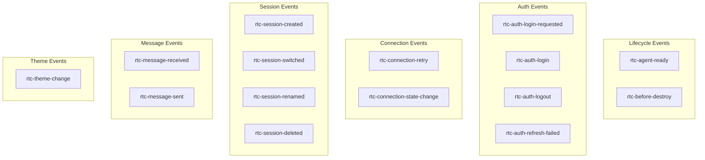
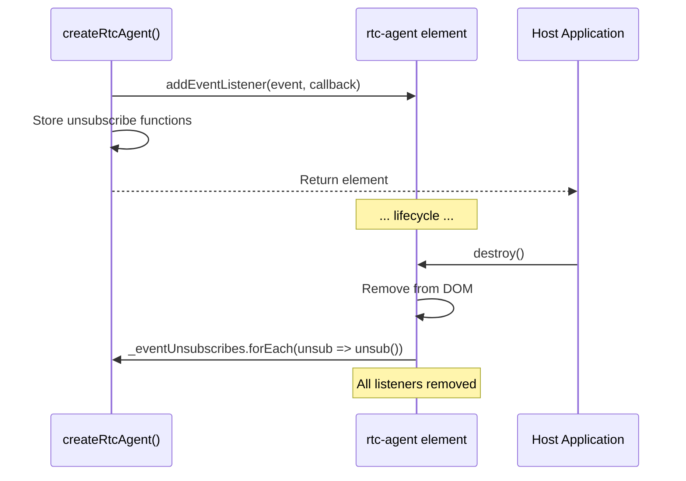
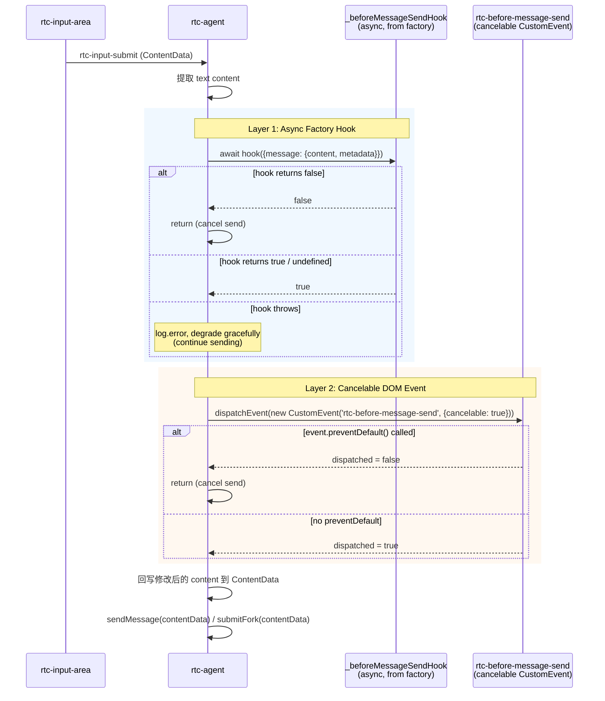

# ComponentEvents

组件 DOM CustomEvent：rtc-agent-ready、rtc-session-* 等。

**所属 package**: `component`

## 关键代码文件

- [factory.ts:202-236](~/Workspaces/rtc-agent/web-components/packages/component/src/factory.ts#L202-L236) — 事件注册与回调映射
- [types/factory.ts:149-318](~/Workspaces/rtc-agent/web-components/packages/component/src/types/factory.ts#L149-L318) — `EventCallbacks` 类型定义

## 事件清单



## 事件-回调映射

| DOM Event | EventCallbacks Field | Payload |
| ----------- | --------------------- | --------- |
| `rtc-agent-ready` | `ready` | — |
| `rtc-before-destroy` | `beforeDestroy` | — |
| `rtc-auth-login-requested` | `authLoginRequested` | — |
| `rtc-auth-login` | `authLogin` | `{userId}` |
| `rtc-auth-logout` | `authLogout` | — |
| `rtc-auth-refresh-failed` | `authError` | — |
| `rtc-connection-retry` | `connectionRetry` | — |
| `rtc-connection-state-change` | `connectionStateChange` | `{state}` |
| `rtc-session-created` | `sessionCreated` | `{session}` |
| `rtc-session-switched` | `sessionSwitched` | `{id}` |
| `rtc-session-renamed` | `sessionRenamed` | `{id, title}` |
| `rtc-session-deleted` | `sessionDeleted` | `{id}` |
| `rtc-message-received` | `messageReceived` | `{message}` |
| `rtc-message-sent` | `messageSent` | `{message}` |
| `rtc-theme-change` | `themeChange` | `{theme}` |

## 注册与清理



## beforeMessageSend 两层拦截架构

消息发送前拦截采用两层设计：先异步 Hook，后同步 DOM 事件。



### Layer 1: 异步工厂 Hook

```typescript
// Set by createRtcAgent() factory:
element._beforeMessageSendHook = config.on.beforeMessageSend;
```

- 类型：`(detail) => boolean | Promise<boolean>`
- 支持异步（返回 Promise），适合需要网络请求的拦截场景（如内容审核）
- 可就地修改 `detail.message.content` 和 `detail.message.metadata`
- 返回 `false` 取消发送；抛出异常时降级继续发送（不阻断用户操作）
- **短路优化**：未注册 hook 时跳过 `await`，避免每次消息发送都创建 Promise（[rtc-agent.ts:1812-1813](~/Workspaces/rtc-agent/web-components/packages/component/src/components/rtc-agent/rtc-agent.ts#L1812-L1813)）

### Layer 2: 同步可取消 DOM 事件

```typescript
const event = new CustomEvent('rtc-before-message-send', {
    detail: messageDetail,
    bubbles: true,
    composed: true,
    cancelable: true,  // 关键：允许 preventDefault() 取消
});
const dispatched = this.dispatchEvent(event);
if (!dispatched) return false;  // cancel
```

- 类型：`CustomEvent<{message: {content: string; metadata?: Record<string, unknown>}}>`
- 同步执行，支持 `preventDefault()` 取消
- 通过 `HTMLElementEventMap` 全局扩展提供类型安全（[types/events.ts:40](~/Workspaces/rtc-agent/web-components/packages/component/src/types/events.ts#L40)）
- 适合宿主应用的全局拦截（无需修改 factory 配置）

### 两层设计的分工

| 维度     | Layer 1 (Hook)                                           | Layer 2 (DOM Event)                                  |
| -------- | -------------------------------------------------------- | ---------------------------------------------------- |
| 设置方式 | `createRtcAgent({on:{beforeMessageSend}})`               | `addEventListener('rtc-before-message-send', ...)`   |
| 异步支持 | 支持（Promise）                                          | 不支持（同步 `preventDefault()`）                    |
| 内容修改 | 可修改 `detail.message.content`                          | 可修改 `detail.message.content`                      |
| 适用场景 | 应用级拦截（内容审核、格式转换）                         | 全局监听（日志、分析）                               |
| 错误处理 | 异常降级（继续发送）                                     | 无异常风险                                           |

## 性能说明

> **~15 个事件直接 addEventListener** — [factory.ts:197-200](~/Workspaces/rtc-agent/web-components/packages/component/src/factory.ts#L197-L200)
>
> ```text
> Perf note: For the current ~15 events, direct addEventListener registration
> is optimal. Event delegation (single listener + bubbling dispatch) would add
> complexity without measurable benefit at this scale.
> ```

## 跨维度关联

- [[Factory]] — 事件回调在工厂函数中注册
- [[EventBus]] — 部分 DOM 事件由 EventBus 事件桥接而来
- [[AuthController]] — 触发 auth 相关事件
- [[ConnectionState]] — `rtc-connection-state-change` 事件的 payload 来源
- [[Ready]] — `rtc-agent-ready` 事件的触发时机
