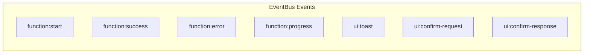
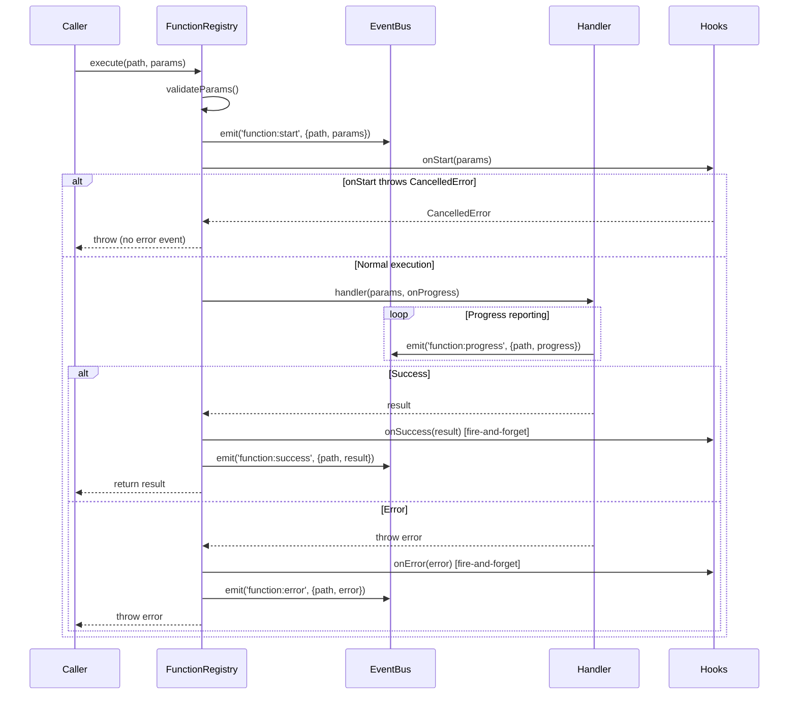

# EventBus

FunctionRegistry 事件总线：function:start/success/error/progress。

**所属 package**: `component`

## 关键代码文件

- [event-bus.ts](~/Workspaces/rtc-agent/web-components/packages/component/src/core/event-bus.ts) — `EventBus` 类 + `FunctionRegistryEventMap`
- [function-registry.ts:341-423](~/Workspaces/rtc-agent/web-components/packages/component/src/core/function-registry.ts#L341-L423) — `FunctionRegistry.execute()` 中的事件发出

## 事件类型



| Event | Payload | Emitter | Consumer |
|-------|---------|---------|----------|
| `function:start` | `{path, params}` | `FunctionRegistry.execute()` | UI toast, host app callbacks |
| `function:success` | `{path, result}` | `FunctionRegistry.execute()` | UI refresh, host app callbacks |
| `function:error` | `{path, error}` | `FunctionRegistry.execute()` | UI error display, host app callbacks |
| `function:progress` | `{path, progress}` | Handler via `onProgress` callback | Progress bar UI |
| `ui:toast` | `{message, type}` | UI hooks | Toast notification |
| `ui:confirm-request` | `{requestId, path, message}` | Confirm dialog hook | Confirm dialog UI |
| `ui:confirm-response` | `{requestId, confirmed}` | Confirm dialog UI | FunctionRegistry |

## 执行生命周期



## 快照迭代保护

> **M8: 快照防并发修改** — [event-bus.ts:99-101](~/Workspaces/rtc-agent/web-components/packages/component/src/core/event-bus.ts#L99-L101)
>
> ```typescript
> // M8: 快照，防止迭代过程中 Set 被修改
> const snapshot = Array.from(handlers);
> ```

handler 内调用 `off()` 不会导致迭代器失效。

## EventBus vs DOM Events

| 特性 | EventBus | DOM CustomEvent |
| ------ | ---------- | ----------------- |
| 作用域 | 组件内部（跨 Controller） | 组件外部（宿主应用） |
| 性能 | 同步分发，零 DOM 开销 | 涉及事件冒泡/捕获 |
| 类型安全 | 泛型事件映射 | `CustomEvent<T>` |
| 跨线程 | 不支持 | 不支持 |

## Factory 桥接

`createRtcAgent()` 工厂函数将 EventBus 事件桥接到外部回调：

```typescript
// factory.ts
eventBus.on('function:start', (detail) => {
    callbacks.toolCallStart?.({ path: detail.path, params: detail.params });
});
```

## 跨维度关联

- [[FunctionRegistry]] — EventBus 的事件源
- [[Factory]] — 工厂函数桥接 EventBus 到外部回调
- [[ComponentEvents]] — EventBus 事件可桥接为 DOM CustomEvent
