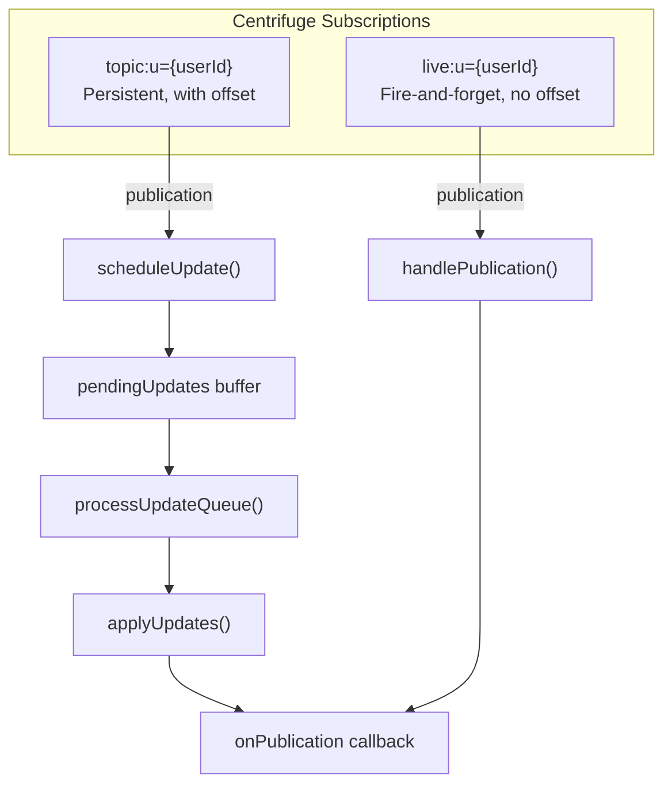
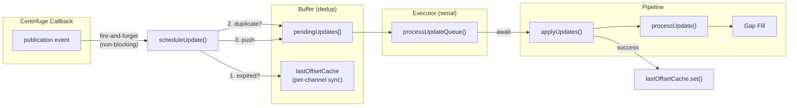
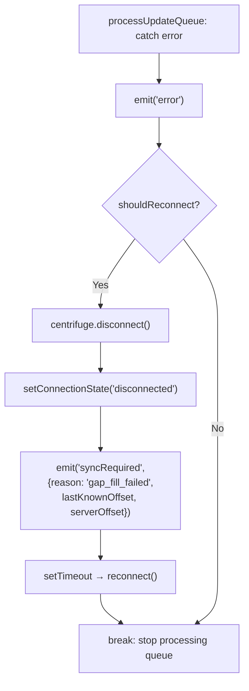
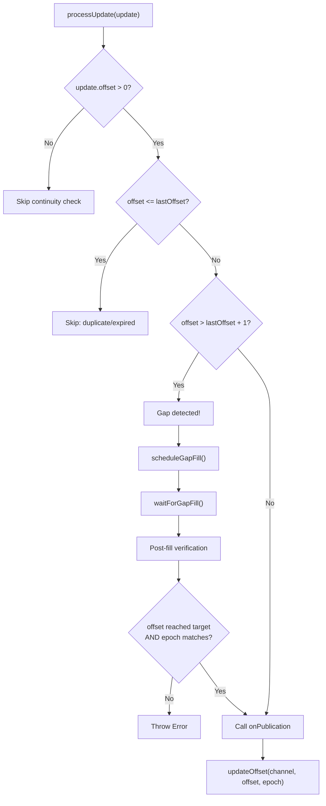
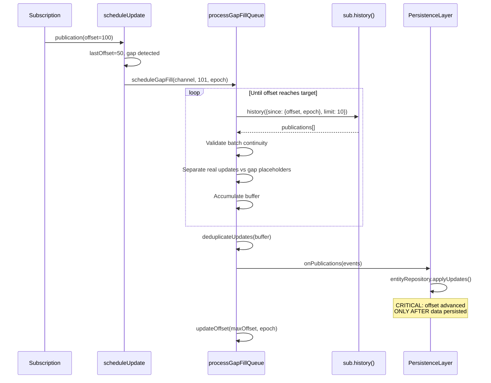
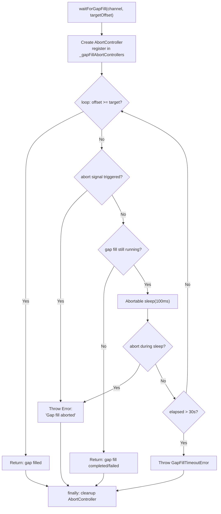
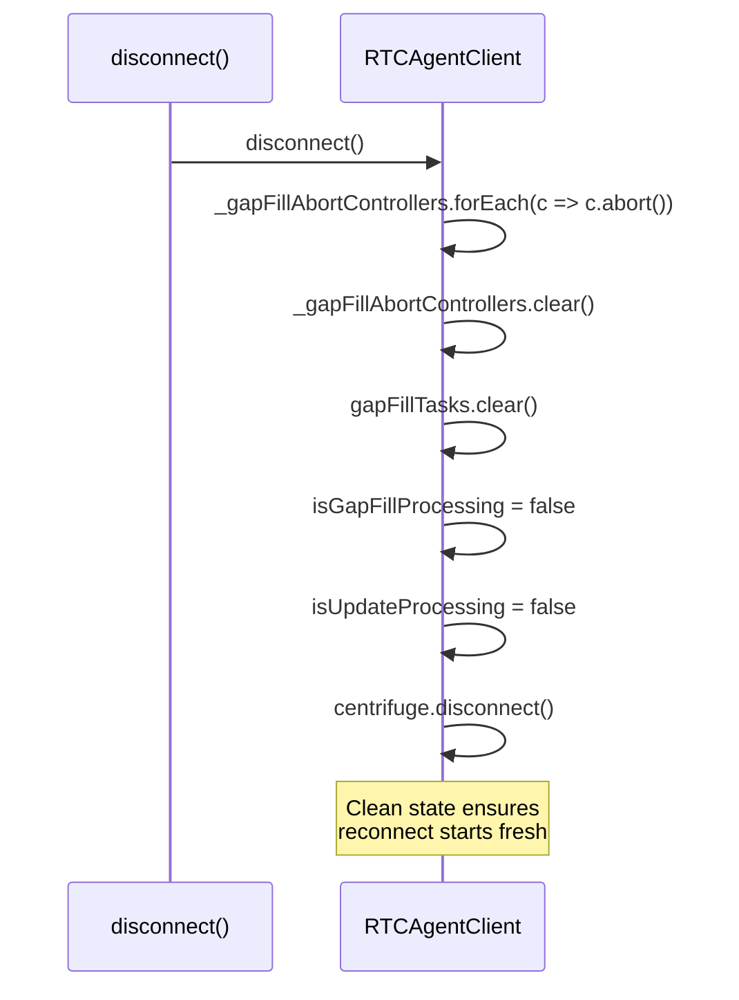

# Publication

Centrifuge Publication 事件处理：topic/live 双通道、gap fill、offset 连续性。

**所属 package**: `client`

## 关键代码文件

- [client.ts:1076-1164](~/Workspaces/rtc-agent/web-components/packages/client/src/client.ts#L1076-L1164) — `subscribeChannels()` 订阅逻辑
- [client.ts:570-640](~/Workspaces/rtc-agent/web-components/packages/client/src/client.ts#L570-L640) — `scheduleUpdate()` / `processUpdateQueue()` 调度器
- [client.ts:487-560](~/Workspaces/rtc-agent/web-components/packages/client/src/client.ts#L487-L560) — `waitForGapFill()` AbortController 机制
- [client.ts:680-950](~/Workspaces/rtc-agent/web-components/packages/client/src/client.ts#L680-L950) — Gap Fill 机制（`processGapFillQueue()` / `flushGapFillBuffer()`）

## 双通道订阅



| Channel            | Recovery                   | Offset          | 用途                                     |
| ------------------ | -------------------------- | --------------- | ---------------------------------------- |
| `topic:u={userId}` | Yes (Centrifuge 自动恢复)  | 严格 +1 连续性  | 实体变更同步（session/message/rtc）      |
| `live:u={userId}`  | No                         | 无 offset       | 流式消息推送（streaming chunks）         |

## Update Scheduler 架构



> **为什么需要调度器** — [client.ts:558-569](~/Workspaces/rtc-agent/web-components/packages/client/src/client.ts#L558-L569)
> _Centrifuge dispatches publication callbacks serially per subscription — if the callback awaits slow work (gap fill polling, IndexedDB, user's onPublication), new messages queue up behind it and Centrifuge's internal ping/pong can timeout._

### scheduleUpdate 去重策略

`scheduleUpdate()` 在将 update 推入 `pendingUpdates` 缓冲区前进行两级去重，**全程同步**（不 await IndexedDB）：

1. **过期检查** — `lastOffsetCache.get(channel)` 对比 `update.offset`。offset <= lastOffset → 跳过
2. **队列去重** — `pendingUpdates.some(u => u.offset === update.offset)` → 跳过

`lastOffsetCache` 在 `processUpdateQueue()` 成功处理一条 update 后同步更新，确保后续入队可以正确判断过期。

### processUpdateQueue 串行执行

```typescript
// Executor: drain pendingUpdates serially.
// Each update goes through applyUpdates (which provides its own Promise-chain
// serialisation and integrates with gap fill / external RPC callers).
// The two-level serialisation (buffer loop + applyUpdates Promise chain) is
// intentional — the buffer deduplicates and decouples from Centrifuge,
// applyUpdates coordinates with external callers and gap fill.
```

— [client.ts:594-602](~/Workspaces/rtc-agent/web-components/packages/client/src/client.ts#L594-L602)

严重错误（如 gap fill 失败）→ 停止处理剩余队列 → 触发 reconnect + 发出 `syncRequired` 事件：



`syncRequired` 事件通知上层（WorkerCore → 主线程）数据可能出现不一致，需要进行全量同步恢复。

## Offset 连续性保证



## Gap Fill 流程



### flushGapFillBuffer: Offset 延迟推进

```mermaid
flowchart TD
    A["flushGapFillBuffer()"] --> B{"buffer.length > 0?"}
    B -->|Yes| C["deduplicateUpdates(buffer)"]
    C --> D["suspendUIUpdates()"]
    D --> E["onPublications(events)"]
    E --> F["entityRepository.applyUpdates()"]
    F -->|"SUCCESS"| G["updateOffset(max(allOffsets), epoch)"]
    F -->|"FAIL"| H["DO NOT advance offset"]
    H --> I["Data remains fetchable on reconnect"]
    G --> J["resumeUIUpdates()"]
    H --> J

    B -->|"No (gap placeholders only)"| K["updateOffset(maxGapOffset, epoch)"]
    Note over K: Safe: no real data to persist
```

> **关键修复** — [client.ts:895-898](~/Workspaces/rtc-agent/web-components/packages/client/src/client.ts#L895-L898)
> _CRITICAL: Offset is only advanced AFTER all data is successfully persisted. This prevents data loss if applyUpdates fails — the offset stays behind, allowing retry to re-fetch the missing data._

修复前，offset 在 `applyUpdates` 之前推进，如果持久化失败，offset 已经前进，导致数据永久丢失。修复后，offset 仅在持久化成功后一次性推进到 `max(gapOffsets, buffer offsets)`。

## Gap Fill 健壮性

### waitForGapFill 改进

`waitForGapFill()` 使用 AbortController + 显式异常替代静默超时：



关键设计：

| 改进 | 修复前 | 修复后 |
|------|--------|--------|
| 超时处理 | 静默 `log.warn` + return | 抛出 `GapFillTimeoutError`，触发 reconnect |
| 取消支持 | 无 | AbortController 允许 disconnect 中断等待 |
| 断开清理 | gap fill 状态残留 | `disconnect()` 清除所有 abort controllers + gap fill tasks + processing flags |

### disconnect 时的 Gap Fill 清理



### GapFillTimeoutError

```typescript
// client.ts:37-49
export class GapFillTimeoutError extends Error {
  constructor(
    readonly channel: string,
    readonly targetOffset: number,
    readonly elapsedMs: number
  ) {
    super(`Gap fill timeout after ${elapsedMs}ms: channel=${channel}, target=${targetOffset}`);
    this.name = 'GapFillTimeoutError';
  }
}
```

显式错误类型允许上层区分超时与其他错误，决定是否触发 reconnect。

## 关键参数

| Parameter | Value | Purpose |
| ----------- | ------- | --------- |
| `BATCH_SIZE` | 10 | 每次 RPC 拉取数量 |
| `ACCUMULATE_THRESHOLD` | 10,000 | 累积到此数量后去重 |
| `SUSPEND_THRESHOLD` | 100 | Gap > 100 时暂停 UI 更新 |
| `MAX_WAIT_MS` | 30,000 | Gap fill 等待超时 |
| `POLL_INTERVAL_MS` | 100 | Gap fill 轮询间隔 |

## 关键注释摘录

> **Offset 连续性** — [client.ts:421-428](~/Workspaces/rtc-agent/web-components/packages/client/src/client.ts#L421-L428)
> _Skip duplicate/expired messages: if offset <= lastOffset, this message was already processed. Prevents offset rollback and duplicate onPublication calls._

<!-- separator -->

> **Epoch 验证** — [client.ts:453-459](~/Workspaces/rtc-agent/web-components/packages/client/src/client.ts#L453-L459)
> _Epoch changed (possible server restart) — reject to prevent data corruption._

## 跨维度关联

- [[Connection]] — 连接建立后触发 subscribeChannels()
- [[Offset]] — offset 持久化到 IndexedDB
- [[ProtocolTypes]] — `Update` / `UpdateItem` 类型定义来源于 protocol 包
- [[UIUpdateBus]] — onPublication 处理后触发 UIUpdateBus.publish()
- [[UIUpdate]] — suspend/resume 在 gap fill 期间控制 UI 更新频率
- [[StreamingEvents]] — live 通道的流式消息推送机制
- [[ConcurrencyPatterns]] — Gap Fill AbortController + Promise.race 超时 + Offset 延迟推进
