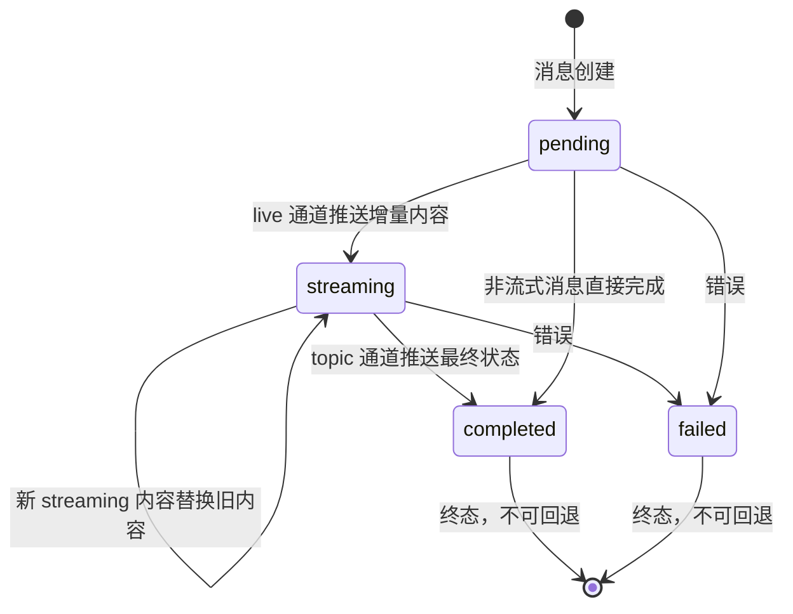
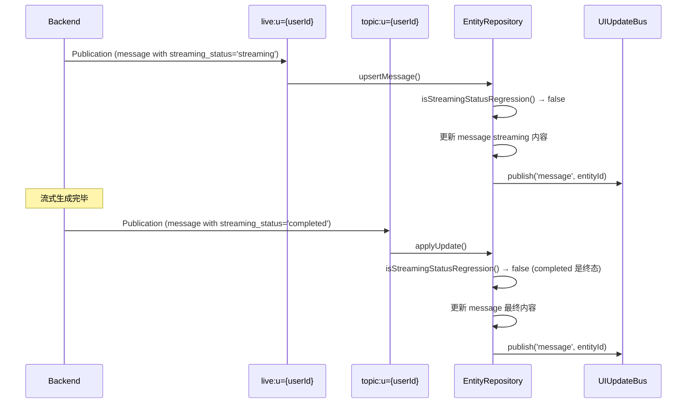
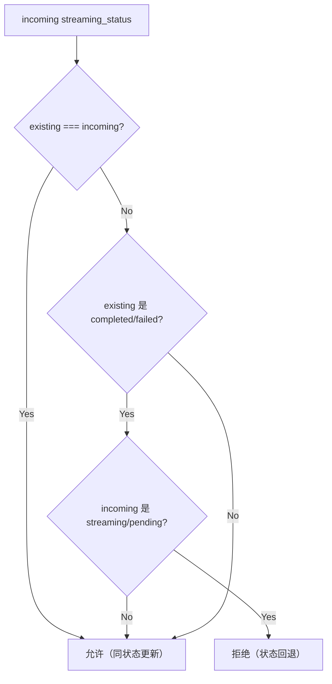

# Streaming Events

消息流式推送机制：`streaming_status` 状态机、live 通道推送、单调性保护。

**所属 package**: `client` (类型定义) | `persistence` (streaming_status 状态管理) | `component` (UI 消费)

## 关键代码文件

- [types.ts:36-51](~/Workspaces/rtc-agent/web-components/packages/client/src/types.ts#L36-L51) — `StreamChunk` / `StreamStart` / `StreamEnd` 接口定义（预留事件类型）
- [types.ts:161-165](~/Workspaces/rtc-agent/web-components/packages/client/src/types.ts#L161-L165) — `RTCAgentClientEvents` 中的事件声明
- [entity-repository.ts:73-102](~/Workspaces/rtc-agent/web-components/packages/persistence/src/entity-repository.ts#L73-L102) — `isStreamingStatusRegression()` 单调性保护函数（含 JSDoc 设计说明）
- [entity-repository.ts:417](~/Workspaces/rtc-agent/web-components/packages/persistence/src/entity-repository.ts#L417) — `upsertMessage()` 方法定义
- [entity-repository.ts:440](~/Workspaces/rtc-agent/web-components/packages/persistence/src/entity-repository.ts#L440) — `upsertMessage` 中的 streaming 回退检查

## streaming_status 状态机

消息的流式推送通过 `streaming_status` 字段实现，而非独立事件：



## 实现机制

流式推送通过 `live:u={userId}` 通道的 Publication 事件传递，消息实体的 `streaming_status` 字段在 `pending → streaming → completed/failed` 之间单向流转。



## 单调性保护

`isStreamingStatusRegression()` 防止 live 通道的 streaming 更新覆盖 topic 通道已到达的终态内容：



关键规则：

- **同状态总是允许** — `streaming → streaming`（新内容替换旧内容）
- **终态不可回退** — `completed → streaming` 或 `completed → pending` 被拒绝
- **空值不检查** — existing 或 incoming 为 undefined 时直接放行

**应用范围**：该检查同时应用于单条 upsert（`upsertMessage()` at line 440）和批量 merge（`applyUpdates()` → `mergeMessages()` at line 1402）。批量操作中每条 message 独立检查，确保不会因为批量写入导致已 terminal 的消息回退。

## 预留事件类型

以下接口定义在 `RTCAgentClientEvents` 中，当前通过 Publication/Update 机制间接实现流式推送：

```typescript
interface StreamStart { session_id: string; message_id: string; }
interface StreamChunk { session_id: string; message_id: string; content: string; }
interface StreamEnd { session_id: string; message_id: string; final_content: string; }
```

## 通道特性

| 属性                 | 值                       | 说明                                                |
| -------------------- | ------------------------ | --------------------------------------------------- |
| 流式推送通道         | `live:u={userId}`        | Fire-and-forget，无 offset                          |
| 最终状态通道         | `topic:u={userId}`       | Persistent + Offset，保证最终一致                   |
| 可靠性               | live 不保证              | 网络中断时可能丢失 streaming chunk                  |
| 恢复机制             | topic 通道保证           | 即使 live 丢失，topic 通道的 completed 状态确保最终一致 |

## 关键注释摘录

> **单向状态流转** — [entity-repository.ts:77-78](~/Workspaces/rtc-agent/web-components/packages/persistence/src/entity-repository.ts#L77-L78)
>
> ```text
> The streaming_status lifecycle is one-directional:
>   pending → streaming → completed / failed
> ```

评注：同状态更新（如 `streaming → streaming`）总是允许，确保新内容能替换旧内容。

> **防止覆盖终态** — [entity-repository.ts:82-83](~/Workspaces/rtc-agent/web-components/packages/persistence/src/entity-repository.ts#L82-L83)
>
> ```text
> This prevents live-channel streaming updates from overwriting
> the final completed content received via the topic channel.
> ```

## 跨维度关联

- [[Publication]] — live/topic 双通道架构
- [[EntityRepository]] — `isStreamingStatusRegression()` 在 upsert 和 merge 中调用
- [[UIUpdateBus]] — streaming 更新通过 UIUpdateBus 分发到 UI
- [[MessageVirtualScroll]] — 流式输出中的消息不可被骨架化（Phase 4）
