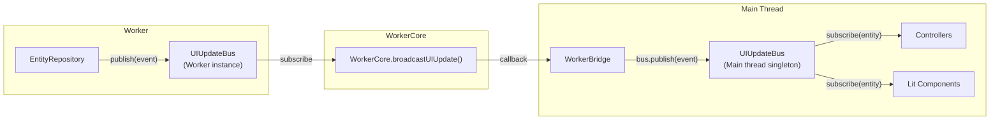
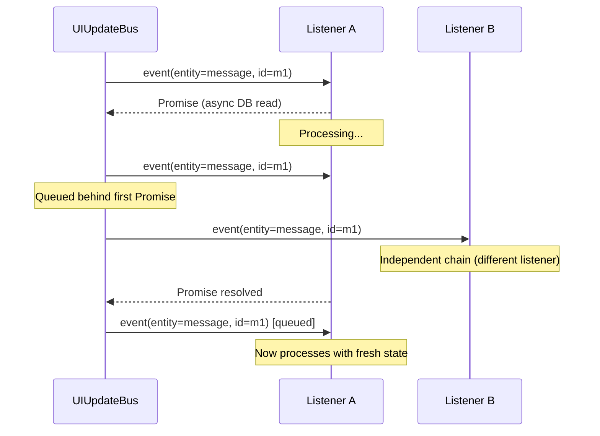
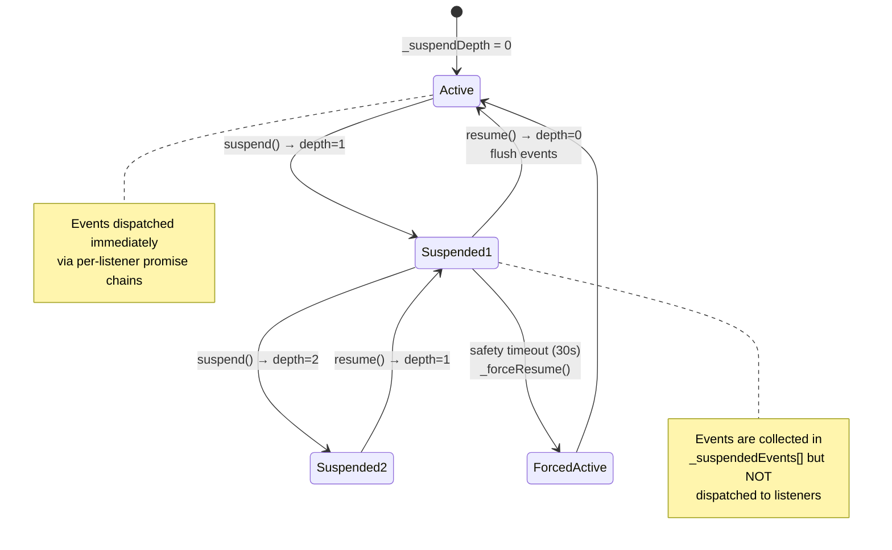
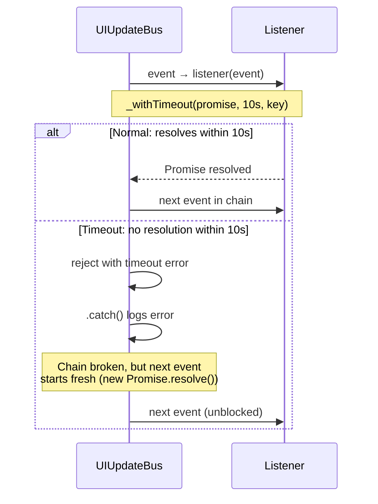
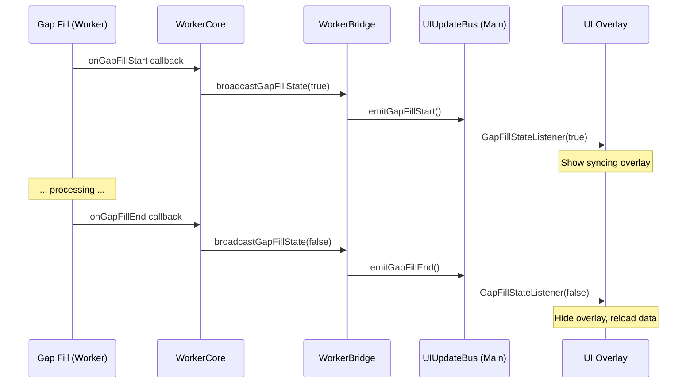

# UIUpdateBus

UI 更新事件总线：entity 过滤、per-listener 队列化、suspend/resume。

> 本主题聚焦 UIUpdateBus 的事件模型与消费者关系。状态管理机制详见 [[UIUpdate]]。

**所属 package**: `persistence`（定义）/ `component`（消费）

## 关键代码文件

- [ui-update-bus.ts](~/Workspaces/rtc-agent/web-components/packages/persistence/src/ui-update-bus.ts) — `UIUpdateBus` 类定义
- [worker-bridge.ts:132-136](~/Workspaces/rtc-agent/web-components/packages/component/src/worker-bridge.ts#L132-L136) — Worker → 主线程桥接

## 事件生命周期



## 消费者列表

| Consumer | Entity Filter | Purpose |
| ---------- | --------------- | --------- |
| SessionController | `session` | 更新会话列表、当前会话状态 |
| MessageController | `message` | 追加/更新消息 |
| ToolCallController | `rtc` | 更新工具调用状态 |
| FileExplorerController | `file` | 刷新文件列表 |
| StatusBar / NotificationController | various | 状态栏 / 通知更新 |

> **BusHandler**: component 包中的事件路由核心逻辑详见 [[BusHandler]]。BusHandler 将 UIUpdateEvent 按 entity 类型分发到对应 Controller，并实现 Session 结构/轻量变更分类、DebouncedSessionLoader 防抖、Master Tab 门控等机制。

## Per-Listener 队列化

每个 listener 对同一 `(entity, entityId)` 的事件串行处理，防止异步 listener 导致的竞态：



实现机制：

```text
// Per-(entity, entityId, listener) promise chains for sequential processing.
// Key format: "${entity}:${entityId}:${listenerId}"
//
// When a listener returns a Promise, subsequent events for the same
// (entity, entityId) wait for it to complete before processing.
// This prevents race conditions where async DB reads return stale data.
```

— [ui-update-bus.ts:72-79](~/Workspaces/rtc-agent/web-components/packages/persistence/src/ui-update-bus.ts#L72-L79)

### Listener ID 与 WeakMap

每个 listener 分配唯一 ID（递增计数器），用于构建 chain key。ID 存储在 `WeakMap<UIUpdateListener, number>` 中，listener 被 GC 时 ID 自动清理。

## Suspend/Resume 机制

### Reference-Counted Suspend

多个调用方可嵌套调用 `suspend()` / `resume()`，内部用 `_suspendDepth` 计数器跟踪。只有最外层的 `resume()` 才真正刷新事件：



### 安全超时

`suspend()` 在 depth 从 0 变为 1 时启动 30 秒安全计时器（`MAX_SUSPEND_MS = 30_000`）。超时后 `_forceResume()` 强制刷新，防止 `suspend()` 被调用但 `resume()` 永远不执行的场景（如异常中断）。

| 方法                | 行为                                                    |
| ------------------- | ------------------------------------------------------- |
| `suspend()`         | `_suspendDepth++`；depth=1 时启动安全计时器             |
| `resume()`          | `_suspendDepth--`；depth=0 时清除计时器 + flush         |
| `_forceResume()`    | 重置 depth=0 + 清除计时器 + flush（紧急恢复）           |
| `destroy()`         | 重置 depth=0 + 清除计时器 + 清理所有监听器              |

### Listener Chain 超时保护

每个 listener 的 Promise 链有 10 秒超时（`CHAIN_TIMEOUT_MS = 10_000`）。如果 listener 的 Promise 永远不 resolve，链自动断裂，后续事件正常处理：



超时后链断裂但不影响后续事件处理 — 因为 `_dispatchToListener()` 每次调用 `.catch()` 后链恢复为 resolved 状态。

### 错误隔离

listener 抛出的同步或异步错误由 `.catch()` 捕获，防止链断裂。错误被记录但不影响后续事件处理。

## Bulk Update 事件

```typescript
interface BulkUpdateEvent {
  entities: Set<UpdateEntity>;  // 批量期间涉及的实体类型
  eventCount: number;            // 批量事件总数
}
```

UI 组件收到 BulkUpdateEvent 后，应重新加载数据而非逐条处理事件。

## Gap Fill 状态事件



## 跨维度关联

- [[UIUpdate]] — UIUpdateBus 的状态管理机制（suspend/resume/队列化）
- [[Publication]] — Publication 处理后触发 UIUpdateBus.publish()
- [[EntityRepository]] — EntityRepository 的 upsert 方法发出 UIUpdateEvent
- [[SharedWorker]] — WorkerCore 桥接 Worker 内 UIUpdateBus 到主线程
- [[SyncStatus]] — sync_status 变化也会产生 UIUpdateEvent
- [[BusHandler]] — component 包中的事件路由分发逻辑
- [[NotificationController]] — 直接订阅 UIUpdateBus 的 Controller（不经过 BusHandler）
- [[ConcurrencyPatterns]] — 引用计数 Suspend + Listener Chain 超时机制详解
