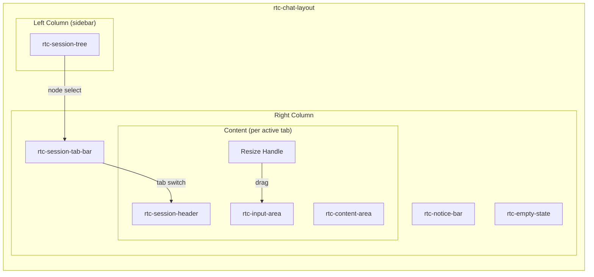
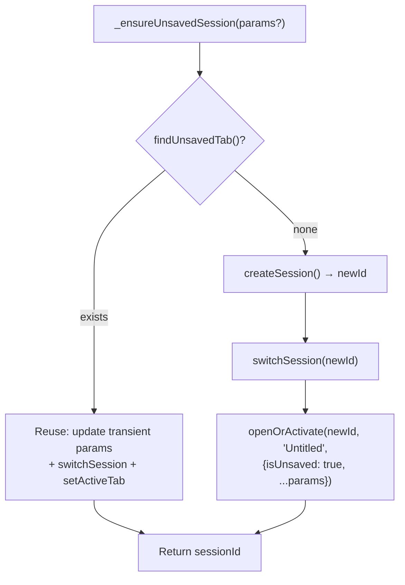
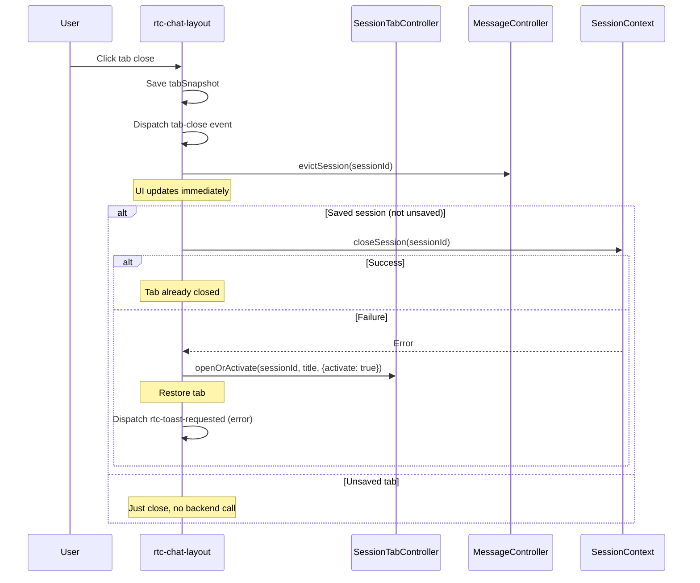
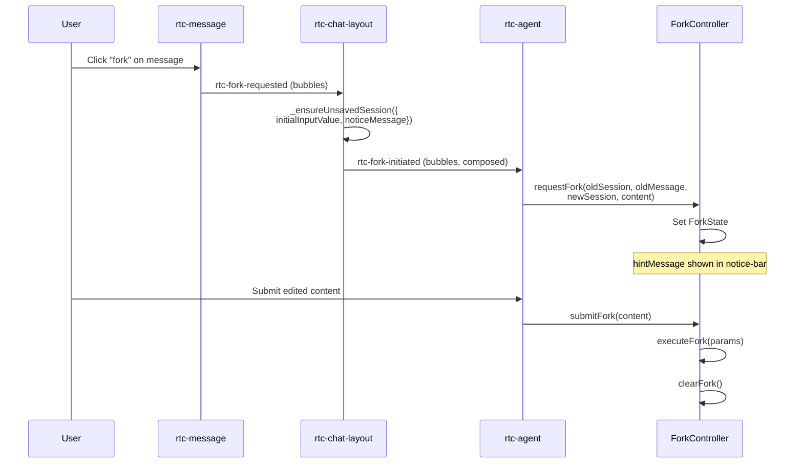
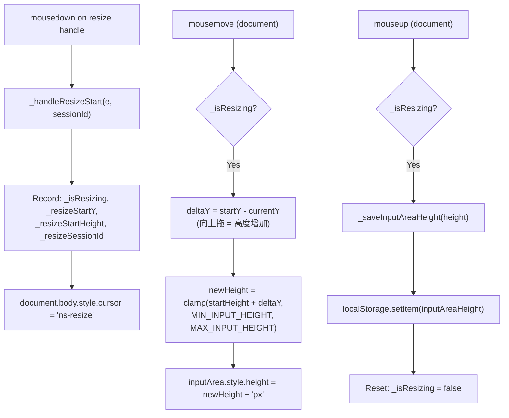
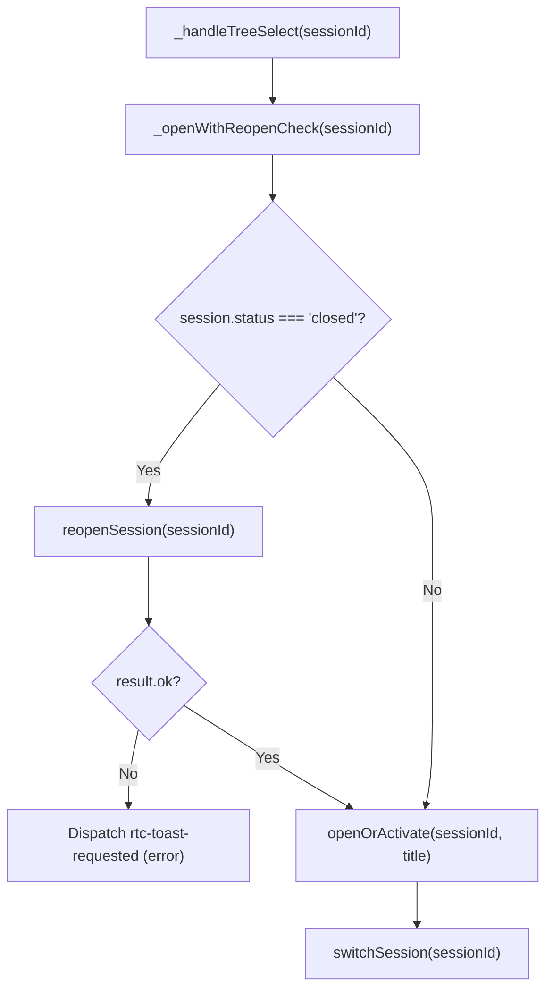

# ChatLayout

聊天页面编排器：两栏布局、Tab 生命周期、Resize 持久化、Fork 流程编排。

**所属 package**: `component`

## 关键代码文件

- [components/chat-layout/rtc-chat-layout.ts](~/Workspaces/rtc-agent/web-components/packages/component/src/components/chat-layout/rtc-chat-layout.ts) — `RtcChatLayout` 类（~830 行）

## 职责

`<rtc-chat-layout>` 是对话页面的顶层编排组件，负责：

| 职责 | 说明 |
|------|------|
| 两栏布局 | 左栏 session-tree + 右栏 tab-bar / content-area / input-area |
| Tab 生命周期 | 新建、切换、关闭（含错误恢复）、unsaved Tab 管理 |
| Fork 流程编排 | 从消息分叉创建新 session |
| Resize 持久化 | 拖拽调整 input-area 高度，localStorage 持久化 |
| 全局事件路由 | 在 document 层监听跨组件事件 |
| 透明 Reopen | 点击 closed session 自动 reopen |

## 布局结构



侧栏可见性由 `sessionTreeVisible` property 控制（Activity Bar 的"聊天"图标 toggle）。

## Unsaved Tab 编排

`_ensureUnsavedSession()` 是同步方法，保证双击"+"按钮幂等：



关键设计：

- **同步执行** — 无 `await`，第二次调用时 `findUnsavedTab()` 立即返回已有 Tab
- **createSession + switchSession** — `createSession` 只创建，不触发 `onSessionSwitch`；必须手动 `switchSession` 触发消息加载
- **Transient Params** — `initialInputValue` / `noticeMessage` 通过 Tab 的 transient params 传递，Lit property binding 自动透传给子组件

## Tab 关闭错误恢复

Tab 关闭采用乐观 UI + 失败回滚模式（[rtc-chat-layout.ts:637-724](~/Workspaces/rtc-agent/web-components/packages/component/src/components/chat-layout/rtc-chat-layout.ts#L637-L724)）：



关键设计（Fix 44）：

- **Tab Snapshot** — 关闭前保存 `tabSnapshot`，用于失败时恢复
- **evictSession 提前** — 在 `closeSession` 之前清理 MessageController 缓存
- **Restore 嵌套 try/catch** — 恢复逻辑本身也可能失败（如组件已卸载），嵌套保护防止 unhandled rejection
- **Unsaved 分支** — unsaved Tab 无后端 session，直接关闭

## Fork 流程编排

Fork 允许用户从某条消息分叉创建新对话：



关键点：

- ChatLayout 负责创建 unsaved Tab 并填充 fork 内容
- `rtc-fork-initiated` 携带完整元数据冒泡到 `<rtc-agent>`
- `<rtc-agent>` 将事件接线到 ForkController
- Transient params 通过 Tab → property binding → input-area / notice-bar

## Resize 持久化

Input-area 高度可拖拽调整，全局持久化到 localStorage：



**Per-Session Application Tracking**:

```typescript
private _heightAppliedSessions = new Set<string>();
```

`updated()` 生命周期钩子遍历所有 Tab，对尚未应用过高度的 session 应用 localStorage 中保存的高度。每个 session 只应用一次（记录在 `_heightAppliedSessions` Set 中），避免覆盖用户的拖拽调整。

高度约束：`MIN_INPUT_HEIGHT = 80px`, `MAX_INPUT_HEIGHT = 400px`。

## 全局事件路由

ChatLayout 在 document 层和自身层注册多个全局事件监听器：

| 事件 | 监听位置 | 用途 |
|------|----------|------|
| `rtc-message-sent` | `document` | 标记 Tab 为已保存（unsaved → saved） |
| `rtc-notification-click` | `document` | 跳转到通知对应的 session |
| `rtc-fork-requested` | `this` (bubbles) | 编排 Fork 流程 |
| `rtc-session-tree-new` | `this` (bubbles) | 创建新 session |
| `rtc-clear-active-input` | `this` (bubbles) | Escape 键清空输入框 |
| `mousemove` / `mouseup` | `document` | Resize handle 拖拽 |

**为什么在 document 层监听**：`rtc-message-sent` 从 `<rtc-agent>`（ChatLayout 的父组件）派发，向上冒泡到 document。由于 Shadow DOM 的事件重定向，事件不会向下传播到 ChatLayout 的 shadow DOM 子树，因此必须在 document 层捕获。

## 透明 Reopen

点击 closed session 时自动 reopen，用户无感知：



## 关键注释摘录

> **Unsaved Tab 幂等性** — [rtc-chat-layout.ts:388-400](~/Workspaces/rtc-agent/web-components/packages/component/src/components/chat-layout/rtc-chat-layout.ts#L388-L400)
>
> ```text
> 核心编排：确保存在一个 unsaved tab
>
> - 已有 unsaved tab → 激活它，返回其 sessionId
> - 没有 → 创建新 session + 开 unsaved tab，返回 newId
>
> 同步方法（无 await），保证双击 "+" 幂等：
> 第二次调用时 findUnsavedTab 立即返回已有 tab。
> ```

> **document 层监听原因** — [rtc-chat-layout.ts:161-163](~/Workspaces/rtc-agent/web-components/packages/component/src/components/chat-layout/rtc-chat-layout.ts#L161-L163)
>
> ```text
> 监听 rtc-message-sent：事件从 rtc-agent（父组件）派发，
> 向上冒泡到 document。chat-layout 必须在 document 上监听，
> 因为事件不会向下传播到 shadow DOM 中的子组件。
> ```

## 跨维度关联

- [[ControllerPattern]] — 消费 SessionContext / SessionTabContext，不持有状态
- [[ContextSystem]] — 通过 `@consume` 获取 Session / SessionTab 状态
- [[ComponentEvents]] — 派发 `rtc-chat-layout-session-select` / `rtc-chat-layout-tab-activate` / `rtc-chat-layout-tab-close` / `rtc-fork-initiated` / `rtc-new-session`
- [[ComponentHierarchy]] — 作为 Chat Layout 区域的顶层组件
- [[LocalStorage]] — 使用 `STORAGE_KEYS.inputAreaHeight` 持久化 input-area 高度
- [[SessionManagement]] — 通过 SessionTabController 管理 Tab 生命周期
- [[ScrollSaver]] — 消息列表滚动位置保持（虚拟滚动配合）
- [[ActivityBarConfig]] — 控制侧边栏活动按钮，影响 ChatLayout 左栏可见性
