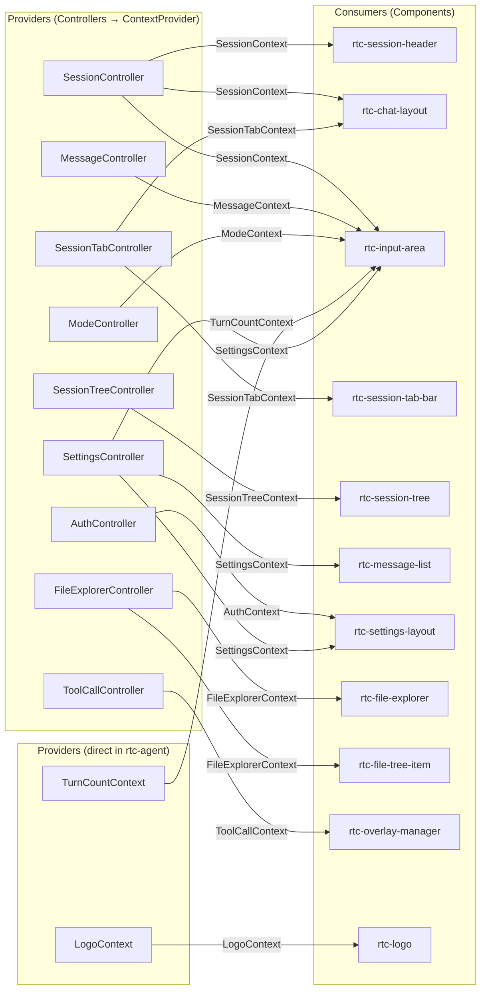

# Component Hierarchy

UI 组件树：47 个 Lit Web Components 的层次结构与职责。

**所属 package**: `component`

## 关键代码文件

- [components/rtc-agent/rtc-agent.ts](~/Workspaces/rtc-agent/web-components/packages/component/src/components/rtc-agent/rtc-agent.ts) — 根组件 `<rtc-agent>`，唯一公开元素
- [components/](~/Workspaces/rtc-agent/web-components/packages/component/src/components) — 所有 UI 组件目录

## 组件总数

47 个自定义元素（`@customElement` 装饰器），按功能分为 12 个区域。

## 组件树

```mermaid
flowchart TD
    A["rtc-agent<br/>(Root)"]

    A --> TB["rtc-title-bar"]
    A --> AB["rtc-activity-bar"]
    A --> CL["rtc-chat-layout"]
    A --> SL["rtc-settings-layout"]
    A --> EA["rtc-editor-area"]
    A --> SB["rtc-status-bar"]
    A --> DR["rtc-drawer"]

    %% Login
    A --> LP["rtc-login-page"]
    A --> LD["rtc-login-dialog"]

    %% Chat Layout children
    CL --> SH["rtc-session-header"]
    CL --> ST["rtc-session-tree"]
    CL --> STB["rtc-session-tab-bar"]
    CL --> CA["rtc-content-area"]
    CL --> IA["rtc-input-area"]
    CL --> NB["rtc-notice-bar"]
    CL --> ES["rtc-empty-state"]
    CL --> TU["rtc-token-usage"]

    %% Session Tree
    ST --> STI["rtc-session-tree-item"]
    STB --> ST2["rtc-session-tab"]

    %% Content Area
    CA --> SC["rtc-scroll-container"]
    CA --> ML["rtc-message-list"]
    CA --> CW["rtc-content-wrapper"]
    CA --> EM["rtc-error-message"]

    %% Message List
    ML --> MSG["rtc-message"]
    ML --> UM["rtc-user-message"]
    ML --> TC["rtc-toolcall-card"]
    ML --> MM["rtc-message-more-menu"]
    MSG --> TR["rtc-toolcall-reply"]

    %% Editor Area
    EA --> ET["rtc-editor-tab"]
    EA --> ETB["rtc-editor-toolbar"]
    EA --> ME["rtc-markdown-editor"]

    %% File Explorer
    AB --> FE["rtc-file-explorer"]
    FE --> FTI["rtc-file-tree-item"]

    %% Settings
    SL --> SN["rtc-settings-nav"]
    SL --> SP["rtc-settings-panel"]
    SL --> SCP["rtc-scenario-panel"]

    %% Overlay Manager (child of rtc-content-wrapper / rtc-chat-layout)
    CW --> OM["rtc-overlay-manager"]
    OM --> TC2["rtc-tool-confirm"]

    %% Toast (direct child of rtc-agent)
    A --> Toast["rtc-toast"]

    %% Dynamic Dialogs (created by dialog-helpers.ts, appended to ShadowRoot)
    A -.->|"dynamic"| AU["rtc-ask-user"]
    A -.->|"dynamic"| RC["rtc-restore-confirm"]

    %% Floating Panels (positioned by @floating-ui/dom from their trigger components)
    %% rtc-command-panel, rtc-mode-panel (positioned by rtc-input-area)
    %% rtc-session-panel (positioned by rtc-session-header)
    IA -.->|"floating"| CP["rtc-command-panel"]
    IA -.->|"floating"| MP["rtc-mode-panel"]
    SH -.->|"floating"| SessP["rtc-session-panel"]
    IA -.->|"floating"| TP["rtc-todo-panel"]

    %% Logo
    A --> Logo["rtc-logo"]
```



## 区域划分

| 区域 | 组件 | 职责 |
| ------ | ------ | ------ |
| Root | `rtc-agent` | 根组件：Controller 装配 + Context 分发 |
| Title Bar | `rtc-title-bar` | 窗口标题、拖拽、最小化/最大化按钮 |
| Activity Bar | `rtc-activity-bar` | VS Code 风格侧边栏图标 |
| Chat Layout | `rtc-chat-layout`, `rtc-session-header`, `rtc-session-tree`, `rtc-session-tree-item`, `rtc-session-tab-bar`, `rtc-session-tab`, `rtc-content-area`, `rtc-input-area`, `rtc-notice-bar`, `rtc-empty-state`, `rtc-token-usage` | 对话页面布局 |
| Content Area | `rtc-message-list`, `rtc-message`, `rtc-user-message`, `rtc-toolcall-card`, `rtc-toolcall-reply`, `rtc-message-more-menu`, `rtc-scroll-container`, `rtc-content-wrapper`, `rtc-error-message` | 消息列表与渲染 |
| Editor Area | `rtc-editor-area`, `rtc-editor-tab`, `rtc-editor-toolbar`, `rtc-markdown-editor` | 文件编辑器 |
| File Explorer | `rtc-file-explorer`, `rtc-file-tree-item` | 虚拟文件树 |
| Settings | `rtc-settings-layout`, `rtc-settings-nav`, `rtc-settings-panel`, `rtc-scenario-panel` | 设置页面 |
| Overlay | `rtc-overlay-manager`, `rtc-command-panel`, `rtc-mode-panel`, `rtc-session-panel`, `rtc-todo-panel`, `rtc-tool-confirm`, `rtc-ask-user`, `rtc-restore-confirm`, `rtc-toast` | 弹出层与对话框 |
| Login | `rtc-login-page`, `rtc-login-dialog` | 认证页面 |
| Status Bar | `rtc-status-bar` | 底部状态栏 |
| Misc | `rtc-logo`, `rtc-drawer` | 通用组件 |

## Context 消费关系



注：WindowStateController、ActivityController、EditorAreaController、NotificationController 不通过 Context 分发状态，而是通过 DOM events 或 root 直接引用 actions 消费。

## 设计原则

1. **单一公开元素** — 只有 `<rtc-agent>` 是公开 API，其余均为内部实现
2. **Controller 驱动** — 每个业务区域的 state 由 Controller 管理，组件只负责渲染
3. **Context 分发** — Controller 通过 `@lit/context` 向子组件提供状态，避免 prop drilling
4. **Helper 拆分** — 根组件的复杂逻辑（bus 处理、命令解析、VFS 操作）拆分到 `helpers/` 子目录
5. **样式隔离** — 每个组件有独立的 `.styles.ts` 文件，使用 CSS custom properties 实现主题

## 关键注释摘录

> **根组件定位** — [rtc-agent.ts:1-8](~/Workspaces/rtc-agent/web-components/packages/component/src/components/rtc-agent/rtc-agent.ts#L1-L8)
>
> ```text
> RTC Agent — Root Component
> The only public custom element exposed by the library. This component is a
> pure "assembler": it creates Reactive Controllers, wires each controller's
> value to a @lit/context provider, and renders the top-level shell UI.
> ```

> **事件命名约定** — [rtc-agent.ts:29-39](~/Workspaces/rtc-agent/web-components/packages/component/src/components/rtc-agent/rtc-agent.ts#L29-L39)
>
> ```text
> All public events dispatched by <rtc-agent> follow the pattern:
>   `rtc-<domain>-<action>-<past-tense>`
>
> ### Event prefix taxonomy:
> - `rtc-*`         : Public API events (external developers listen to these)
> - No prefix       : Internal component events (may change without notice)
> - `demo-*`        : Demo/test-only events (not for production use)
> ```

## 跨维度关联

- [[ControllerPattern]] — Controller 为组件提供状态
- [[ContextSystem]] — Context 是 Controller 到组件的桥梁
- [[ComponentEvents]] — 组件通过 DOM 事件向外通信
- [[Factory]] — `createRtcAgent()` 工厂创建 `<rtc-agent>` 实例
- [[RootComponentHelpers]] — 根组件逻辑拆分为 helper 模块
- [[FloatingPanelController]] — Overlay 面板定位，供 mode/command/scenario 面板复用
- [[ChatLayout]] — 聊天页面编排：Tab 管理、Fork 流程、Resize 持久化
- [[OverlaySystem]] — Overlay 管理器 + 浮动面板 + 动态对话框 + Toast
