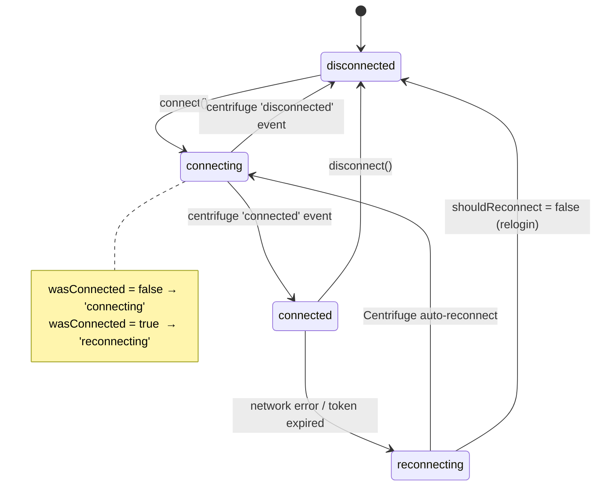
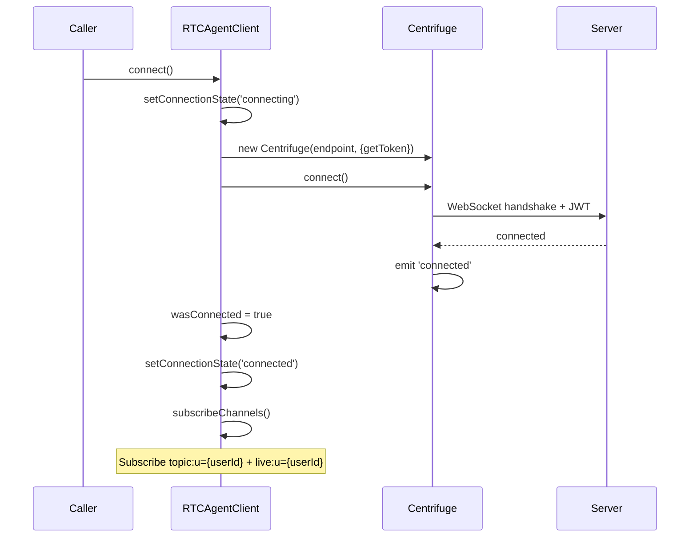
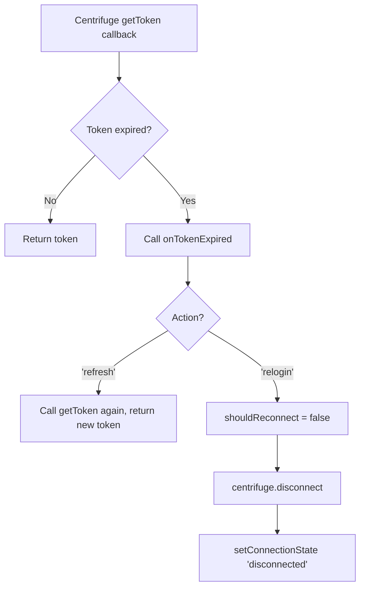
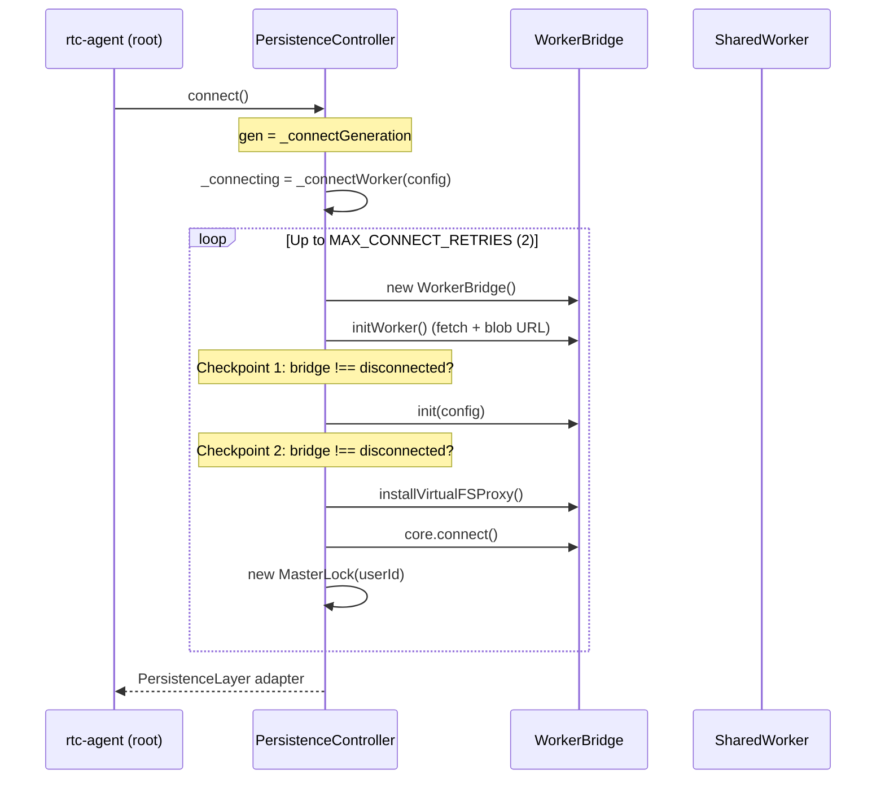
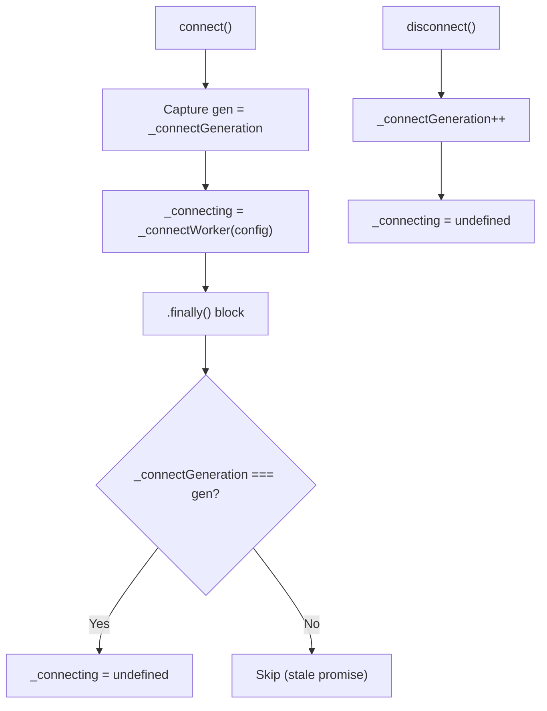
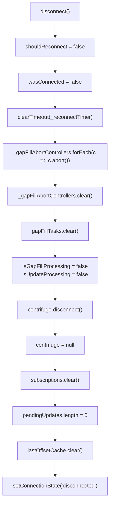
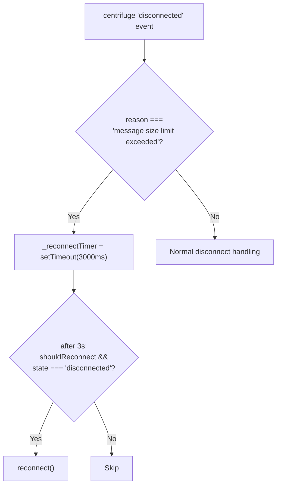
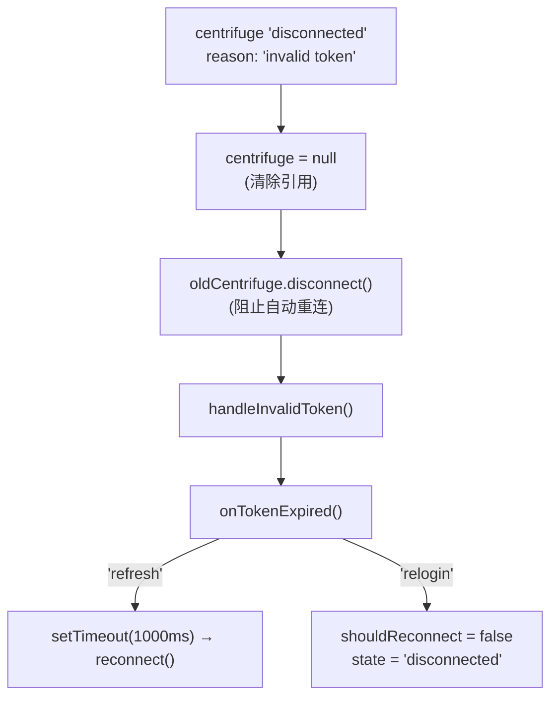
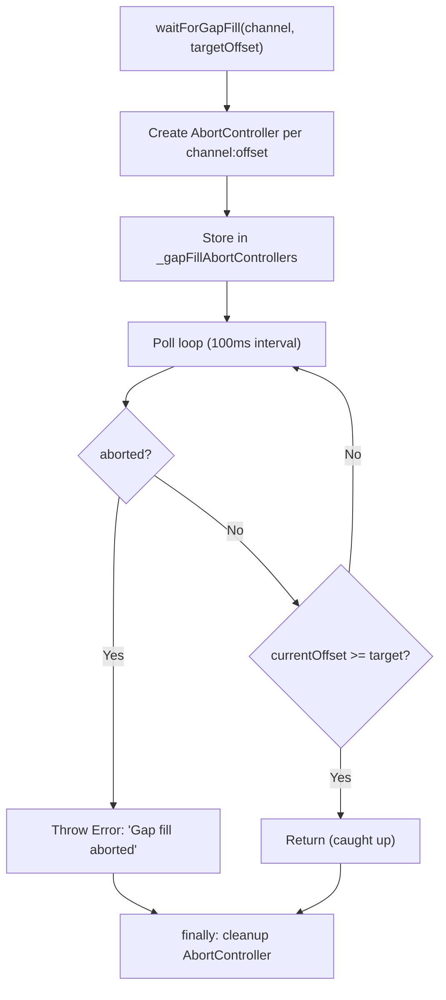

# Connection

RTCAgentClient WebSocket 连接生命周期（Centrifuge 驱动）。

**所属 package**: `client`

## 关键代码文件

- [client.ts](~/Workspaces/rtc-agent/web-components/packages/client/src/client.ts) — `RTCAgentClient` 类（1186 行），Centrifuge WebSocket 封装
- [client.ts:40-49](~/Workspaces/rtc-agent/web-components/packages/client/src/client.ts#L40-L49) — `GapFillTimeoutError` 类（gap fill 超时专用错误）
- [types.ts](~/Workspaces/rtc-agent/web-components/packages/client/src/types.ts) — `ConnectionState` 类型定义、`IRTCAgentClient` 接口

## 连接状态机

## 生命周期流程

## Token 过期处理

## PersistenceController 连接重试

`PersistenceController`（主线程侧）在 `connect()` 时支持自动重试和 generation counter 防竞态：

### Generation Counter 防竞态

**Why**: `disconnect()` 可能在 `_connecting` promise 仍在 pending 时被调用。递增 generation 后，旧 promise 的 `finally` 检测到 generation 不匹配，不会错误地清除新的 `_connecting`。

**Checkpoint 机制**: `_connectWorkerOnce()` 在两个 `await` 点（`initWorker()` 和 `init()`）后检查 `this._workerBridge !== bridge`，如果在 await 期间被 `disconnect()` 打断，优雅退出并清理。

## disconnect 清理

`disconnect()` 执行完整的状态清理，确保 reconnect 时从干净状态启动：

关键设计：

| 清理项 | 防止的问题 |
| --- | --- |
| `_reconnectTimer` | 清除 message-size-limit 延迟重连定时器，防止 zombie reconnect |
| `_gapFillAbortControllers` | 中断 zombie gap fill 等待定时器 |
| `gapFillTasks` + `isGapFillProcessing` | 防止旧 gap fill 状态污染新连接 |
| `isUpdateProcessing` | 防止旧 update executor 标志位阻塞新连接的消息处理 |
| `lastOffsetCache` | offset 去重缓存与新连接的 offset 状态不一致 |

## Message Size Limit 恢复

服务端拒绝连接时（`message size limit exceeded`），Centrifuge 不会自动重试此类型的服务端拒绝。客户端检测到后延迟 3 秒手动重连：

`RECONNECT_AFTER_SIZE_LIMIT_DELAY_MS = 3000` — 给服务端缓冲时间后重试。

## Invalid Token 处理

服务端可能在 JWT 未过期时拒绝 token（服务重启导致 JWT secret 轮换、服务端 token 撤销等）。检测到 `invalid token` 后立即断开 Centrifuge 实例，防止其用缓存旧 token 自动重连：

`RECONNECT_AFTER_TOKEN_REFRESH_DELAY_MS = 1000` — token 刷新后延迟 1 秒重连，避免快速重试循环。

## 关键注释摘录

> **Token 过期检测** — [client.ts:1020-1046](~/Workspaces/rtc-agent/web-components/packages/client/src/client.ts#L1020-L1046)
> _Check whether a JWT has expired. Parses the exp claim from the JWT payload (Unix timestamp in seconds) and compares it with the current time. Returns false on parse failure (to avoid blocking connections due to malformed tokens)._

<!-- separator -->

> **Invalid Token 处理** — [client.ts:169-179](~/Workspaces/rtc-agent/web-components/packages/client/src/client.ts#L169-L179)
> _Detect server-side token rejection (e.g. "invalid token"). Even if the JWT is not expired, we need to trigger the refresh mechanism. Critical fix: immediately disconnect the Centrifuge instance to prevent it from auto-reconnecting with the cached old token._

<!-- separator -->

> **disconnect 清理** — [client.ts:209-235](~/Workspaces/rtc-agent/web-components/packages/client/src/client.ts#L209-L235)
> disconnect() 清理所有状态：abort gap fill、clear subscriptions、clear pending updates、clear lastOffsetCache。确保 reconnect 时状态干净。

## Gap Fill 取消机制

`waitForGapFill()` 使用 `AbortController` 实现可中断的轮询等待，`disconnect()` 批量中断所有等待：

关键设计：

- 每个 gap fill 等待创建独立的 `AbortController`，按 `channel:offset` 为 key 存储
- `disconnect()` 批量 abort 所有控制器，防止 zombie 定时器
- `waitForGapFill` 的 `finally` 块仅在 controller 仍是当前存储的实例时才删除（防止并发调用互相覆盖）
- 超时（30s）抛出 `GapFillTimeoutError` 而非静默返回
- `isUpdateProcessing` 和 `isGapFillProcessing` 双标志重置，确保 reconnect 后 `processUpdateQueue` 和 gap fill 调度器从干净状态启动

## 跨维度关联

- [[ConnectionState]] — 连接状态枚举定义
- [[Publication]] — 连接后订阅的 topic/live 通道
- [[StreamingEvents]] — live 通道的流式消息推送（streaming_status 状态机）
- [[ProtocolTypes]] — RPC 方法常量与请求/响应类型定义
- [[AuthController]] — 提供 token 给 RTCAgentClient
- [[SharedWorker]] — RTCAgentClient 在 Worker 内运行
- [[PersistenceLayer]] — RTCAgentClient 由 PersistenceLayer 创建并持有
- [[PersistenceController]] — 驱动连接/断开生命周期的组件层控制器
- [[RootComponentHelpers]] — `logout()` 和 `disconnectedCallback` 中的连接清理编排
- [[ConcurrencyPatterns]] — disconnect 批量 AbortController + Generation Counter + Checkpoint
