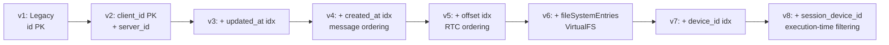
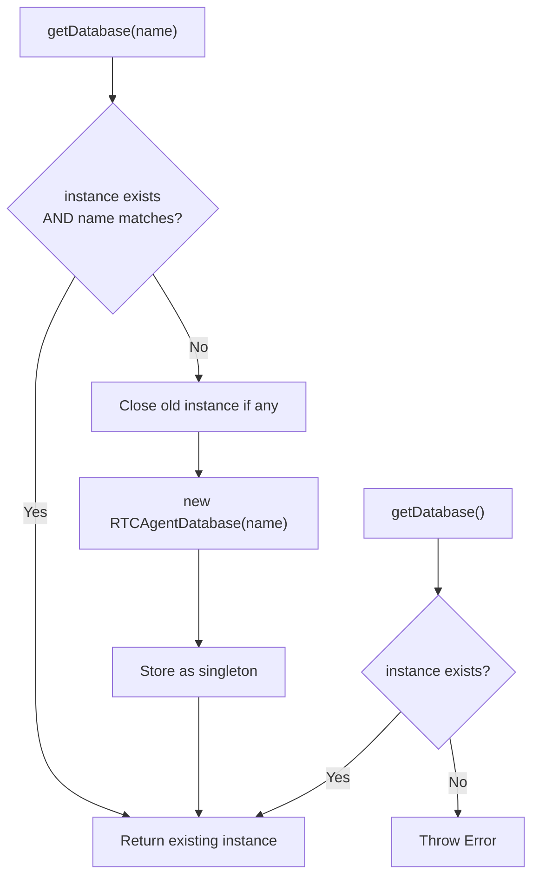
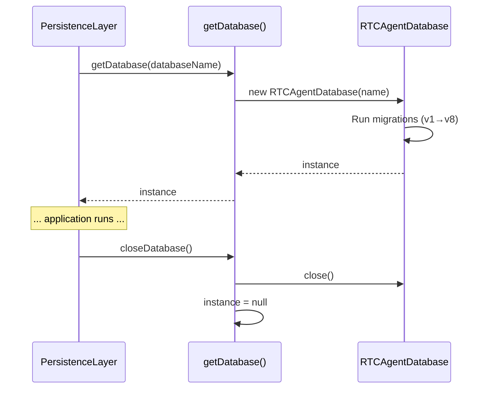

# Database

IndexedDB (Dexie) 初始化、版本迁移、关闭流程。

**所属 package**: `persistence`

## 关键代码文件

- [database.ts](~/Workspaces/rtc-agent/web-components/packages/persistence/src/database.ts) — `RTCAgentDatabase` 类（Dexie 子类）、`getDatabase()` 单例、`closeDatabase()`

## 数据库版本演进



## 表结构（v8 最终版）

| Table | Primary Key | Indexes |
| ------- | ------------- | --------- |
| `sessions` | `client_id` | `server_id`, `sync_status`, `status`, `updated_at`, `device_id` |
| `turns` | `client_id` | `server_id`, `sync_status`, `session_client_id`, `status` |
| `messages` | `client_id` | `server_id`, `sync_status`, `session_client_id`, `turn_id`, `global_offset`, `created_at` |
| `rtcs` | `client_id` | `server_id`, `sync_status`, `session_client_id`, `turn_id`, `status`, `offset`, `session_device_id` |
| `offsets` | `channel` | — |
| `fileSystemEntries` | `path` | `type`, `metadata.group`, `*metadata.tags` |

## 单例管理



## 关键设计决策

1. **client_id 作为主键** — v2 从 server UUID (`id`) 迁移到 `client_id`。支持离线优先：本地创建实体时无需等待服务器分配 ID。

2. **sync_status 三态** — `'pending' | 'synced' | 'failed'`。所有实体表都包含此字段，用于追踪本地数据与服务器的同步状态。

3. **双 ID 体系** — `client_id`（本地 UUID，主键）+ `server_id`（服务器 UUID，可选索引）。RPC 调用使用 `server_id`，本地查询使用 `client_id`。

4. **fileSystemEntries 多值索引** — `*metadata.tags` 支持数组字段的查询（如按标签搜索场景/函数文档）。

## 关键注释摘录

> **v1→v2 迁移** — [database.ts:156-220](~/Workspaces/rtc-agent/web-components/packages/persistence/src/database.ts#L156-L220)
>
> ```text
> Data migration: v1 PK was id (server UUID), v2 PK is client_id.
> Since update(key, changes) looks up by the new PK, old records may lack client_id,
> causing update to find no target row and silently fail. Use clear + add instead.
> ```

## 生命周期



## 跨维度关联

- [[IndexedDB]] — 详细表结构设计
- [[Offset]] — offsets 表的消费者
- [[VirtualFS]] — fileSystemEntries 表的消费者
- [[SyncStatus]] — sync_status 状态流转
