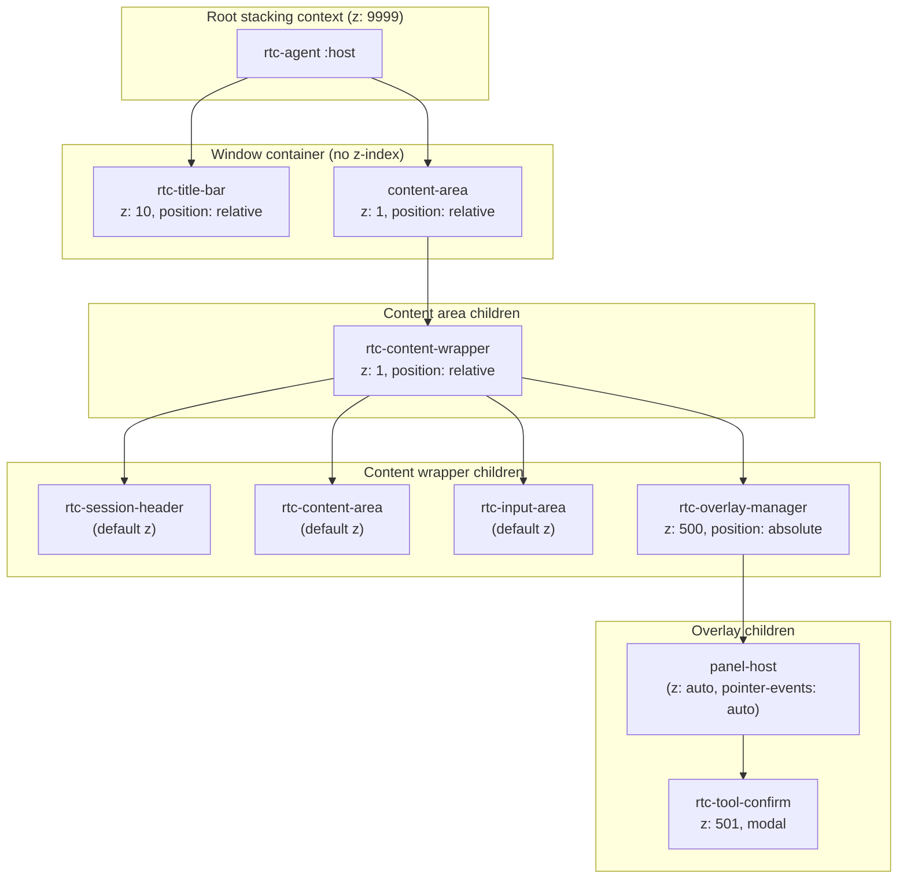
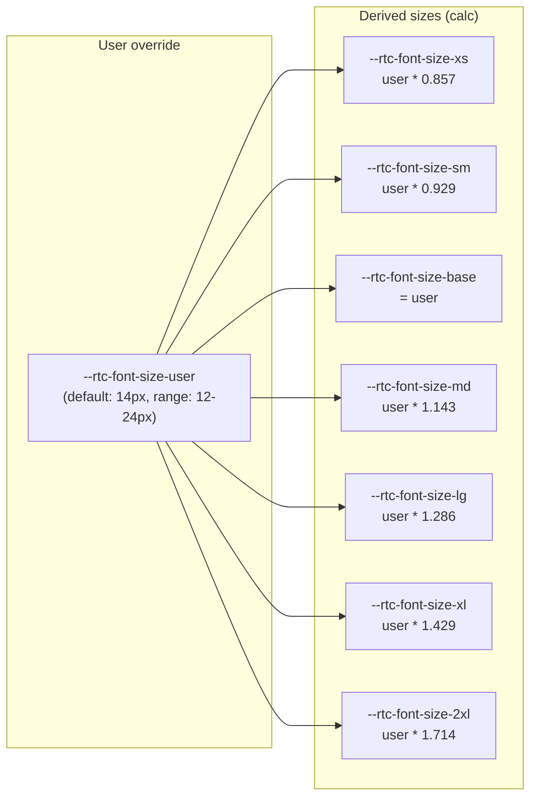
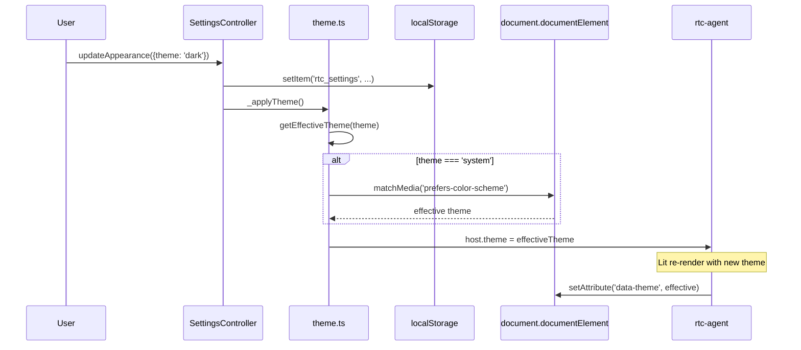

# DesignSystem

Design Token 体系与主题系统：结构 token + 颜色主题分离。

**所属 package**: `component`

## 关键代码文件

- [styles/tokens.ts](~/Workspaces/rtc-agent/web-components/packages/component/src/styles/tokens.ts) — 结构 token（spacing, typography, borders, shadows, z-index）
- [styles/themes/light.ts](~/Workspaces/rtc-agent/web-components/packages/component/src/styles/themes/light.ts) — 亮色主题颜色定义
- [styles/themes/dark.ts](~/Workspaces/rtc-agent/web-components/packages/component/src/styles/themes/dark.ts) — 暗色主题颜色定义
- [styles/base.ts](~/Workspaces/rtc-agent/web-components/packages/component/src/styles/base.ts) — 全局基础样式
- [core/theme.ts](~/Workspaces/rtc-agent/web-components/packages/component/src/core/theme.ts) — Theme 初始化与切换逻辑

## 设计原则

1. **结构/颜色分离** — `tokens.ts` 只定义结构 token（spacing, typography, borders, shadows, z-index），颜色 token 全部在 theme 文件中定义
2. **CSS Custom Properties** — 所有 token 通过 `--rtc-*` 命名空间暴露，支持主题切换
3. **用户可覆盖** — 字体大小通过 `--rtc-font-size-user` 变量支持用户级覆盖
4. **单一颜色源** — 颜色只在 `themes/light.ts` 和 `themes/dark.ts` 中定义，tokens.ts 不定义任何颜色

## Token 分类

### 结构 Token（tokens.ts）

| 类别 | 变量前缀 | 示例值 | 用途 |
| --- | --- | --- | --- |
| Spacing | `--rtc-spacing-*` | xs:4, sm:8, md:16, lg:24, xl:32, 2xl:48 | 间距比例尺 |
| Typography | `--rtc-font-*` | family-base, size-sm/base/lg, weight-normal/medium/bold | 字体/字号/字重 |
| Border | `--rtc-border-*` | width:1px, radius-sm:4, radius:6, radius-lg:8 | 边框宽度/圆角 |
| Shadow | `--rtc-shadow-*` | sm, md, lg, xl, drag | 阴影层级 |
| Transition | `--rtc-transition-*` | duration:0.15s, duration-slow:0.3s | 动画时长/缓动 |
| Z-index | `--rtc-z-*` | content:1, title-bar:10, overlay:500, modal:501, toast:1000, root:9999 | 层叠上下文 |
| Window | `--rtc-window-*` | default-width:420px, min-width:350px | 浮动窗口尺寸 |
| Content Height | `--rtc-content-height-*` | xs:60, sm:100, md:160, lg:240, xl:360 | 可滚动内容区域最大高度 |

### 颜色 Token（themes/*.ts）

| 类别 | 变量前缀 | 示例（light） | 用途 |
| --- | --- | --- | --- |
| Background | `--rtc-color-bg*` | #FFFFFF, bg-secondary:#F5F5F5 | 背景色 |
| Primary | `--rtc-color-primary*` | #2741FE（蓝天）, hover:#4A5FFE | 品牌主色 |
| Text | `--rtc-color-text*` | #1A1A2E（夜空极深色）, secondary:#555570 | 文字颜色 |
| Border | `--rtc-color-border*` | #E0E0E0, hover:#D0D0D0 | 边框颜色 |
| Semantic | `--rtc-color-success/warning/error/info` | #4CAF50/#F97802/#F44336/#2AC9FF | 语义颜色 |
| Toolcall | `--rtc-color-toolcall-{0-7}` | 8 种颜色，按 ID 哈希分配 | 工具调用卡片着色 |

### 文件图标颜色（tokens.ts）

```css
/* 跨主题一致（VS Code 约定） */
--rtc-color-icon-folder: #dcb67a;
--rtc-color-icon-file-md: #519aba;
--rtc-color-icon-file-js: #cbcb41;
```

## Z-index 层叠体系



### Z-index 值定义

| 变量 | 值 | 用途 |
| --- | --- | --- |
| `--rtc-z-root` | 9999 | 整个组件的根层叠上下文 |
| `--rtc-z-content` | 1 | 内容区域基础层 |
| `--rtc-z-title-bar` | 10 | 标题栏（flex 兄弟，不与 content 重叠） |
| `--rtc-z-overlay` | 500 | 浮层容器（tool confirm, ask user 等） |
| `--rtc-z-modal` | 501 | 模态对话框（在 overlay 之上） |
| `--rtc-z-toast` | 1000 | Toast 通知 |
| `--rtc-z-local-1` | 1 | 组件内部微弱分层（dots, sticky） |
| `--rtc-z-local-2` | 2 | 组件内部交互层（按钮在遮罩上） |
| `--rtc-z-local-3` | 10 | 组件内部工具提示层 |

## 字体大小体系



用户可通过 SettingsController 调整字体大小，设置 `--rtc-font-size-user` CSS 变量，所有派生变量自动更新。

## 主题切换流程



## 关键注释摘录

> **Token 分类原则** — [tokens.ts:6-9](~/Workspaces/rtc-agent/web-components/packages/component/src/styles/tokens.ts#L6-L9)
>
> ```text
> IMPORTANT: This file defines ONLY structural tokens (spacing, typography,
> borders, shadows, transitions, z-index, window dimensions). Color tokens
> are defined exclusively in theme files (themes/light.ts, themes/dark.ts)
> to ensure a single source of truth for colors.
> ```

<!-- separator -->

> **Z-index 层叠文档** — [tokens.ts:84-106](~/Workspaces/rtc-agent/web-components/packages/component/src/styles/tokens.ts#L84-L106)
>
> ```text
> Stacking context hierarchy (from bottom to top):
>   rtc-agent :host (z: 9999)
>     └── .window-container (no z-index, in host context)
>           ├── rtc-title-bar (z: 10, position: relative)
>           └── .content-area (z: 1, position: relative)
>                 └── rtc-overlay-manager (z: 500, position: absolute)
>                       └── rtc-tool-confirm (z: 501, modal)
> ```

<!-- separator -->

> **产品品牌色** — [themes/light.ts:4-10](~/Workspaces/rtc-agent/web-components/packages/component/src/styles/themes/light.ts#L4-L10)
>
> ```text
> 产品品牌色：
>   - 主色（蓝天）：#2741FE
>   - 警告（橙色行星）：#F97802
>   - 信息（亮蓝）：#2AC9FF
>   - 成功（绿色）：#4CAF50
>   - 错误（红色）：#F44336
>   - 文字（夜空极深色）：#1A1A2E
> ```

## 跨维度关联

- [[I18nTheme]] — Theme 初始化与切换的生命周期
- [[ControllerPattern]] — SettingsController 管理主题/字体大小设置
- [[SettingsSystem]] — 全局设置系统：DOM 副作用、多 Tab 同步
- [[ComponentHierarchy]] — 所有组件使用 Design Token 保持一致性
- [[LocalStorage]] — 设置持久化到 localStorage
