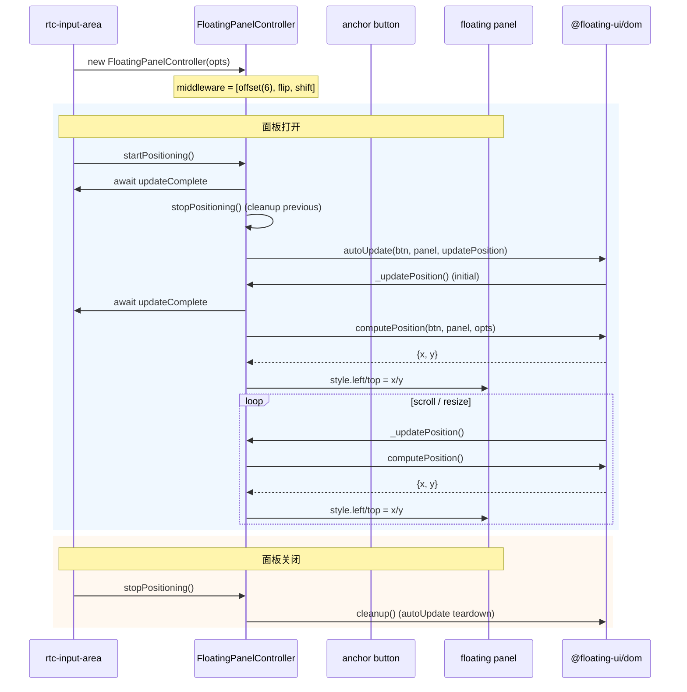
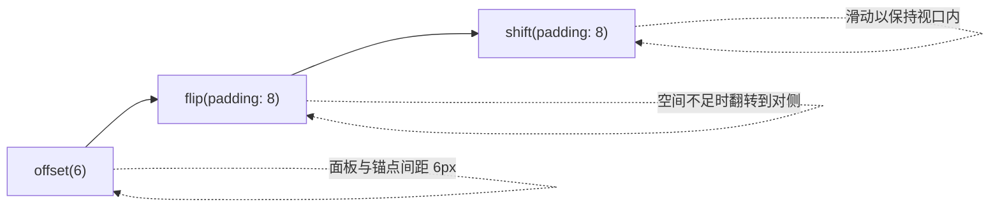

# FloatingPanelController

Overlay 面板定位控制器：封装 @floating-ui/dom 的 autoUpdate/computePosition 模式，供多个浮动面板复用。

**所属 package**: `component`

## 关键代码文件

- [utils/floating-panel-controller.ts](~/Workspaces/rtc-agent/web-components/packages/component/src/utils/floating-panel-controller.ts) — 控制器实现
- [components/input-area/rtc-input-area.ts](~/Workspaces/rtc-agent/web-components/packages/component/src/components/input-area/rtc-input-area.ts) — 使用方，管理 3 个面板实例

## 使用方

`<rtc-input-area>` 创建了 3 个 `FloatingPanelController` 实例：

| 实例 | 锚点按钮 | 浮动面板 | Placement |
| ---- | -------- | -------- | --------- |
| `_modePanelCtrl` | mode 按钮 | `<rtc-mode-panel>` | 面板上方 |
| `_commandPanelCtrl` | `/` 命令按钮 | `<rtc-command-panel>` | 面板上方 |
| `_scenarioPanelCtrl` | `#` scenario 按钮 | `<rtc-scenario-panel>` | 面板上方 |

## 生命周期



## Middleware 配置

所有面板使用统一的 middleware 链：



## 设计要点

1. **Host 保留可见性状态** — `@state` 控制和 outside-click 关闭由宿主组件管理，`FloatingPanelController` 仅处理定位
2. **updateComplete 等待** — 每次定位前 `await host.updateComplete`，确保面板元素已存在于 DOM
3. **单一清理函数** — `autoUpdate()` 返回的 cleanup 函数由 `stopPositioning()` 调用，保证无泄漏
4. **绝对定位策略** — `strategy: 'absolute'`，直接设置 `panel.style.left/top`

## 关键注释摘录

> **职责分离** — [floating-panel-controller.ts:1-13](~/Workspaces/rtc-agent/web-components/packages/component/src/utils/floating-panel-controller.ts#L1-L13)
>
> ```text
> Floating Panel Controller — shared positioning lifecycle for overlay panels.
>
> Encapsulates the floating-ui autoUpdate/computePosition pattern used by
> multiple overlay panels (mode, command, scenario) in <rtc-input-area>.
>
> Each instance manages one panel's positioning lifecycle:
> - startPositioning(): begin auto-updating position when panel opens
> - stopPositioning(): tear down autoUpdate when panel closes
>
> The host component retains ownership of visibility state (@state) and
> outside-click dismissal, while this controller handles the DOM math.
> ```

## 跨维度关联

- [[ComponentHierarchy]] — 由 `<rtc-input-area>` 装配
- [[ControllerPattern]] — 遵循 Lit ReactiveController 模式（但更偏工具类，非状态管理）
- [[UIUpdate]] — 面板内容由 UIUpdateBus 数据驱动
- [[WindowSystem]] — 窗口级定位由 WindowStateController 管理，FloatingPanelController 处理面板级定位
