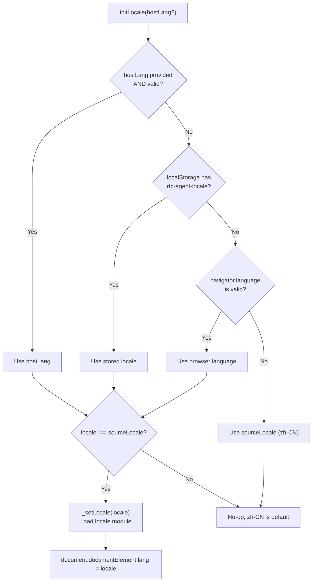
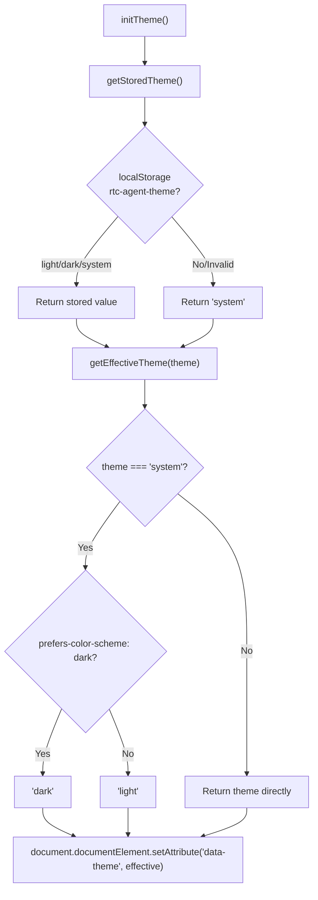
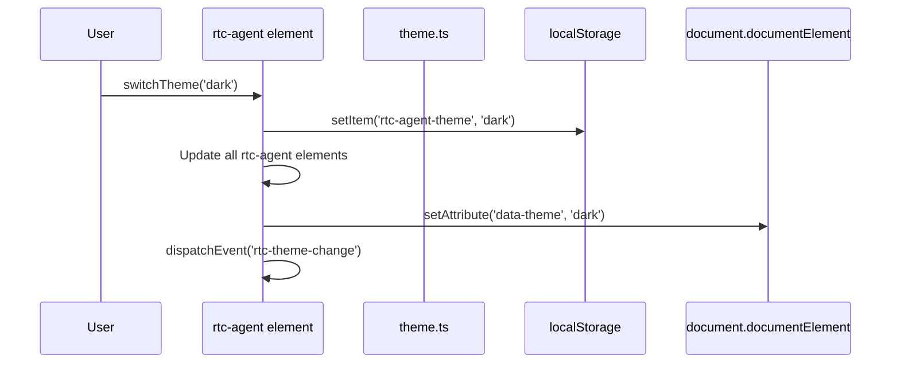

# I18nTheme

i18n 语言切换与 Theme 主题初始化的生命周期。

**所属 package**: `component`

## 关键代码文件

- [i18n.ts](~/Workspaces/rtc-agent/web-components/packages/component/src/core/i18n.ts) — `@lit/localize` 配置、`initLocale()`、`switchLocale()`
- [theme.ts](~/Workspaces/rtc-agent/web-components/packages/component/src/core/theme.ts) — `initTheme()`、`switchTheme()`、`getEffectiveTheme()`

## i18n 初始化流程



### 语言优先级

1. 组件 `lang` 属性（最高）
2. localStorage `rtc-agent-locale`
3. `navigator.language`
4. 默认 `zh-CN`

### 支持的语言

| Locale | 类型 |
|--------|------|
| `zh-CN` | sourceLocale（源码语言） |
| `en-US` | targetLocale（动态加载） |

## Theme 初始化流程



### Theme 切换



## 关键注释摘录

> **i18n 类型守卫** — [i18n.ts:55-57](~/Workspaces/rtc-agent/web-components/packages/component/src/core/i18n.ts#L55-L57)
>
> ```text
> 类型守卫：编译期保证类型安全
> ```

> **Theme 持久化** — [theme.ts:39-45](~/Workspaces/rtc-agent/web-components/packages/component/src/core/theme.ts#L39-L45)
>
> 使用 `localStorage` 存储用户偏好。`rtc-agent-theme` key 存储 `'light' | 'dark' | 'system'`。

## 跨维度关联

- [[ComponentEvents]] — `rtc-theme-change` 事件
- [[RtcAgentConfig]] — `theme` 和 `lang` 配置字段
- [[Factory]] — createRtcAgent 支持设置 `theme` 和 `lang`
- [[DesignSystem]] — Theme 是 Design Token 体系的一部分
- [[LocalStorage]] — i18n 和 Theme 偏好通过 localStorage 持久化
