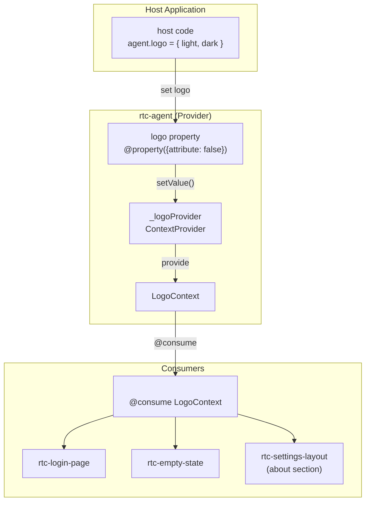
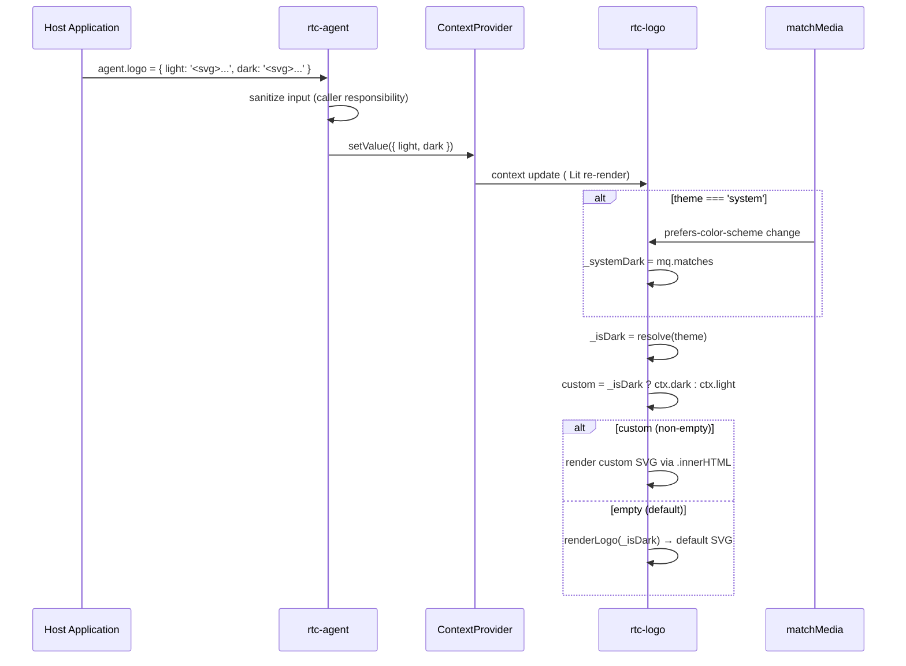

# LogoSystem

自定义品牌 Logo 系统：Context 驱动的主题感知 Logo 替换机制。

**所属 package**: `component`

## 关键代码文件

- [contexts/logo.ts](~/Workspaces/rtc-agent/web-components/packages/component/src/contexts/logo.ts) — `LogoContext` 定义 + `LogoContextValue` 接口
- [components/logo/rtc-logo.ts](~/Workspaces/rtc-agent/web-components/packages/component/src/components/logo/rtc-logo.ts) — `<rtc-logo>` 组件：消费 LogoContext，主题感知渲染
- [icons/logo.ts](~/Workspaces/rtc-agent/web-components/packages/component/src/icons/logo.ts) — `renderLogo()` / `renderBubbleLogo()` 默认 Logo 渲染
- [components/rtc-agent/rtc-agent.ts:260-290](~/Workspaces/rtc-agent/web-components/packages/component/src/components/rtc-agent/rtc-agent.ts#L260-L290) — `logo` property + `_logoProvider` ContextProvider

## 架构概览



## LogoContext 定义

```typescript
interface LogoContextValue {
    /** Custom logo SVG/HTML for light theme */
    light: string;
    /** Custom logo SVG/HTML for dark theme */
    dark: string;
}

const LogoContext = createContext<LogoContextValue>(Symbol('logo-context'));

const DEFAULT_LOGO: LogoContextValue = { light: '', dark: '' };
```

空字符串表示无自定义 Logo，`<rtc-logo>` 回退到默认 RTC Agent Logo。

## 数据流



## rtc-logo 组件

`<rtc-logo>` 是纯展示组件，通过 `@consume` 订阅 `LogoContext`，支持三种主题模式：

| Attribute | 行为 |
| --------- | ---- |
| `theme="light"` | 始终渲染 light variant |
| `theme="dark"` | 始终渲染 dark variant |
| `theme="system"` (默认) | 跟随 OS `prefers-color-scheme`，实时响应变化 |

系统暗色模式检测：

```typescript
connectedCallback() {
    super.connectedCallback();
    this._mq = window.matchMedia('(prefers-color-scheme: dark)');
    this._systemDark = this._mq.matches;
    this._mq.addEventListener('change', this._boundOnMediaChange);
}

disconnectedCallback() {
    super.disconnectedCallback();
    this._mq?.removeEventListener('change', this._boundOnMediaChange);
}
```

## 使用场景

| 位置 | 组件 | 说明 |
|------|------|------|
| 登录页 | `rtc-login-page` | 品牌展示 |
| 空状态 | `rtc-empty-state` | 无 session 时的占位页 |
| 设置页 | `rtc-settings-layout` | "关于"区域的品牌 Logo |
| 最小化气泡 | `rtc-agent` (bubble) | 使用 `renderBubbleLogo()` — 不走 Context |

> 最小化气泡的 Logo 直接在 `rtc-agent.ts` 中调用 `renderBubbleLogo(dark)` 渲染，不经过 `<rtc-logo>` 组件，也不消费 `LogoContext`。这是设计上的简化：bubble 尺寸小（40x40），自定义 Logo 在此场景意义不大。

## 安全说明

`logo` property 的 JSDoc 明确指出：

> **Security note**: Same as `bubbleIcon` — callers should sanitize input before assignment. The component does NOT sanitize this value.

自定义 Logo 通过 `.innerHTML` 渲染，存在 XSS 风险。宿主应用必须在赋值前使用 DOMPurify 等工具进行清理。

## 关键注释摘录

> **Context 设计** — [contexts/logo.ts:1-8](~/Workspaces/rtc-agent/web-components/packages/component/src/contexts/logo.ts#L1-L8)
>
> ```text
> Logo Context — custom logo for host application branding.
>
> Provided by: <rtc-agent> (root)
> Consumed by: <rtc-logo>
>
> The context carries optional custom SVG/HTML strings for light and dark themes.
> When both are absent, <rtc-logo> falls back to the default RTC Agent logo.
> ```

> **Logo property JSDoc** — [rtc-agent.ts:260-278](~/Workspaces/rtc-agent/web-components/packages/component/src/components/rtc-agent/rtc-agent.ts#L260-L278)
>
> ```text
 * Custom logo for host application branding.
 *
 * When set, replaces the default RTC Agent logo everywhere it appears:
 * login page, empty state, settings "about" section.
 *
 * Provide separate SVG/HTML strings for light and dark themes:
 * ```ts
 * agent.logo = {
 *   light: '<svg>...</svg>',  // rendered in light theme
 *   dark: '<svg>...</svg>',   // rendered in dark theme
 * };
 * ```
 *
 * Either field can be omitted; missing variants fall back to the default logo.
 * ```

## 跨维度关联

- [[ContextSystem]] — LogoContext 是众多 Context 之一，遵循 provide/consume 模式
- [[DesignSystem]] — Logo 渲染使用 Design Token 保持一致性
- [[I18nTheme]] — Logo 的主题感知与 Theme 系统联动
- [[ComponentHierarchy]] — `<rtc-logo>` 在组件树中的位置
- [[AgentConfig]] — Logo 作为 `rtc-agent` 元素的 property 配置
