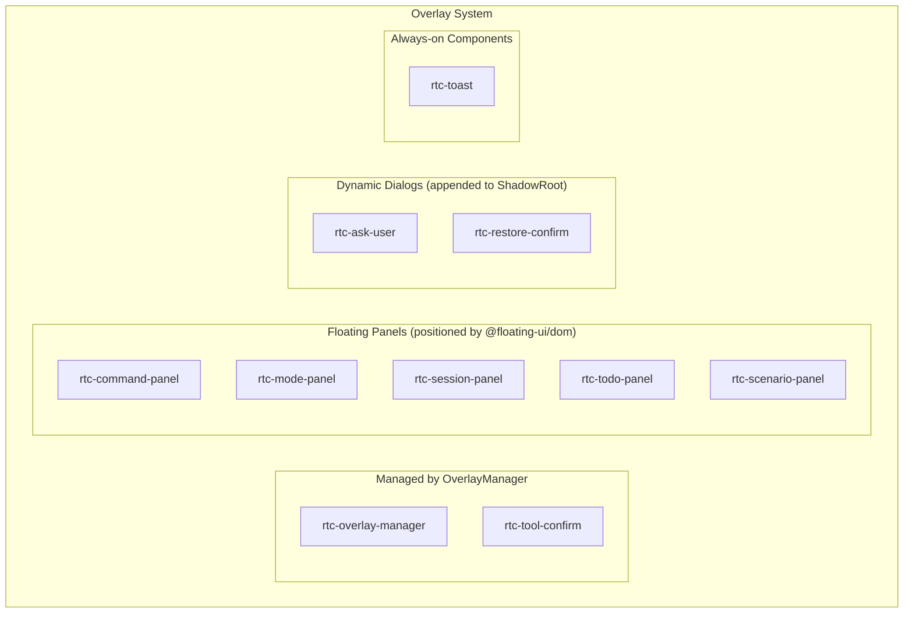
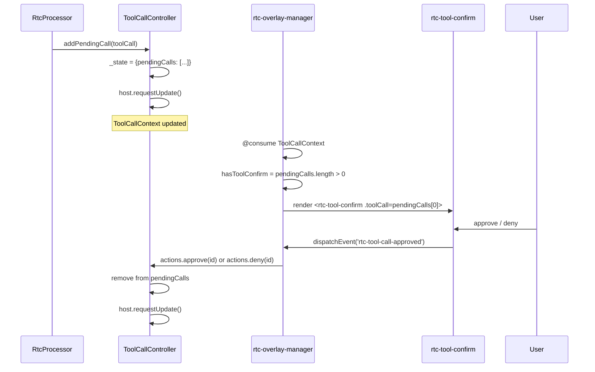
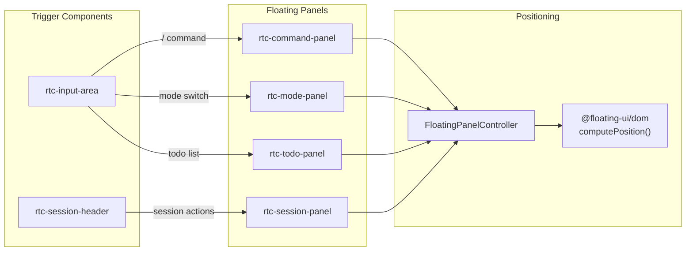
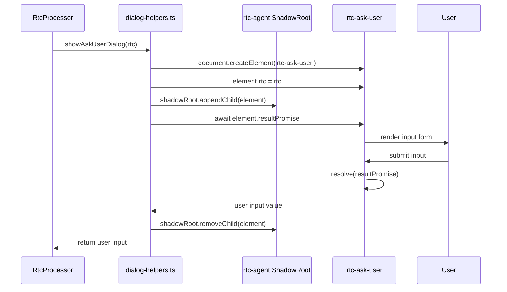
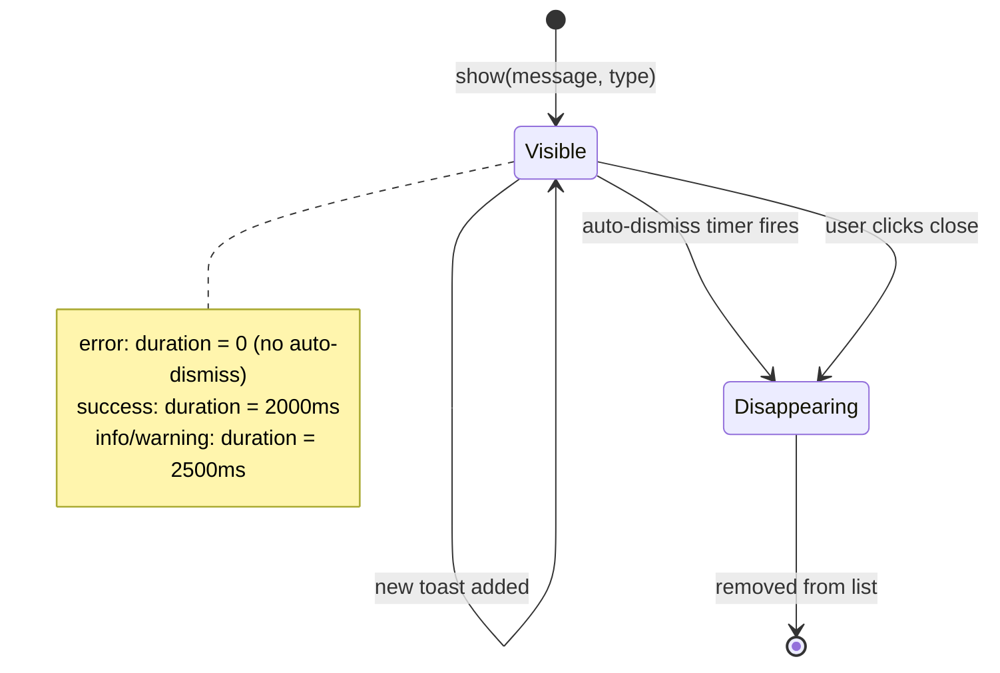

# OverlaySystem

弹出层系统：Overlay Manager、浮动面板、模态对话框的组织与定位。

**所属 package**: `component`

## 关键代码文件

- [components/overlay/rtc-overlay-manager.ts](~/Workspaces/rtc-agent/web-components/packages/component/src/components/overlay/rtc-overlay-manager.ts) — Overlay 管理器，消费 ToolCallContext
- [components/overlay/rtc-tool-confirm.ts](~/Workspaces/rtc-agent/web-components/packages/component/src/components/overlay/rtc-tool-confirm.ts) — 工具执行确认对话框
- [components/overlay/rtc-ask-user.ts](~/Workspaces/rtc-agent/web-components/packages/component/src/components/overlay/rtc-ask-user.ts) — 用户输入收集对话框
- [components/overlay/rtc-restore-confirm.ts](~/Workspaces/rtc-agent/web-components/packages/component/src/components/overlay/rtc-restore-confirm.ts) — 文件恢复默认确认
- [components/overlay/rtc-command-panel.ts](~/Workspaces/rtc-agent/web-components/packages/component/src/components/overlay/rtc-command-panel.ts) — Slash 命令面板
- [components/overlay/rtc-mode-panel.ts](~/Workspaces/rtc-agent/web-components/packages/component/src/components/overlay/rtc-mode-panel.ts) — 工作模式切换面板
- [components/overlay/rtc-session-panel.ts](~/Workspaces/rtc-agent/web-components/packages/component/src/components/overlay/rtc-session-panel.ts) — 会话操作面板
- [components/overlay/rtc-todo-panel.ts](~/Workspaces/rtc-agent/web-components/packages/component/src/components/overlay/rtc-todo-panel.ts) — Todo 列表面板
- [components/overlay/rtc-scenario-panel.ts](~/Workspaces/rtc-agent/web-components/packages/component/src/components/overlay/rtc-scenario-panel.ts) — Scenario 选择面板
- [components/overlay/rtc-toast.ts](~/Workspaces/rtc-agent/web-components/packages/component/src/components/overlay/rtc-toast.ts) — Toast 通知组件
- [components/overlay/rtc-session-panel.ts](~/Workspaces/rtc-agent/web-components/packages/component/src/components/overlay/rtc-session-panel.ts) — 会话面板
- [utils/floating-panel-controller.ts](~/Workspaces/rtc-agent/web-components/packages/component/src/utils/floating-panel-controller.ts) — @floating-ui/dom 封装

## Overlay 分类

Overlay 系统分为三类，每类有不同的定位策略：



| 类别 | 定位方式 | 触发条件 | 组件 |
| --- | --- | --- | --- |
| OverlayManager 管理 | CSS 居中 | ToolCallContext 有 pending calls | `rtc-tool-confirm` |
| 浮动面板 | @floating-ui/dom | 用户点击触发元素 | `rtc-command-panel`, `rtc-mode-panel`, `rtc-session-panel`, `rtc-todo-panel`, `rtc-scenario-panel` |
| 动态对话框 | ShadowRoot append | 代码显式调用 | `rtc-ask-user`, `rtc-restore-confirm` |
| 常驻组件 | DOM 固定位置 | ToastController 触发 | `rtc-toast` |

## OverlayManager 架构

`rtc-overlay-manager` 消费 `ToolCallContext`，当有 pending tool calls 时渲染 `rtc-tool-confirm`。



关键设计：

- **单条处理** — OverlayManager 每次只渲染 `pendingCalls[0]`，用户处理完当前 call 后才显示下一个
- **事件委托** — `rtc-tool-confirm` 派发自定义事件，`rtc-overlay-manager` 监听并调用 Context actions
- **approveAll** — 支持"全部允许"操作，按 toolName 移除所有 pending calls

## 浮动面板定位

浮动面板使用 `FloatingPanelController`（封装 @floating-ui/dom）定位，相对于触发元素放置。



详见 [[FloatingPanelController]]。

## 动态对话框创建

`rtc-ask-user` 和 `rtc-restore-confirm` 由 `dialog-helpers.ts` 动态创建并附加到 `rtc-agent` 的 ShadowRoot。



Promise-based 设计：

```typescript
// dialog-helpers.ts pattern
const element = document.createElement('rtc-ask-user');
element.rtc = rtc;
shadowRoot.appendChild(element);
const result = await element.resultPromise;  // Promise resolves when user submits
shadowRoot.removeChild(element);
return result;
```

## Toast 生命周期

`rtc-toast` 由 `ToastController` 驱动，支持自动消失和手动关闭。



详见 [[ControllerPattern]] 中 ToastController 章节。

## 跨维度关联

- [[ToolRegistry]] — ToolCallController 管理工具调用确认
- [[RtcProcessor]] — RTC 处理器触发 ask-user / tool-confirm 对话框
- [[FloatingPanelController]] — 浮动面板定位底层
- [[ControllerPattern]] — ToastController、ToolCallController 状态管理
- [[ComponentEvents]] — Overlay 组件通过 CustomEvent 通信
- [[Permission]] — 权限检查决定是否需要 tool-confirm 对话框
- [[ChatLayout]] — ChatLayout 是浮动面板触发元素的主要宿主
