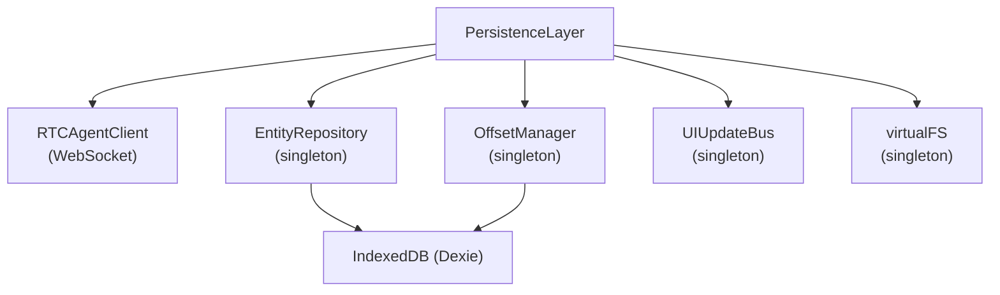
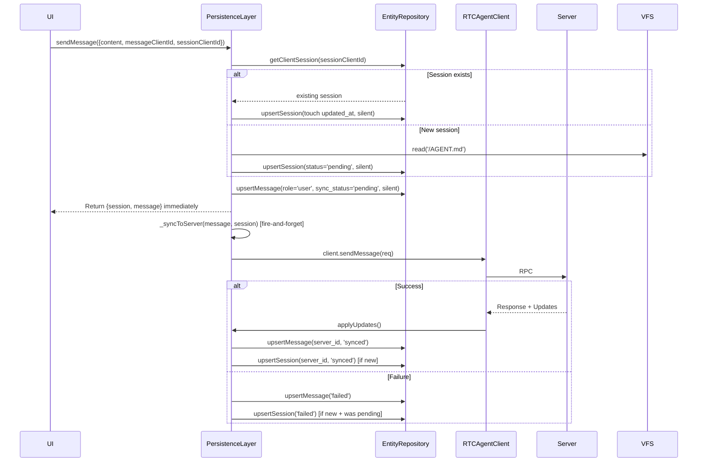
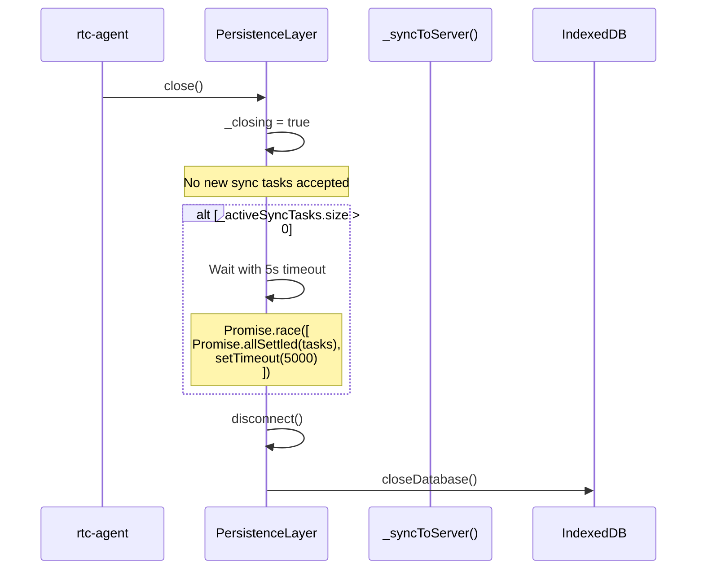
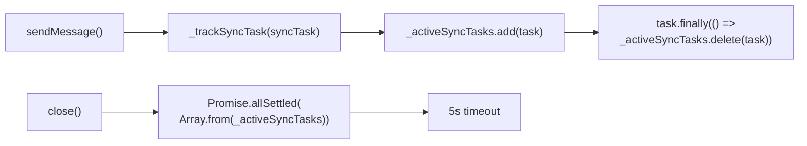
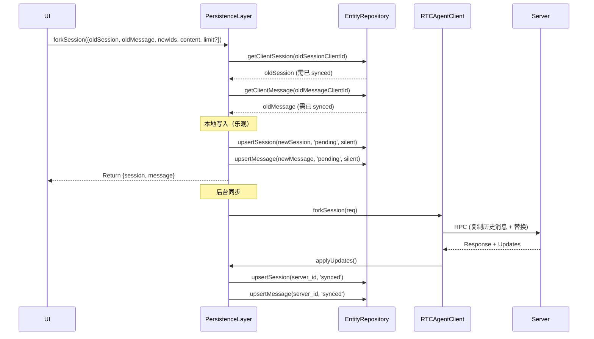
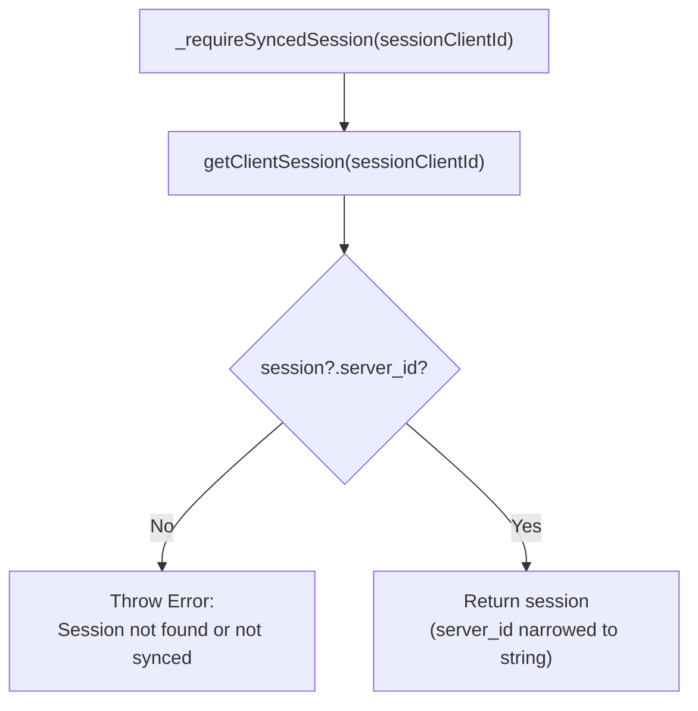
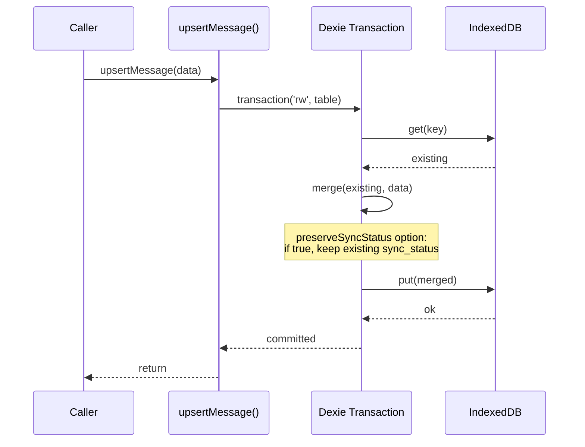
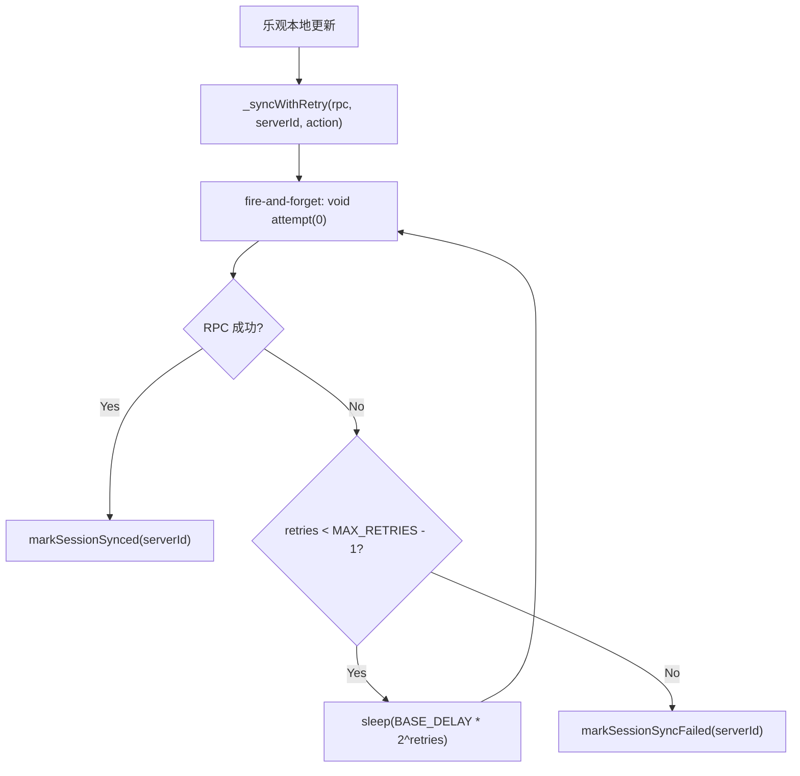

# PersistenceLayer

持久化层核心编排器：集成 RTCAgentClient + IndexedDB + EntityRepository + OffsetManager。

**所属 package**: `persistence`

## 关键代码文件

- [index.ts:41](~/Workspaces/rtc-agent/web-components/packages/persistence/src/index.ts#L41) — `PersistenceLayer` 类

## 内部组件持有



## 职责

| 职责 | 方法 | 说明 |
| ------ | ------ | ------ |
| 连接管理 | `connect()` / `disconnect()` / `reconnect()` | 代理到 RTCAgentClient |
| 消息发送 | `sendMessage()` | 乐观写入 + 后台同步 |
| 本地消息注入 | `insertLocalMessage()` | 系统消息直写 DB，不触发后台同步 |
| Publication 处理 | `handlePublication()` / `handlePublications()` | 接收 Centrifuge 事件，写入 EntityRepository |
| 数据查询 | `listSessions()` / `listMessages()` / `listRtc()` | 代理到 EntityRepository |
| RPC 操作 | `stopTurn()` / `closeSession()` / `deleteSession()` | 先查 server_id，再调用 RPC |
| 会话标题更新 | `updateSessionTitle()` | 乐观本地更新 + `_syncWithRetry` 异步 RPC 同步 |
| 上下文压缩 | `compactSession()` | RPC 调用，服务端压缩会话上下文 |
| 会话分叉 | `forkSession()` | 基于旧会话创建新会话 + 替换消息 |
| 优雅关闭 | `close()` | 等待活跃同步任务完成（最多 5 秒） |

## sendMessage 乐观写入流程



## 优雅关闭机制



### _closing 标志

`_closing` 在 `_syncToServer()` 的每个 DB 写入前检查，防止写入已关闭的数据库。检查点分布在：

| 检查点位置 | 操作 |
| ---------- | ---- |
| RPC 返回后 | 跳过所有 DB 更新 |
| 更新 message 前 | 跳过 message 状态更新 |
| 更新 session 前（新 session） | 跳过 session 状态更新 |
| RPC 失败后 | 跳过失败状态写入 |
| 失败后更新 session 前 | 跳过 session 失败标记 |

### _activeSyncTasks 跟踪

`sendMessage()` 的 fire-and-forget 同步通过 `_trackSyncTask()` 注册到 `_activeSyncTasks` Set 中：



`_closing` 标志同时阻止新的 `sendMessage()` 发起同步任务，确保关闭过程不会遗漏正在排队的消息。

## insertLocalMessage: 系统消息注入

[index.ts:342-365](~/Workspaces/rtc-agent/web-components/packages/persistence/src/index.ts#L342-L365)

用于向会话注入系统生成的消息（如 todo_list 变更通知），不触发后台同步：

```mermaid
flowchart LR
    A["insertLocalMessage(params)"] --> B["upsertMessage(role, content,<br/>syncStatus='synced')"]
    B --> C["Return LocalMessage"]
    
    note right of B
        syncStatus = 'synced' (非 'pending')
        不触发 _syncToServer()
        creator_kind 默认 'system'
    end note
```

| 参数 | 类型 | 默认值 | 说明 |
| --- | --- | --- | --- |
| `sessionClientId` | `string` | — | 目标会话 |
| `role` | `'user' \| 'assistant' \| 'tool' \| 'system'` | — | 消息角色 |
| `content` | `string` | — | 消息文本 |
| `creatorKind` | `string` | `'system'` | 创建者类型标识 |
| `creatorRefId` | `string` | `''` | 关联资源 ID |

## forkSession: 会话分叉

[index.ts:737-808](~/Workspaces/rtc-agent/web-components/packages/persistence/src/index.ts#L737-L808)

基于旧会话创建新会话，替换指定消息并触发 AI 流程：



请求体结构：

```typescript
interface ForkSessionRequest {
  old_server_session_id: string;
  old_server_message_id: string;
  new_client_session_id: string;
  new_client_message_id: string;
  content_data: ContentData;
  limit?: number;  // 分叉多少条历史消息
}
```

## _requireSyncedSession 辅助模式

[index.ts:378-384](~/Workspaces/rtc-agent/web-components/packages/persistence/src/index.ts#L378-L384)

RPC 操作（stopTurn / closeSession / openSession / compactSession）统一使用此辅助方法：



消除 `stopTurn()` / `closeSession()` / `openSession()` / `compactSession()` 中重复的查找 + 守卫模式。

## _applyResponseUpdates 辅助模式

[index.ts:392-396](~/Workspaces/rtc-agent/web-components/packages/persistence/src/index.ts#L396)

RPC 响应可能携带服务端更新。此辅助方法在更新非空时调用 `client.applyUpdates()`：

```typescript
private async _applyResponseUpdates(response: { updates?: Update[] }): Promise<void> {
    if (response.updates && response.updates.length > 0) {
        await this.client.applyUpdates(response.updates);
    }
}
```

消除每个 RPC 方法中重复的 `if (response.updates && response.updates.length > 0)` 守卫。

## 注入回调

PersistenceLayer 构造时向 RTCAgentClient 注入以下回调：

| 回调 | 实现 |
| ---- | ---- |
| `getLastOffset` | `offsetManager.getPosition(channel)` — write-through 缓存 |
| `updateOffset` | `offsetManager.updatePosition(channel, offset, epoch)` |
| `onPublication` | `handlePublication(event)` → `entityRepository.applyUpdate()` |
| `onPublications` | `handlePublications(events)` → `entityRepository.applyUpdates()` |
| `suspendUIUpdates` | `getUIUpdateBus().suspend()` |
| `resumeUIUpdates` | `getUIUpdateBus().resume()` |
| `onGapFillStart` | `getUIUpdateBus().emitGapFillStart()` |
| `onGapFillEnd` | `getUIUpdateBus().emitGapFillEnd()` |

## Upsert 事务保护

所有 `upsert*` 方法（upsertSession / upsertTurn / upsertMessage / upsertRtc）使用 Dexie 事务包装 read-modify-write 操作，防止多 Tab 并发更新导致的数据丢失。



### preserveSyncStatus 选项

`UpsertOptions.preserveSyncStatus` 用于聚合更新场景（如 turn count 更新）。当设置为 `true` 时，upsert 操作不会修改实体的 `sync_status` 字段，防止覆盖由其他操作设置的状态。

**典型用例**：`applyUpdateItem` 更新 turn count 时，需要保留当前 `sync_status`，避免覆盖 `pending` 状态导致同步错误。

## _syncWithRetry 重试策略

部分操作（deleteSession / updateSessionTitle）使用带重试的异步同步：



```typescript
static readonly SYNC_MAX_RETRIES = 3;
static readonly SYNC_BASE_DELAY_MS = 1000;
// Exponential backoff: delay = BASE_DELAY * 2^retries (1s → 2s → 4s)
```

`_syncWithRetry` 不阻塞调用方。本地更新立即生效，后台异步同步到服务器。

## 关键注释摘录

> **事务保护** — [entity-repository.ts:203](~/Workspaces/rtc-agent/web-components/packages/persistence/src/entity-repository.ts#L203)
> _Fix 40: Wrap read-modify-write operations in Dexie transactions for all upsert methods to prevent data loss from concurrent updates across multiple tabs._

<!-- separator -->

> **OffsetManager write-through 缓存** — [index.ts:58-63](~/Workspaces/rtc-agent/web-components/packages/persistence/src/index.ts#L58-L63)
> _OffsetManager uses write-through caching: first call may hit IndexedDB, but subsequent calls return from in-memory cache (effectively synchronous). This design prevents race conditions in scheduleUpdate's deduplication logic._

<!-- separator -->

> **关闭保护** — [index.ts:450-451](~/Workspaces/rtc-agent/web-components/packages/persistence/src/index.ts#L450-L451)
> _Fix: Bail out if closing (prevent writes to closed database)_

<!-- separator -->

> **同步任务跟踪** — [index.ts:330-332](~/Workspaces/rtc-agent/web-components/packages/persistence/src/index.ts#L330-L332)
> _Fire-and-forget async sync (tracked for graceful shutdown)_

## 跨维度关联

- [[Connection]] — PersistenceLayer 代理连接到 RTCAgentClient
- [[Database]] — 持有 IndexedDB 实例
- [[Offset]] — 通过 OffsetManager 管理 offset
- [[UIUpdateBus]] — 订阅 UI 更新事件
- [[SyncStatus]] — sendMessage 管理实体的 sync_status 流转
- [[SharedWorker]] — PersistenceLayer 在 SharedWorker 内运行
- [[SyncPattern]] — 乐观同步、优雅关闭、指数退避重试的详细模式
- [[Publication]] — handlePublication 处理 Centrifuge 事件
