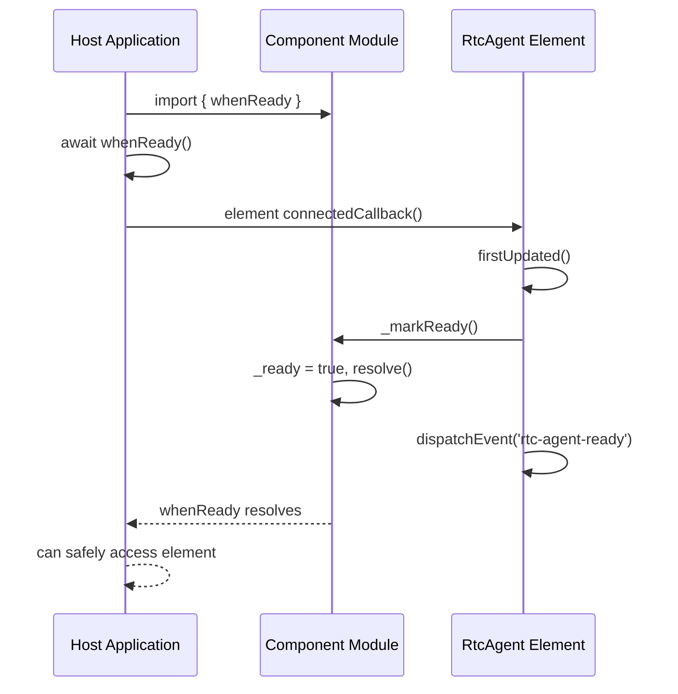

# Ready

组件 Ready 信号机制（Promise + CustomEvent 双通道）。

**所属 package**: `component`

## 关键代码文件

- [ready.ts](~/Workspaces/rtc-agent/web-components/packages/component/src/core/ready.ts) — `whenReady` Promise + `_markReady()` 内部函数

## 双通道信号

```mermaid
flowchart TD
    subgraph "Channel 1: ES Module Promise"
        WR["whenReady: Promise<void>"]
        MR["_markReady()"]
    end
    subgraph "Channel 2: DOM CustomEvent"
        CE["rtc-agent-ready event"]
    end

    RtcAgent["RtcAgent.firstUpdated()"] --> MR
    RtcAgent --> CE

    HostApp["Host Application"] --> WR
    HostApp --> CE

    MR --> WR
    Note over WR: await whenReady()
    Note over CE: addEventListener('rtc-agent-ready')
```

## 时序



## 关键注释摘录

> **模块就绪语义** — [ready.ts:1-9](~/Workspaces/rtc-agent/web-components/packages/component/src/core/ready.ts#L1-L9)
>
> ```text
> Module Ready Signal
>
> 提供两种机制让宿主应用等待 <rtc-agent> 组件初始化完成：
> 1. `whenReady()` Promise — ES module 风格
> 2. `rtc-agent-ready` 自定义事件 — Web Component 风格（由 RtcAgent 组件派发）
>
> 内部使用：组件在 firstUpdated 时调用 _markReady()。
> ```

## 跨维度关联

- [[Factory]] — createRtcAgent 返回的元素也通过此机制通知就绪
- [[ComponentEvents]] — `rtc-agent-ready` 是组件级事件之一
