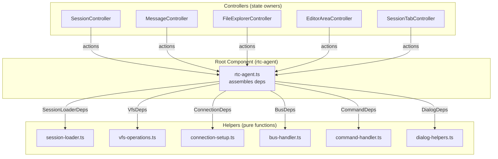
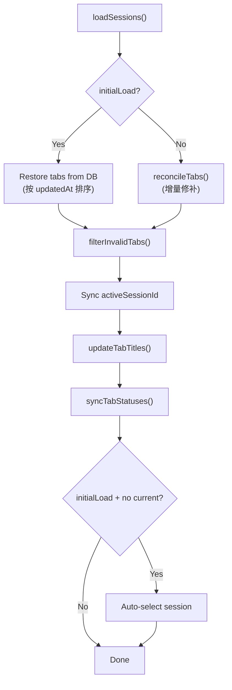
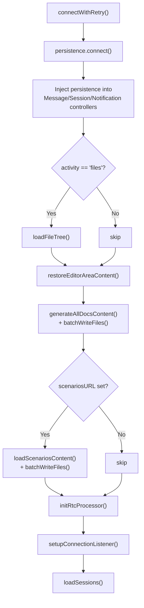
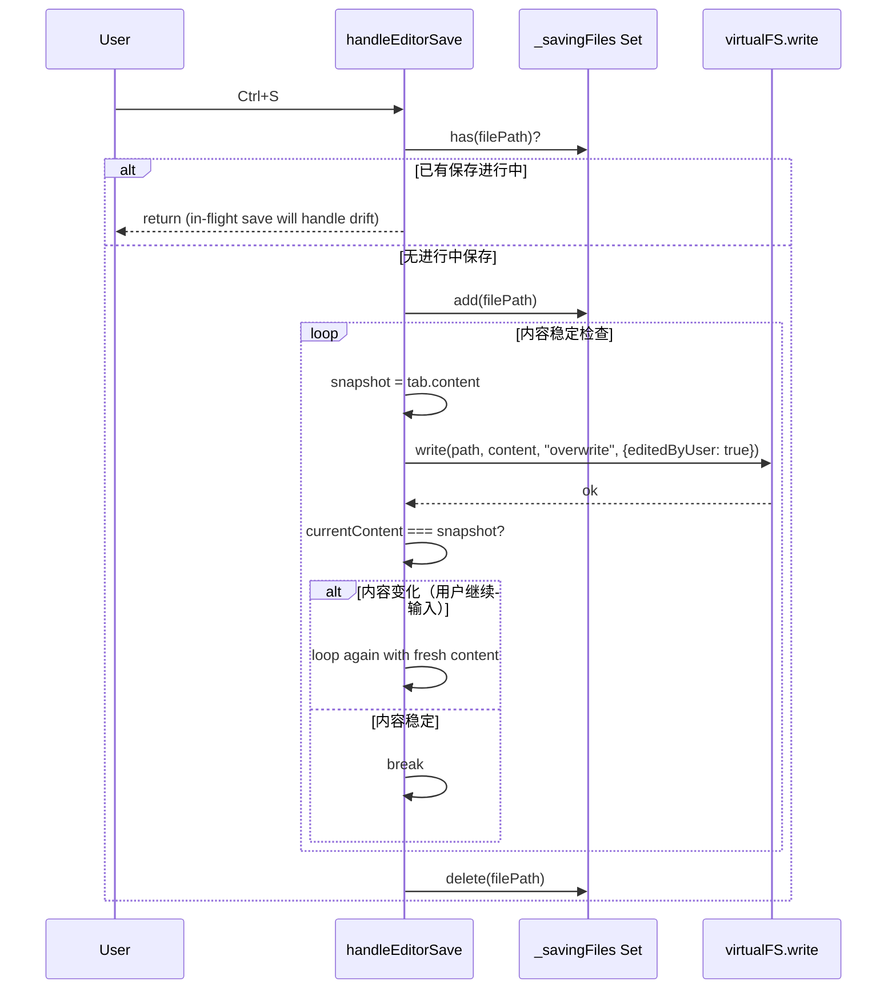
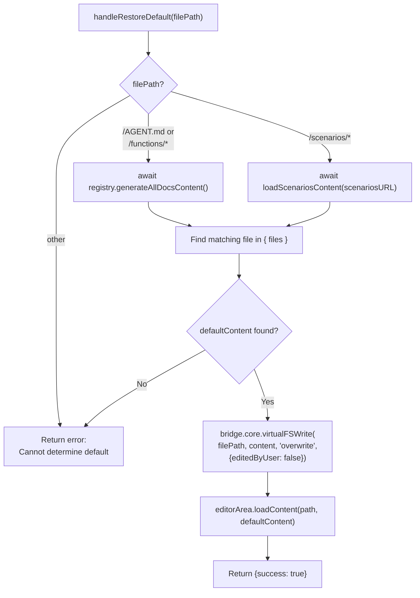
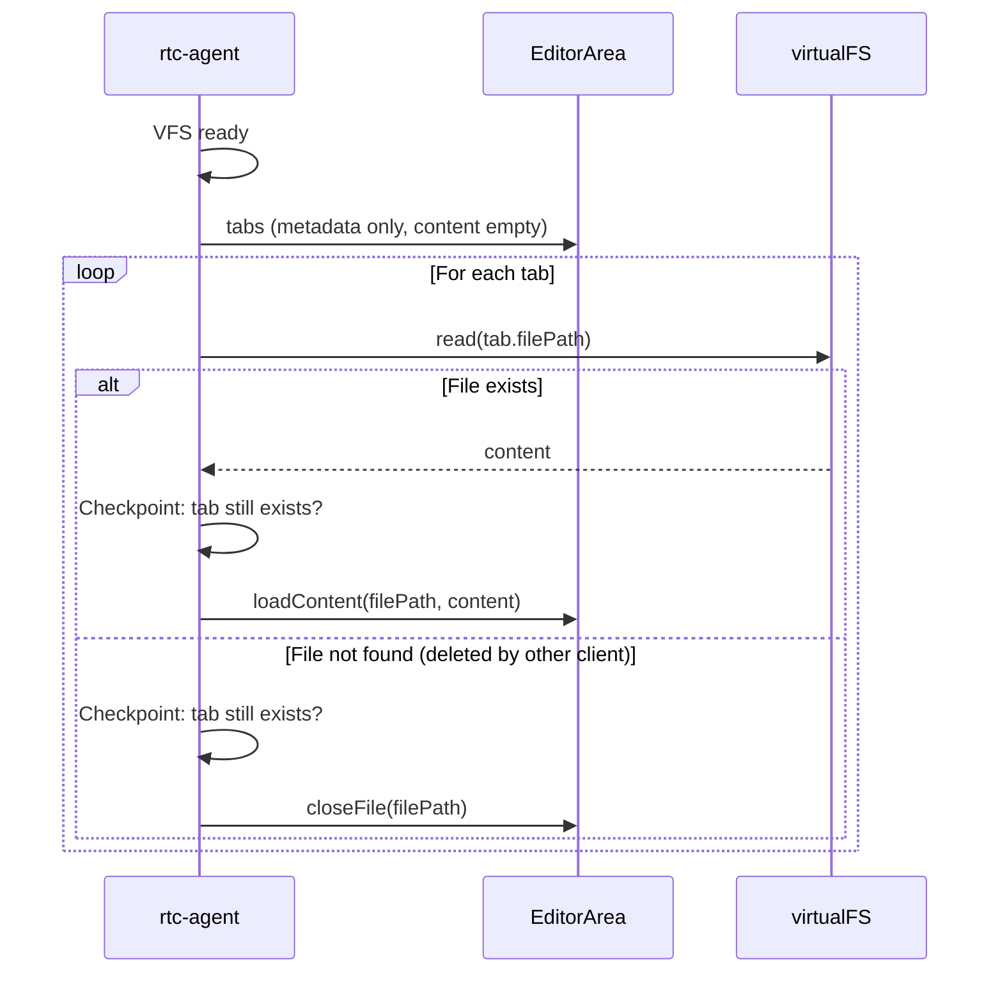
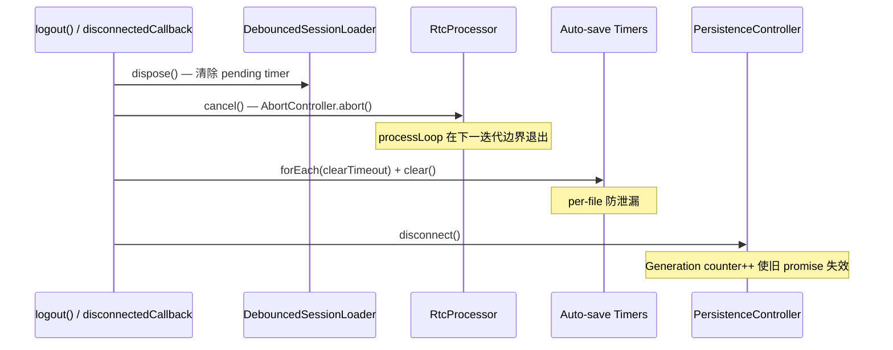

# RootComponentHelpers

根组件 `<rtc-agent>` 的逻辑拆分模式：将复杂业务逻辑提取到 `helpers/` 子目录，保持根组件在 300 行以内。

**所属 package**: `component`

## 关键代码文件

- [components/rtc-agent/helpers/](~/Workspaces/rtc-agent/web-components/packages/component/src/components/rtc-agent/helpers) — helper 目录
- [helpers/bus-handler.ts](~/Workspaces/rtc-agent/web-components/packages/component/src/components/rtc-agent/helpers/bus-handler.ts) — UIUpdateBus 事件路由
- [helpers/command-handler.ts](~/Workspaces/rtc-agent/web-components/packages/component/src/components/rtc-agent/helpers/command-handler.ts) — Slash 命令分发
- [helpers/connection-setup.ts](~/Workspaces/rtc-agent/web-components/packages/component/src/components/rtc-agent/helpers/connection-setup.ts) — 连接重试 + 状态监听 + 后连接步骤编排
- [helpers/dialog-helpers.ts](~/Workspaces/rtc-agent/web-components/packages/component/src/components/rtc-agent/helpers/dialog-helpers.ts) — 对话框显示辅助
- [helpers/session-loader.ts](~/Workspaces/rtc-agent/web-components/packages/component/src/components/rtc-agent/helpers/session-loader.ts) — Session 加载 + Tab 同步 + 对账
- [helpers/vfs-operations.ts](~/Workspaces/rtc-agent/web-components/packages/component/src/components/rtc-agent/helpers/vfs-operations.ts) — VFS 操作（文件树加载、文件打开/保存、跨 Tab 文件变更）

## 拆分动机

`<rtc-agent>` 根组件是唯一的公开 Web Component，承担了以下职责：

- Controller 装配（19 个）
- Context 分发
- 连接管理
- Session/Message 生命周期
- VFS 文件操作
- 命令处理
- UIUpdateBus 事件路由

如果不拆分，单一文件会超过 2000 行（当前 2297 行）。Helpers 提取模式将根组件保持为"装配器"角色，每个 helper 是纯函数模块。

## Helper 依赖注入模式

每个 helper 使用 **Deps 接口** 声明依赖，根组件负责组装：



## 关键 Helper 详解

### session-loader.ts



**reconcileTabs vs restoreTabsFromDB**:

- `restoreTabsFromDB`: 全量恢复（首次加载，按 updatedAt 排序，恢复 storedActiveId）
- `reconcileTabs`: 增量修补（后续更新，保留用户已有 tab 顺序和激活状态，新 tab 不激活）

### connection-setup.ts

`connectWithRetry()` 编排后连接步骤：



`initRtcProcessor()` 的关键行为：

- 注入 `MasterLock`
- 当本 Tab 成为 Master 时，触发 `rtcProcessor.onRtcUpdate()` 恢复 pending 任务
- 设置 confirm dialog 和 ask-user dialog 回调

### vfs-operations.ts

文件保存的并发安全机制：



文件树加载的 Generation Counter 防竞态：

```text
// Generation counter per path for detecting stale folder loads (Fix 42).
//
// When multiple loadFolderChildren calls happen concurrently for the same path,
// only the most recent one should update the UI. Earlier calls are discarded.
```

— [vfs-operations.ts:52-56](~/Workspaces/rtc-agent/web-components/packages/component/src/components/rtc-agent/helpers/vfs-operations.ts#L52-L56)

### handleRestoreDefault: 文件恢复默认

[vfs-operations.ts:448-504](~/Workspaces/rtc-agent/web-components/packages/component/src/components/rtc-agent/helpers/vfs-operations.ts#L448-L504)

将文件恢复为系统生成的默认内容。根据文件路径选择不同的恢复策略：



关键设计：

- **`editedByUser: false`** — 恢复后重置编辑标记，允许未来系统更新覆盖该文件
- **单文件写入** — 通过 `bridge.core.virtualFSWrite()` 直接写入单个文件到 VFS，绕过主线程 virtualFS 代理
- **异步文档生成** — `generateAllDocsContent()` 是 async 方法，返回 `{files, deletePaths}`，从当前 FunctionRegistry 重新生成，确保与最新注册表一致
- **Scenario 动态加载** — 使用 `import()` 动态导入 `scenario-loader`，避免循环依赖

### restoreEditorAreaContent: 刷新后恢复编辑器

[vfs-operations.ts:204-244](~/Workspaces/rtc-agent/web-components/packages/component/src/components/rtc-agent/helpers/vfs-operations.ts#L204-L244)

页面刷新后，Tab 元数据（filePath、viewMode、cursorPosition）已从 localStorage 恢复，但 content 为空。此函数在 VFS 就绪后遍历所有已恢复的 Tab，从 VFS 读取内容填充：



Checkpoint 保护：`await virtualFS.read()` 期间 Tab 可能被关闭（用户操作或其他 Tab 事件），读取完成后检查 Tab 是否仍然存在，避免复活已关闭的 Tab。

### handleFileChange: 跨 Tab 文件变更

[vfs-operations.ts:353-403](~/Workspaces/rtc-agent/web-components/packages/component/src/components/rtc-agent/helpers/vfs-operations.ts#L353-L403)

响应 UIUpdateBus 的 `file` entity 事件，处理其他 Tab/Client 对 VFS 的修改：

| field              | 操作                                                                                       |
| ------------------ | ------------------------------------------------------------------------------------------ |
| `batch`            | 全量重载文件树                                                                             |
| `write` / `create` | 刷新父目录；文件已开且未修改 → 静默重载；文件已开且已修改 → Toast 提示                     |
| `delete`           | 刷新父目录；文件已开 → 关闭 Tab + Toast 提示                                               |

`write` 时使用 `loadContent()` 而非 `openFile()`（Fix 48），保留当前 viewMode 和光标位置。

## 生命周期清理

根组件在 logout 和 `disconnectedCallback` 中执行对称的清理序列，确保无资源泄漏：



关键清理项（[rtc-agent.ts:1649-1671](~/Workspaces/rtc-agent/web-components/packages/component/src/components/rtc-agent/rtc-agent.ts#L1649-L1671)）：

| 清理项 | 方法 | 防止的问题 |
| --- | --- | --- |
| DebouncedSessionLoader | `.dispose()` | pending timer 触发已卸载组件的 `requestUpdate()` |
| RtcProcessor | `.cancel()` | processLoop 在组件卸载后继续执行工具调用（Fix 61） |
| Auto-save timers | `forEach(clearTimeout)` | 定时器触发时对已关闭文件执行写入 |
| Connection listener | `_unsubConnection()` | disconnect 触发的状态变更在已拆除的 bridge 上回调 |
| Auth callback | `_auth.onLogin = undefined` | 防止内存泄漏 |
| Generation counter | `_connectGeneration++` | 旧连接 promise 的 `finally` 清除新连接的 `_connecting` |

`logout()` 额外清理（[rtc-agent.ts:776-800](~/Workspaces/rtc-agent/web-components/packages/component/src/components/rtc-agent/rtc-agent.ts#L776-L800)）：

- `_fork.actions.clearFork()` — 清除分叉状态
- `_editorArea.actions.closeAll()` + `_sessionTab.actions.clearAll()` — 重置 UI
- `_session.actions.reset()` + `_message.actions.clearMessages()` — 清除数据

## 设计原则

1. **纯函数模块** — Helper 不持有状态，所有状态通过 Deps 接口传入
2. **Deps 接口声明** — 每个 helper 定义自己的依赖接口，根组件负责组装
3. **Checkpoint 模式** — 异步操作后检查状态是否仍有效（Tab 未关闭、文件未删除）
4. **Generation Counter** — 并发操作使用计数器检测过期结果
5. **Loop-until-stable** — 文件保存使用循环直到内容稳定，避免竞态覆盖
6. **对称清理** — `connectedCallback` 的每个注册操作在 `disconnectedCallback` 中都有对应的清理

## 关键注释摘录

> **Helper 拆分动机** — [session-loader.ts:1-9](~/Workspaces/rtc-agent/web-components/packages/component/src/components/rtc-agent/helpers/session-loader.ts#L1-L9)
>
> ```text
> Session loading and tab synchronization for <rtc-agent>.
>
> Loads sessions from persistence, syncs them into SessionController,
> manages tab restoration/creation/filtering, and handles auto-select
> on initial load.
>
> Extracted from rtc-agent.ts to keep the root component lean.
> ```

<!-- separator -->

> **reconcileTabs 幂等性** — [session-loader.ts:265-278](~/Workspaces/rtc-agent/web-components/packages/component/src/components/rtc-agent/helpers/session-loader.ts#L265-L278)
>
> ```text
> 增量对账 tab 与 session 状态（非首次加载时调用）。
>
> Gap fill / BulkUpdate 后，DB 中的 session 列表可能已变化：
>
> - 其他 tab/client 创建了新 session → 需要开 tab
> - 其他 tab/client 关闭了 session → 需要关 tab
> - session 被删除 → 需要关 tab
>
> 与首次加载的 restoreTabsFromDB 区别：
>
> - restoreTabsFromDB 是全量恢复（按 updatedAt 排序，恢复 storedActiveId）
> - reconcileTabs 是增量修补（保留用户已有 tab 顺序和激活状态，新 tab 不激活）
>
> 幂等安全：多次调用无副作用，已存在的 tab 不会被重复打开或重排。
> ```

## 跨维度关联

- [[ComponentHierarchy]] — 根组件使用 helper 拆分
- [[ControllerPattern]] — Helper 通过 Controller 的 actions 操作状态
- [[UIUpdateBus]] — bus-handler 是 UIUpdateBus 的路由层
- [[CommandPipeline]] — command-handler 是命令管线的分发层
- [[Connection]] — connection-setup 编排连接后的步骤
- [[SyncPattern]] — connection-setup 中 initRtcProcessor 恢复待处理 RTC
- [[OverlaySystem]] — dialog-helpers 动态创建 ask-user / restore-confirm 对话框
