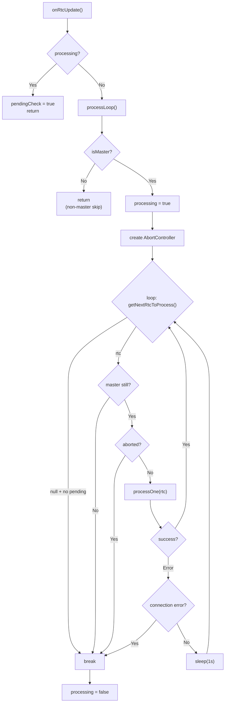
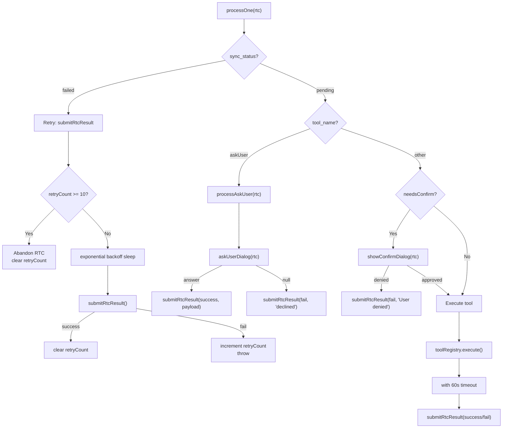
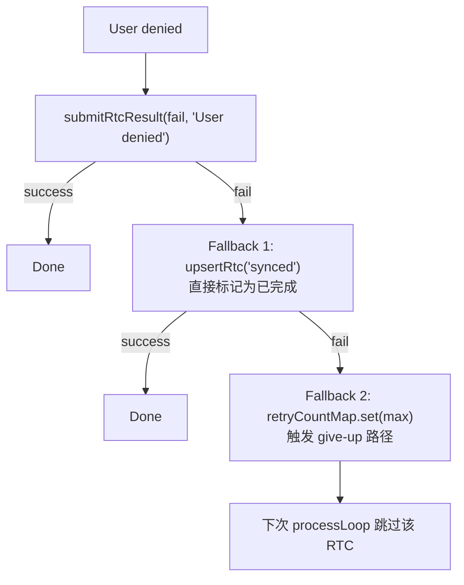
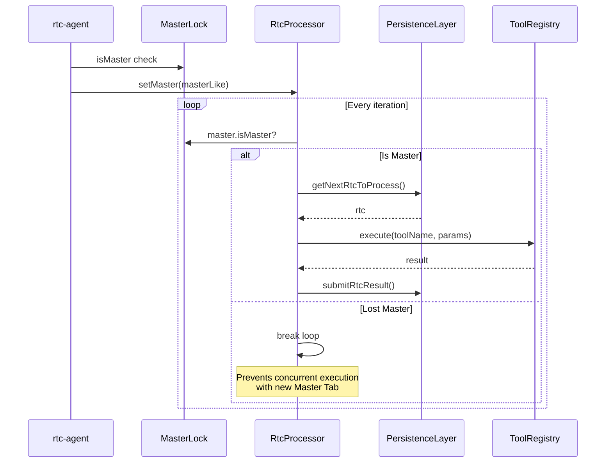
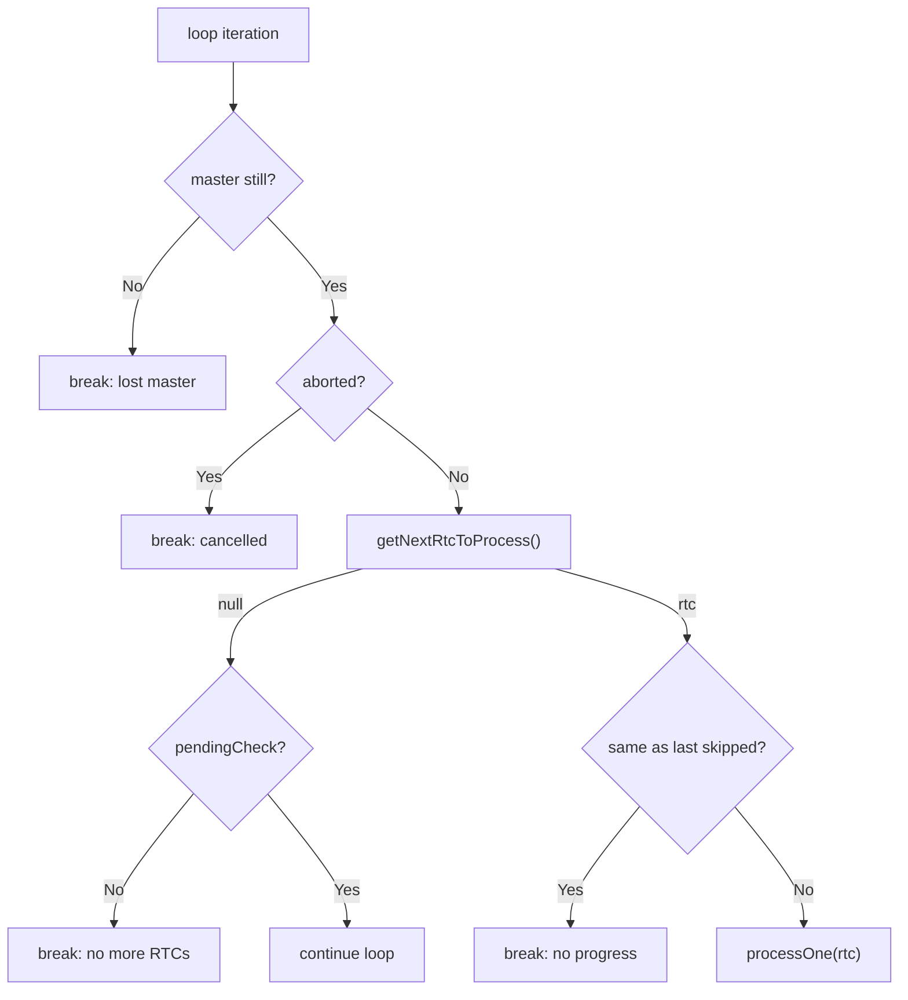
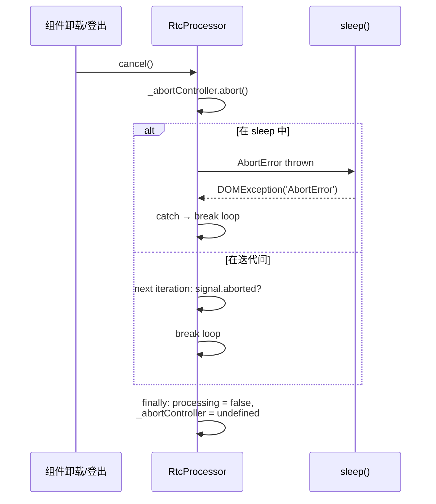

# RtcProcessor

RTC（Remote Tool Call）串行处理管线：权限确认、工具执行、结果提交、重试退避。

**所属 package**: `persistence`

## 关键代码文件

- [rtc-processor.ts:85](~/Workspaces/rtc-agent/web-components/packages/persistence/src/rtc-processor.ts#L85) — `RtcProcessor` 类定义
- [rtc-processor.ts:182-189](~/Workspaces/rtc-agent/web-components/packages/persistence/src/rtc-processor.ts#L182-L189) — `onRtcUpdate()` — 处理循环入口
- [rtc-processor.ts:191-283](~/Workspaces/rtc-agent/web-components/packages/persistence/src/rtc-processor.ts#L191-L283) — `processLoop()` — 串行处理主循环
- [rtc-processor.ts:285-418](~/Workspaces/rtc-agent/web-components/packages/persistence/src/rtc-processor.ts#L285-L418) — `processOne()` — 单个 RTC 处理
- [rtc-processor.ts:419-472](~/Workspaces/rtc-agent/web-components/packages/persistence/src/rtc-processor.ts#L419-L472) — `processAskUser()` — askUser 特殊处理

## 核心设计

RtcProcessor 串行处理所有 RTC，防止重入。关键设计点：

| 机制 | 实现 |
|------|------|
| 串行执行 | `processing` flag 防止并发循环 |
| 新推送检测 | `pendingCheck` flag 确保不遗漏新 RTC |
| 权限确认 | `permissionChecker.needsConfirm()` + 外部注入 `confirmDialog` |
| Master 选举 | 可选注入 `MasterLike`，非 Master Tab 跳过执行 |
| 取消支持 | `AbortController` — 在迭代边界和 sleep 中检查 |
| 重试退避 | 指数退避 1s→2s→4s→...→30s（上限） |
| 最大重试 | `MAX_SUBMIT_RETRY_COUNT = 10` — 超过后放弃 |
| 超时保护 | `PROCESS_TIMEOUT_MS = 60_000` — 工具执行超时 |

## 处理流程



## processOne 分支逻辑



### User-Denied 降级策略

当用户拒绝工具执行时，`submitRtcResult(fail, 'User denied')` 可能因网络问题失败。为防止 RTC 反复弹出确认对话框，采用三级降级：



[rtc-processor.ts:342-361](~/Workspaces/rtc-agent/web-components/packages/persistence/src/rtc-processor.ts#L342-L361)

## Master Lock 集成



## 取消机制

`cancel()` 方法支持优雅关闭，用于：
- 组件卸载（`disconnectedCallback`）
- 用户登出
- 测试清理

实现：通过 `AbortController.abort()` 信号中断循环。sleep 期间检查 abort 信号，抛出 `DOMException('AbortError')`。

## Master 迭代检查与无进展检测

processLoop 在每次迭代中执行两项安全检查：

1. **Master 状态检查** (Fix 60) — 每次循环迭代开始时调用 `_isMasterAllowed()`。如果本 Tab 在处理过程中失去 Master 地位，立即退出循环，防止与新 Master Tab 并发执行。

2. **无进展检测** (`_lastSilentlySkippedRtcId`) — 当 `processOne()` 因超过最大重试次数而静默跳过某个 RTC 时，设置 `_lastSilentlySkippedRtcId`。processLoop 检查此标记：如果连续两次循环都跳过了同一个 RTC（无进展），则退出循环防止死循环。



## 关键常量

| 常量 | 值 | 用途 |
| ------ | ----- | ------ |
| `ERROR_RETRY_DELAY_MS` | 1000 | 非连接错误重试延迟 |
| `PROCESS_TIMEOUT_MS` | 60000 | 工具执行超时（60s），超时后 RTC 标记为 failed（Fix 76） |
| `MAX_SUBMIT_RETRY_COUNT` | 10 | 最大结果提交重试次数 |

## cancel() 优雅关闭

`cancel()` 方法支持在迭代边界和 sleep 检查点中断 processLoop：



使用场景：

- 组件卸载（React StrictMode 双挂载）— `disconnectedCallback` 中调用 `cancel()` (Fix 61)
- 用户登出 — `logout()` 中调用 `cancel()`，防止 RTC 工具执行在登出后继续 (Fix 61)
- 测试清理

根组件调用点（[rtc-agent.ts:783](~/Workspaces/rtc-agent/web-components/packages/component/src/components/rtc-agent/rtc-agent.ts#L783), [rtc-agent.ts:1654](~/Workspaces/rtc-agent/web-components/packages/component/src/components/rtc-agent/rtc-agent.ts#L1654)）：

```typescript
// logout() 和 disconnectedCallback 中
this._rtcProcessor?.cancel();
this._rtcProcessor = undefined;
```

[rtc-processor.ts:169-176](~/Workspaces/rtc-agent/web-components/packages/persistence/src/rtc-processor.ts#L169-L176)

## 关键注释摘录

> **串行处理设计** — [rtc-processor.ts:69-84](~/Workspaces/rtc-agent/web-components/packages/persistence/src/rtc-processor.ts#L69-L84)
> _RtcProcessor: serially processes RTCs to prevent re-entrancy. `processing` flag prevents concurrent loops; `pendingCheck` ensures new pushes are not missed; Permission mode determines whether user confirmation is required; `confirmDialog` is injected externally (implemented by the component layer); Optional `MasterLike` injection: in multi-Tab scenarios only the Master Tab executes tools._

> **超时行为说明** — [rtc-processor.ts:14-20](~/Workspaces/rtc-agent/web-components/packages/persistence/src/rtc-processor.ts#L14-L20)
> _Timeout for RTC processing (ms). Fix 76: Prevents processOne from hanging indefinitely if tool execution or network operations stall. After this timeout, the RTC is marked as failed._

<!-- separator -->

> **无进展检测** — [rtc-processor.ts:99-103](~/Workspaces/rtc-agent/web-components/packages/persistence/src/rtc-processor.ts#L99-L103)
> _Set by processOne when it silently skips an RTC (max retries exceeded). processLoop checks this to detect "no progress" and break the loop._

## 跨维度关联

- [[Permission]] — `permissionChecker.needsConfirm()` 判断是否需要用户确认
- [[MasterLock]] — 多 Tab 场景下的 Master 选举
- [[ToolRegistry]] — 工具执行的实际入口
- [[SharedWorker]] — RtcProcessor 运行在 Worker 内
- [[UIUpdateBus]] — RTC 处理结果通过 UIUpdateBus 通知 UI
- [[BusHandler]] — component 层通过 `getRtcProcessor()?.onRtcUpdate()` 触发处理循环
- [[ConcurrencyPatterns]] — AbortController + Master 迭代检查 + 超时保护
