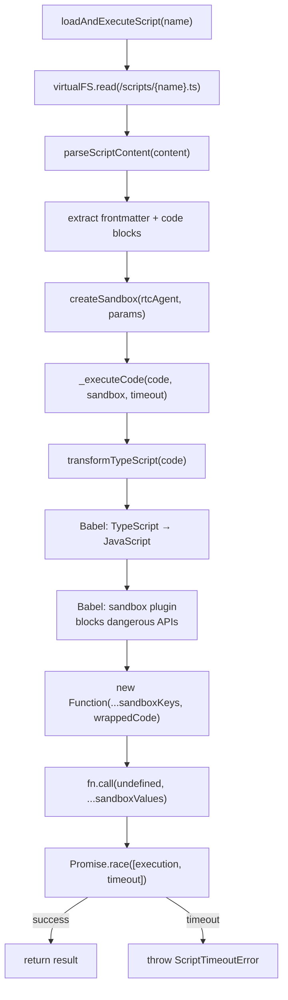
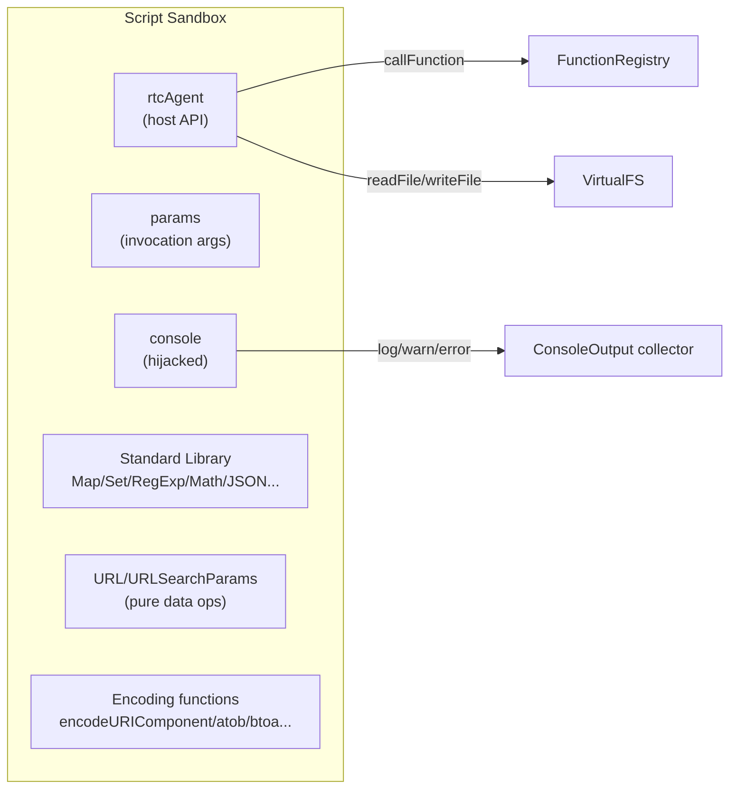

# ScriptEngine

LLM 生成脚本的沙箱执行环境：Babel AST 安全变换 + 受限 API 注入 + 超时控制。

**所属 package**: `persistence`

## 关键代码文件

- [script-engine.ts:543-588](~/Workspaces/rtc-agent/web-components/packages/persistence/src/script-engine.ts#L543-L588) — `_executeCode()` — 核心执行逻辑
- [script-engine.ts:402-429](~/Workspaces/rtc-agent/web-components/packages/persistence/src/script-engine.ts#L402-L429) — `transformTypeScript()` — Babel 变换 + 安全检查
- [script-engine.ts:165-226](~/Workspaces/rtc-agent/web-components/packages/persistence/src/script-engine.ts#L165-L226) — `createSandbox()` — 沙箱环境构建
- [script-engine.ts:247-266](~/Workspaces/rtc-agent/web-components/packages/persistence/src/script-engine.ts#L247-L266) — `BLOCKED_GLOBALS` — 被禁止的全局标识符
- [script-engine.ts:300-388](~/Workspaces/rtc-agent/web-components/packages/persistence/src/script-engine.ts#L300-L388) — `sandboxPlugin` — Babel 安全插件
- [script-engine.ts:444-499](~/Workspaces/rtc-agent/web-components/packages/persistence/src/script-engine.ts#L444-L499) — `parseScriptContent()` — 脚本内容解析（frontmatter + code blocks）

## 设计原则

> 沙箱限制"副作用"（存储/网络/DOM），保留"表达力"（语言/数据结构/逻辑）。LLM 的创造力在逻辑层——纯计算标准库 + rtcAgent API 完全开放。

## 执行流程



## 沙箱安全模型

### 被禁止的全局标识符（BLOCKED_GLOBALS）

| 类别 | 禁止的标识符 |
|------|-------------|
| 存储 API | `localStorage`, `sessionStorage`, `indexedDB`, `caches`, `cookieStore` |
| 网络 API | `fetch`, `XMLHttpRequest`, `WebSocket`, `EventSource`, `BroadcastChannel` |
| DOM/浏览器 | `window`, `self`, `document`, `navigator`, `location`, `history`, `alert`, `confirm`, `prompt` |
| 元编程 | `eval`, `Function`, `globalThis`, `global` |
| Worker | `Worker`, `SharedWorker`, `ServiceWorker`, `importScripts` |
| 定时器 | `setTimeout`, `setInterval` |
| 共享内存 | `SharedArrayBuffer`, `Atomics` |
| Node.js | `require`, `module`, `exports`, `__dirname`, `__filename` |

### 被禁止的属性访问（BLOCKED_MEMBER_PROPERTIES）

- `__proto__` — 原型链逃逸
- `constructor` — 构造函数逃逸（阻止 `x.constructor.constructor('return this')()`）

### 被禁止的语法结构

| 语法 | 原因 |
|------|------|
| `while` / `do...while` | 无可预见的终止条件 |
| `for(;;)` | 无限循环 |
| `import()` | 动态加载远程代码 |

允许的循环：`for...of`, `for...in`, 有界的 `for`, Array 迭代方法（forEach/map/filter/reduce）。

## 沙箱 API 注入

脚本内可用的 API：



## 脚本内容格式

```markdown
---
name: "my-script"
description: "Does something useful"
createdAt: "2024-01-01T00:00:00Z"
---

```typescript
// Script code here
const result = await rtcAgent.callFunction('task.list', {});
return result;
```
```

解析规则：
- Frontmatter：简单 `key: value` 对（不支持多行/数组/嵌套）
- Code blocks：提取所有 ` ```typescript ` 块，多个块用换行连接
- 无 code block：直接使用 body 作为代码

## 超时行为

超时仅放弃等待（reject Promise），不终止运行中的脚本。脚本继续在后台运行直到完成，但调用方收到 `ScriptTimeoutError`。

## 关键注释摘录

> **沙箱策略声明** — [script-engine.ts:1-11](~/Workspaces/rtc-agent/web-components/packages/persistence/src/script-engine.ts#L1-L11)
>
> ```text
> Design principles:
> - Sandbox restricts "side effects" (storage/network/DOM) but preserves "expressiveness" (language/data structures/logic)
> - Uses Babel AST transforms to block dangerous API access at compile time
> - Uses new Function() for execution, with "use strict" + fn.call(undefined) to prevent this escape
> - LLM creativity lives in the logic layer -- full pure-computation standard library + rtcAgent API are exposed
> ```

> **安全插件说明** — [script-engine.ts:280-299](~/Workspaces/rtc-agent/web-components/packages/persistence/src/script-engine.ts#L280-L299)
>
> ```text
> Sandbox security plugin.
> Statically blocks the following categories of syntax at Babel transform time:
> 1. Dangerous global identifiers (BLOCKED_GLOBALS)
> 2. Prototype chain escape properties (BLOCKED_MEMBER_PROPERTIES)
> 3. Dynamic import()
> 4. Dangerous loop constructs
> ```

## 跨维度关联

- [[ToolRegistry]] — 脚本作为工具的一种类型被执行
- [[VirtualFS]] — 脚本存储在 VFS 中（`/scripts/*.ts`）
- [[FunctionRegistry]] — 脚本通过 `rtcAgent.callFunction()` 调用已注册的函数
- [[Permission]] — 脚本执行受权限模式控制
