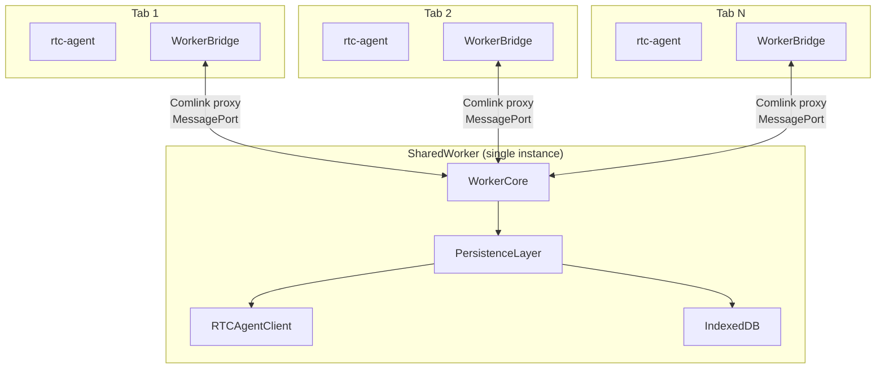
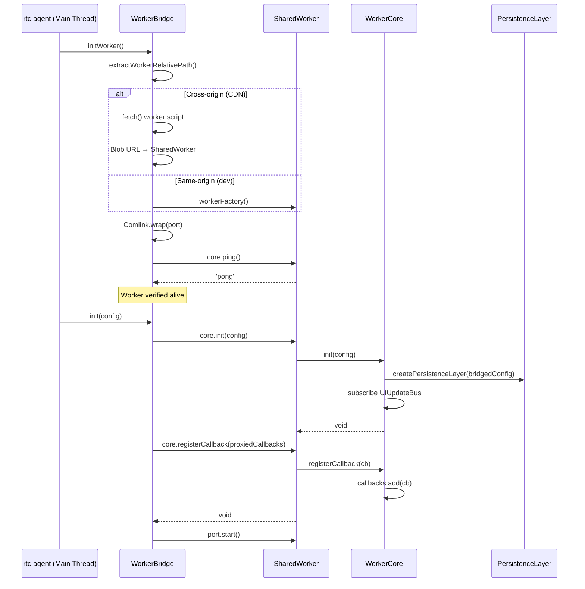
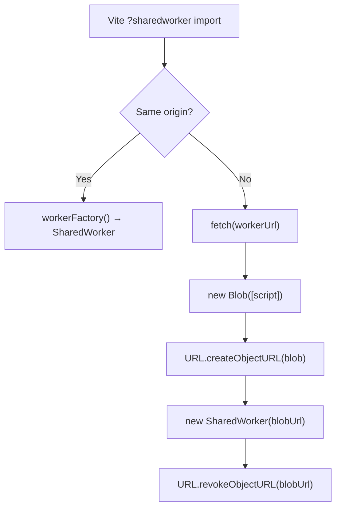

# SharedWorker

SharedWorker 启动、多 Tab 连接、Comlink 桥接。

**所属 package**: `worker` + `component`

## 关键代码文件

- [shared-worker.ts](~/Workspaces/rtc-agent/web-components/packages/worker/src/shared-worker.ts) — SharedWorker 入口，`onconnect` 事件处理，Comlink `expose()`
- [worker-core.ts](~/Workspaces/rtc-agent/web-components/packages/worker/src/worker-core.ts) — `WorkerCore` 类（548 行），Worker 侧所有逻辑
- [core-interface.ts](~/Workspaces/rtc-agent/web-components/packages/worker/src/core-interface.ts) — `WorkerPersistenceCore` 接口 + `WorkerCallbacks` 接口
- [worker-bridge.ts](~/Workspaces/rtc-agent/web-components/packages/component/src/worker-bridge.ts) — `WorkerBridge` 类，主线程侧 Comlink 桥接

## 架构总览



## Worker 初始化流程



## Worker 脚本加载策略



Cross-origin 处理：CDN 部署时 worker 脚本跨域，SharedWorker 要求同源。解决方案：fetch 脚本 → 创建 blob: URL（继承页面 origin）→ 用 blob URL 构造 SharedWorker。

## Worker 重试机制

- 最大重试次数：`MAX_INIT_RETRIES = 3`
- 重试延迟：`INIT_RETRY_DELAY_MS * attempt`（线性退避）
- 健康检查超时：`VERIFICATION_TIMEOUT_MS = 5000`（5 秒 ping 超时）

## 多 Tab 回调广播

WorkerCore 维护 `Set<WorkerCallbacks>`，每个 Tab 注册自己的回调集：

| Callback | 方向 | 用途 |
| ---------- | ------ | ------ |
| `onUIUpdate` | Worker → Tab | 广播实体变更事件 |
| `requestToken` | Tab → Worker | 获取 JWT token |
| `requestTokenRefresh` | Tab → Worker | Token 刷新 |
| `onConnectionStateChange` | Worker → Tab | 广播连接状态变化 |
| `onGapFillState` | Worker → Tab | 广播 gap fill 开始/结束 |

## WorkerCore 批量操作事务

`WorkerCore.batchWriteFiles()` 将多个文件写入和删除操作包裹在单个 Dexie 事务中：

```mermaid
flowchart TD
    A["batchWriteFiles(files, deletePaths)"] --> TX["db.transaction('rw', fileSystemEntries)"]
    TX --> W1["virtualFS.write(file1, overwrite)"]
    TX --> W2["virtualFS.write(file2, overwrite)"]
    TX --> WN["virtualFS.write(fileN, overwrite)"]
    TX --> D1["virtualFS.remove(orphan1)"]
    TX --> DN["virtualFS.remove(orphanN)"]
    TX --> BC["broadcastUIUpdate()"]
    Note over BC: Only after transaction commits
```

关键设计 (Fix 55):

- **原子性**: 任何一个写入失败，整个批次回滚，防止部分更新
- **广播在事务后**: `broadcastUIUpdate` 只在事务成功提交后发出，避免 UI 看到半完成的状态
- **保护文件检查**: 在事务内读取 `editedByUser` 标记，确保检查与写入原子性

## WorkerCore 关键方法

| Method | Description |
| ---------- | ----------- |
| `init(config)` | 创建 PersistenceLayer，订阅 UIUpdateBus |
| `connect()` | 启动 Centrifuge WebSocket 连接 |
| `close()` | 关闭连接 + DB |
| `batchWriteFiles` | 事务性批量写入 + 删除（Fix 55） |
| `sendMessage/getMessage/listMessages` | 透传到 PersistenceLayer |

## 关键注释摘录

> **WorkerCore 初始化幂等** — [worker-core.ts:42-46](~/Workspaces/rtc-agent/web-components/packages/worker/src/worker-core.ts#L42-L46)
>
> ```text
> Initialize shared state.
> - Creates PersistenceLayer (internally holds RTCAgentClient + IndexedDB + EntityRepository)
> - Subscribes to UIUpdateBus for broadcasting to all Tabs
> - Idempotent (subsequent init calls are ignored)
> ```

> **SharedWorker 入口** — [shared-worker.ts:1-15](~/Workspaces/rtc-agent/web-components/packages/worker/src/shared-worker.ts#L1-L15)
>
> ```text
> Each connecting Tab triggers an onconnect event, receiving a MessagePort.
> We create a facade for each port, all sharing the same WorkerCore instance.
> ```

## 跨维度关联

- [[Connection]] — WorkerCore 内部 RTCAgentClient 的连接管理
- [[Database]] — WorkerCore 内部 PersistenceLayer 持有 IndexedDB
- [[PersistenceLayer]] — WorkerCore 内部持有的持久化层编排器
- [[AuthController]] — 提供 token 给 WorkerBridge 的 requestToken 回调
- [[UIUpdateBus]] — WorkerCore 订阅 Worker 内的 UIUpdateBus，广播到主线程
- [[WorkerBridge]] — 主线程侧 Comlink 桥接
- [[ConcurrencyPatterns]] — batchWriteFiles 事务 + Worker 初始化重试
- [[SkillSystem]] — batchWriteFiles 用于文档对账（写入 + 删除孤儿）
