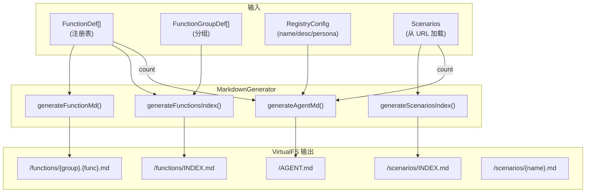
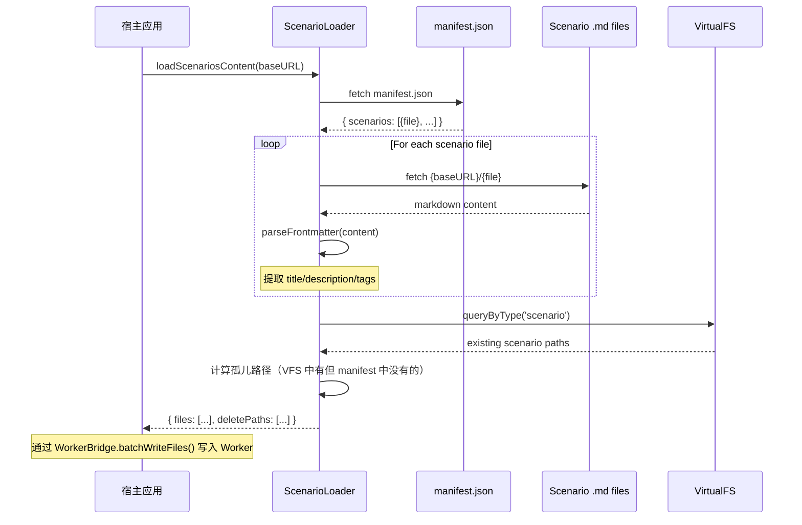
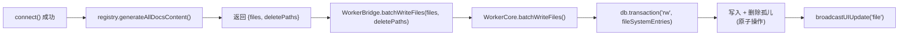
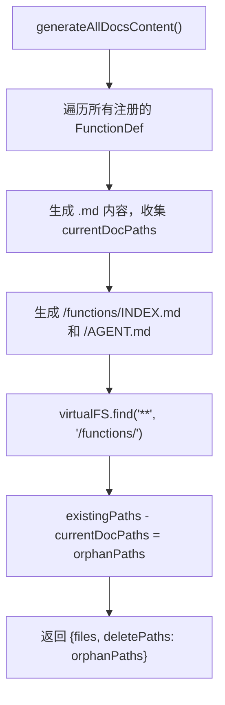

# SkillSystem

Skill 文档生成与 Scenario 加载的完整生命周期：从 FunctionDef/Scenario markdown 到 VirtualFS 中的 Agent 可读文档。

**所属 package**: `component`（生成与加载）/ `persistence`（VirtualFS 存储）

## 关键代码文件

- [core/markdown-generator.ts](~/Workspaces/rtc-agent/web-components/packages/component/src/core/markdown-generator.ts) — Markdown 文档生成器：`generateFunctionMd` / `generateFunctionsIndex` / `generateAgentMd` / `generateScenariosIndex`
- [core/scenario-loader.ts](~/Workspaces/rtc-agent/web-components/packages/component/src/core/scenario-loader.ts) — Scenario 加载器：`loadScenariosFromURL` / `loadScenariosContent` / `parseFrontmatter`
- [core/function-registry.ts](~/Workspaces/rtc-agent/web-components/packages/component/src/core/function-registry.ts) — FunctionRegistry 持有 `generateAllDocsContent()` 方法
- [core/builtin-system-group.ts](~/Workspaces/rtc-agent/web-components/packages/component/src/core/builtin-system-group.ts) — 内置系统 Group 注册

## 文档生成流程



## AGENT.md 结构

`generateAgentMd()` 生成的 Agent Prompt 包含以下节：

| Section | 来源 | 内容 |
| ------- | ------ | ------ |
| Header | `RegistryConfig.name/description` | Agent 名称和描述 |
| Persona | `RegistryConfig.persona` | AI 人设（可选） |
| Environment | 硬编码 | 执行环境说明（IndexedDB、rtcAgent 全局对象、VFS 路径） |
| Available Tools | 硬编码 | 可用工具列表（ls/read/write/edit/find/grep/script/todoWrite/askUser/webSearch/webFetch） |
| Available Functions | `FunctionDef[]` + `FunctionGroupDef[]` | 按分组列出函数及描述 |
| Business Scenarios | scenario count | 场景数量，指向 `/scenarios/INDEX.md` |
| How to Call | 硬编码 | 参数传递规范和语法示例 |

## Scenario 加载流程



## Frontmatter 解析

`parseFrontmatter()` 支持以下 YAML 字段：

| 字段 | 映射到 metadata | 说明 |
| ------ | ---------------- | ------ |
| `title` / `name` / `n` | `name` | 场景标题 |
| `description` / `d` | `description` | 场景描述 |
| `tags` | `tags` | 标签数组 `[tag1, tag2]` |
| `id` | — | 场景唯一标识 |
| `author` | — | 作者（保留在原文中） |
| `createdAt` | — | 创建时间（保留在原文中） |

## 孤儿清理

`loadScenariosContent()` 在加载新 Scenario 后，会比较 VFS 中已有的 scenario 文件与 manifest 中的文件列表，计算"孤儿路径"（存在于 VFS 但不在 manifest 中的文件）。这些路径通过 `deletePaths` 返回，由 `WorkerBridge.batchWriteFiles()` 在写入时一并删除。

## 连接后文档生成

`connectWithRetry()` 在连接成功后触发文档生成：



关键步骤（[connection-setup.ts:103-115](~/Workspaces/rtc-agent/web-components/packages/component/src/components/rtc-agent/helpers/connection-setup.ts#L103-L115)）：
1. 主线程调用 `registry.generateAllDocsContent()` 生成所有文档内容
2. `generateAllDocsContent()` 同时执行 **文档对账**：查询 VFS 中已有的函数文档，计算孤儿路径（已注册函数不再生成的文档），通过 `deletePaths` 返回
3. 通过 `WorkerBridge.batchWriteFiles()` 批量发送到 Worker
4. Worker 在 `db.transaction('rw', fileSystemEntries)` 中执行所有写入和孤儿删除（原子性保证）
5. 事务成功后广播单个 `file` UIUpdateEvent（避免逐文件通知）

## 文档对账（Doc Reconciliation）

`generateAllDocsContent()` 在生成文档时同步执行对账，确保 VFS 中的函数文档始终与当前注册表一致：



对账逻辑（[function-registry.ts:310-324](~/Workspaces/rtc-agent/web-components/packages/component/src/core/function-registry.ts#L310-L324)）：

- 查询 VFS 中 `/functions/` 下的所有文件
- 排除 INDEX.md 和当前注册列表中的路径
- 剩余路径即孤儿（曾经注册但已移除的函数文档）
- 对账失败不阻断文档生成（catch + warn 日志）

## Scenario URL 重载

`connectWithRetry()` 还在连接后重载 Scenario（[connection-setup.ts:118-133](~/Workspaces/rtc-agent/web-components/packages/component/src/components/rtc-agent/helpers/connection-setup.ts#L118-L133)）：
1. 调用 `loadScenariosContent(scenariosURL)` 获取内容和孤儿路径
2. 通过 `WorkerBridge.batchWriteFiles()` 写入并清理孤儿
3. 失败时降级处理（warn 日志，不阻断连接流程）

## 关键注释摘录

> **文档自动生成标识** — [markdown-generator.ts:134](~/Workspaces/rtc-agent/web-components/packages/component/src/core/markdown-generator.ts#L134)
>
> ```text
> <!-- AUTO-GENERAGED by rtc-agent FunctionRegistry. Do not edit manually. -->
> ```
> 生成的文档头部添加此注释，标识为系统自动生成，防止手动编辑。

> **孤儿清理** — [scenario-loader.ts:301-314](~/Workspaces/rtc-agent/web-components/packages/component/src/core/scenario-loader.ts#L301-L314)
>
> ```text
> 计算孤儿路径：VFS 中已有的 scenario 文件，但不在当前 manifest 中
> ```
> 确保 VFS 中的 scenario 列表始终与 manifest 保持一致。

> **主线程生成，Worker 写入** — [connection-setup.ts:108-114](~/Workspaces/rtc-agent/web-components/packages/component/src/components/rtc-agent/helpers/connection-setup.ts#L108-L114)
>
> ```text
> Main thread generates doc content, sends to Worker via batchWriteFiles.
> ```
> 主线程不直接访问 IndexedDB，文档内容通过 Comlink 代理路由到 Worker。

## 跨维度关联

- [[MarkdownGenerator]] — MarkdownGenerator 主题详解：函数文档生成算法、参数表渲染、AGENT.md 结构
- [[FunctionRegistry]] — 持有 `generateAllDocsContent()` 方法，驱动文档生成
- [[SchemaValidation]] — `zodToParams` 被 `generateFunctionMd()` 使用将 Zod schema 转为 OpenAPI 参数表
- [[BuiltinSystemGroup]] — 内置 system 工具组，注册后自动生成 `/functions/system/*.md`
- [[VirtualFS]] — 文档最终存储在 VirtualFS 中
- [[WorkerBridge]] — `batchWriteFiles()` 将文档从主线程传输到 Worker
- [[ToolRegistry]] — Agent 通过 script 工具调用函数时，参考 VFS 中的文档
- [[ScriptEngine]] — 脚本执行时读取 VFS 中的函数文档
