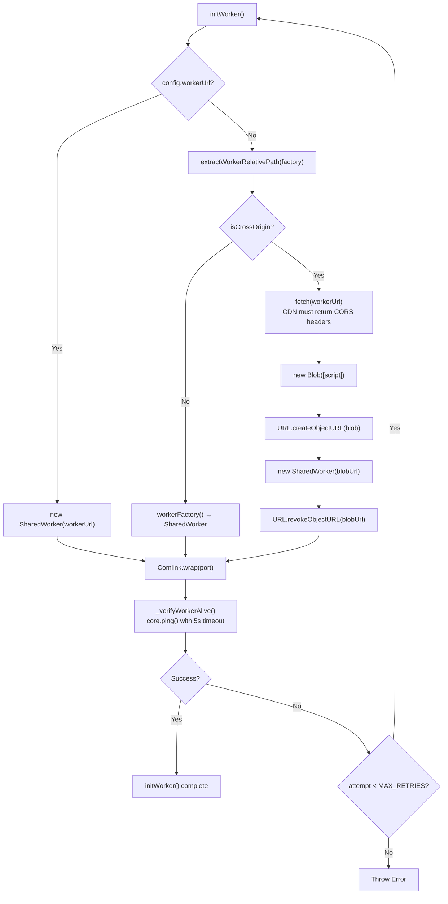
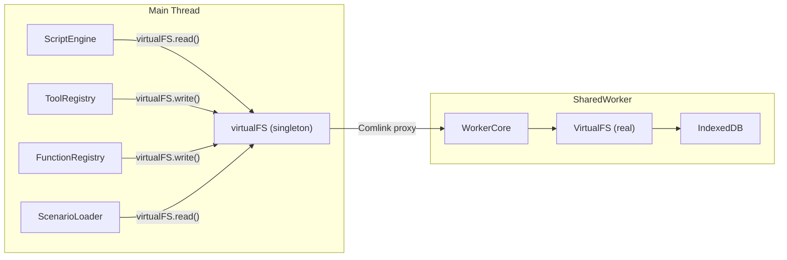
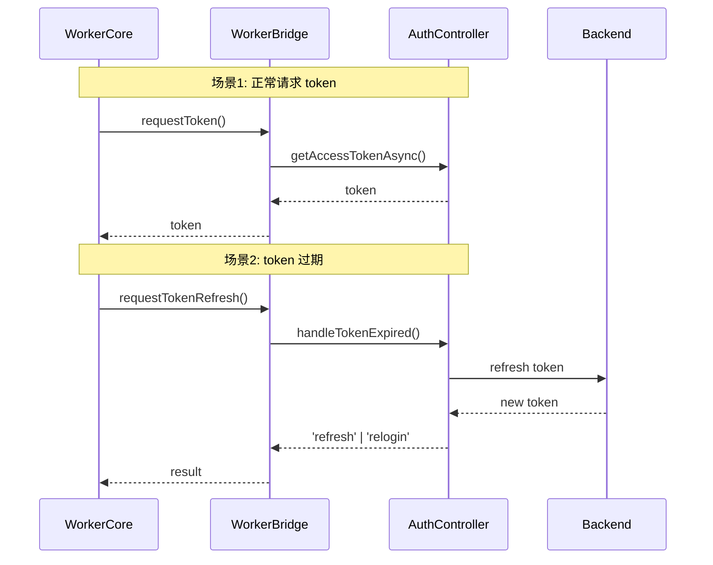

# WorkerBridge

主线程与 SharedWorker 之间的 Comlink 桥接层：处理跨域 Worker 加载、virtualFS 代理、Token 协调与连接状态中继。

**所属 package**: `component`

## 关键代码文件

- [worker-bridge.ts:108](~/Workspaces/rtc-agent/web-components/packages/component/src/worker-bridge.ts#L108) — `WorkerBridge` 类定义
- [worker-bridge.ts:74-88](~/Workspaces/rtc-agent/web-components/packages/component/src/worker-bridge.ts#L74-L88) — `extractWorkerRelativePath()` — Vite 工厂函数解析
- [worker-bridge.ts:195-223](~/Workspaces/rtc-agent/web-components/packages/component/src/worker-bridge.ts#L195-L223) — `initWorker()` — 带重试的 Worker 初始化
- [worker-bridge.ts:491-531](~/Workspaces/rtc-agent/web-components/packages/component/src/worker-bridge.ts#L491-L531) — `installVirtualFSProxy()` — virtualFS 全局代理替换

## 核心职责

WorkerBridge 是主线程与 SharedWorker 之间的唯一通信通道，承担 5 项职责：

| # | 职责 | 方法/机制 |
| --- | ------ | ----------- |
| 1 | Worker 脚本加载 | `initWorker()` — 同源直接加载，跨域 fetch+blob URL |
| 2 | Comlink 代理获取 | `Comlink.wrap(port)` → `Remote<WorkerPersistenceCore>` |
| 3 | UIUpdate 事件中继 | `onUIUpdate` callback → 主线程 `UIUpdateBus.publish()` |
| 4 | Token 请求协调 | `requestToken` / `requestTokenRefresh` → `AuthController` |
| 5 | virtualFS 代理 | `installVirtualFSProxy()` — 将主线程 singleton 方法替换为 Comlink 调用 |

## Worker 脚本加载策略



### 跨域问题的根因

组件可能从 CDN 加载，此时 `import.meta.url` 指向 CDN 域名。Vite 的 `?sharedworker` import 生成的工厂函数内部使用 `new URL("assets/shared-worker-<hash>.js", import.meta.url)` 构造 Worker URL。直接使用该 URL 会在 CDN 域名上创建 SharedWorker，导致 SecurityError（SharedWorker 要求同源脚本）。

解决方案：fetch 脚本内容 → 创建 blob: URL（继承页面 origin）→ 用 blob URL 构造 SharedWorker → 立即 revokeObjectURL（Worker 已持有脚本内容）。

## virtualFS 代理机制

主线程无法直接访问 IndexedDB。`installVirtualFSProxy()` 将主线程 `virtualFS` 单例对象的方法全部替换为 Comlink 远程调用：



代理替换的方法：`read`, `write`, `ls`, `find`, `grep`, `queryByType`, `exists`, `remove`。

替换是全局的（virtualFS 是模块级单例），所有通过 virtualFS 的操作自动路由到 Worker。

## Token 协调

WorkerBridge 注册两个 Token 相关回调给 Worker：



## 重试与健康检查

- `MAX_INIT_RETRIES = 3` — 最大重试 3 次（共 4 次尝试）
- `INIT_RETRY_DELAY_MS = 1000` — 线性退避（1s, 2s, 3s）
- `VERIFICATION_TIMEOUT_MS = 5000` — ping 超时 5 秒
- 失败后清理：`_cleanupFailedWorker()` 关闭 port 并重置引用

## 关键注释摘录

> **跨域 Worker 加载设计决策** — [worker-bridge.ts:27-46](~/Workspaces/rtc-agent/web-components/packages/component/src/worker-bridge.ts#L27-L46)
>
> ```text
> Background: the component may be loaded from a CDN, in which case the component
> scripts are cross-origin relative to the host page.
> SharedWorker requires same-origin scripts (data: URLs get an opaque origin,
> blob: URLs inherit the creating page's origin).
> ```

> **virtualFS 代理说明** — [worker-bridge.ts:481-490](~/Workspaces/rtc-agent/web-components/packages/component/src/worker-bridge.ts#L481-L490)
>
> ```text
> Replace the main-thread's virtualFS singleton methods with Comlink proxies.
> The main thread cannot directly access IndexedDB.
> After replacement, all operations via virtualFS (tool execution, script reading,
> function-registry doc writing, scenario-loader, etc.) are automatically routed
> to the Worker.
> ```

## 跨维度关联

- [[SharedWorker]] — Worker 端的入口与 WorkerCore 实现
- [[AuthController]] — Token 请求的来源
- [[PersistenceController]] — 主线程调用方：创建 WorkerBridge 并管理其生命周期
- [[UIUpdateBus]] — onUIUpdate 回调的目标
- [[VirtualFS]] — 被代理的虚拟文件系统
- [[Connection]] — 连接状态通过 WorkerBridge 中继到主线程
